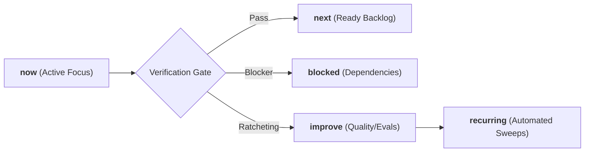

# Ars Arcanum (Scriptorium) — Agentic Operating Manifesto & Engineering Contracts
> **Sovereign Authoring Operating System (GPA 4.0/4.0 — Grade A+)** | Release v0.1.0

---

## 1. System Identity & Mission

**Ars Arcanum (Scriptorium)** is a sovereign, 100% offline, privacy-first operating system and craft studio designed for speculative fiction authors, worldbuilders, and narrative designers. 

### Core Operating Principles
1. **Absolute Creative Sovereignty**: Zero cloud dependencies, zero external network telemetry, and 100% offline privacy for unpublished creative intellectual property. The system exists to empower authorial agency, not enforce stylistic homogenization.
2. **Descriptive Measurement over Prescriptive Dogma**: Craft lenses (three-act structure, pacing variance, motivational response units, macroeconomics, climate) measure narrative geometry and provide observational telemetry. They never gatekeep or dictate aesthetic choices.
3. **Deterministic Rails over Probabilistic Hallucination**: Mandatory validation gates, rigid schemas, atomic POSIX/Windows file I/O, and mathematical consistency checks for all lore and manuscript operations.
4. **Continuous Verification & Anti-Stall Momentum**: Every milestone ratchets forward repository capabilities across explicit momentum queues (`now`, `next`, `blocked`, `improve`, `recurring`).
5. **Defense in Depth**: Strict path traversal sanitization, cross-platform file locking, stream-verified archives, and cryptographic GPG backup protection.

---

## 2. Invariant Engineering Contracts

All automated agents, subagents, and human contributors must strictly uphold these non-negotiable architectural contracts:

### 2.1 File Safety & Storage Invariants
- **Atomic Writes**: All file modifications must use `atomic_write()` from [`scripts/lib/_bootstrap.py`](file:///scripts/lib/_bootstrap.py) (temporary file $\to$ `flush` $\to$ `fsync` $\to$ `os.replace` $\to$ parent directory `fsync`). Direct unbuffered file overwrites are strictly prohibited.
- **Cross-Platform File Locking**: Concurrency-sensitive operations (snapshots, backups, migrations) must acquire an `ArcanumLock` ([`scripts/lib/lockfile.py`](file:///scripts/lib/lockfile.py)) utilizing `fcntl.flock` on POSIX and `msvcrt.locking` on Windows with deterministic byte-0 positioning.
- **Path Traversal Defense**: All user-supplied volume names, draft identifiers, and book targets must be sanitized via regex token validation `^[A-Za-z0-9_-]+$`. Directory separators (`/`, `\`) and path traversals (`..`) are rejected immediately, alongside Windows reserved device names (`CON`, `PRN`, `AUX`, `NUL`, `COM1-9`, `LPT1-9`).
- **Zero-Pip Dependency Guarantee**: All core craft engines, validators, parsers, and static site generators must execute exclusively on standard library Python primitives without external `pip` dependencies.

### 2.2 Content Security Policy & Offline Isolation
- Every generated HTML report, interactive corkboard, visual timeline, static codex, and Zen drafting studio must declare strict offline Content Security Policies:
  ```html
  <meta http-equiv="Content-Security-Policy" content="default-src 'none'; style-src 'unsafe-inline'; script-src 'unsafe-inline'; img-src data:; media-src data: blob:;">
  ```
- No external CDN scripts, remote fonts, or network telemetry are permitted in any generated artifacts.

### 2.3 Granular Scope & Intelligent Context Invariants
- **Altitude-Aware Context Defaults**: Engines must never perform unconstrained whole-drive or all-vault scans by default. When no explicit target is supplied, engines resolve the active manuscript/world context via `config.json`, current working directory, or single-project discovery.
- **Granular Slice Resolution**: All narrative, craft, and worldbuilding engines must support targeted execution across universes, worlds, lore categories, series, books, chapter lists/ranges (`1-5`, `1,3,7-10`, `ch01..ch05`), and scene slices (`1-3`, `sc01..sc02`) via [`scripts/lib/scope.py`](file:///scripts/lib/scope.py) (`EngineScope`, `filter_manuscript_scope`, `filter_world_scope`).

### 2.4 Separation of the Three Subsystems & Epistemic Safety
To protect authorial sovereignty and prevent technical urgency from lending false authority to subjective aesthetic opinions, all engines and tools must strictly operate within one of three separated subsystems:
1. **Invariant Consistency Engine (Subsystem 1)**: Deterministic file safety, atomic locks, SHA-256 validation, YAML/JSON syntax parse errors, broken internal link pointers, and explicit author-declared hard invariants (`[AUTHOR RULE]`, `[DATA ISSUE]`). **Fails builds (`exit 1`) in strict mode.**
2. **Selected Craft Lenses (Subsystem 2)**: Modular reference overlays (Three-Act, Save the Cat, Hero's Journey, Kishōtenketsu, Fichtean, soft/hard magic, readability, cadence variance). **Always advisory (`exit 0` by default), phrased as observations or questions, dismissible via `@intent: deliberate` or Authorial Constitution configuration.**
3. **Creative Ideation & Sparks (Subsystem 3)**: Combinatorial analogies, creative prompts, conceptual bridge syntheses. **Always clearly labeled with provenance tags (`[SPECULATION]`).**

### 2.5 6-Tier Diagnostic Severity Taxonomy
All diagnostic outputs across the CLI, desktop app, and Studio Hub must classify findings into one of six standardized severity levels:
- `CANON_ERROR` (Severity 5): Hard broken links, invalid YAML frontmatter, missing mandatory identifiers, duplicate unique IDs.
- `RULE_CONFLICT` (Severity 4): Contradiction of an explicit author-declared world rule in `constitution.yaml` or `world.yaml`.
- `OBSERVATION` (Severity 3): Neutral mathematical or structural telemetry (e.g. sentence variance, MRU sequence, faction balance).
- `LENS_NOTE` (Severity 2): Comparative feedback against a selected optional craft framework (e.g. Save the Cat beat sheet milestone).
- `SUGGESTION` (Severity 1): Optional creative spark, alternative phrasing, or vocabulary expansion prompt.
- `EXPERIMENT` (Severity 0): Speculative lateral thinking prompts, cross-domain isomorphisms, or "what-if" divergences.

### 2.6 Authorial Constitution & Intent Preservation
All craft engines must honor the Authorial Constitution defined in `constitution.yaml`, `constitution.json`, `world.yaml`, or `manuscript.yaml`:
- **Suppressed Rules**: If an engine rule ID (e.g., `PAC-101`, `FAC-102`, `PRP-101`) is listed under `suppressed_rules`, the engine must skip reporting that finding.
- **Intent Directives**: Document-level `@intent: deliberate`, `@intent: non-linear`, or inline `@beat: <name>` / `@arc-stage: <stage>` tags must be respected by structural and pacing analyzers without forcing normative defaults.
- **Advisory Default Contract**: Subsystem 2 and Subsystem 3 checks must exit with returncode `0` unless the author explicitly supplies the `--strict` CLI flag.

---

## 3. Momentum Queues & Compounding Architecture

The system tracks its active state across five persistent momentum queues:



1. **`now`**: The active milestone currently undergoing execution and verification.
2. **`next`**: Concrete, unblocked technical tasks staged for immediate execution.
3. **`blocked`**: Tasks awaiting external dependencies or human-in-the-loop decisions.
4. **`improve`**: Refactoring candidates, test coverage expansion, and performance optimizations.
5. **`recurring`**: Automated background invariants (supply-chain SHA-256 sweeps, version parity gates, static syntax sweeps, systemd backup timers).

---

## 4. Domain Engine Topology

The codebase separates concerns into a clean, sovereign architecture:

```
scripts/
├── __init__.py                # Package root for pip install / setuptools entry points
├── arcanum                    # POSIX unified CLI bootstrap wrapper
├── test_parallel.py           # Multi-worker parallel test runner (~2.5s execution)
├── lib/
│   ├── _bootstrap.py          # Atomic write, path resolution & common primitives
│   ├── cli.py                 # Authoritative Python CLI dispatcher (v0.1.0)
│   ├── cli_handlers.py        # CLI handler routing with graceful retirement doctrine guidance
│   ├── config.py              # Configuration & Authorial Constitution loader
│   ├── lockfile.py            # Cross-platform file locking (ArcanumLock)
│   ├── fs_utils.py            # Safe atomic file and path manipulation utilities
│   ├── cache.py               # Memory/disk AST and frontmatter cache layer
│   ├── data_access.py         # Centralized cached vault reader & frontmatter AST layer
│   ├── frontmatter.py         # Zero-dependency YAML frontmatter parser and serializer
│   ├── frontmatter_builder.py # Interactive CLI & programmatic YAML frontmatter scaffolding
│   ├── scope.py               # Universal granular target scoping & range parsing engine
│   ├── scope_models.py        # Dataclasses for EngineScope, ChapterItem, SceneSlice, ResolvedScope
│   ├── scope_parser.py        # Expression and range parsers for granular chapter/scene slicing
│   ├── scope_resolver.py      # Active context resolution heuristics for manuscripts and worlds
│   ├── manuscript_diff.py     # Structural markdown diff engine with HTML visualizer
│   ├── manuscript_diff_template.py # Presentation HTML/CSS template for manuscript diffs
│   ├── revision_heatmap.py    # Revision density and editing churn heatmaps with HTML export
│   ├── revision_heatmap_template.py # Presentation HTML/CSS template for revision heatmaps
│   ├── portfolio.py           # Multi-manuscript author portfolio tracker & standalone HTML dashboard
│   ├── docx_sync.py           # Two-way roundtrip Markdown <-> DOCX synchronizer
│   ├── docx_builder.py        # Zero-dependency standard submission format DOCX builder
│   ├── importer.py            # Universal multi-format manuscript & lore importer (MD, TXT, EPUB, DOCX)
│   ├── diagnostics.py         # Unified system health, toolchain & world vault consistency doctor
│   ├── migrate.py             # Schema and directory migration engine with automated backup
│   ├── preflight.py           # Pre-compilation validation & publication gatekeeper
│   ├── codex_export.py        # Standalone offline HTML world codex static site generator
│   ├── omnibus.py             # Multi-volume series omnibus compiler (MD, EPUB, PDF)
│   ├── backup.py              # Pure-Python standalone verified .tar.gz archive engine
│   ├── restore.py             # Pure-Python verified archive restoration with path traversal defense
│   ├── snapshot.py            # Pure-Python Git milestone snapshot versioning engine
│   ├── registry_base.py       # Core EngineSpec dataclasses, DiagnosticSeverity & base classes
│   ├── registry_specs/        # Domain engine specifications (Editorial, Portfolio, Infrastructure, Publishing)
│   └── registry.py            # Engine discovery matrix, craft doctrine docs & bibliography formatter
```

---

## 5. Verification Protocol & Quality Gates

Before any milestone or phase is marked complete, the following quality gates must pass with 100% compliance:

```bash
# 1. Full Python Test Suite Discovery (336+ tests across 48 modules, 0 failures permitted)
python -m unittest discover tests

# High-performance parallel test runner (~2.5s execution)
python scripts/test_parallel.py

# 2. Strict Expanded Ruff Linter Pass (0 violations permitted)
ruff check .

# 3. Strict Mypy Static Type Checking across all source files
mypy --explicit-package-bases scripts tests

# 4. Coverage Threshold Enforcement (fail_under = 80)
coverage run -m unittest discover tests; coverage report --fail-under=80

# 5. Canonical 7-Stage Integration Verification Harness (POSIX)
bash scripts/verify.sh
```

