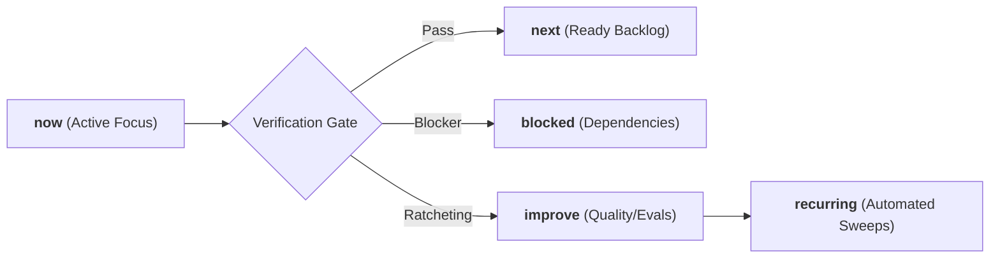

# Ars Arcanum (Scriptorium) — Agentic Operating Manifesto & Engineering Contracts
> **Sovereign Authoring Operating System (GPA 4.0/4.0 — Grade A+)** | Release v0.1.0

---

## 1. System Identity & Mission

**Ars Arcanum (Scriptorium)** is a sovereign, 100% offline, privacy-first operating system and craft studio designed for speculative fiction authors, worldbuilders, and narrative designers. 

### Core Operating Principles
1. **Absolute Creative Sovereignty**: Zero cloud dependencies, zero external network telemetry, and 100% offline privacy for unpublished creative intellectual property.
2. **Deterministic Rails over Probabilistic Free-Form**: Mandatory validation gates, rigid schemas, atomic POSIX/Windows file I/O, and mathematical consistency checks for all lore and manuscript operations.
3. **Continuous Verification & Anti-Stall Momentum**: Every milestone ratchets forward repository capabilities across explicit momentum queues (`now`, `next`, `blocked`, `improve`, `recurring`).
4. **Defense in Depth**: Strict path traversal sanitization, cross-platform file locking, stream-verified archives, and cryptographic GPG backup protection.

---

## 2. Invariant Engineering Contracts

All automated agents, subagents, and human contributors must strictly uphold these non-negotiable architectural contracts:

### 2.1 File Safety & Storage Invariants
- **Atomic Writes**: All file modifications must use `atomic_write()` from [`scripts/lib/_bootstrap.py`](file:///scripts/lib/_bootstrap.py) (temporary file $\to$ `flush` $\to$ `fsync` $\to$ `os.replace` $\to$ parent directory `fsync`). Direct unbuffered file overwrites are prohibited.
- **Cross-Platform File Locking**: Concurrency-sensitive operations (snapshots, backups, migrations) must acquire an `ArcanumLock` ([`scripts/lib/lockfile.py`](file:///scripts/lib/lockfile.py)) utilizing `fcntl.flock` on POSIX and `msvcrt.locking` on Windows.
- **Path Traversal Defense**: All user-supplied volume names, draft identifiers, and book targets must be sanitized via regex token validation `^[A-Za-z0-9_-]+$`. Directory separators (`/`, `\`) and path traversals (`..`) are rejected immediately, alongside Windows reserved device names (`CON`, `PRN`, `AUX`, `NUL`, `COM1-9`, `LPT1-9`).
- **Zero-Pip Dependency Guarantee**: All core craft engines, validators, parsers, and static site generators must execute exclusively on standard library Python primitives without external `pip` dependencies.

### 2.2 Content Security Policy & Offline Isolation
- Every generated HTML report, interactive corkboard, visual timeline, static codex, and Zen drafting studio must declare strict offline Content Security Policies:
  ```html
  <meta http-equiv="Content-Security-Policy" content="default-src 'none'; style-src 'unsafe-inline'; script-src 'unsafe-inline'; img-src data:; media-src data: blob:;">
  ```
- No external CDN scripts, remote fonts, or network requests are permitted in generated artifacts.

### 2.3 Granular Scope & Intelligent Context Invariants
- **Altitude-Aware Context Defaults**: Engines must never perform unconstrained whole-drive or all-vault scans by default. When no explicit target is supplied, engines resolve the active manuscript/world context via `config.json`, current working directory, or single-project discovery.
- **Granular Slice Resolution**: All narrative, craft, and worldbuilding engines must support targeted execution across universes, worlds, lore categories, series, books, chapter lists/ranges (`1-5`, `1,3,7-10`, `ch01..ch05`), and scene slices (`1-3`, `sc01..sc02`) via [`scripts/lib/scope.py`](file:///scripts/lib/scope.py) (`EngineScope`, `filter_manuscript_scope`, `filter_world_scope`).

### 2.4 Separation of the Three Subsystems & Epistemic Safety
To protect authorial sovereignty and prevent technical urgency from lending false authority to subjective aesthetic opinions, all engines and tools must strictly operate within one of three separated subsystems:
1. **Invariant Consistency Engine (Subsystem 1)**: Deterministic file safety, atomic locks, SHA-256 validation, syntax/parse errors, and explicit author-declared hard invariants (`[AUTHOR RULE]`, `[DATA ISSUE]`). **Fails builds (`exit 1`) in strict mode.**
2. **Selected Craft Lenses (Subsystem 2)**: Modular reference overlays (Three-Act, Save the Cat, Hero's Journey, Kishōtenketsu, Fichtean, soft/hard magic, readability, cadence variance). **Always advisory (`exit 0` by default), phrased as observations or questions, dismissible via `@intent: deliberate`.**
3. **Creative Ideation & Sparks (Subsystem 3)**: Combinatorial analogies, creative prompts, conceptual bridge syntheses. **Always clearly labeled with provenance tags (`[SPECULATION]`).**

---

## 3. Momentum Queues & Compounding Architecture

The system tracks its active state across five persistent momentum queues:



1. **`now`**: The active milestone currently undergoing execution and verification.
2. **`next`**: Concrete, unblocked technical tasks staged for immediate execution.
3. **`blocked`**: Tasks awaiting external dependencies or human-in-the-loop decisions.
4. **`improve`**: Refactoring candidates, test coverage expansion, and performance optimizations.
5. **`recurring`**: Automated background invariants (supply-chain SHA-256 sweeps, version parity gates, static syntax sweeps, systemd backup timers).

---

## 4. Domain Engine Topology

The codebase separates concerns into three coordinated architectural tiers:

```
scripts/
├── __init__.py                # Package root for pip install / setuptools entry points
├── arcanum                    # POSIX unified CLI bootstrap wrapper
├── arcanum_app.py             # Desktop GTK3 application entry point
├── lib/
│   ├── _bootstrap.py          # Atomic write, path resolution & common primitives
│   ├── cli.py                 # Authoritative Python CLI dispatcher (v0.1.0)
│   ├── scope.py               # Universal granular target scoping & range parsing engine
│   ├── ui_gtk3/               # Modular presentation package (<800 lines/file)
│   ├── ui_adw.py              # Modern Libadwaita interface
│   ├── registry_base.py       # Core EngineSpec dataclasses, categories & base classes (<200 lines)
│   ├── registry_specs/        # Domain engine specifications package across 7 domains (<400 lines/file)
│   ├── registry.py            # Core vs. Craft engine discovery matrix & doc formatting (<600 lines)
│   ├── data_access.py         # Centralized cached vault reader & frontmatter AST layer
│   ├── studio_hub.py          # Hardened browser-based Studio Hub & Scope Cockpit (<550 lines)
│   ├── studio_hub_template.py # Presentation HTML/CSS/JS template for Studio Hub (<60 lines)
│   ├── resonance.py           # Universal resonance mesh dispatcher & coherence auditor (<650 lines)
│   ├── resonance_data.py      # Resonance node/edge catalog & cascade impact engine (<600 lines)
│   ├── resonance_template.py  # Presentation HTML/CSS/JS template for resonance graph (<680 lines)
│   ├── economy.py             # Macroeconomic PPP validator & tech anachronism auditor (<780 lines)
│   ├── economy_data.py        # Tech era dictionaries & normalization primitives (<130 lines)
│   ├── economy_template.py    # Offline HTML report generator for economic audits (<140 lines)
│   ├── economy_trade.py       # Trade route freight margins & settlement gravity simulation (<350 lines)
│   ├── tips.py                # Craft tip retrieval & query engine (<350 lines)
│   ├── tips_catalog/          # Modularized tip catalog across 6 craft domains (<60 lines/file)
│   ├── zen_studio.py          # Standalone offline drafting studio & lore drawer
│   ├── story_canvas.py        # Visual drag-and-drop story corkboard
│   ├── timeline_sync.py       # Dual-track narrative vs chronological synchronizer
│   ├── omnibus.py             # Multi-volume series omnibus compiler
│   ├── restore.py             # Hardened archive restore engine with non-empty directory defense
│   ├── corpus_export.py       # Universal structured JSONL/SQLite RAG exporter & vault restore
│   ├── local_rag.py           # Zero-dependency hybrid TF-IDF & SQLite FTS5 semantic retriever
│   └── [Craft Engines]        # Astrophysics, climate, genealogy, conlang, causality, magic... (<800 lines/file)
```

---

## 5. Verification Protocol & Quality Gates

Before any milestone or phase is marked complete, the following quality gates must pass with 100% compliance:

```bash
# 1. Full Python Test Suite Discovery (960 tests, 0 failures permitted)
python -m unittest discover tests

# High-performance parallel test runner (~20s execution)
python scripts/test_parallel.py

# 2. Strict Expanded Ruff Linter Pass (0 violations permitted)
ruff check .

# 3. Strict Mypy Static Type Checking across all source files
mypy --explicit-package-bases scripts tests

# 4. Coverage Threshold Enforcement (fail_under = 80)
coverage run -m unittest discover tests; coverage report --fail-under=80

# 5. Canonical 7-Stage Integration Verification Harness (POSIX)
bash scripts/verify.sh
```
