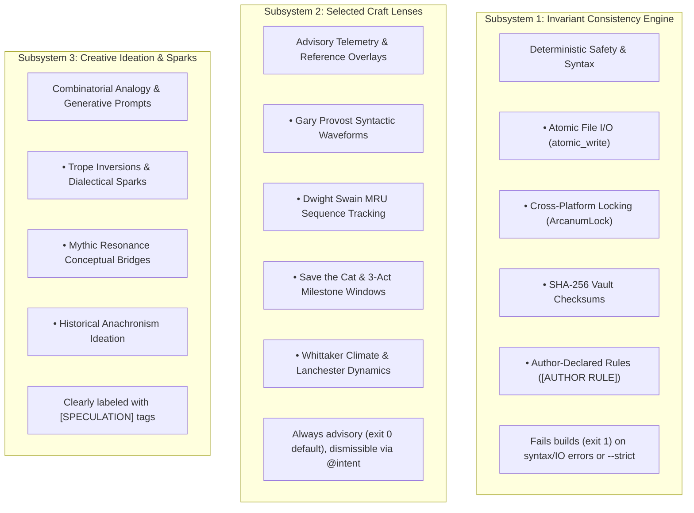

# 🖋️ Ars Arcanum — Sovereign Authoring Operating System & Craft Studio

> **A 100% offline, privacy-first operating system and craft studio for speculative fiction authors, worldbuilders, and narrative designers.**  
> Zero cloud dependencies · Zero telemetry · Deterministic rails over probabilistic drift · Your intellectual property, sovereign forever.

[](CHANGELOG.md)
[](#)
[-brightgreen.svg)](#)
[](#)
[](LICENSE)
[-success.svg)](#)

---

## The Sovereignty Principle

> **"Measure everything that helps the author think; prescribe nothing unless the author explicitly asks for a prescription."**

Ars Arcanum (code-named *Scriptorium*) is a sovereign, local-first authoring platform and worldbuilding operating system. It provides speculative fiction novelists, epic fantasy worldbuilders, and narrative designers with an exhaustive professional craft studio—from secondary-world bibles and conlang phonotactics to sub-second typesetting and omnibus compilation—without a single cloud dependency, external telemetry ping, or Python pip requirement.

All manuscripts and lore vaults are stored in **standard CommonMark Markdown** (`.md`), human-readable **YAML frontmatter**, and standard **DOCX / Typst** source. Your intellectual property remains un-scraped, un-monetized, and completely readable 50 years from now on any POSIX or Windows machine.

---

## ✨ Architectural Pillars & Studio Capabilities

| Studio Component | Core Capabilities |
|:--|:--|
| **🖥️ Studio Hub & Scope Cockpit** | Standalone GTK3 desktop app (Linux) & hardened browser Studio Hub (Cross-Platform) with real-time altitude scoping and live modal engine dispatch. |
| **🎯 Altitude-Aware Scoping** | Execute craft engines on exact slices: scenes (`--scene 1-3`), chapters (`-c 1-5`, `ch01..ch05`), books (`-b 1-2`), lore categories, or worlds without whole-vault overhead. |
| **🪐 World Bible Ecosystem** | Obsidian-compatible vault architecture with structured schemas for characters, cultures, pantheons, genealogies, and magic systems. |
| **✍️ Zen Drafting & Bidirectional Sync** | Standalone distraction-free Zen drafting studio, plus seamless bidirectional Markdown ↔ DOCX synchronization. |
| **🔮 53 Sovereign Craft Engines** | Comprehensive domain engines across 5 domains: Astrophysics, Climate, Conlang, Factions, Genealogy, Magic Systems, Resonance, Tactical Sim, Pacing, and Scene Mechanics. |
| **📚 Sub-Second Typesetting** | Single-command compilation to print-ready PDF (Typst presets), clean EPUB (Pandoc), submission DOCX (william shunn), and offline TTS acoustic proofing. |
| **🔒 Immutable Safety & Cryptography** | POSIX/Windows atomic file writes (`atomic_write`), cross-platform file locking (`ArcanumLock`), SHA-256 backup verification, and GPG encryption. |
| **🧠 Local Semantic Search & Codex** | Offline hybrid TF-IDF and SQLite FTS5 semantic search across lore bibles. Zero API keys, zero external networks. |

---

## 🏛️ The Three Subsystems & Epistemic Safety

To protect authorial sovereignty and prevent technical algorithms from masquerading as subjective aesthetic rules, Ars Arcanum strictly segregates all operations into three isolated subsystems:



### The 6-Tier Diagnostic Severity Taxonomy
Diagnostics across all engines are categorized into six explicit severity tiers:
1. **`CANON_ERROR`**: Provable contradiction against explicit author-declared facts.
2. **`RULE_CONFLICT`**: Violation of an explicit author-declared world invariant (`[AUTHOR RULE]`).
3. **`OBSERVATION`**: Objective statistical telemetry (word counts, sentence distributions, timeline ordering).
4. **`LENS_NOTE`**: Insights generated by an opt-in craft lens (Save the Cat, Swain MRUs, Provost waveforms).
5. **`SUGGESTION`**: Optional revision pathways presenting concrete tradeoffs.
6. **`EXPERIMENT`**: Creative prompts and speculative brainstorming labeled with `[SPECULATION]`.

---

## 📜 The Authorial Constitution

Authors declare their narrative conventions, world axioms, and diagnostic filters in `constitution.yaml` or `constitution.json`:

```yaml
---
# ~/.config/ars-arcanum/config.json or World/Manuscript constitution.yaml
canon:
  authority: author
  narrator_reliability: unreliable       # Allows narrative ambiguity
  allow_unresolved_mysteries: true

style:
  passive_voice: observe                 # "observe" | "allow"
  repetition: observe                    # "observe" | "allow"
  filter_verbs: observe

structure:
  framework: three_act                   # "none" | "three_act" | "kishotenketsu" | "heros_journey"
  mode: descriptive                      # Observational telemetry only

magic:
  modality: mythic                       # "mythic" | "soft" | "rationalist" | "unconstrained"
  enforce_thermodynamics: false

continuity:
  timeline: flexible
  preserve_poetic_variation: true        # Permits metaphorical eye/hair color variations

diagnostics:
  default_severity: advisory             # Universal exit code 0 default
  suppressed_rules: []                   # Rule IDs to silence
---
```

---

## ⚡ 5-Minute Quickstart

### Prerequisites
- Python 3.10+ (Standard Library only — zero pip packages required)
- *Optional recommended tools:* Git, Pandoc, Typst, Obsidian

### 1. Installation

**Linux / macOS:**
```bash
git clone https://github.com/aryansinghnagar/Ars-Arcanum.git Ars-Arcanum
cd Ars-Arcanum
bash scripts/setup_arcanum.sh
```

**Windows (PowerShell):**
```powershell
git clone https://github.com/aryansinghnagar/Ars-Arcanum.git Ars-Arcanum
cd Ars-Arcanum
powershell -ExecutionPolicy Bypass -File scripts\setup_arcanum.ps1
```

### 2. Launching Control Surfaces

- **Studio Hub (Cross-Platform Browser UI):**
  ```bash
  python scripts/arcanum hub
  # Or on Windows: .\scripts\arcanum.cmd hub
  ```
- **Zen Drafting Studio (Distraction-Free Offline Studio):**
  ```bash
  python scripts/arcanum zen
  ```
- **CLI Craft Engine Dispatcher:**
  ```bash
  python scripts/arcanum craft structure --paradigm three_act
  python scripts/arcanum craft factions check
  python scripts/arcanum craft magic check
  python scripts/arcanum craft causality dag
  ```

---

## 🗂️ Sovereign Vault Structure

```
~/Universes/<UniverseName>/
├── universe.yaml              → Overarching cosmological container
└── <WorldName>/               → Obsidian-compatible World Bible lore vault
    ├── world.yaml             → World manifest & axioms
    ├── constitution.yaml      → Local Authorial Constitution
    ├── Characters/            → Character dossiers, arcs, and voice profiles
    ├── Locations/             → Regional climate biomes, routes, and maps
    ├── Factions/              → Diplomatic matrices, treaties, and vassals
    ├── Magic-Technology/      → Magic modalities, costs, and limits
    ├── Bestiary/              → Species, ecosystems, and food webs
    ├── Artifacts/             → Relics, focal items, and provenance
    ├── Cosmology/             → Pantheons, astrophysics, and prophecies
    ├── History/               → Timelines, causal DAGs, and branches
    ├── Languages/             → Conlang morphosyntax and glossaries
    └── .obsidian/             → Pre-configured offline Obsidian workspace

~/Manuscripts/<ManuscriptName>/
├── manuscript.yaml            → Links Universe, World Bible, and active book
├── constitution.yaml          → Manuscript-specific craft constitution
├── Book-01/                   → Dedicated repository container
│   ├── Draft-01/
│   │   ├── 01_Act_I/
│   │   │   ├── 01_Chapter.md  → Chapter markdown source with scene directives
│   │   │   └── 02_Chapter.md
│   │   └── 02_Act_II/
│   └── Export/                → PDF, EPUB, and submission DOCX exports
```

---

## 🔍 Verification & Engineering Gates

Ars Arcanum enforces strict deterministic quality gates across POSIX and Windows:

```bash
# 1. Full 95-module parallel test discovery (970 tests, 0 failures)
python scripts/test_parallel.py

# 2. Strict Ruff linter pass (0 violations)
ruff check .

# 3. Strict Mypy static type checking across all 218 source files
mypy --explicit-package-bases scripts tests

# 4. Canonical POSIX Integration Verification Harness
bash scripts/verify.sh
```

---

## 📖 Documentation Index

- **[📖 Author's Craft Manual](docs/AUTHOR_MANUAL.md)** — Exhaustive guide to sovereign worldbuilding and narrative drafting.
- **[🏛️ System Architecture Blueprint](docs/ARCHITECTURE.md)** — C4 diagrams, Three Subsystem breakdown, and engine topology.
- **[📚 Craft Logic Encyclopedia](docs/ENGINE_LOGIC_ENCYCLOPEDIA.md)** — Historical lineages, mathematical models, and tradeoffs for all 53 engines.
- **[⚡ Complete Setup & Installation Guide](docs/SETUP_GUIDE.md)** — Step-by-step installation instructions for Linux, macOS, and Windows.
- **[🔒 Security & Threat Model](docs/THREAT_MODEL.md)** — Air-gapped CSP policies, path traversal defense, and cryptographic guarantees.
- **[📚 Master Academic & Craft References](REFERENCES.md)** — 340+ verified academic and literary citations.

---

## 📄 License & Intellectual Property

Ars Arcanum is open-source software licensed under the **[MIT License](LICENSE)**.  
All creative works, manuscripts, world bibles, and lore created using Ars Arcanum remain the **100% sovereign intellectual property of the author**, free from any licensing claim, telemetry tracking, or cloud retention.
