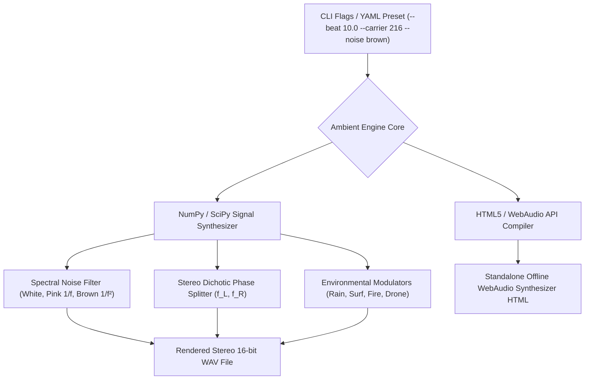

# AMBIENT — Focus Ambient & Binaural Soundscape Generator (`docs/AMBIENT.md`)
> **Module**: `scripts/lib/ambient.py` | **CLI Command**: `arcanum ambient`  
> **Domain**: Psychoacoustics, Brainwave Entrainment & Focus Audio Synthesis

---

## 1. Overview & Theoretical Rationale

The **Ars Arcanum Ambient Engine** (`scripts/lib/ambient.py`) is an offline acoustic synthesizer, psychoacoustic noise generator, and binaural-beat brainwave entrainment system designed to optimize neurocognitive flow during worldbuilding, plotting, and prose drafting sessions.

Auditory distraction is one of the primary triggers of working memory fragmentation. The human auditory cortex is hardwired to attend to intermittent, intelligible human speech and sudden transient sounds. This creates cognitive interference:
1. **Intelligible Speech Interference**: Overhearing conversational speech consumes semantic working memory capacity ($\mathcal{C}_{\text{WM}}$), directly competing with the lexical search networks required for writing.
2. **Startle Reflexes & Cortisol Spikes**: Unpredictable environmental transients (traffic horns, door slams) trigger adrenergic fight-or-flight micro-arousals, terminating deep flow states.
3. **Overly Rhythmic / Lyrical Music Distraction**: Music containing recognizable vocal lyrics or complex variable tempos demands conscious cognitive decoding.

The Ambient Engine provides two sovereign, zero-dependency audio generation pathways:
- **Procedural WAV Synthesizer**: Generates 44,100 Hz, 16-bit stereo `.wav` audio files using NumPy/SciPy mathematical signal processing.
- **Air-Gapped HTML5 WebAudio Synthesizer**: Compiles an interactive, standalone single-file HTML application that synthesizes infinite procedural audio in real-time inside any modern browser with zero server connection.



---

## 2. Psychoacoustics & Auditory Masking Physics

```
+-----------------------------------------------------------------------------------+
|                           SPECTRAL NOISE COLOR SPECTRUM                           |
+-------------------+-------------------------------+-------------------------------+
| WHITE NOISE       | PINK NOISE (1/f)              | BROWN / RED NOISE (1/f²)      |
| Equal power per   | Equal power per octave;       | -6 dB/octave attenuation;     |
| Hz across full    | natural waterfall / rainfall  | deep, warm, low-frequency     |
| spectrum (Hiss).  | sound profile.                | thunder / ocean roar.         |
+-------------------+-------------------------------+-------------------------------+
```

### 2.1 Spectral Power Density Formulations
1. **White Noise**: Power spectral density $S(f)$ is constant across all frequencies:
   $$S_{\text{white}}(f) = C_0$$
2. **Pink Noise ($1/f$ Fractal Noise)**: Power drops at $3\text{ dB per octave}$:
   $$S_{\text{pink}}(f) \propto \frac{1}{f}$$
3. **Brownian / Red Noise ($1/f^2$ Noise)**: Integrated white noise dropping at $6\text{ dB per octave}$:
   $$S_{\text{brown}}(f) \propto \frac{1}{f^2}$$
   *Psychoacoustic Quality*: Brown noise provides maximum auditory masking of low-to-mid frequency environmental noise while evoking a warm, enveloping sensation devoid of harsh high-frequency treble fatigue.

### 2.2 Auditory Masking Thresholds
A continuous background masker $M$ with sound pressure level $L_M(f)$ elevates the hearing threshold for distracting transient sounds $T$ at frequency $f$:

$$\text{Masking Criterion}: \quad L_T(f) \le L_M(f) - \Delta L_{\text{crit}}(f) \implies \text{Transient is Inaudible}$$

---

## 3. Binaural Beat Physics & Brainwave Entrainment

When two pure sinusoidal tones of slightly differing frequencies $f_L$ and $f_R$ are presented dichotically (one to each ear via stereo headphones), the brain's **Superior Olivary Complex** in the brainstem integrates the phase difference, perceiving an internal amplitude modulation known as a **Binaural Beat**:

```
Left Ear:   sin(2π f_L t)  ---\
                               +---> Superior Olivary Complex ---> Perceived Beat: sin(2π f_beat t)
Right Ear:  sin(2π f_R t)  ---/
```

### 3.1 Mathematical Frequency Equations
Let $f_c$ be the base **carrier frequency** and $f_{\text{beat}}$ be the desired **entrainment beat frequency**:

$$f_{\text{beat}} = |f_L - f_R|$$

$$f_c = \frac{f_L + f_R}{2} \in [100\text{ Hz}, 500\text{ Hz}]$$

The discrete stereo channels are generated as:

$$f_L = f_c - \frac{f_{\text{beat}}}{2}, \qquad f_R = f_c + \frac{f_{\text{beat}}}{2}$$

*Carrier Frequency Selection*: Carrier tones between $150\text{ Hz}$ and $250\text{ Hz}$ (e.g. $216\text{ Hz}$ or $432\text{ Hz}$) provide optimal neural phase-locking in human auditory pathways.

### 3.2 EEG Brainwave Frequency Taxonomy

| Band | Frequency ($f_{\text{beat}}$) | Neurocognitive State | Ideal Worldbuilding Activity |
|---|---|---|---|
| **Delta ($\delta$)** | $0.5 - 4.0\text{ Hz}$ | Deep restorative sleep, unconscious processing. | Overnight subconscious problem incubation. |
| **Theta ($\theta$)** | $4.0 - 8.0\text{ Hz}$ | Deep meditation, hypnagogia, associative memory. | Mythic ideation, dreamlike surreal brainstorming, cosmology design. |
| **Alpha ($\alpha$)** | $8.0 - 13.0\text{ Hz}$ | Relaxed alertness, cognitive flow, calm focus. | **High-velocity prose drafting**, scene writing, dialogue composition. |
| **Beta ($\beta$)** | $13.0 - 30.0\text{ Hz}$ | Analytical processing, active problem solving. | Timeline paradox debugging, calendar math, tactical battle simulation. |
| **Gamma ($\gamma$)** | $30.0 - 50.0\text{ Hz}$ | Peak cognitive binding, multi-modal synthesis. | Universal resonance cross-pillar synthesis audits. |

---

## 4. Procedural Environmental Soundscape Models

The Ambient Engine implements procedural DSP synthesis models:

1. **Rain (`rain`)**: Pink noise modulated by low-frequency Brownian ripples ($0.1\text{--}0.5\text{ Hz}$) with pseudo-random high-frequency droplet transients.
2. **Ocean Surf (`surf`)**: Low-pass filtered brown noise shaped by an asymmetric envelope ($T_{\text{wave}} \approx 8\text{--}12\text{s}$, fast swell $\to$ slow foam retreat).
3. **Campfire (`fire`)**: Warm brown base drone punctuated by Poisson-distributed stochastic pops and crackle impulses.
4. **Deep Space Drone (`space`)**: Resonant low-pass filtered saw/sine cluster ($55\text{ Hz}, 110\text{ Hz}, 165\text{ Hz}$) with slow LFO phase sweeping ($0.03\text{ Hz}$).
5. **Clockwork Library (`library`)**: Subdued room resonance with periodic ultra-low-amplitude mechanical tick impulses.

---

## 5. Built-In Presets & CLI Reference

### 5.1 Predefined Profiles Matrix

| Profile Key | Mode | Noise Color | Carrier ($f_c$) | Beat ($f_{\text{beat}}$) | Target State |
|---|---|---|---|---|---|
| `deep-focus` | `drone` | `brown` | $216.0\text{ Hz}$ | $10.0\text{ Hz}$ ($\alpha$) | Sustained Prose Drafting |
| `brainstorm` | `surf` | `pink` | $196.0\text{ Hz}$ | $6.0\text{ Hz}$ ($\theta$) | Creative Ideation & Plotting |
| `astral-void` | `space` | `brown` | $108.0\text{ Hz}$ | $4.5\text{ Hz}$ ($\theta$) | Hard Sci-Fi & Cosmic Worldbuilding |
| `midnight-rain`| `rain` | `pink` | $220.0\text{ Hz}$ | $8.5\text{ Hz}$ ($\alpha$) | Mood Immersion & Flow |
| `tactical-grid`| `clockwork`| `white` | $260.0\text{ Hz}$ | $16.0\text{ Hz}$ ($\beta$) | Complex Structural Editing & Math |

### 5.2 CLI Invocations
```bash
# Generate a 30-minute WAV file for deep focus drafting
arcanum ambient --profile deep-focus --duration 1800 -o audio/focus_30m.wav

# Synthesize customized Alpha wave soundscape with brown noise and ocean surf
arcanum ambient --mode surf --noise brown --carrier 216 --beat 10.0 --duration 600 -o audio/alpha_surf.wav

# Export a standalone, zero-dependency HTML5 WebAudio synthesizer for in-browser use
arcanum ambient --profile midnight-rain --html -o studio_ambient.html

# Synthesize Theta wave astral drone for worldbuilding ideation
arcanum ambient --mode space --beat 5.5 --carrier 144 --duration 1200 -o audio/theta_space.wav
```

---

## 6. Worked Step-by-Step Example

### Scenario: Generating an Alpha-Entrainment Soundscape for a 45-Minute Writing Sprint
1. **Target Parameters**:
   - Cognitive Goal: Sustained narrative flow ($\alpha$-band, $f_{\text{beat}} = 10.0\text{ Hz}$).
   - Carrier Base: Harmonic $f_c = 216.0\text{ Hz}$ (A3 tuning standard reference).
   - Left Ear Frequency: $f_L = 216.0 - \frac{10.0}{2} = 211.0\text{ Hz}$.
   - Right Ear Frequency: $f_R = 216.0 + \frac{10.0}{2} = 221.0\text{ Hz}$.
   - Noise Masker: Brownian noise ($1/f^2$) at $-18\text{ dBFS}$ relative to carrier tones.
2. **Execution**:
   ```bash
   arcanum ambient --carrier 216.0 --beat 10.0 --noise brown --mode rain --duration 2700 -o sprints/alpha_sprint_45m.wav
   ```
3. **Acoustic Result**:
   - The user wears stereo headphones during the sprint.
   - External household noise is masked by the gentle Brownian rain profile.
   - The $10\text{ Hz}$ binaural phase integration promotes relaxed, steady drafting cadence without fatigue.

---

## 7. Recommended Reading, References & Media

### 7.1 Foundational Craft & Academic Books
- **Oster, Gerald (1973)**. "Auditory Beats in the Brain", *Scientific American*, 229(4), 94–102. DOI: 10.1038/scientificamerican1073-94.  
  *The landmark paper discovering the neurological mechanism of binaural beat processing in the human superior olivary complex.*
- **Eno, Brian (1978)**. *Ambient 1: Music for Airports* (Liner Notes and Essays on Generative Ambient Audio). E.G. Records.  
  *The foundational philosophical manifesto defining ambient audio: 'as ignorable as it is interesting, accommodating many levels of listening attention.'*
- **Roederer, Juan G. (2008)**. *The Physics and Psychophysics of Music: An Introduction* (4th ed.). Springer. ISBN: 978-0387094700.  
  *The authoritative textbook on neuroacoustics, pitch perception, and auditory masking.*
- **Cook, Perry R. (2002)**. *Real Sound Synthesis for Interactive Applications*. A K Peters / CRC Press. ISBN: 978-1568811680.  
  *Comprehensive mathematical reference on procedural noise synthesis, modal filters, and stochastic audio modeling.*
- **Csikszentmihalyi, Mihaly (1990)**. *Flow: The Psychology of Optimal Experience*. Harper & Row. ISBN: 978-0061339202.  
  *Explores the environmental and acoustic prerequisites for entering and maintaining deep psychological flow states.*

### 7.2 Landmark Scientific / Worldbuilding Papers & Textbooks
- **Lane, James D. et al. (1998)**. "Binaural auditory beats affect vigilance performance and mood", *Physiology & Behavior*, 63(2), 249–252. DOI: 10.1016/S0031-9384(97)00436-8.  
  *Controlled clinical study demonstrating that theta and beta binaural beats enhance vigilance and reduce task-related fatigue.*
- **Chaieb, Leila et al. (2015)**. "Auditory Beat Stimulation and its Effects on Cognition and Mood States", *Frontiers in Psychiatry*, 6(70). DOI: 10.3389/fpsyt.2015.00070.  
  *Systematic review of electrophysiological brainwave entrainment through auditory stimulation.*

### 7.3 Seminal Video Lectures, Masterclasses & Channels
- **Andrew Huberman (Huberman Lab, 2021)**. *How to Focus & Stay Focused: Sound, Binaural Beats & White Noise*. Podcast / YouTube.  
  *Detailed neurobiological explanation of 40 Hz Gamma and 10 Hz Alpha auditory entrainment.*
- **Perry R. Cook (Stanford CCRMA, 2017)**. *Physical Audio Signal Processing & Noise Synthesis*. Stanford University Lectures.  
  *Examines the algorithmic implementation of fractal noise and procedural environmental soundscapes.*
- **David Huron (2006)**. *Sweet Anticipation: Music and the Psychology of Expectation*. MIT Press Lectures.  
  *Analyzes the evolutionary psychology of musical expectation, auditory surprise, and mental tension.*

### 7.4 Landmark Speculative Case Studies
- **Brian Eno, *Apollo: Atmospheres and Soundtracks* (1983)**: The benchmark ambient soundtrack written for the moon landings, combining space drones with pedal steel guitar.
- **Denis Villeneuve & Hans Zimmer, *Blade Runner 2049* / *Dune* (2017/2021)**: Masterclasses in integrating procedural acoustic sound design directly into the diegetic worldbuilding texture of speculative cinema.
- **Wendy Carlos, *Sonic Seasonings* (1972)**: Pioneering procedural synthesizer work blending ambient field recordings with Moog electronic soundscapes to evoke atmospheric weather states.
