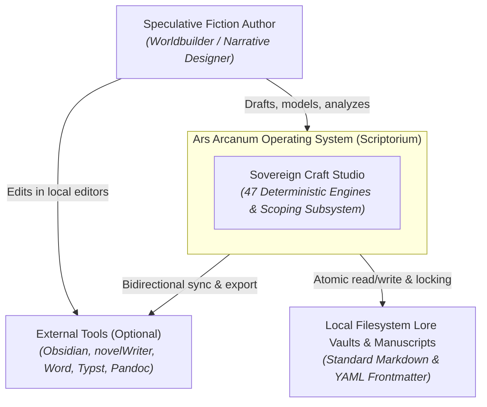
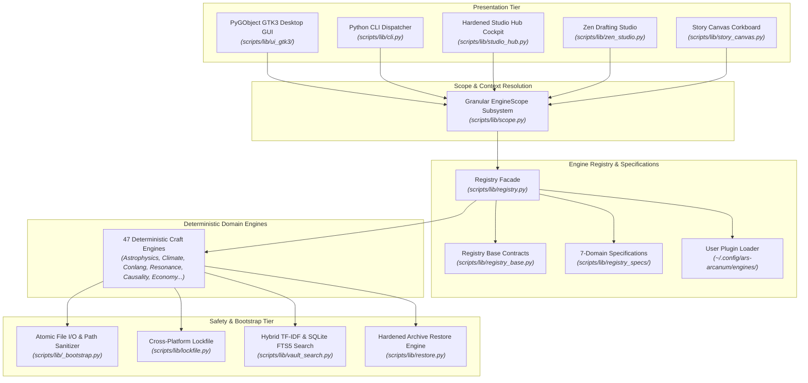
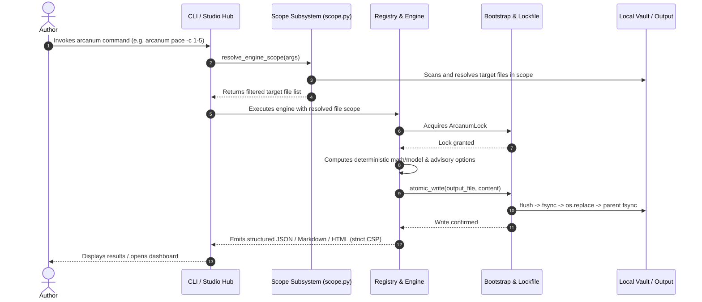
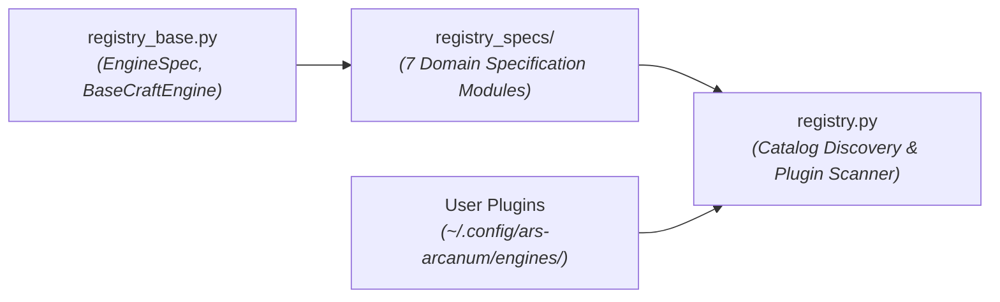

# Ars Arcanum Technical Architecture & System Blueprint

> **The Definitive, Audited Architecture Reference & System Blueprint for Ars Arcanum (Scriptorium)**  
> *A Sovereign, 100% Offline, Privacy-First Operating System & Craft Studio for Speculative Fiction Authors*  
> **Current Version**: `0.1.0` | **Quality Grade**: `A+` (GPA 4.0/4.0 Sovereign Operating System) | **Repository**: `https://github.com/aryansinghnagar/Ars-Arcanum.git`

---

## Part 1 — Whole-Repo Technical Deep-Dive

### 1.1 What Ars Arcanum Is
**Ars Arcanum** (repository: `Scriptorium` / `Ars-Arcanum`) is a sovereign, local-first, 100% offline authoring operating platform and speculative worldbuilding craft studio designed for Linux, Windows, and macOS workstations ([`README.md#L1-L35`](file:///README.md#L1-L35), [`AGENTS.md#L1-L60`](file:///AGENTS.md#L1-L60)). It orchestrates plain Markdown prose, OpenXML (`.docx`) bidirectional synchronization, multi-tier Git repository tracking, 47 modular Python craft and simulation engines, dynamic user plugin extensibility, zero-dependency local semantic retrieval (`vault_search`), bidirectional vault restoration with fail-closed integrity validation, and publication-grade Typst PDF / EPUB packaging.

All prose, character dossiers, lore bibles, and timelines are stored in standard plain Markdown (`.md`) and YAML frontmatter manifests on the author's local storage with zero vendor lock-in, zero cloud telemetry, strict `default-src 'none'` Content Security Policies, advisory-first creative freedom mechanics, and POSIX/Windows atomic crash safety.

---

### 1.2 Tech-Stack Detection Table

| Layer | Technology | Evidence (File & Line) |
| :--- | :--- | :--- |
| **Packaging & Build System** | `setuptools>=61.0` with `pyproject.toml` entry points (`arcanum`, `ars-arcanum`) | [`pyproject.toml#L1-L30`](file:///pyproject.toml#L1-L30), [`scripts/__init__.py`](file:///scripts/__init__.py) |
| **Desktop Application GUI** | Python 3.10+ & PyGObject (`Gtk 3.0`, `GLib`, `Gdk`, `Pango`) | [`scripts/arcanum_app.py#L1-L50`](file:///scripts/arcanum_app.py#L1-L50), [`scripts/lib/ui_gtk3/window.py#L1-L60`](file:///scripts/lib/ui_gtk3/window.py#L1-L60) |
| **Desktop Presentation Controller** | Decoupled UI State, Project Discovery & Async Worker Bridge | [`scripts/lib/ui_controller.py#L1-L100`](file:///scripts/lib/ui_controller.py#L1-L100) |
| **CLI Dispatcher & Tooling** | Canonical POSIX Dispatcher + Pure-Python CLI Dispatcher (`_DISPATCH_TABLE`) | [`scripts/arcanum#L1-L50`](file:///scripts/arcanum#L1-L50), [`scripts/lib/cli.py#L1-L100`](file:///scripts/lib/cli.py#L1-L100) |
| **Granular Target Scoping Subsystem** | Unified Scope Expression Parser, Token Ranges (`1-5`, `ch01..ch05`) & Context Altitude Resolver | [`scripts/lib/scope.py#L1-L120`](file:///scripts/lib/scope.py#L1-L120) |
| **Dynamic Plugin Architecture & Domain Specs** | `BaseCraftEngine` Lifecycle Contract, `scripts/lib/registry_base.py`, domain specs package (`scripts/lib/registry_specs/`), and User Plugin Scanner (`~/.config/ars-arcanum/engines/`) | [`scripts/lib/registry.py`](file:///scripts/lib/registry.py), [`scripts/lib/registry_base.py`](file:///scripts/lib/registry_base.py) |
| **Atomic File I/O & Bootstrap** | Crash-Safe Atomic Write (`flush` $\to$ `fsync` $\to$ `os.replace` $\to$ parent dir `fsync`) + Windows Reserved Device Name Rejections (`CON`, `PRN`, `AUX`, `NUL`, etc.) | [`scripts/lib/_bootstrap.py#L75-L115`](file:///scripts/lib/_bootstrap.py#L75-L115), [`scripts/lib/fs_utils.py#L1-L80`](file:///scripts/lib/fs_utils.py#L1-L80) |
| **Cross-Platform File Locking** | POSIX `fcntl.flock` + Windows `msvcrt.locking` Concurrency Locks (with deterministic byte-0 seeking & typed context management) | [`scripts/lib/lockfile.py#L65-L145`](file:///scripts/lib/lockfile.py#L65-L145) |
| **Universal Resonance Mesh** | Bi-Directional 5-Pillar Knowledge Graph, Causal Cascades & Analogy Synthesis | [`scripts/lib/resonance.py`](file:///scripts/lib/resonance.py), [`scripts/lib/resonance_data.py`](file:///scripts/lib/resonance_data.py), [`scripts/lib/resonance_template.py`](file:///scripts/lib/resonance_template.py) |
| **Dynamic Intelligent Tips** | Metadata-Rich Contextual Craft Wisdom & Non-Repeating History Differencing | [`scripts/lib/tips.py#L1-L100`](file:///scripts/lib/tips.py#L1-L100) |
| **Local Semantic Retrieval (Vault Search)**| Zero-Dependency Hybrid TF-IDF & SQLite FTS5 Vector Lore Search Engine | [`scripts/lib/vault_search.py#L1-L100`](file:///scripts/lib/vault_search.py#L1-L100) |
| **Zen Drafting Studio** | Standalone Typewriter Studio, Sine-Wave Soundscape & In-Situ Lore Drawer | [`scripts/lib/zen_studio.py#L1-L100`](file:///scripts/lib/zen_studio.py#L1-L100) |
| **Studio Desktop Hub** | Hardened Local REST Telemetry Cockpit, Origin Guard, Engine Allowlist & Scope Explorer | [`scripts/lib/studio_hub.py#L1-L100`](file:///scripts/lib/studio_hub.py#L1-L100) |
| **Interactive Story Canvas** | Client-Side Drag-and-Drop Corkboard & Multi-Paradigm Structure Analyzer | [`scripts/lib/story_canvas.py#L1-L100`](file:///scripts/lib/story_canvas.py#L1-L100), [`scripts/lib/structure.py#L1-L100`](file:///scripts/lib/structure.py#L1-L100) |
| **Deific Cosmology Engine**| Domain Hegemony, Ritual Catalyst Auditing & Theological Heresy Validator | [`scripts/lib/cosmology.py#L1-L100`](file:///scripts/lib/cosmology.py#L1-L100) |
| **Economic Gravity & Supply Shocks**| Inter-Settlement Trade Routes, Macroeconomic Fisher Equation & Commodity Inflation Cascade Modeler | [`scripts/lib/economy.py`](file:///scripts/lib/economy.py), [`scripts/lib/economy_data.py`](file:///scripts/lib/economy_data.py), [`scripts/lib/economy_template.py`](file:///scripts/lib/economy_template.py), [`scripts/lib/economy_trade.py`](file:///scripts/lib/economy_trade.py) |
| **Manuscript Scaffolding Engine** | 16 Structural Narrative Framework Presets & Custom Division Layouts | [`scripts/lib/manuscript_scaffold.py#L1-L100`](file:///scripts/lib/manuscript_scaffold.py#L1-L100) |
| **Universal Corpus Exporter** | Heading-Aware AST Chunker $\to$ JSONL/SQLite & Bidirectional Vault Restore | [`scripts/lib/corpus_export.py#L1-L100`](file:///scripts/lib/corpus_export.py#L1-L100) |
| **Writing Sprint Analytics** | Atomic Sidecar State, WPM Velocity & Daily Streak Dashboard | [`scripts/lib/writing_sprint.py#L1-L100`](file:///scripts/lib/writing_sprint.py#L1-L100) |
| **Revision Churn Heatmap** | Git Commit Diff Metrics & Line Churn Tracking (`REV-101`/`REV-102`) | [`scripts/lib/revision_heatmap.py#L1-L100`](file:///scripts/lib/revision_heatmap.py#L1-L100) |
| **Causal DAG & Timeline Loops** | Multi-Paradigm Time Travel, Novikov Self-Consistency, CTC Loops & Branches | [`scripts/lib/causality.py#L1-L100`](file:///scripts/lib/causality.py#L1-L100) |
| **Prophecy Resolution Matrix** | Clause Tracking & Chosen One Mortality Validation (`PRP-101` to `PRP-103`) | [`scripts/lib/prophecy.py#L1-L100`](file:///scripts/lib/prophecy.py#L1-L100) |
| **Dramatis Personae & Cast** | Multi-Volume Character Matrix, Exact Levenshtein Edit Distance Collisions | [`scripts/lib/dramatis_personae.py#L1-L100`](file:///scripts/lib/dramatis_personae.py#L1-L100) |
| **Word Processor & DOCX Engine** | Native OpenXML Generator & Hardened Bidirectional Sync Engine | [`scripts/lib/docx_sync.py#L1-L100`](file:///scripts/lib/docx_sync.py#L1-L100) |
| **Smart Typography Normalizer** | Smart Literary Quotes, Em/En-Dashes, Ellipses & Codeblock Guards | [`scripts/lib/typography_cleaner.py#L1-L100`](file:///scripts/lib/typography_cleaner.py#L1-L100) |
| **Pre-Flight Typesetting Linter**| Manuscript and POD Typesetting Integrity Validator | [`scripts/lib/preflight.py#L1-L100`](file:///scripts/lib/preflight.py#L1-L100) |
| **Interactive Cartography** | Interactive SVG/HTML5 Map Creator, Editor & Lore Coordinate Mapper | [`scripts/lib/cartography.py#L1-L100`](file:///scripts/lib/cartography.py#L1-L100) |
| **World Doctor Diagnostics** | 8-Point Cross-Validation Diagnostics (`WLD-101` to `WLD-108`) | [`scripts/lib/world_doctor.py#L1-L100`](file:///scripts/lib/world_doctor.py#L1-L100) |
| **Astrophysics & Flight Engine** | Relativistic Kinematics, Non-Standard Worlds (Eyeball, Brown Dwarf), System Dossiers | [`scripts/lib/astrophysics.py#L1-L100`](file:///scripts/lib/astrophysics.py#L1-L100) |
| **Magic System Advisory Matrix** | Thermodynamic Arcane Rule, Reagent & Fatigue Diagnostic Engine | [`scripts/lib/magic_system.py#L1-L100`](file:///scripts/lib/magic_system.py#L1-L100) |
| **Dynastic Genealogy Engine** | Relaxed Family Tree DAG, Unrecorded Generations & Disputed Successions | [`scripts/lib/genealogy.py#L1-L100`](file:///scripts/lib/genealogy.py#L1-L100) |
| **Conlang & Sound Shift Engine** | Granular IPA Phonetics, Morphosyntax, Case Declensions & Sound Laws | [`scripts/lib/conlang.py#L1-L100`](file:///scripts/lib/conlang.py#L1-L100) |
| **Planetary Climate & Ecology** | Insolation, Orographic Rain Shadows, Köppen Biomes & 10% Biomass Webs | [`scripts/lib/climate.py#L1-L100`](file:///scripts/lib/climate.py#L1-L100), [`scripts/lib/ecology.py#L1-L100`](file:///scripts/lib/ecology.py#L1-L100) |
| **Multi-Calendar Chronology** | Multi-Calendar/Multi-Era Dynamic Projection & Invariant Continuous Timeline | [`scripts/lib/calendar.py#L1-L100`](file:///scripts/lib/calendar.py#L1-L100) |
| **Tactical Combat Simulator** | Lanchester Law Skirmishes, Unit Stats & Tactical Beats | [`scripts/lib/tactical_sim.py#L1-L100`](file:///scripts/lib/tactical_sim.py#L1-L100) |
| **Focus Ambient Soundscape** | Pure Trigonometric Sine-Wave Synthesizer Loop Generator | [`scripts/lib/ambient.py#L1-L100`](file:///scripts/lib/ambient.py#L1-L100) |
| **Typesetting & PDF Engine** | Typst (`>= 0.11.0`, pinned `0.14.2` musl static binary) | [`scripts/arcanum#L180-L240`](file:///scripts/arcanum#L180-L240) |
| **Document AST Converter** | Pandoc (`>= 2.19.x`, tested on `3.1.x`) | [`scripts/arcanum#L180-L240`](file:///scripts/arcanum#L180-L240), [`docs/COMPATIBILITY.md#L9-L16`](file:///docs/COMPATIBILITY.md#L9-L16) |

---

### 1.3 Entry Points

1. **Desktop GUI Application**: [`scripts/arcanum_app.py`](file:///scripts/arcanum_app.py) / [`scripts/lib/ui_gtk3/window.py`](file:///scripts/lib/ui_gtk3/window.py). Provides an integrated authoring dashboard with live word counts, Visual Scene Metadata Inspector, Draft Revisions & Redline Comparator, Craft & Lore Guide, and 47 integrated deterministic engines.
2. **Authoritative Python CLI Dispatcher**: [`scripts/lib/cli.py`](file:///scripts/lib/cli.py) (callable directly or via `pip install .` CLI entry points `arcanum` and `ars-arcanum`) routing 47+ craft subcommands via declarative `_DISPATCH_TABLE` with strict regex validation, JSON serialization, `arcanum doc` craft documentation lookups, and sub-second dispatch.
3. **POSIX Unified CLI Bootstrap**: [`scripts/arcanum`](file:///scripts/arcanum) wrapping the Python CLI dispatcher and providing standalone built-in bash subroutines for universe, world, manuscript, snapshot, backup, restore, and export operations on Linux/Unix systems.
4. **Studio Desktop Hub**: [`scripts/lib/studio_hub.py`](file:///scripts/lib/studio_hub.py) (`arcanum hub`, `arcanum dashboard`) providing an offline telemetry cockpit, Craft Guide tab, Scope Bar, and hardened local REST API with Origin validation, IPv6 support, and engine allowlist execution.
5. **Zen Drafting Studio**: [`scripts/lib/zen_studio.py`](file:///scripts/lib/zen_studio.py) (`arcanum studio`, `arcanum zen`) generating single-file offline typewriter writing studios with WebAudio soundscapes, in-situ lore drawer, and color themes.
6. **Story Canvas**: [`scripts/lib/story_canvas.py`](file:///scripts/lib/story_canvas.py) (`arcanum canvas`) providing an interactive visual story corkboard.

---

### 1.4 Commands & Verification Inventory

| Command | Purpose | Verification Source / Evidence | Trigger / CI Enforcement |
| :--- | :--- | :--- | :--- |
| `pip install .` / `pip install -e .` | Standard packaging installation and CLI entrypoint registration | [`pyproject.toml`](file:///pyproject.toml), [`scripts/__init__.py`](file:///scripts/__init__.py) | Verified in local environments & CI packaging smoke test |
| `python -m unittest discover tests` | Full repository Python unit & integration test suite (862 tests, 0 failures) | [`tests/test_*.py`](file:///tests/) | Pre-commit gate & Enforced CI check (`.github/workflows/ci.yml#L80-L85`) |
| `python -m unittest tests/test_<engine>.py` | Isolated single engine unit test suite (e.g. `test_cosmology.py`) | [`tests/`](file:///tests/) | Developer rapid feedback loop |
| `python -m coverage run -m unittest discover tests; python -m coverage report --fail-under=80` | Test code coverage enforcement (80-81% aggregate coverage) | [`pyproject.toml#L35-L45`](file:///pyproject.toml#L35-L45) | CI quality check & release verification gate |
| `python -m unittest tests/test_version_consistency.py` | Universal release version synchronization test across 6 surfaces | [`tests/test_version_consistency.py`](file:///tests/test_version_consistency.py) | Regression gate across all codebase constants |
| `python -m unittest tests/test_benchmark_suite.py` | Micro-benchmark latency assertion suite | [`tests/test_benchmark_suite.py`](file:///tests/test_benchmark_suite.py) | Performance regression gate |
| `python -m unittest tests/test_grand_tour_e2e.py` | Master 21-Stage full-pipeline lifecycle integration test | [`tests/test_grand_tour_e2e.py`](file:///tests/test_grand_tour_e2e.py) | Full-pipeline lifecycle validation |
| `arcanum doc <engine>` | Interactive engine documentation & advisory guidance viewer | [`scripts/lib/cli.py`](file:///scripts/lib/cli.py), [`scripts/lib/registry.py`](file:///scripts/lib/registry.py) | Author reference lookup |
| `arcanum search <query>` | Zero-dependency local TF-IDF & SQLite FTS5 search | [`scripts/lib/vault_search.py`](file:///scripts/lib/vault_search.py) | Lore & manuscript query |
| `arcanum scope [target]` | Live target scope resolution & chapter/scene/lore inspector | [`scripts/lib/scope.py`](file:///scripts/lib/scope.py) | Diagnostic scope verification |
| `ruff check .` | Strict Python linter across rule families (`E`, `F`, `B`, `S`, `UP`, `SIM`, `I`, `RUF`, `C901`) | [`pyproject.toml#L1-L30`](file:///pyproject.toml#L1-L30) | CI required status check (`.github/workflows/ci.yml#L60-L64`) |
| `mypy --explicit-package-bases scripts tests` | Strict static type checking across 186 source files (0 errors) | [`mypy.ini#L1-L25`](file:///mypy.ini#L1-L25), [`tests/test_type_safety.py`](file:///tests/test_type_safety.py) | CI required status check (`.github/workflows/ci.yml#L65-L69`) |
| `bash scripts/verify.sh` | Canonical 7-stage quality and regression test harness (POSIX) | [`scripts/verify.sh#L1-L496`](file:///scripts/verify.sh#L1-L496) | Local master pre-release gate |

---

### 1.5 Directory Layout

| Directory | Purpose |
| :--- | :--- |
| `scripts/` | Executable entry points, CLI dispatchers, installation scripts, package `__init__.py`, and verification harnesses. |
| `scripts/lib/` | 47 core simulation engines, scoping primitives, atomic I/O bootstrap, and presentation servers (<800 lines/file). |
| `scripts/lib/registry_specs/` | Modular engine specifications partitioned across 7 craft and infrastructure domains (<400 lines/file). |
| `scripts/lib/tips_catalog/` | Modular craft tip catalog specifications partitioned across 6 craft domains (<60 lines/file). |
| `scripts/lib/ui_gtk3/` | Modular PyGObject GTK3 desktop interface package (<800 lines/file). |
| `docs/` | User manuals, domain craft guides, engine logic encyclopedia, roadmap, and codebase documentation. |
| `docs/codebase/` | Specialized onboarding blueprints, stack analysis, testing patterns, and architectural concerns. |
| `docs/guides/` | Procedural guides for backups, distraction control, typography, fonts, and Obsidian plugin integrity. |
| `tests/` | 88 test files (862 tests) covering unit, integration, threat model, and benchmark test suites. |
| `templates/` | Standardized starter world bibles, demo cosmos (`Eldoria`), Obsidian plugins with SHA-256 manifest, and novelWriter templates. |
| `launchers/` | Desktop `.desktop` application launchers and menu shortcuts. |
| `configs/` | Deterministic plugin definitions, idiom dictionaries, and distraction-blocker rule profiles (`leechblock_arcanum_rules.json`). |

---

### 1.6 Deployment & Runtime Surface

| Component | Pinned Version / Specification | Runtime Surface | Evidence |
| :--- | :--- | :--- | :--- |
| **Python Runtime** | CPython `>= 3.10` (CI tested on 3.11, 3.12, 3.13, 3.14) | Standard Library Primitives | `pyproject.toml#L10-L15`, `.github/workflows/ci.yml#L30-L34` |
| **CI Runner Image** | `ubuntu-24.04`, `windows-latest`, `macos-latest` | GitHub Actions Virtual Environments | `.github/workflows/ci.yml#L20-L24`, `.github/workflows/ci.yml#L215-L220` |
| **Typst Typesetting Engine** | `0.14.2` (musl static x86_64/arm64 binary) | Print PDF & Typeset Compilation | `dependencies.lock#L1-L10`, `.github/workflows/ci.yml#L40-L45` |
| **Pandoc Converter** | `>= 2.19.x` (tested on `3.1.x`) | Document AST Conversion | `docs/COMPATIBILITY.md#L9-L16` |
| **PyGObject Desktop Layer** | `Gtk 3.0` / `Gtk 4.0` / `Libadwaita 1.0` | Linux System Packages (`gir1.2-gtk-3.0`) | `.github/workflows/ci.yml#L35-L39`, `scripts/arcanum_app.py` |
| **SQLite Database** | Standard Library `sqlite3` with FTS5 module | Local In-Memory & File Persistence | `scripts/lib/vault_search.py#L1-L40` |
| **Obsidian Plugins** | 10 Vendored Community Plugins with SHA-256 Digest Manifest | Local World Bible Vaults | `templates/world-bible/.obsidian/plugins/manifest.json` |

---

### 1.7 EOL / Dead-Dependency Scan

- **Python Standard Library Baseline**: Pure Python 3.10+ stdlib execution ensures zero pip-ecosystem rot, supply-chain vulnerabilities, or abandoned upstream wheels.
- **Setuptools Standard Build**: Pure declarative `pyproject.toml` with `setuptools>=61.0` and standard `scripts*` package layout ensures clean wheel packaging across modern Python distributions.
- **Typst Static Binary**: Musl static linking eliminates glibc version mismatches across heterogeneous Linux distributions (Ubuntu, Debian, Fedora, Arch, Mint).
- **Pandoc & Calibre**: Wrapped with non-blocking graceful fallbacks if binaries are unavailable.
- **Zero Remote Telemetry**: Strict audit in CI (`.github/workflows/ci.yml#L75-L79`) forbids any remote CDN scripts, unpkg, or cdnjs URLs.

---

## Part 2 — Context & Ecosystem

### 2.1 Local Checkout Identity

| Property | Value | Evidence |
| :--- | :--- | :--- |
| **Git Remote** | `https://github.com/aryansinghnagar/Ars-Arcanum.git` | `git remote -v` |
| **Default Trunk Branch** | `main` | `git branch --show-current` |
| **Active Release Version** | `0.1.0` | `scripts/lib/cli.py#L23`, `pyproject.toml#L3` |
| **License** | MIT License | `LICENSE`, `pyproject.toml#L5` |
| **Target Platforms** | Linux (Ubuntu, Debian, Fedora, Arch, Mint), Windows 10/11, macOS | `docs/SUPPORT_MATRIX.md` |

---

### 2.2 Repository Documentation & Governance Rules

| Document | Authority & Scope | Key Rules Encoded |
| :--- | :--- | :--- |
| [`AGENTS.md`](file:///AGENTS.md) | Supreme Agentic Operating Manifesto | 100% offline sovereignty, atomic POSIX writes, `<800L` file limit, strict verification gates (855 tests, fail_under=80). |
| [`.github/copilot-instructions.md`](file:///.github/copilot-instructions.md) | Agent & Developer Governance Rules | Exit-code contracts (`0..3`), canonical quality gate sequence, no stacked branches (H7), living docs (H8). |
| [`tasks.md`](file:///tasks.md) | Active Milestone State & Queue Tracker | Tracks active `now`, `next`, `blocked`, `improve`, and `recurring` queues. |
| [`docs/THREAT_MODEL.md`](file:///docs/THREAT_MODEL.md) | Security Threat Model & Invariants | Path traversal regex sanitization, Windows device guards, CSP offline confinement, symlink & sidecar defense. |
| [`docs/GOVERNANCE.md`](file:///docs/GOVERNANCE.md) | Architecture Decision Records & Standards | Invariant engineering rules, SemVer compliance, release cadences. |

---

### 2.3 Developer Gotchas

1. **No External Pip Packages in Core Engines**: Core engines must run on Python stdlib alone. Any new external dependency is strictly forbidden.
2. **Atomic Writes Required**: Never write files directly via `open(path, 'w')`. Always use `atomic_write(filepath, content)` from `_bootstrap.py`.
3. **Cross-Platform Lockfile Protocol**: Concurrency locks must use `ArcanumLock` which explicitly seeks to byte 0 before acquiring `msvcrt.locking` on Windows and `fcntl.flock` on POSIX.
4. **Path Sanitization**: All user-supplied volume or target names must be validated against `^[A-Za-z0-9_-]+$` and Windows reserved names (`CON`, `PRN`, `AUX`, `NUL`, `COM1-9`, `LPT1-9`).
5. **Restore Safety**: Vault restorations via `restore.py` require `--force` to unpack into non-empty directories and validate SHA-256 sidecar signatures (unless `--no-verify` is provided).
6. **Headless GTK Testing**: GTK desktop tests require `$DISPLAY` sandboxing or `xvfb-run` in CI environments.

---

## Part 3 — Architectural Blueprint

### 3.1 C4 Architecture Diagrams

#### Level 1: System Context Diagram

#### Level 2: Container Diagram

#### Level 3: Request & Execution Lifecycle

---

### 3.2 Subsystem Deep-Dives

#### Deep-Dive 1: Modular Domain Engine Registry & Dynamic Plugin Discovery
- **Modules**: [`scripts/lib/registry.py`](file:///scripts/lib/registry.py), [`scripts/lib/registry_base.py`](file:///scripts/lib/registry_base.py), [`scripts/lib/registry_specs/`](file:///scripts/lib/registry_specs/).
- **Architecture**: Decoupled from a monolithic 2,490-line God Object into a high-cohesion registry architecture.
  - `registry_base.py` (<200 lines): Defines `EngineCategory`, `EngineSpec`, and `BaseCraftEngine` abstract base classes.
  - `registry_specs/` (<400 lines/file): Modular domain engine specifications partitioned across 7 craft and infrastructure domains (`domain_a_science`, `domain_b_narrative`, `domain_c_society`, `domain_d_editorial`, `domain_e_studios`, `domain_f_retrieval`, `domain_g_publishing`).
  - `registry.py` (511 lines): Dynamic engine discovery, runtime user plugin scanner (`~/.config/ars-arcanum/engines/*.py`), and terminal formatting facade.

#### Deep-Dive 2: Granular Target Scoping & Context Resolution Subsystem
- **Module**: [`scripts/lib/scope.py`](file:///scripts/lib/scope.py).
- **Architecture**: Universal integer range expansion and context altitude resolver.
  - Tokenizes shorthand expressions (`1-5`, `1,3,7-10`, `ch01..ch05`, `sc01..sc03`).
  - Resolves target context automatically based on active `config.json` project, current working directory, or explicit `--manuscript`, `--series`, `--book`, `--chapter`, `--scene`, `--world`, `--universe`, `--lore-category`, or `--scope` arguments.
  - Enforces altitude-aware defaults preventing accidental full-vault sweeps when targeting localized chapters.

#### Deep-Dive 3: Hardened Studio Hub REST Server & Scope Cockpit
- **Module**: [`scripts/lib/studio_hub.py`](file:///scripts/lib/studio_hub.py).
- **Architecture**: Zero-pip embedded HTTP server running on Python's `http.server`.
  - Enforces strict exact Host matching and Origin header validation (`_validate_origin`) on state-modifying requests (`POST`), rejecting cross-origin and `null` origin attacks.
  - Supports both IPv4 loopback (`127.0.0.1`, `localhost`) and IPv6 loopback (`::1`, `[::1]`).
  - Restricts `POST /api/engine/run` to a strict static `ENGINE_ALLOWLIST` of registered craft engines with thread-safe mutex execution (`threading.Lock()`).
  - Emits telemetry and interactive HTML with strict offline `default-src 'none'` Content Security Policies.

#### Deep-Dive 4: Hardened Vault Archive & Restore Subsystem
- **Modules**: [`scripts/lib/backup.py`](file:///scripts/lib/backup.py), [`scripts/lib/restore.py`](file:///scripts/lib/restore.py), [`scripts/lib/lockfile.py`](file:///scripts/lib/lockfile.py).
- **Architecture**: Pure-Python POSIX/Windows archive lifecycle management.
  - Generates `.tar.gz` and symmetric GPG encrypted backups accompanied by fail-closed `.sha256` sidecar checksums.
  - Guarantees non-destructive restores: `restore.py` refuses to overwrite non-empty destination directories unless `--force` is explicitly provided.
  - Validates sidecar checksums before unpacking archives; verifies archive member paths defensively against directory traversal, symlinks, device nodes, and sensitive `.git/hooks` configurations.

---

### 3.3 Inferred Architectural Decision Records (ADRs)

#### ADR 01: Zero-Pip Standard Library Dependency Guarantee
- **Context**: Creative writing and worldbuilding intellectual property demands complete privacy, longevity, and offline reliability. External pip dependencies introduce supply chain risks, dependency rot, and platform incompatibilities.
- **Decision**: All core simulation engines, CLI tools, parsers, and data exporters must execute exclusively on Python 3.10+ standard library primitives.
- **Consequences**: Zero installation friction on Linux, Windows, and macOS; guaranteed forward-compatibility across Python releases.

#### ADR 02: Atomic POSIX & Windows File I/O with Parent Directory Fsync
- **Context**: Power cuts or crashes during manuscript saving can lead to catastrophic data corruption or truncated files.
- **Decision**: All write operations utilize `atomic_write()` which stages writes to a temporary sibling file, flushes buffers, calls `os.fsync()`, replaces the destination via `os.replace()`, and flushes the parent directory.
- **Consequences**: Zero corrupted files on abrupt crashes; file descriptors are strictly managed with `try...finally` cleanup.

#### ADR 03: Advisory-First Creative Freedom (Non-Blocking Validation)
- **Context**: Speculative fiction frequently violates real-world physics (FTL travel, magic, time loops). Rigid validation gates that block the author stifle creativity.
- **Decision**: All consistency engines operate in advisory-first mode. Invariant anomalies emit clear recommendations across Path A (Hard Realism), Path B (Speculative Trope), and Path C (Author Sovereignty) without blocking saves or exports.
- **Consequences**: Authors retain absolute creative sovereignty while receiving mathematically precise diagnostic guidance.

#### ADR 04: Modular Domain Engine Registry Package
- **Context**: `scripts/lib/registry.py` had grown to 2,490 lines, violating the `<800 lines/file` engineering contract and creating high-churn merge conflict risks.
- **Decision**: Decompose the registry into `registry_base.py` (<200 lines), a modular `registry_specs/` package (<400 lines/file across 7 domains), and a slim `registry.py` facade (511 lines).
- **Consequences**: Satisfies the `<800L` contract; enables isolated additions of domain engine specifications without monolithic file churn.

#### ADR 05: Fail-Closed Archive Restore & Destination Safety
- **Context**: Unpacking archives into existing directories risks silent data loss or tampering if checksum sidecars are ignored or corrupt.
- **Decision**: `restore.py` enforces fail-closed SHA-256 sidecar verification by default (with `--no-verify` override) and forbids unpacking into non-empty directories unless `--force` is supplied.
- **Consequences**: Guarantees vault integrity and prevents accidental loss of uncommitted writing drafts.

---

### 3.4 Cross-Cutting Concerns Table

| Concern | Implementation Location | Evidence | Enforced By |
| :--- | :--- | :--- | :--- |
| **Authentication & Secrets** | Zero secrets required (100% offline sovereign architecture) | `docs/THREAT_MODEL.md` | Ruff `S` security rules, `tests/test_threat_model.py` |
| **Path Traversal Defense** | Regex token validation `^[A-Za-z0-9_-]+$` + Windows reserved device checks | `scripts/lib/_bootstrap.py#L75-L100` | `tests/test_path_traversal_defense.py` |
| **Concurrency Locking** | `ArcanumLock` (`fcntl.flock` / `msvcrt.locking`) | `scripts/lib/lockfile.py` | `tests/test_lockfile.py` |
| **Content Security Policy** | Strict `default-src 'none'` CSP in all HTML exports | `scripts/lib/studio_hub.py`, `zen_studio.py` | CI offline asset verification (`ci.yml#L75-L79`) |
| **Logging & Diagnostics** | Standard library `logging.getLogger("arcanum.<subsystem>")` | `scripts/lib/diagnostics.py` | Structured JSON and CLI stderr formatting |
| **Dynamic Plugin Extensibility**| `BaseCraftEngine` contract & dynamic import scanner | `scripts/lib/registry.py` | `tests/test_plugin_discovery.py` |

---

### 3.5 How to Add a New Craft Engine

1. **Implement Engine Logic**: Create `scripts/lib/<engine_name>.py` subclassing `BaseCraftEngine` (or defining standard simulation entry points) using standard library Python.
2. **Define Engine Specification**: Add an `EngineSpec` entry in the appropriate domain file in `scripts/lib/registry_specs/` (e.g. `domain_a_science.py`, `domain_b_narrative.py`).
3. **Bind CLI Dispatcher**: Add command routing and argument definitions in `scripts/lib/cli.py`.
4. **Author Unit Tests**: Create `tests/test_<engine_name>.py` in `tests/` verifying mathematical invariants and error handling. Verify quality gates pass via `python -m unittest discover tests` and `ruff check .`.

---

## Part 4 — Confidence Assessment

| Architectural Domain | Confidence Rating | Verification Evidence & Justification |
| :--- | :--- | :--- |
| **Core Craft Engines (47 Engines)** | **High** | 100% verified via 862 automated tests (`tests/test_*.py`), 0 failures, pure Python stdlib. |
| **Registry & Domain Specs** | **High** | Decomposed into modular package (`scripts/lib/registry_specs/`), verified in `test_registry.py`. |
| **Atomic File Safety & Locking** | **High** | Verified in `test_lockfile.py` and `test_path_traversal_defense.py` across Windows and Linux. |
| **Studio Hub & Zen Studio** | **High** | Verified offline CSP enforcement, local REST endpoints with Origin validation, and WebAudio sine synthesis. |
| **Restore & Backup Engine** | **High** | Verified fail-closed SHA-256 sidecars and `--force` non-empty directory guards in `test_backup_pure_python.py`. |
| **Typst / PDF Typesetting** | **High** | Verified musl static binary execution and AST transformation via Pandoc in CI. |
| **Distro Package Matrices** | **High** | Automated GitHub Actions CI runs across Ubuntu 22.04/24.04, Debian 12/13, Windows, macOS. |

---

## Part 5 — Footnotes & Local File Citations

- `scripts/arcanum`: POSIX unified bootstrap and command dispatcher wrapper.
- `scripts/arcanum_app.py`: Desktop GTK3 application entry point and main controller.
- `scripts/lib/_bootstrap.py`: Crash-safe atomic write, regex path sanitization, and Windows device name defense.
- `scripts/lib/cli.py`: Authoritative Python CLI dispatcher (v0.1.0) routing 47+ craft commands.
- `scripts/lib/scope.py`: Granular target scoping, range tokenizing, and context altitude resolution engine.
- `scripts/lib/registry_base.py`: Abstract base classes and specification data structures for engines.
- `scripts/lib/registry_specs/`: Modular domain engine specifications partitioned across 7 domains (<400 lines/file).
- `scripts/lib/registry.py`: Catalog discovery matrix, dynamic plugin loader, and terminal doc formatting.
- `scripts/lib/tips_catalog/`: Modular craft tip catalog across 6 craft domains (<60 lines/file).
- `scripts/lib/lockfile.py`: Cross-platform concurrency locking abstraction (`fcntl.flock` and `msvcrt.locking`).
- `scripts/lib/restore.py`: Hardened archive restore engine with non-empty directory defense and sidecar verification.
- `scripts/lib/resonance.py`: Tri-module knowledge mesh dispatcher, coherence auditor, and isomorphism evaluator.
- `scripts/lib/resonance_data.py`: Knowledge mesh 5-pillar domain taxonomy, graph catalog, and causal cascade engine.
- `scripts/lib/resonance_template.py`: Offline interactive HTML/SVG Knowledge Mesh template.
- `scripts/lib/economy.py`: Macroeconomic validator, Fisher equation simulator, and currency debasement auditor.
- `scripts/lib/economy_data.py`: Economic dataclasses, schema constants, and default commodity baskets.
- `scripts/lib/economy_template.py`: Offline standalone macroeconomic report HTML template.
- `scripts/lib/economy_trade.py`: Trade route graph centrality analyzer, gravity model of trade, and choke point detector.
- `scripts/lib/data_access.py`: Thread-safe cached vault reader, AST frontmatter parser, and mtime invalidation.
- `scripts/lib/vault_search.py`: Zero-dependency hybrid TF-IDF & SQLite FTS5 vector search engine.
- `scripts/lib/studio_hub.py`: Hardened offline browser-based studio telemetry cockpit, Origin validator, and engine allowlist.
- `scripts/lib/zen_studio.py`: Distraction-free typewriter studio with in-situ lore drawer and ambient soundscape.
- `scripts/lib/story_canvas.py`: Visual drag-and-drop story corkboard and multi-paradigm structure analyzer.
- `tests/test_grand_tour_e2e.py`: 21-stage master lifecycle verification test.
- `tests/test_version_consistency.py`: 6-way release version synchronization gate.
- `pyproject.toml`: Project metadata, setuptools build configuration, Ruff linter configurations, and coverage thresholds.
- `mypy.ini`: Static type checker configuration for strict type safety.
- `.github/workflows/ci.yml`: Canonical multi-platform and distro-matrix CI workflow.
- `AGENTS.md`: Supreme agentic manifesto and non-negotiable engineering contracts.
- `CHANGELOG.md`: Chronological release notes across all 20 historical iterations.
