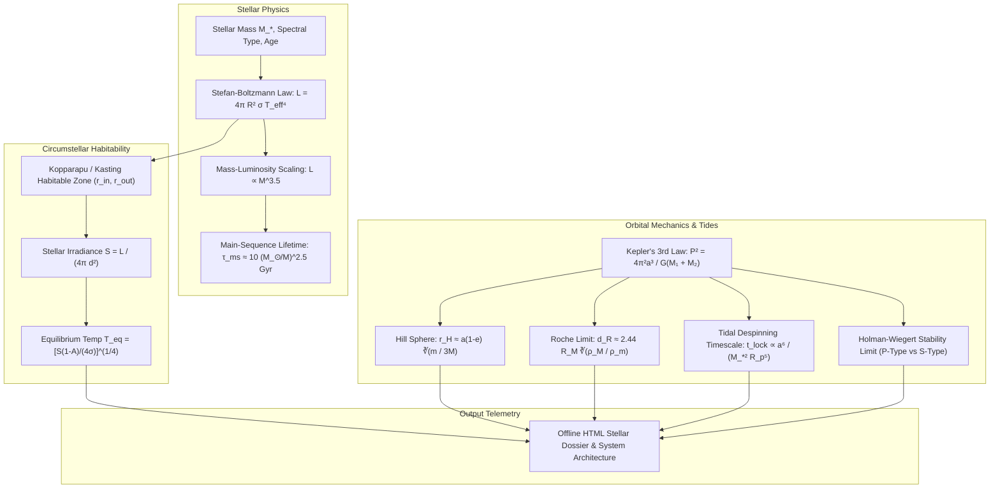

# Master Craft Reference: Planetary Astrophysics, Stellar Mechanics & Celestial Dynamics (`docs/ASTROPHYSICS.md`)
> **Domain A: Astrophysics, Climate, Cartography & Celestial Mechanics** | **Master Craft Reference Manual**
> **Primary Active Toolchain:** [Celestia](https://celestiaproject.space/) + [StarGen](https://www.projectrho.com/public_html/rocket/worldbuilding.php) + [SpinCalc](http://www.artificial-gravity.com/sw/SpinCalc/) + [Atomic Rockets](https://www.projectrho.com/public_html/rocket/) | **Reference CLI:** `arcanum calc astro`

---

## 1. Executive Summary & Epistemological Architecture

This document serves as the **Master Craft Reference Manual** for hard science fiction astrophysics, stellar thermodynamics, relativistic kinematics, Keplerian orbital mechanics, and habitable zone calculations. Fictional solar systems and orbital habitats are visualized in 3D using **Celestia**, generated via **StarGen**, and calculated using **SpinCalc** and **Atomic Rockets** (see [Master External Tools Guide](file:///docs/guides/EXTERNAL_TOOLS_AND_PLUGINS.md)).

Worldbuilding on an astronomical scale requires strict adherence to physical conservation laws:
1. **Thermodynamic Radiation Balance**: Stellar classification, blackbody effective temperature, and circumstellar habitable zone (HZ) boundaries must align with the Stefan-Boltzmann law and radiative transfer models.
2. **Orbital Gravitational Stability**: Planetary orbits, satellite Hill spheres, and Roche limits must satisfy Newtonian and relativistic orbital mechanics.
3. **Multi-Star Dynamical Hierarchies**: S-type (satellite/non-circumbinary) and P-type (circumbinary) orbits must respect the empirical stability thresholds established by Holman & Wiegert.
4. **Tidal Dissipation & Despinning**: Tidal locking timescales dictate whether an exoplanet develops an Earth-like diurnal cycle or becomes a tidally locked "eyeball world" with extreme atmospheric collapse hazards.



---

## 2. Stellar Classification & Radiation Physics

### 2.1 The Morgan-Keenan (M-K) Spectral Sequence
Stars are classified by surface effective temperature $T_{\text{eff}}$, spectral absorption lines, and luminosity class.

| Spectral Class | Effective Temp ($K$) | Chromatic Color | Canonical Mass ($M_\odot$) | Canonical Radius ($R_\odot$) | Canonical Lum ($L_\odot$) | Main Sequence Lifetime |
|---|---|---|---|---|---|---|
| **O** | $> 30,000$ | Electric Blue | $16\text{–}100+$ | $6.6\text{–}20+$ | $> 30,000$ | $< 10\text{ Myr}$ |
| **B** | $10,000\text{–}30,000$ | Blue-White | $2.1\text{–}16$ | $1.8\text{–}6.6$ | $25\text{–}30,000$ | $10\text{–}500\text{ Myr}$ |
| **A** | $7,500\text{–}10,000$ | Pure White | $1.4\text{–}2.1$ | $1.4\text{–}1.8$ | $5\text{–}25$ | $0.5\text{–}3\text{ Gyr}$ |
| **F** | $6,000\text{–}7,500$ | Yellow-White | $1.04\text{–}1.4$ | $1.15\text{–}1.4$ | $1.5\text{–}5$ | $3\text{–}8\text{ Gyr}$ |
| **G** (Sol) | $5,200\text{–}6,000$ | Yellow (True: White) | $0.8\text{–}1.04$ | $0.96\text{–}1.15$ | $0.6\text{–}1.5$ | $8\text{–}15\text{ Gyr}$ |
| **K** | $3,700\text{–}5,200$ | Pale Orange | $0.45\text{–}0.8$ | $0.7\text{–}0.96$ | $0.08\text{–}0.6$ | $15\text{–}50\text{ Gyr}$ |
| **M** (Red Dwarf)| $2,400\text{–}3,700$ | Deep Orange-Red | $0.08\text{–}0.45$ | $\le 0.7$ | $< 0.08$ | $50\text{ Gyr}\text{–}10\text{ Tyr}$ |

### 2.2 Fundamental Stellar Equations

#### Stefan-Boltzmann Luminosity Law
$$L = 4\pi R_*^2 \sigma T_{\text{eff}}^4$$

Where $\sigma = 5.670374 \times 10^{-8} \text{ W m}^{-2} \text{ K}^{-4}$. Scaled to solar units:

$$\frac{L}{L_\odot} = \left(\frac{R_*}{R_\odot}\right)^2 \left(\frac{T_{\text{eff}}}{T_\odot}\right)^4 \quad (\text{with } T_\odot = 5778\text{ K})$$

#### Mass-Luminosity Empirical Relation (Main Sequence)
For main-sequence stars, luminosity scales as a power law of stellar mass:

$$\frac{L}{L_\odot} \approx \begin{cases}
0.23 \left(\frac{M}{M_\odot}\right)^{2.3} & M < 0.43 M_\odot \\
\left(\frac{M}{M_\odot}\right)^{4.0} & 0.43 M_\odot \le M < 2.0 M_\odot \\
1.5 \left(\frac{M}{M_\odot}\right)^{3.5} & 2.0 M_\odot \le M < 20 M_\odot \\
3200 \left(\frac{M}{M_\odot}\right) & M \ge 20 M_\odot
\end{cases}$$

#### Main-Sequence Hydrogen-Burning Lifetime
Stellar lifetime $\tau_{\text{ms}}$ scales inversely with fuel burn rate:

$$\tau_{\text{ms}} \approx 10 \times \left(\frac{M}{M_\odot}\right) \left(\frac{L_\odot}{L}\right) \text{ Gyr} \approx 10 \times \left(\frac{M}{M_\odot}\right)^{-2.5} \text{ Gyr} \quad (\text{for } G\text{-type analogs})$$

---

## 3. Circumstellar Habitable Zone (HZ) Models

The Habitable Zone is the orbital annulus where an Earth-mass planet with an active carbonate-silicate cycle can maintain liquid surface water at $1\text{ atm}$ barometric pressure.

```
                   [ STELLAR HABITABLE ZONE PROFILE ]
 ◄── RUNAWAY GREENHOUSE ──┼────── RECENT VENUS ──────┼─── MAXIMUM GREENHOUSE ──►
      (Inner Limit)        │   (Earth Insolation)    │     (Outer Limit)
                           ▼                         ▼
 ───┼──────────────────────[    HABITABLE ANNULUS    ]──────────────────────┼───
   0.8 AU                                           1.7 AU (Sol G2V)
   0.1 AU                                           0.25 AU (M3V Dwarf)
```

### 3.1 Kasting-Kopparapu Analytic Habitability Boundaries
Based on 1D radiative-convective climate models (Kopparapu et al., 2013), the effective stellar flux $S_{\text{eff}}$ required for specific climate thresholds is parameterized by:

$$S_{\text{eff}} = S_{\text{eff}\odot} + a T_* + b T_*^2 + c T_*^3 + d T_*^4$$

Where $T_* = T_{\text{eff}} - 5780\text{ K}$.

For worldbuilding estimation, the classic Kasting-Whitmire boundaries simplified for solar-spectrum stars are:

$$r_{\text{in}} = \sqrt{\frac{L_*/L_\odot}{S_{\text{eff, inner}}}} = \sqrt{\frac{L_*/L_\odot}{1.10}} \quad (\text{Runaway Greenhouse Limit})$$

$$r_{\text{out}} = \sqrt{\frac{L_*/L_\odot}{S_{\text{eff, outer}}}} = \sqrt{\frac{L_*/L_\odot}{0.53}} \quad (\text{Maximum } \text{CO}_2 \text{ Greenhouse Limit})$$

### 3.2 Planetary Equilibrium & Surface Temperature
Total stellar irradiance (Solar Constant) at orbital semi-major axis $d$ (in AU):

$$S = \frac{L_*}{4\pi d^2} = 1361 \times \left(\frac{L_*/L_\odot}{(d/\text{AU})^2}\right) \text{ W/m}^2$$

Assuming spherical thermal redistribution, blackbody equilibrium temperature $T_{\text{eq}}$ with Bond albedo $A$:

$$T_{\text{eq}} = \left( \frac{S (1 - A)}{4 \sigma} \right)^{1/4} = 278.5 \times \left(\frac{L_*/L_\odot}{d^2}\right)^{1/4} (1 - A)^{1/4} \text{ K}$$

Actual surface temperature $T_{\text{surf}}$ includes atmospheric greenhouse warming $\Delta T_{\text{greenhouse}}$:

$$T_{\text{surf}} = T_{\text{eq}} + \Delta T_{\text{greenhouse}}$$

*(For Earth: $A = 0.30$, $S = 1361\text{ W/m}^2 \implies T_{\text{eq}} = 255\text{ K} (-18^\circ\text{C})$. Greenhouse $\Delta T_g = +33\text{ K} \implies T_{\text{surf}} = 288\text{ K} (+15^\circ\text{C})$).*

---

## 4. Orbital Mechanics & Gravitational Architecture

### 4.1 Keplerian Orbit Mechanics
1. **First Law**: Orbit is an ellipse with the barycenter at one focus:
   $$r(\theta) = \frac{a(1 - e^2)}{1 + e \cos\theta}$$
   - Periapsis distance: $r_{\text{peri}} = a(1 - e)$
   - Apoapsis distance: $r_{\text{apo}} = a(1 + e)$

2. **Second Law (Conservation of Angular Momentum)**:
   $$\frac{dA}{dt} = \frac{1}{2} r^2 \frac{d\theta}{dt} = \frac{h}{2} = \text{constant}$$

3. **Third Law (Newtonian Generalization)**:
   $$P^2 = \frac{4\pi^2}{G(M_1 + M_2)} a^3$$
   When masses are in solar masses ($M_\odot$), semi-major axis $a$ in AU, and period $P$ in Earth years:
   $$P_{\text{years}} = \sqrt{\frac{a_{\text{AU}}^3}{M_{1,\odot} + M_{2,\odot}}}$$

4. **Vis-Viva Equation (Orbital Velocity)**:
   $$v(r) = \sqrt{G(M_1 + M_2) \left( \frac{2}{r} - \frac{1}{a} \right)}$$

---

## 5. Planetary Stability Boundaries: Hill Spheres & Roche Limits

```
                          [ SATELLITE STABILITY ZONES ]
  Primary Planet ──► ( O )
                     │◄─── d_Roche (Rings / Tidal Disruption)
                     │
                     │◄─────────── Stable Moon Zone (0.33 to 0.50 r_H)
                     │
                     │◄───────────────────────────── r_Hill (True Gravitational Edge)
```

### 5.1 Hill Sphere (Gravitational Domain)
The Hill sphere defines the region in which a planet's gravity dominates over the host star, permitting permanent natural satellites:

$$r_H \approx a (1 - e) \sqrt[3]{\frac{m_{\text{planet}}}{3 M_{\text{star}}}}$$

- **True Satellite Stability Limit**:
  - Prograde moons: Stable up to $r_{\text{stable}} \le 0.33\text{--}0.50 \, r_H$.
  - Retrograde moons: Stable up to $r_{\text{stable}} \le 0.67 \, r_H$.
  - Beyond $0.50 \, r_H$, solar three-body tidal perturbations strip the moon over geological timescales ($< 10^7\text{ yrs}$).

### 5.2 Roche Limit (Tidal Disruption Threshold)
The distance within which a celestial body held together only by self-gravity disintegrates from tidal forces exerted by a second body:

$$\text{Rigid Body Roche Limit: } d_R = R_M \left( 2 \frac{\rho_M}{\rho_m} \right)^{1/3} \approx 1.26 \, R_M \sqrt[3]{\frac{\rho_M}{\rho_m}}$$

$$\text{Fluid Body Roche Limit: } d_R \approx 2.44 \, R_M \sqrt[3]{\frac{\rho_M}{\rho_m}}$$

Where $R_M$ is the primary radius, $\rho_M$ is primary density, and $\rho_m$ is the satellite density. Moons inside $d_R$ are shattered into planetary rings (e.g., Saturn's rings).

---

## 6. Tidal Locking & Planetary Despinning Dynamics

Tidal friction from the host star dissipates a planet's rotational angular momentum, driving the rotation period into synchronous resonance with its orbital period ($P_{\text{rot}} = P_{\text{orb}}$).

### 6.1 Despinning Timescale Formula
The time $t_{\text{lock}}$ required for a star of mass $M_*$ to tidally lock a planet of mass $m_p$, radius $R_p$, semi-major axis $a$, initial angular rotation $\omega_0$, and specific dissipation factor $Q$:

$$t_{\text{lock}} \approx \frac{4}{9} \frac{\omega_0 a^6 I Q}{G M_*^2 k_2 R_p^5}$$

Where:
- $I = \alpha m_p R_p^2$ is the moment of inertia ($\alpha \approx 0.33$ for differentiated terrestrial rocky planets).
- $k_2$ is the Love number of degree 2 ($k_2 \approx 0.30$ for rocky mantles).
- $Q$ is the tidal quality factor / dissipation parameter ($Q \approx 10\text{--}100$ for rocky worlds; $10^4\text{--}10^5$ for gas giants).

#### Dimensional Scaling:
$$t_{\text{lock}} \propto \frac{a^6 \omega_0}{M_*^2 R_p^3 \rho_p}$$

Because $t_{\text{lock}} \propto a^6$, habitable zone planets around low-mass stars (M-dwarfs, where $a < 0.2\text{ AU}$) despin into tidal lock within $< 100\text{ Myr}$. Habitable planets around G-type stars ($a \approx 1.0\text{ AU}$) have tidal lock timescales exceeding $1000\text{ Gyr}$, preserving rapid diurnal cycles.

---

## 7. Multiple Star Systems & Holman-Wiegert Stability

In binary star systems, planetary orbits fall into two distinct dynamical architectures:
1. **P-Type (Circumbinary)**: The planet orbits *both* stars simultaneously outside a critical boundary ($a > a_{\text{crit}}$).
2. **S-Type (Non-Circumbinary)**: The planet orbits *one* star, while the second star acts as an exterior perturber ($a < a_{\text{crit}}$).

```
        P-TYPE (Circumbinary)                      S-TYPE (Non-Circumbinary)
               * *                                         * Planet
             (Star A/B)                                  (Star A)
                 │                                           │
         ════════╪════════                                   │       * Star B
                 ▼                                           ▼       (Distand Companion)
          O Planet Orbit                            Stable Boundary
```

### 7.1 Holman & Wiegert (1999) Critical Semi-Major Axis Formulas

Let binary semi-major axis be $a_b$, binary eccentricity be $e_b$, and mass ratio $\mu = \frac{M_2}{M_1 + M_2} \in (0, 0.5]$:

#### Circumbinary (P-Type) Inner Critical Radius $a_{c, \text{out}}$
Planets are stable for all orbits with semi-major axis $a > a_{c, \text{out}}$:

$$a_{c, \text{out}} = a_b \left( 1.60 + 5.10 e_b - 2.22 e_b^2 + 4.12 \mu - 4.27 e_b \mu - 5.09 \mu^2 + 4.61 e_b^2 \mu^2 \right)$$

#### Non-Circumbinary (S-Type) Outer Critical Radius $a_{c, \text{in}}$
Planets around Star 1 are stable for all orbits with semi-major axis $a < a_{c, \text{in}}$:

$$a_{c, \text{in}} = a_b \left( 0.464 - 0.380 \mu - 0.631 e_b + 0.586 \mu e_b + 0.150 e_b^2 - 0.198 \mu e_b^2 \right)$$

---

## 8. Worked Step-by-Step Calculation: Habitable Moon of a Gas Giant

### Scenario:
A worldbuilder designs a habitable Earth-mass moon ($m_m = 1.0 M_\oplus = 5.972 \times 10^{24}\text{ kg}$, $R_m = 6371\text{ km}$, $\rho_m = 5515\text{ kg/m}^3$) orbiting a Jupiter-mass gas giant ($M_p = 1.0 M_{\text{Jup}} = 317.8 M_\oplus = 1.898 \times 10^{27}\text{ kg}$, $R_p = 71,492\text{ km}$, $\rho_p = 1326\text{ kg/m}^3$).
The gas giant orbits a G2V star ($M_* = 1.0 M_\odot$, $L_* = 1.0 L_\odot$) at $a_p = 1.0\text{ AU}$ ($e_p = 0.02$).

#### Step 1: Calculate Planet's Hill Sphere
$$r_{H, p} = a_p (1 - e_p) \sqrt[3]{\frac{M_p}{3 M_*}} = 1.0 \times (1 - 0.02) \times \sqrt[3]{\frac{1.898 \times 10^{27}}{3 \times 1.989 \times 10^{30}}} \text{ AU}$$

$$\frac{M_p}{3 M_*} = \frac{1.898 \times 10^{27}}{5.967 \times 10^{30}} = 3.1808 \times 10^{-4}$$

$$\sqrt[3]{3.1808 \times 10^{-4}} \approx 0.06826$$

$$r_{H, p} = 0.98 \times 0.06826\text{ AU} \approx 0.0669\text{ AU} \approx 10,007,000\text{ km}$$

#### Step 2: Establish Stable Satellite Orbital Window
- **Outer Limit (Prograde)**: $r_{\text{outer}} = 0.33 \times r_{H, p} \approx 0.33 \times 10,007,000\text{ km} \approx 3,302,000\text{ km}$.
- **Inner Limit (Gas Giant Fluid Roche Limit)**:
  $$d_R \approx 2.44 R_p \sqrt[3]{\frac{\rho_p}{\rho_m}} = 2.44 \times 71,492\text{ km} \times \sqrt[3]{\frac{1326}{5515}} = 174,440 \times \sqrt[3]{0.2404} = 174,440 \times 0.6218 \approx 108,467\text{ km}$$

*Stable Orbital Shell*: The moon can stably orbit anywhere between $108,500\text{ km}$ and $3,302,000\text{ km}$.

#### Step 3: Select Orbit and Calculate Moon Orbital Period
Select $a_m = 500,000\text{ km} = 5.0 \times 10^8\text{ m}$.
$$P_m = 2\pi \sqrt{\frac{a_m^3}{G(M_p + m_m)}} \approx 2\pi \sqrt{\frac{(5.0 \times 10^8)^3}{6.6743 \times 10^{-11} \times 1.904 \times 10^{27}}} = 2\pi \sqrt{\frac{1.25 \times 10^{26}}{1.2708 \times 10^{17}}} = 2\pi \sqrt{9.836 \times 10^8} \approx 2\pi \times 31,363 \approx 197,060\text{ s} \approx 2.28\text{ Earth days}$$

*Conclusion*: The moon experiences a $2.28$-day diurnal cycle (if tidally locked to the gas giant), with periodic eclipses by the planet.

---

## 9. Practical YAML Data Schemas

### 9.1 Star System Architecture (`World/Astrophysics/system.yaml`)

```yaml
schema_version: "2.0"
system_id: "kepler_arc_12"
star_count: 1

primary_star:
  id: "kepler_12_a"
  name: "Sol-Minor"
  spectral_type: "K2V"
  mass_msun: 0.78
  radius_rsun: 0.75
  effective_temp_k: 4900
  luminosity_lsun: 0.32
  age_gyr: 4.2

habitable_zone:
  inner_runaway_au: 0.539
  outer_max_greenhouse_au: 0.777

planets:
  - id: "kepler_12_a_b"
    name: "Aurelia"
    semi_major_axis_au: 0.612
    eccentricity: 0.015
    orbital_period_days: 198.4
    mass_mearth: 1.15
    radius_rearth: 1.04
    density_g_cm3: 5.62
    bond_albedo: 0.31
    greenhouse_warming_k: 36.0
    surface_temp_c: 18.2
    is_tidally_locked: false
    rotation_period_hours: 28.5
    hill_sphere_km: 742000
    moons:
      - id: "luna_prime"
        semi_major_axis_km: 285000
        radius_km: 1420
        orbital_period_days: 16.2
```

---

## 10. CLI Reference & Scriptorium Integration

```bash
# Calculate habitable zone boundaries for a specific stellar mass/luminosity
arcanum astrophysics --mass 0.85 --lum 0.45 --temp 5100

# Compute Hill sphere, Roche limits, and tidal locking timescale
arcanum orbit --planet-mass 1.0 --star-mass 1.0 --orbit-au 1.0 --radius-km 6371

# Evaluate binary star orbital stability (Holman-Wiegert S-type and P-type)
arcanum orbit --binary --m1 1.0 --m2 0.4 --sep-au 15.0 --ecc 0.25

# Generate standalone offline HTML stellar system dossier
arcanum astrophysics --system World/Astrophysics/system.yaml --html reports/stellar_dossier.html
```

---

## 11. Recommended Reading, References & Media

### Foundational Craft & Academic Textbooks
- **Dole, Stephen H. (1964)**. *Habitable Planets for Man*. Blaisdell Publishing Company / RAND Corporation.  
  *The landmark foundational text on exoplanetary habitability, planetary mass bounds, rotation limits, and atmospheric retention.*
- **Kasting, James (2010)**. *How to Find a Habitable Planet*. Princeton University Press.  
  *The authoritative treatise on circumstellar habitable zones, atmospheric biosignatures, and planetary climate evolution.*
- **Carroll, Bradley W., & Ostlie, Dale A. (2017)**. *An Introduction to Modern Astrophysics* (2nd ed.). Cambridge University Press.  
  *The university standard for stellar structure, Stefan-Boltzmann radiation, and orbital mechanics.*
- **Perryman, Michael (2018)**. *The Exoplanet Handbook* (2nd ed.). Cambridge University Press.  
  *Exhaustive empirical compendium of detected exoplanet architectures, orbital resonances, and tidal interactions.*

### Landmark Scientific Papers
- **Kasting, J. F., Whitmire, D. P., & Reynolds, R. T. (1993)**. "Habitable Zones around Main Sequence Stars." *Icarus*, 101(1), 108–128.  
  *The classic paper deriving analytical water-loss and maximum-greenhouse limits.*
- **Kopparapu, R. K., et al. (2013)**. "Habitable Zones around Main-Sequence Stars: New Estimates." *The Astrophysical Journal*, 765(2), 131.  
  *The modern updated habitable zone boundary model widely adopted by NASA.*
- **Holman, M. J., & Wiegert, P. A. (1999)**. "Long-Term Stability of Planets in Binary Systems." *The Astronomical Journal*, 117(1), 621–628.  
  *The mathematical foundation for calculating P-type and S-type orbital stability boundaries.*
- **Gladman, B. (1993)**. "Dynamics of systems of two close planets." *Icarus*, 106(1), 247–263.  
  *Formulated the Hill stability criteria for closely spaced multi-planet systems.*

### Seminal Video Lectures, Masterclasses & Channels
- **Artifexian** (YouTube Series: *Worldbuilding Astrophysics, Star Systems & Planetary Orbit Series*).  
  *Gold-standard step-by-step mathematical guide for building realistic solar systems, moon orbits, and habitable zones.*
- **Isaac Arthur — Science & Futurism with Isaac Arthur (SFIA)** (*Habitable Worlds Series*, *Colonizing Binary Star Systems*, *Megastructures*).  
  *Comprehensive astrophysical analysis of extreme habitats, Dyson swarms, and artificial planetary orbits.*
- **PBS Space Time** (YouTube Series: *Lagrange Points*, *How Exoplanet Atmospheres Work*, *The Physics of Tidal Locking*).  
  *High-level mathematical and conceptual breakdowns of relativistic and classical orbital mechanics.*
- **Scott Manley** (*Orbital Mechanics 101*, *Rocket Science & Gravitational Physics*).  
  *Pragmatic, intuitive visual explanations of delta-V, Keplerian orbital transfers, and planetary gravity assists.*

### Landmark Speculative Case Studies
- **Clement, Hal**. *Mission of Gravity* (Mesklin, a massive, rapidly spinning oblate planet with surface gravity varying from $3g$ at the equator to $700g$ at the poles).
- **Herbert, Frank**. *Dune* (Arrakis orbiting the real-world supergiant star Canopus, detailing atmospheric moisture limits and orbital solar irradiance).
- **Clarke, Arthur C.** *Rendezvous with Rama* (Rigorous centripetal gravity, coriolis forces, and structural kinematics of a cylindrical orbital habitat).
- **Liu Cixin**. *The Three-Body Problem* (Alpha Centauri trinary system dynamics illustrating Poincaré chaos, Syzygy events, and chaotic orbital collapse).
- **Forward, Robert L.** *Dragon's Egg* (Life on a neutron star surface with $67\text{ billion } g$ gravity, exploring relativistic physics and magnetic compression).
