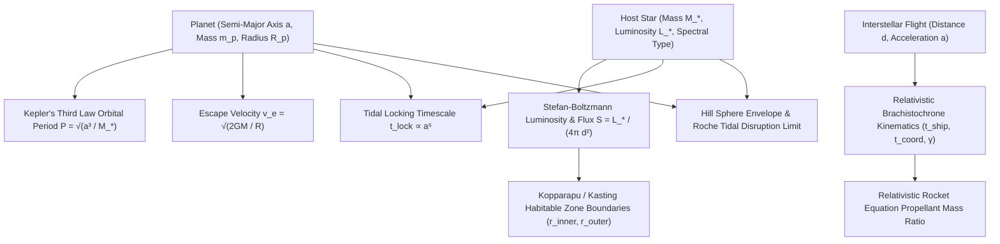
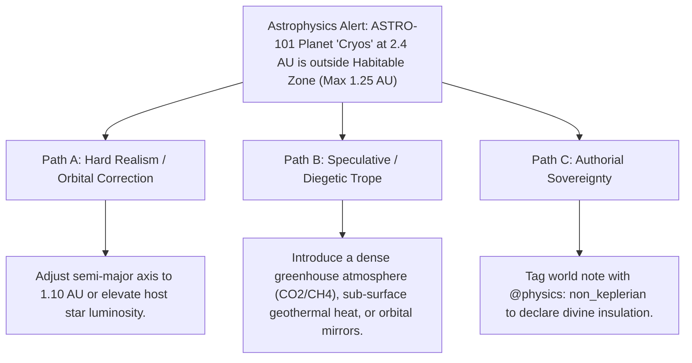

# Astrophysics, Orbital Mechanics & Relativistic Kinematics (`docs/ASTROPHYSICS.md`)
> **Domain A: Astrophysics, Climate, Cartography & Celestial Mechanics** | **CLI:** `arcanum astrophysics` / `arcanum orbit`

---

## 1. Overview & Theoretical Rationale

The **Ars Arcanum Astrophysics Engine** (`scripts/lib/astrophysics.py`) is an offline celestial mechanics, relativistic kinematics, and stellar habitability suite engineered for hard science fiction worldbuilders, space opera novelists, and speculative cosmologists.

Constructing fictional planetary systems and interstellar routes without mathematical consistency breaks reader suspension of disbelief. Common authorial failure modes include:
1. **Impossible Planetary Periods**: Arbitrarily assigning day and year lengths that contradict Kepler's Laws for the host star's mass.
2. **Goldilocks Zone Misplacement**: Placing Earth-like temperate worlds at orbital distances where they would freeze into iceballs or boil into runaway superheated greenhouse states.
3. **Relativistic Travel Violations**: Depicting sub-light interstellar voyages without accounting for proper time dilation ($\tau$), coordinate time ($t$), Lorentz factor ($\gamma$), or propellant mass fractions.
4. **Tidal Disruption & Roche Limit Violations**: Placing close-orbiting moons or massive ring structures inside the planet's Roche tidal disruption zone.
5. **Tidal Locking Neglect**: Assuming a close-orbiting planet around a red dwarf (M-dwarf) maintains a 24-hour day/night cycle despite rapid geological tidal circularization.

The Astrophysics Engine computes exact closed-form solutions for stellar luminosity, orbital mechanics, planetary habitability zones, relativistic brachistochrone trajectories, and tidal stability.

---

## 2. Mathematical & Physical Principles



### 2.1 Keplerian Orbital Mechanics & Stellar Insolation

#### Kepler's Third Law (Harmonic Law)
For a planet of mass $m_p$ orbiting a host star of mass $M_*$ with semi-major axis $a$ (expressed in $\text{AU}$, solar masses $M_\odot$, and Earth years):

$$P = \sqrt{\frac{a^3}{M_* + m_p}} \approx \sqrt{\frac{a^3}{M_*}} \quad [\text{Earth years}]$$

The mean orbital velocity $v_{\text{orb}}$ for an eccentric orbit with semi-major axis $a$ and eccentricity $e$ at distance $r$:
$$v_{\text{orb}}(r) = \sqrt{G M_* \left(\frac{2}{r} - \frac{1}{a}\right)}$$

#### Stellar Luminosity & Insolation
Using the main-sequence Mass-Luminosity relation:
$$\frac{L_*}{L_\odot} \approx \begin{cases} 
0.23 \left(\frac{M_*}{M_\odot}\right)^{2.3} & \text{for } M_* < 0.43 M_\odot \\
\left(\frac{M_*}{M_\odot}\right)^{4.0} & \text{for } 0.43 M_\odot \le M_* < 2.0 M_\odot \\
1.5 \left(\frac{M_*}{M_\odot}\right)^{3.5} & \text{for } 2.0 M_\odot \le M_* < 55 M_\odot
\end{cases}$$

The solar constant equivalent flux $S$ incident upon the top of the planetary atmosphere at orbital distance $d$ ($\text{AU}$):
$$S = S_0 \cdot \left(\frac{L_*}{L_\odot}\right) \cdot \left(\frac{1 \text{ AU}}{d}\right)^2 \quad \left[\text{where } S_0 = 1361 \text{ W/m}^2\right]$$

### 2.2 Conservative Liquid Water Habitable Zone (Kopparapu / Kasting Formulation)
The stellar flux thresholds $S_{\text{eff}}$ defining runaway greenhouse ($r_{\text{inner}}$) and maximum greenhouse ($r_{\text{outer}}$) boundaries:

$$r_{\text{inner}} = \sqrt{\frac{L_* / L_\odot}{S_{\text{eff, inner}}}} \approx \sqrt{\frac{L_*}{1.1}} \quad [\text{AU}]$$
$$r_{\text{outer}} = \sqrt{\frac{L_* / L_\odot}{S_{\text{eff, outer}}}} \approx \sqrt{\frac{L_*}{0.53}} \quad [\text{AU}]$$

### 2.3 Relativistic Brachistochrone Kinematics (Constant Proper Acceleration $a$)
For an interstellar spacecraft accelerating constantly at proper acceleration $a$ (e.g. $1g \approx 9.81 \text{ m/s}^2$) to the midpoint and decelerating at $a$ over coordinate distance $d$:

#### Proper Ship Time ($\tau_{\text{ship}}$ — Experienced by Travelers):
$$\tau_{\text{ship}} = \frac{2c}{a} \operatorname{arcosh}\left(1 + \frac{a d}{2 c^2}\right)$$

#### Coordinate Time ($t_{\text{coord}}$ — Elapsed on Earth / Home World):
$$t_{\text{coord}} = 2 \sqrt{\left(\frac{d}{2c} + \frac{c}{a}\right)^2 - \left(\frac{c}{a}\right)^2} = \frac{2c}{a} \sinh\left(\frac{a \tau_{\text{ship}}}{2c}\right)$$

#### Peak Relativistic Velocity ($v_{\text{max}}$) and Lorentz Factor ($\gamma_{\text{max}}$) at Midpoint Turnover:
$$v_{\text{max}} = c \cdot \tanh\left(\frac{a \tau_{\text{ship}}}{2c}\right), \qquad \gamma_{\text{max}} = \frac{1}{\sqrt{1 - v_{\text{max}}^2 / c^2}} = 1 + \frac{a d}{2 c^2}$$

#### Relativistic Tsiolkovsky Rocket Equation
For effective exhaust velocity $v_e$:
$$\frac{m_0}{m_f} = \left(\frac{1 + v/c}{1 - v/c}\right)^{\frac{c}{2 v_e}}$$

### 2.4 Tidal Physics, Roche Disruption & Hill Sphere

#### Planetary Surface Gravity & Escape Velocity
$$g_{\text{surf}} = \frac{G M_p}{R_p^2} = g_\oplus \cdot \left(\frac{M_p / M_\oplus}{(R_p / R_\oplus)^2}\right), \qquad v_{\text{escape}} = \sqrt{\frac{2 G M_p}{R_p}} = v_{e, \oplus} \cdot \sqrt{\frac{M_p / M_\oplus}{R_p / R_\oplus}}$$

#### Roche Tidal Disruption Limit
A satellite held together purely by self-gravitation will disintegrate into a planetary ring system if it orbits within $d_{\text{Roche}}$ of a primary of radius $R_M$ and density $\rho_M$:
$$d_{\text{rigid}} = R_M \left(2 \cdot \frac{\rho_M}{\rho_m}\right)^{1/3}, \qquad d_{\text{fluid}} \approx 2.44 \cdot R_M \left(\frac{\rho_M}{\rho_m}\right)^{1/3}$$

#### Hill Sphere (Gravitational Enclosing Sphere for Stable Moons)
For a planet of mass $m_p$ and eccentricity $e$ orbiting star of mass $M_*$ at semi-major axis $a$:
$$r_H \approx a(1 - e) \left(\frac{m_p}{3 M_*}\right)^{1/3}$$
*Rule of thumb for long-term orbital stability*: Prograde satellite orbits are stable out to $\approx \frac{1}{2} r_H$; retrograde satellites out to $\approx \frac{2}{3} r_H$.

#### Tidal Locking Timescale
The characteristic time $t_{\text{lock}}$ for a planet to become tidally locked into synchronous rotation:
$$t_{\text{lock}} \approx \frac{\omega_0 a^6 I Q}{3 G M_*^2 k_2 R_p^5}$$
Where $\omega_0$ is initial spin rate, $Q$ is tidal dissipation factor, $k_2$ is Love number of degree 2, and $I$ is moment of inertia. Planets orbiting M-dwarfs at $a \le 0.2\text{ AU}$ lock within $< 100 \text{ million years}$.

---

## 3. Subfeatures Matrix

| Subfeature | Mathematical Mechanism | Diagnostic Rule / Trigger | Narrative Craft Significance |
|---|---|---|---|
| **Keplerian Orbit Solver** | Computes $P = \sqrt{a^3 / M_*}$ and orbital velocity profiles. | Verifies seasonal year length matches stellar mass. | Enforces astronomical consistency for world calendars. |
| **Habitable Zone Validator** | Evaluates Kopparapu flux boundaries ($r_{\text{inner}} \le a \le r_{\text{outer}}$). | Flags `ASTRO-101: OUTSIDE_HABITABLE_ZONE` if world is frozen or boiling. | Prevents improbable Earth-like climates at extreme distances. |
| **Relativistic Kinematics Modeler**| Closed-form integration of hyperbolic spaceflight equations. | Emits $\tau_{\text{ship}}$ traveler time vs $t_{\text{coord}}$ planetary time. | Creates profound generational time dilation stakes. |
| **Tidal Locking Predictor** | Computes $t_{\text{lock}}$ based on $a^6 / M_*^2$ scaling. | Flags `ASTRO-102: TIDALLY_LOCKED_WORLD` if $t_{\text{lock}} < 1\text{ Gyr}$. | Prompts author to design twilight strip settlements and perpetual storms. |
| **Roche Limit & Ring Auditor** | Calculates rigid and fluid disruption radii. | Flags `ASTRO-103: ROCHE_DISRUPTION_RISK` for low-orbit moons. | Explains the origin of planetary rings or impending moonfall cataclysms. |
| **Hill Sphere Moon Boundary** | Computes $r_H$ stable envelope for natural satellites. | Flags `ASTRO-104: UNSTABLE_SATELLITE_ORBIT` if $r_{\text{moon}} > 0.5 r_H$. | Prevents placing permanent moons in gravitationally ejected orbits. |

---

## 4. Author Extension & Configuration Guide

### 4.1 Planetary System Manifest (`World/Cosmology/world.yaml`)
```yaml
stellar_system:
  primary_star:
    name: "Aethelgard Prime"
    spectral_type: "K2V"
    mass_solar: 0.78
    luminosity_solar: 0.42
  planets:
    - name: "Eloria"
      semi_major_axis_au: 0.62
      mass_earth: 0.94
      radius_earth: 0.98
      axial_tilt_deg: 18.2
      albedo: 0.29
      moons:
        - name: "Selene"
          mass_lunar: 1.2
          semi_major_axis_km: 384000
```

### 4.2 Pure Python API Usage
```python
from lib.astrophysics import (
    calc_orbital_period,
    calc_habitable_zone,
    calc_relativistic_brachistochrone,
    calc_roche_limit,
)

# Calculate planetary year and habitability
year_length = calc_orbital_period(semi_major_axis_au=0.62, star_mass_solar=0.78)
hz_inner, hz_outer = calc_habitable_zone(star_luminosity_solar=0.42)

print(f"Eloria Year: {year_length.days:.1f} Earth days")
print(f"Habitable Zone: {hz_inner:.2f} AU to {hz_outer:.2f} AU")

# Calculate relativistic spaceflight to Alpha Centauri (4.2 ly at 1g)
flight = calc_relativistic_brachistochrone(distance_ly=4.2, accel_g=1.0)
print(f"Traveler Time: {flight.ship_time_years:.2f} years")
print(f"Earth Time: {flight.coord_time_years:.2f} years")
print(f"Peak Speed: {flight.peak_velocity_c:.4f} c (Gamma = {flight.peak_gamma:.2f})")
```

---

## 5. Command-Line Interface (CLI) Reference

```bash
# Calculate planetary characteristics, daylight, and habitability from YAML
arcanum astrophysics --system World/Cosmology/world.yaml

# Calculate relativistic spaceflight transit to Epsilon Eridani (10.5 ly at 1G)
arcanum astrophysics --transit --distance 10.5ly --accel 1.0G

# Output machine-readable JSON astronomical data
arcanum astrophysics --system World/Cosmology/world.yaml --json

# Query mathematical derivation of relativistic kinematics
arcanum doc astrophysics --math --why
```

---

## 6. Tri-Fold Creative Advisory Resolutions



### Scenario: Planet Outside Habitable Zone Alert (`ASTRO-101`)
- **Path A (Hard Realism / Astrophysical Precision)**:
  - Migrate the planet's orbit closer to the calculated Goldilocks zone ($r_{\text{inner}} \le a \le r_{\text{outer}}$) to allow liquid surface water.
- **Path B (Speculative / Diegetic Trope)**:
  - Keep the distant orbit but introduce internal heating: tidal flexing from a companion gas giant (like Europa/Io), massive radioactive core decay, or ancient mega-engineering orbital solar concentrator mirrors.
- **Path C (Authorial Sovereignty)**:
  - Declare that the planet is shielded by a celestial planar barrier or primordial solar deity, suppressing physical warnings via `@cosmology: mythic_sun`.

---

## 7. Content Security Policy & Offline Isolation

All astrophysical calculators and HTML orbit visualizers run 100% offline with zero CDN dependencies:

```html
<meta http-equiv="Content-Security-Policy" content="default-src 'none'; style-src 'unsafe-inline'; script-src 'unsafe-inline'; img-src data:; media-src data: blob:;">
```
