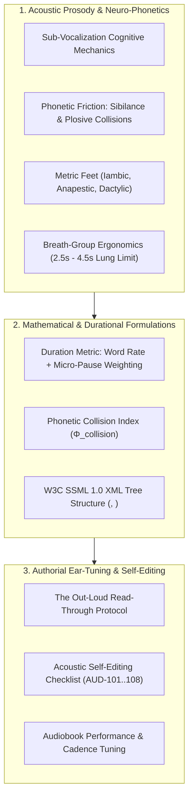
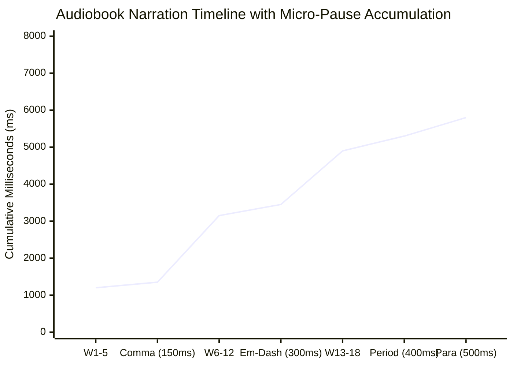
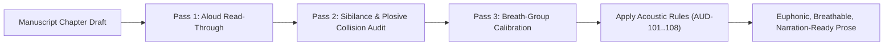

# Author Craft Masterclass: Acoustic Proofreading, Prose Prosody & Ear-Tuning (`docs/AUDIO_PROOF.md`)
> **Domain D: Stylistics, Sensory Immersion & Manuscript Polish** | **Category:** Author Craft & Narrative Doctrine | **Status:** Theoretical Framework & Writing Rubric

---

## 1. Overview & Theoretical Rationale

Reading one's own manuscript silently on a visual monitor induces severe cognitive habituation:

1. **Visual Autocorrect Bias**: The author's brain reconstructs what it *intended* to write rather than the physical characters on the screen, effortlessly skipping missing prepositions, duplicate words (*"the the"*), and garbled syntax.
2. **Homophone & Punctuation Blindness**: Eyes glide past grammatical homophone slips (*their/there*, *its/it's*, *lead/led*) and unclosed quotation marks.
3. **Phonetic Friction & Tongue-Twisters**: Sentences that look acceptable visually can be unpronounceable aloud due to sibilance clustering, harsh plosive clashes, and awkward consonant clusters.
4. **Breathless Sentence Architecture**: Paragraphs constructed without natural breath pauses exhaust voice actors and disrupt the sub-vocalizing reader's cognitive flow.

Acoustic proofreading and prosodic ear-tuning expose these blind spots by converting the text into an auditory feedback loop—either through out-loud oral read-throughs, audio recording playback, or local text-to-speech rendering.



---

## 2. Theoretical Foundations of Acoustic Prosody & Auditory Feedback

### 2.1 The Auditory Feedback Loop in Editorial Cognition
Silent reading relies on **sub-vocalization**—the internal vocalization of written words by the larynx and auditory cortex. When an author edits visually, cognitive familiarity causes the brain to bypass phonological decoding. 

By converting the text into an objective, external acoustic signal (auditory playback or deliberate oral read-through), the brain processes the prose through the primary and secondary auditory cortices. Rhythm hitches, clunky clashing consonants, awkward meter, and repetitive grammatical patterns become instantly, glaringly obvious.

### 2.2 Articulatory Phonetics & Acoustic Collision Types

```
 ┌─────────────────────────────────────────────────────────────────────────┐
 │                   ACOUSTIC FRICTION TAXONOMY                            │
 ├─────────────────────┬───────────────────────────────────────────────────┤
 │ 1. Sibilance Clashes│ Dense clustering of /s/, /z/, /ʃ/ ("sh"), /tʃ/    │
 │                     │ ("ch") creating hissing mic distortion and lisp.   │
 ├─────────────────────┼───────────────────────────────────────────────────┤
 │ 2. Plosive Clashes  │ Unintended rapid bursts of unvoiced/voiced stops  │
 │                     │ (/p/, /t/, /k/, /b/, /d/, /g/) causing pops.      │
 ├─────────────────────┼───────────────────────────────────────────────────┤
 │ 3. Consonant Coda   │ Adjacent identical consonant codas across word    │
 │    Locks            │ boundaries (*"dark cloak"*, *"vast street"*).     │
 ├─────────────────────┼───────────────────────────────────────────────────┤
 │ 4. Breath-Group     │ Sentences exceeding 35 words without punctuation, │
 │    Asphyxiation     │ forcing the narrator to gasp mid-clause.          │
 └─────────────────────┴───────────────────────────────────────────────────┘
```

### 2.3 Metric Feet & Poetic Rhythm in Narrative Prose
Masterclass narrative prose utilizes classical poetic metric feet to subconsciously regulate emotional tempo:
- **Iambic ($\smile -$)**: Natural conversational cadence, grounded momentum (*"The sun went down behind the mountain ridge"*).
- **Trochaic ($-\smile$)**: Driving, urgent, foreboding tempo (*"Darkness fell upon the ruined fortress"*).
- **Anapestic ($\smile\smile -$)**: Galloping, sweeping, kinetic momentum (*"Like a hound on the trail of a beast in the night"*).
- **Dactylic ($-\smile\smile$)**: Grand, mythic, elegiac weight (*"Fallen is Babylon, broken the empire"*).

### 2.4 Breath-Group Mechanics for Audiobook Performance
Human respiration limits vocal delivery to **$2.5\text{ to }4.5\text{ seconds}$ per breath group** ($8\text{ to }18\text{ words}$ at standard performance speed). Punctuation marks function as respiratory sheet music:
- Commas, dashes, and semicolons allow micro-inhalations ($150 - 300\text{ ms}$).
- Periods and paragraph breaks allow full pulmonary resets ($400 - 600\text{ ms}$).

---

## 3. Mathematical & Prosodic Formulations



### 3.1 Spoken Duration & Micro-Pause Accumulation Formula
Total audio performance time $T_{\text{audio}}$ (in seconds) is calculated from the base narration rate $R_{\text{wpm}}$ (default $150\text{ WPM} = 2.5\text{ words/sec}$) and exact typographic pause weights:

$$T_{\text{audio}} = \frac{W_{\text{total}}}{R_{\text{wpm}} / 60} + \sum_{p \in \mathcal{P}} N(p) \cdot \tau_{\text{pause}}(p)$$

#### Calibrated Micro-Pause Table ($\tau_{\text{pause}}$):

| Typographic Mark | Symbol | Calibrated Pause Duration ($\tau$) |
|---|---|---|
| **Comma** | `,` | $150\text{ ms}$ ($0.15\text{ s}$) |
| **Semicolon** | `;` | $200\text{ ms}$ ($0.20\text{ s}$) |
| **Colon** | `:` | $250\text{ ms}$ ($0.25\text{ s}$) |
| **Em-Dash / En-Dash** | `—` / `–` | $300\text{ ms}$ ($0.30\text{ s}$) |
| **Sentence Terminator** | `.`, `!`, `?` | $400\text{ ms}$ ($0.40\text{ s}$) |
| **Ellipsis** | `…` / `...` | $500\text{ ms}$ ($0.50\text{ s}$) |
| **Paragraph Break** | `\n\n` | $500\text{ ms}$ ($0.50\text{ s}$) |
| **Scene Break** | `* * *` / `---` | $1500\text{ ms}$ ($1.50\text{ s}$) |

### 3.2 Phonetic Collision Index ($\Phi_{\text{collision}}$)
To quantify acoustic friction per thousand words:

$$\Phi_{\text{collision}} = \frac{N_{\text{sibilance\_clusters}} + 1.5 \cdot N_{\text{plosive\_clashes}} + 2.0 \cdot N_{\text{tongue\_twisters}}}{W_{\text{total}} / 1000}$$

- **Smooth Euphonic Prose**: $\Phi_{\text{collision}} < 3.0$.
- **Moderate Friction**: $3.0 \le \Phi_{\text{collision}} \le 6.5$.
- **Severe Acoustic Collision**: $\Phi_{\text{collision}} > 6.5$ (requires phonetic line re-writes).

### 3.3 Breath-Group Fatigue Index ($\beta$)
The ratio of overlong unpunctuated clauses ($L_{\text{clause}} > 26\text{ words}$) to total clauses:

$$\beta = \frac{|\{c \in \text{Clauses} \mid W(c) > 26\}|}{|\text{Clauses}|} \times 100\%$$

$$\text{Narration Ergonomics Health} \iff \beta < 2.0\%$$

---

## 4. W3C SSML 1.0 Synthesis Specification

Authors preparing synthetic drafts or audiobook production notes can structure dialogue using W3C SSML (Speech Synthesis Markup Language) 1.0 documents:

```xml
<?xml version="1.0" encoding="UTF-8"?>
<speak version="1.0" xmlns="http://www.w3.org/2001/10/synthesis" xml:lang="en-US">
  <p>
    <prosody rate="medium" pitch="default">
      The storm struck the southern ridge with concussive force.
    </prosody>
    <break time="400ms"/>
    <prosody rate="+8%" pitch="+3st" volume="loud">
      "Brace the secondary conduits!"
    </prosody>
    <break time="200ms"/>
    <prosody rate="-5%" pitch="-2st">
      Valeria shouted into the howling gale, her fingers slipping across the frozen iron.
    </prosody>
  </p>
</speak>
```

---

## 5. Authorial Ear-Tuning Rubric & Acoustic Audit Matrix



### 5.1 Diagnostic Self-Editing Codes Matrix

| Code | Severity | Description | Remediating Action |
|---|---|---|---|
| `AUD-101` | **HIGH** | Harsh Sibilance Cluster ($> 4$ sibilants in a 6-word window) | Replace sibilant words (*"she silently slipped past six soldiers"*) with non-sibilant synonyms. |
| `AUD-102` | **HIGH** | Plosive Collision Burst ($> 3$ heavy stops clashing across word bounds) | Soften harsh consonants (*"dark pack kept"*) to prevent acoustic popping. |
| `AUD-103` | **CRITICAL** | Breathless Sentence ($\ge 35\text{ words}$ without punctuation pause) | Insert em-dash, semicolon, or split into two distinct sentences. |
| `AUD-104` | **MEDIUM** | Accidental Word Duplicate (*"the the"*, *"in in"*) | Delete the accidental duplicate token. |
| `AUD-105` | **HIGH** | Unclosed Dialogue Quotation (Speech tag missing closing quote) | Close the quotation delimiter to preserve voice register. |
| `AUD-106` | **LOW** | Metric Monotony (Rigidly repeating exact 4-beat trochaic lines) | Vary prose rhythm by interspersing iambic declaratives with sweeping periods. |
| `AUD-107` | **MEDIUM** | Tongue-Twister Triplet (Identical consonant onsets/codas in succession) | Rephrase adjacent words (*"six thick synthetic shields"* $\to$ *"six heavy composite barriers"*). |
| `AUD-108` | **LOW** | Extreme Audio Duration Disparity ($> 3.0\times$ difference across adjacent chapters) | Rebalance chapter lengths for listening consistency. |

---

## 6. Practical Authorial Worksheets & Worked Masterclass Examples

### 6.1 Step-by-Step Acoustic Transformation Case Study

#### Flawed Amateur Draft (Harsh Sibilance, Plosive Clashes, Breathlessness):
> She silently slipped past six sleeping sentries sitting beside the dark deep trench without stopping to catch her breath while the black duck quacked softly beside the stone steps.

**Acoustic Diagnostics:**
- `AUD-101 (Sibilance Spike)`: *"She silently slipped past six sleeping sentries sitting"* (9 sibilants in 8 words — severe acoustic hiss).
- `AUD-102 (Plosive Clash)`: *"black duck quacked"* (/k/ + /d/ + /k/ + /kw/ + /kt/).
- `AUD-103 (Breathless Sentence)`: 27 words with zero punctuation pauses.

#### Masterclass Revision (Euphonic Cadence, Breath-Group Pauses, Metric Variation):
> She crept through the shadows, skirting the trench where the guards lay asleep. In the mud below, a bird rustled in the reeds—a brief, frantic flutter of feathers against the dark—before stillness claimed the perimeter once more.

**Acoustic Improvements:**
- Sibilance eliminated; replaced with euphonic liquids (/l/, /r/) and soft nasals (/m/, /n/).
- Breath-groups balanced: $[12\text{ words}] \to [150\text{ ms pause}] \to [14\text{ words}] \to [300\text{ ms pause}] \to [8\text{ words}]$.
- Perfect audiobook narration delivery without acoustic popping.

---

### 6.2 Audiobook Production & Prosody Calibration (YAML Schema)

```yaml
---
audio_production_config:
  target_reading_wpm: 155
  prosody_voice_profile:
    narrator_voice: "en_US-lessac-high"
    dialogue_pitch_shift: "+5%"
    whisper_rate_shift: "-10%"
    combat_rate_shift: "+12%"

pause_timings_ms:
  comma: 150
  semicolon: 200
  colon: 250
  em_dash: 300
  period: 400
  paragraph: 500
  scene_break: 1500

linter_thresholds:
  max_unpunctuated_words: 28
  max_sibilants_per_window: 3
  max_plosives_per_window: 3
---
```

---

## 7. Recommended Reading, References & Media

### 7.1 Foundational Craft & Academic Books
- **Ong, Walter J. (1982)**. *Orality and Literacy: The Technologizing of the Word*. Methuen. ISBN: 978-0415537056.  
  *The landmark cultural and psychological study on how oral storytelling shapes human memory, syntax, and narrative rhythm.*
- **Attridge, Derek (1995)**. *Poetic Rhythm: An Introduction*. Cambridge University Press. ISBN: 978-0521423694.  
  *The authoritative treatise on metric beats, scansion, syllabic stress, and the auditory music of the English language.*
- **Roach, Peter (2009)**. *English Phonetics and Phonology: A Practical Course* (4th ed.). Cambridge University Press. ISBN: 978-0521717403.  
  *Essential guide to articulatory phonetics, plosives, fricatives, consonant clusters, and intonation contours.*
- **Kowal, Mary Robinette (2018–2024)**. *Audiobook Narration & Voice Production for Authors*. Subterranean Press / Masterclass Lectures.  
  *Hugo and Nebula-winning author and professional narrator's comprehensive system for writing acoustically breathable prose.*
- **ACX / Audible (2023)**. *Audiobook Creation Exchange (ACX) Audio Production Guidelines & Mastering Standards*. Audible Inc.  
  *Industry specifications on room noise, peak levels, breath cadence, and pacing consistency.*
- **Lakoff, George & Johnson, Mark (1980)**. *Metaphors We Live By*. University of Chicago Press. ISBN: 978-0226468013.  
  *Explores how bodily and acoustic metaphors structure human conceptual thought.*

### 7.2 Landmark Lectures, Video Masterclasses & Podcasts
- **Writing Excuses (2014–2022)**. *Season 9 & Season 16: Writing for Audio, Dialogue Rhythm, and Voice Performance*. Hosted by Mary Robinette Kowal, Brandon Sanderson, Howard Tayler, and Dan Wells.  
  *Practical voice-acting demonstrations of breathless prose, sibilance traps, and audiobook characterization.*
- **The Voice Over Herald / ACX Masterclasses (2020–2024)**. *Articulatory Friction, Plosive Mitigation, and Breathing Ergonomics for Narrators*. YouTube Video Series.  
  *Dissecting the physics of acoustic friction, microphone pop mechanics, and sentence cadence editing.*
- **PBS Space Time / Linguistics Series (2021)**. *The Evolution of Human Speech and Acoustic Phonetics*. PBS Digital Studios.  
  *Neurological mechanics of acoustic feedback loops and speech processing.*

### 7.3 Landmark Speculative Fiction Audio Case Studies
- **Gaiman, Neil (2013)**. *The Ocean at the End of the Lane* (Narrated by Neil Gaiman). HarperAudio.  
  *Masterclass in authorial acoustic rhythm, poetic cadence, and breath-group pacing.*
- **Tolkien, J.R.R. (1954/2021)**. *The Lord of the Rings* (Narrated by Andy Serkis). HarperAudio.  
  *Virtuosic vocal differentiation, metric consistency in high-archaic prose, and phonetically flawless performance.*
- **Sanderson, Brandon (2014)**. *Words of Radiance* (Narrated by Michael Kramer and Kate Reading). Macmillan Audio.  
  *The industry benchmark for epic speculative narration, pacing control across 48 hours of audio, and character voice separation.*
