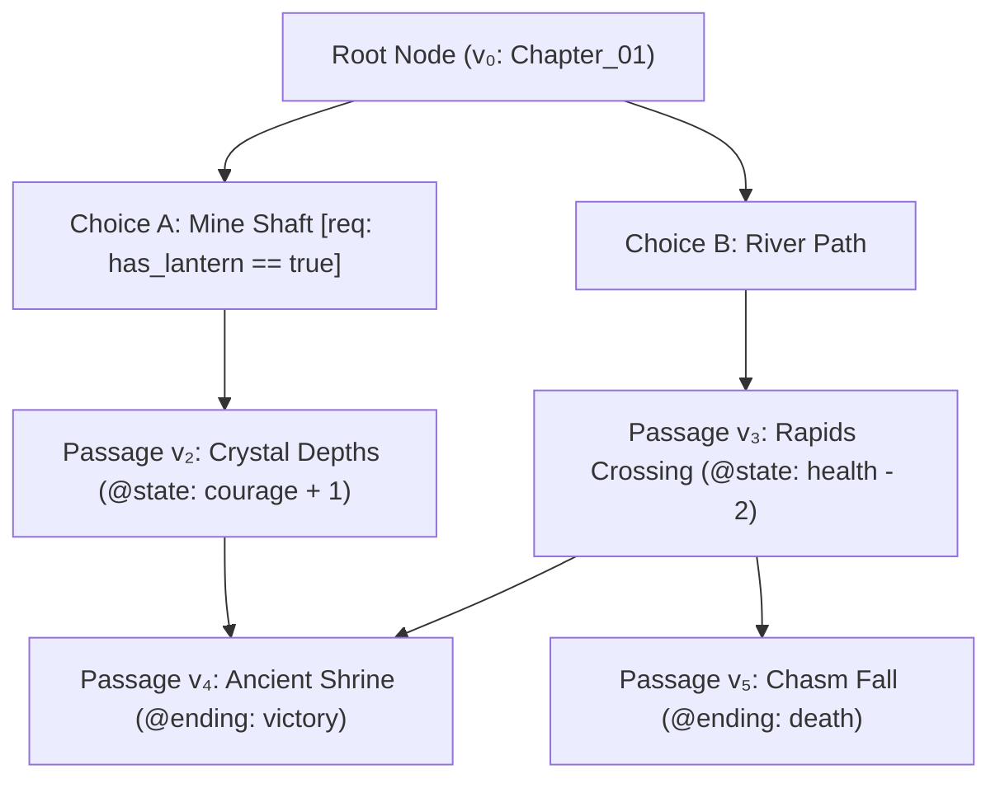
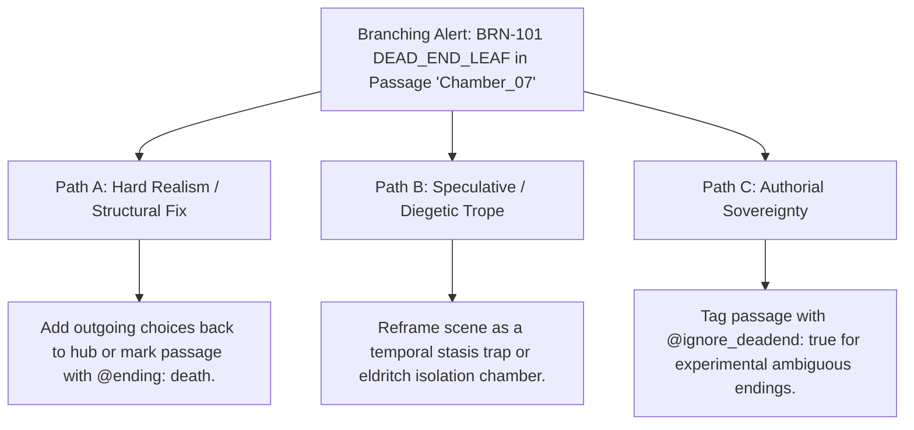

# Interactive Branching Narrative Graph & Choice Engine (`docs/BRANCHING_GRAPH.md`)
> **Domain E: Narrative Dynamics, Pacing, Structure & Branching** | **CLI:** `arcanum branch` / `arcanum choice`

---

## 1. Overview & Theoretical Rationale

The **Ars Arcanum Branching Narrative Graph Engine** (`scripts/lib/branching_graph.py`) is an offline graph-theoretic validation, simulation, and multi-format export suite engineered for authors of interactive fiction, choose-your-own-adventure gamebooks, RPG narrative trees, and branching transmedia manuscripts.

Non-linear writing introduces exponential complexity compared to linear fiction. Authors face severe graph-structural failure modes:
1. **Dangling Dead-End Leaves**: Passages with no outgoing choices and no terminal ending tag, trapping readers in narrative voids.
2. **Orphan & Unreachable Passages**: Scenes written by the author that cannot be reached from the initial root node via any valid choice path.
3. **Accidental Infinite Cycles**: Unintended choice loops that lack state mutation guards, trapping players in repetitive loops.
4. **Invalid State Requisites**: Choices locked behind impossible conditions (e.g., requiring items never acquired in any predecessor branch).
5. **Format Fragmentation**: Inability to compile a single plaintext manuscript into multiple interactive engines (Twine, Inkle Ink, standalone offline HTML5 gamebooks, and Obsidian Mermaid flowcharts).

The Branching Engine treats narrative passages as a Directed Graph $G = (V, E)$ augmented with state mutation vectors, performing deterministic topological validation and zero-pip transpilation.

---

## 2. Graph-Theoretic Foundations & Mathematical Formulation



### 2.1 Graph Definition & Degree Invariants
An interactive manuscript is modeled as a directed graph $G = (V, E)$:
- $V = \{v_1, v_2, \dots, v_n\}$: Set of narrative passages/scenes.
- $E \subseteq V \times V$: Set of directed choice transitions $(u, v)$ from passage $u$ to passage $v$.
- In-Degree: $d^-(v) = |\{u \in V \mid (u, v) \in E\}|$
- Out-Degree: $d^+(v) = |\{w \in V \mid (v, w) \in E\}|$

### 2.2 Topological Validity Rules

1. **Dead-End Leaf Invariant**:
   $$\forall v \in V \setminus \{v_{\text{root}}\}, \quad d^+(v) = 0 \iff v \in V_{\text{terminal}} \quad (\text{tagged with } \texttt{@ending}, \texttt{@death}, \text{ or } \texttt{@victory})$$
   Violation: `BRN-101 (UNINTENDED_DEAD_END)`

2. **Root Reachability Invariant**:
   Let $R(v_0) = \{v \in V \mid \exists \text{ path from } v_0 \text{ to } v\}$:
   $$R(v_0) = V$$
   Violation: `BRN-102 (ORPHAN_UNREACHABLE_NODE)`

3. **Target Existence Invariant**:
   $$\forall (u, v) \in E, \quad v \in V$$
   Violation: `BRN-105 (MISSING_CHOICE_TARGET)`

### 2.3 Cycle Detection & State Mutation Guards
While linear narratives must be strictly acyclic (DAGs), interactive fiction permits deliberate cycles (e.g. exploring a hub room) provided that each traversal mutates state:

$$\text{Cycle } C = (v_1, v_2, \dots, v_k, v_1) \text{ is Valid} \iff \sum_{e \in C} \Delta \mathcal{S}(e) \ne \vec{0}$$

Where $\Delta \mathcal{S}$ represents changes to player state variables (e.g. `@state: sanity - 1` or `@set: searched_desk = true`).

### 2.4 State Space Reachability Engine
Given an initial state $\mathcal{S}_0 \in \mathbb{R}^k \times \{0, 1\}^m$, each edge $(u, v)$ has a guard predicate $\phi_{(u, v)}(\mathcal{S})$. A path $P = (v_0, v_1, \dots, v_m)$ is executable if and only if:
$$\forall i \in [0, m-1], \quad \mathcal{S}_i \models \phi_{(v_i, v_{i+1})} \quad \text{and} \quad \mathcal{S}_{i+1} = \text{apply}(\mathcal{S}_i, \text{Mutations}(v_{i+1}))$$

---

## 3. Subfeatures Matrix

| Subfeature | Algorithmic Mechanism | Diagnostic Output / Rule | Narrative Significance |
|---|---|---|---|
| **Dead-End Leaf Detector** | Scans for nodes with $d^+(v) = 0$ lacking terminal directives. | Emits `BRN-101: DEAD_END_LEAF` with line reference. | Prevents readers from reaching abrupt, unresolvable dead ends. |
| **Orphan Passage Auditor** | Computes breadth-first reachability $R(v_0)$ from root. | Emits `BRN-102: UNREACHABLE_ORPHAN` for nodes $\notin R(v_0)$. | Surfaces abandoned narrative branches and forgotten drafts. |
| **Cycle & Infinite Loop Guard** | Runs Tarjan's strongly connected components and checks state mutations. | Flags `BRN-104: UNGUARDED_INFINITE_LOOP`. | Detects infinite soft-locks where players cannot progress. |
| **State Requisite Validator** | Verifies choice conditions (`[req: key >= 1]`) against available predecessor mutations. | Flags `BRN-106: UNATTAINABLE_PREREQUISITE`. | Ensures choices are mathematically solvable within the story graph. |
| **Multi-Engine Compiler** | Transpiles Markdown passages to Twine 2 (Twee 3), Inkle Ink, and HTML5. | Generates `.ink`, `.twee`, and standalone `.html` bundles. | Delivers zero-pip cross-platform publishing across gaming ecosystems. |
| **Mermaid Graph Generator** | Emits visual flowchart diagram syntax with state annotations. | Generates copy-pasteable Mermaid Markdown graphs. | Provides immediate visual mental model of story branching structure. |

---

## 4. Author Syntax & Extension Guide

### 4.1 Plaintext Choice Directives
Authors write standard Markdown and embed choices using `@choice:` directives:

```markdown
# Passage: The Forsaken Armory
@pov: Sean
@state: courage + 1
@set: visited_armory = true

Dust coats the weapon racks. A silver broadsword rests on the central pedestal.

@choice: "Take the broadsword and advance down the hall" -> Hall_Of_Mirrors [req: strength >= 14]
@choice: "Leave the blade and search the shadowed alcove" -> Secret_Tunnel
@choice: "Return to the courtyard" -> Courtyard [req: visited_armory == true]
```

### 4.2 Terminal Endings
Passages that conclude the narrative must declare a terminal directive:
```markdown
# Passage: The Void Collapse
@ending: death
@tag: bad_ending

The crystal reactor overloads. The world dissolves into blinding white silence.
```

Supported terminal types:
- `@ending: true` / `@ending: name` (Standard conclusion)
- `@death: true` (Player defeat / tragic demise)
- `@victory: true` (Canonical triumph / quest completion)

---

## 5. Command-Line Interface (CLI) Reference

```bash
# Audit topological health of an interactive branching story
arcanum branch InteractiveBook/ --audit

# Output structured JSON narrative graph
arcanum branch InteractiveBook/ --json

# Compile to standalone playable offline HTML5 gamebook
arcanum branch InteractiveBook/ --html dist/gamebook.html

# Transpile to Inkle Ink (.ink) script for game engines (Unity / Godot)
arcanum branch InteractiveBook/ --ink dist/story.ink

# Transpile to Twine 2 Twee 3 (.twee) for SugarCube or Harlowe
arcanum branch InteractiveBook/ --twine dist/story.twee

# Generate Obsidian / Markdown Mermaid decision diagram
arcanum branch InteractiveBook/ --mermaid dist/branching_map.md

# Inspect graph theory logic and cycle detection equations
arcanum doc branching --math --why
```

---

## 6. Tri-Fold Creative Advisory Resolutions



### Scenario: Dead-End Leaf in Passage `Chamber_07` ($d^+ = 0$)
- **Path A (Hard Realism / Graph Completeness)**:
  - Add explicit outgoing navigational choices (e.g. `@choice: "Retrace your steps" -> Antechamber`).
  - Or, if intended as a terminal failure, mark with `@ending: death`.
- **Path B (Speculative / Diegetic Trope)**:
  - Reframe the dead end as an intentional diegetic barrier: an impenetrable forcefield, a temporal time-loop trap, or an eldritch containment vault.
- **Path C (Authorial Sovereignty)**:
  - If writing an open-ended literary vignette or non-traditional cliffhanger, suppress the warning by adding `@ending: open_ended`.

---

## 7. Content Security Policy & Offline Isolation

Generated HTML5 gamebook readers are strictly self-contained and run in any web browser without internet access:

```html
<meta http-equiv="Content-Security-Policy" content="default-src 'none'; style-src 'unsafe-inline'; script-src 'unsafe-inline'; img-src data:; font-src data:;">
```
