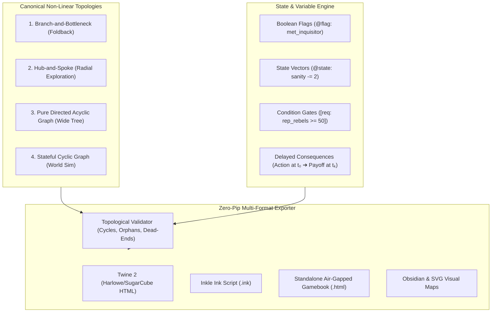
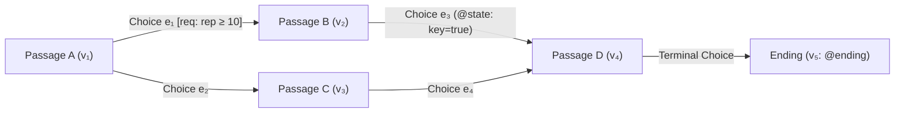
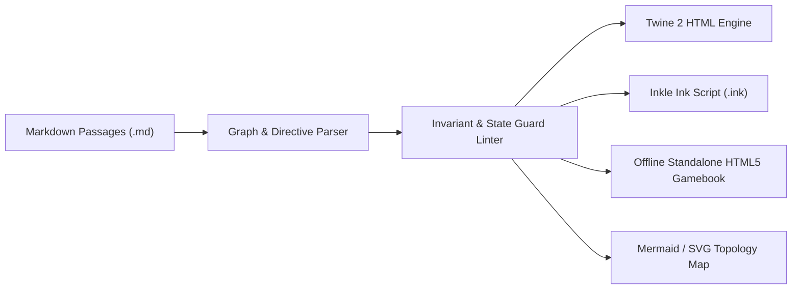
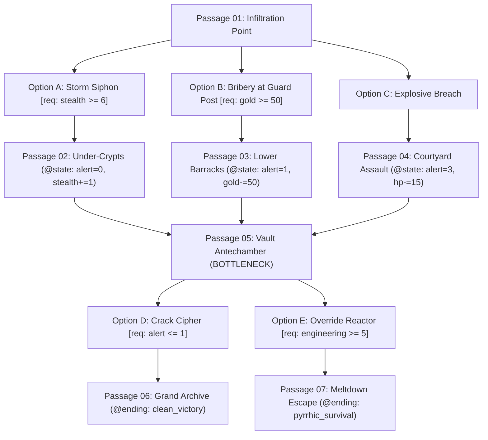

# Interactive Branching Narrative Graph & Choice Engine (`docs/BRANCHING_GRAPH.md`)
> **Domain E: Narrative Dynamics, Pacing, Structure & Branching** | **CLI Commands:** `arcanum branch` / `arcanum choice` | **Module:** `scripts/lib/branching_graph.py`

---

## 1. Overview & Theoretical Rationale

The **Ars Arcanum Branching Narrative Graph Engine** (`scripts/lib/branching_graph.py`) is an offline graph-theoretic validation, state-machine simulation, and multi-format export compiler engineered for authors of interactive fiction (IF), choose-your-own-adventure gamebooks, non-linear novels, RPG narrative trees, and transmedia story worlds.

Writing interactive and multi-threaded fiction introduces severe combinatorial challenges that do not exist in linear prose. Without rigorous graph topology and state management, non-linear narratives inevitably succumb to **Combinatorial State Explosion**, **Unintended Graph Traps**, and **Orphaned Dead Ends**.



---

## 2. Theoretical Foundations of Non-Linear & Ergodic Narratives

### 2.1 Ergodic Literature & Espen Aarseth's Cybertext Theory
In *Cybertext: Perspectives on Ergodic Literature* (1997), Espen Aarseth introduced the concept of **ergodic literature** (from the Greek *ergon* [work] and *hodos* [path]): texts where *"non-trivial effort is required to allow the reader to traverse the text."*

Aarseth distinguishes between:
- **Textons**: The raw, unvarying strings of prose written by the author.
- **Scriptons**: The unique sequence of textons encountered by a specific reader during a particular traversal.
- **Traversal Function**: The mathematical and ludic mechanism (links, conditional state checks, dice rolls) that maps textons to scriptons.

The Branching Narrative Engine treats every scene file as a texton node within a topological traversal network.

### 2.2 The Combinatorial Explosion Dilemma
In a naive binary branching tree where every passage offers two distinct choices ($b = 2$):
$$\text{Total Passages at Depth } D = 2^{D+1} - 1$$

| Choice Depth ($D$) | Total Scenes to Write | Total Word Count ($@ 500\text{ w/scene}$) |
|---|---|---|
| $D = 5$ | 63 | $31,500\text{ words}$ |
| $D = 10$ | 2,047 | $1,023,500\text{ words}$ |
| $D = 20$ | 2,097,151 | $> 1,000,000,000\text{ words}$ |

Writing 20 binary choices in an unconstrained tree requires millions of words, with each reader experiencing less than $0.001\%$ of the authored text. To make interactive storytelling commercially and artistically viable, narrative architects must utilize topological compression architectures.

```
       NAIVE BINARY EXPLOSION                     FOLDBACK (BRANCH-AND-BOTTLENECK)
                (O(2^D))                                       (O(D))

                 [Node]                                        [Node]
                /      \                                       /    \
            [N1]        [N2]                               [N1]      [N2]
           /    \      /    \                                  \    /
        [N3]   [N4]  [N5]   [N6]                           [Bottleneck]
        / \    / \   / \    / \                                /    \
      ... ... ... ... ... ... ...                          [N3]      [N4]
                                                               \    /
                                                           [Bottleneck]
```

### 2.3 Canonical Interactive Topologies
1. **Branch-and-Bottleneck (The Foldback Model)**:
   The narrative branches into 2–4 divergent paths based on player tactics, but these branches reconverge at mandatory thematic or geographical **Bottlenecks** (e.g., reaching the city gates, the trial, or the orbital launch). The choices do not permanently fracture the world state; instead, they alter character relationships, resource counters, and internal state vectors that color future textons.
2. **Hub-and-Spoke (Radial Exploration)**:
   The player is positioned in a central hub (a spaceship bridge, an investigation room, a tavern) with multiple radial spokes that can be explored in arbitrary order. Traversal mutates state; when all critical spokes are investigated, the central hub unlocks the gateway to the next act.
3. **Directed Acyclic Graph (DAG / The Gauntlet)**:
   Choices move strictly forward in time with no backward loops. Parallel tracks represent fundamentally different moral or faction alignments that run in tandem toward distinct climactic endings.
4. **Stateful World Simulation (Cyclic Graph)**:
   The story operates as a discrete topological state machine with loops and interconnected locations. Re-entering a passage evaluates mutated world variables (e.g., entering the courtyard at night vs. day, or before vs. after setting fire to the barracks).

### 2.4 Delayed Consequences vs. Immediate Agency
The hallmark of mature interactive writing is the **Delayed Consequence**:
- **Immediate Choice**: "Do you kick down the door (Option A) or pick the lock (Option B)?" $\to$ Results in an immediate 1-paragraph difference.
- **Delayed Consequence**: In Act I, the player chooses whether to spare a captured spy. The immediate outcome is identical, but the choice writes `@state: spared_malik = true`. In Act III, 40,000 words later, Malik appears either as an assassin aiming a rifle at the protagonist or as a double agent disabling the fortress shields.

---

## 3. Graph Mathematics & Algorithmic Formulation



### 3.1 Graph Topology & Degree Invariants
An interactive manuscript is modeled as an edge-attributed directed multigraph $G = (V, E, \Sigma, \Gamma)$:
- $V = \{v_1, v_2, \dots, v_n\}$: Set of narrative passage nodes.
- $E \subseteq V \times V$: Set of directed choice edges.
- $\Sigma$: Set of state variable transformations ($\Delta S$).
- $\Gamma$: Set of condition guard predicates ($\phi: S \to \{\text{True}, \text{False}\}$).

- **In-Degree ($d^-(v)$)**: Number of incoming choice links arriving at passage $v$.
- **Out-Degree ($d^+(v)$)**: Number of outgoing choices departing from passage $v$.

### 3.2 Topological Validity Rules & Invariants
1. **Dangling Dead-End Invariant**:
   $$\forall v \in V \setminus \{v_{\text{root}}\}, \quad d^+(v) = 0 \iff v \in V_{\text{terminal}} \quad (\text{tagged with } \texttt{@ending}, \texttt{@death}, \text{ or } \texttt{@victory})$$
   Violation: `BRN-101 (UNINTENDED_DEAD_END)`

2. **Root Reachability Invariant**:
   Let the reachability set from root $v_0$ be $R(v_0) = \{u \in V \mid \exists \text{ path } v_0 \rightsquigarrow u\}$:
   $$R(v_0) = V$$
   Violation: `BRN-102 (ORPHAN_UNREACHABLE_NODE)`

3. **Terminal Reachability Invariant**:
   $$\forall v \in V, \quad \exists v_{\text{term}} \in V_{\text{terminal}} \quad \text{such that } v \rightsquigarrow v_{\text{term}}$$
   Violation: `BRN-103 (INFINITE_CHOICE_SINK)`

4. **Target Existence Invariant**:
   $$\forall (u, v) \in E, \quad v \in V$$
   Violation: `BRN-105 (MISSING_CHOICE_TARGET)`

### 3.3 McCabe Cyclomatic Complexity of Narrative Graphs ($M$)
To measure the structural intricacy and branching agency of the manuscript:

$$M = |E| - |V| + 2P$$

Where $|E|$ is choice transitions, $|V|$ is narrative passages, and $P$ is the number of connected components (typically $P = 1$).

- **Linear Novel**: $|E| = |V| - 1 \implies M = 1$.
- **Branch-and-Bottleneck IF**: $M \in [15, 60]$.
- **Expansive Open-World RPG Book**: $M > 150$.

### 3.4 Shortest and Longest Path to Climax
Using topological sorting on DAG components or modified Dijkstra algorithms:

$$D_{\text{min}} = \min_{v_t \in V_{\text{term}}} \text{dist}(v_0, v_t), \qquad D_{\text{max}} = \max_{v_t \in V_{\text{term}}} \text{dist}(v_0, v_t)$$

- **Pacing Balance Ratio**: $\frac{D_{\text{min}}}{D_{\text{max}}} \ge 0.60$. If a reader can reach the ending in 3 choices while another path requires 30 choices, the narrative suffers from severe experiential disparity.

### 3.5 Boolean Reachability Matrix ($R$)
For an adjacency matrix $A$ where $A_{ij} = 1$ if $(v_i, v_j) \in E$:

$$R = \bigvee_{k=0}^{|V|-1} A^k$$

$R_{0j} = 1$ indicates that passage $j$ is reachable from the story opening.

---

## 4. Ars Arcanum Engine & CLI Architecture



### 4.1 CLI Command Reference

```powershell
# Validate all branching logic, state requisites, and dead-ends
arcanum branch Manuscript/

# Export the entire branching manuscript to Twine 2 HTML (SugarCube format)
arcanum choice Manuscript/ --export twine --out dist/gamebook.html

# Compile into an Inkle Ink script for game engine integration
arcanum choice Manuscript/ --export ink --out dist/story.ink

# Generate an offline SVG / Mermaid structural graph of all choices
arcanum branch Manuscript/ --visualize --out reports/story_graph.svg
```

### 4.2 Diagnostic Codes Matrix

| Code | Severity | Description | Remediating Action |
|---|---|---|---|
| `BRN-101` | **CRITICAL** | Unintended Dead-End Leaf ($d^+(v) = 0$ without terminal tag) | Add outgoing choices or mark the passage with `@ending: victory/death/epilogue`. |
| `BRN-102` | **CRITICAL** | Orphan Node (Passage unreachable from root $v_0$) | Connect passage to an existing node via a choice link, or remove dead scene file. |
| `BRN-103` | **HIGH** | Trapping Cycle (Loop with zero exit probability or state mutation) | Add an exit condition guard or ensure state mutates on each iteration. |
| `BRN-104` | **HIGH** | Impossible Requisite Gate (Condition requires state never set in any predecessor) | Verify state variable dependencies across all upstream paths. |
| `BRN-105` | **CRITICAL** | Missing Target Link (Choice points to non-existent passage file) | Correct target filename or create the missing chapter file. |
| `BRN-106` | **MEDIUM** | Asymmetric Path Depth ($\frac{D_{\text{min}}}{D_{\text{max}}} < 0.40$) | Expand short paths with intermediate complications or compress elongated routes. |
| `BRN-107` | **LOW** | False Choice / Non-Divergence (All options route to the exact same passage without state change) | Add state flag mutations or differentiate narrative consequences. |
| `BRN-108` | **MEDIUM** | Redundant Bottleneck Collapse (Excessive compression discarding all player agency) | Preserve player choice through delayed texton reactivity. |

---

## 5. Practical Authorial Worksheets & Worked Masterclass Examples

### 5.1 Step-by-Step Interactive Scenario: The Citadel Heist



#### Passage 01 Markdown File (`Manuscript/01_Infiltration.md`):
```markdown
---
id: "passage_01"
title: "The Citadel Infiltration"
act: 1
---

Rain lashes against the obsidian spires of the Iron Citadel. Beneath the parapet, the drainage siphon churns with chemical runoff. Across the plaza, two mercenary sentries huddle beneath a canvas awning, their lanterns sputtering in the gale.

You check your gear. The clock is ticking.

- [[Scale the slippery conduits into the storm siphon|passage_02]] [req: stealth >= 6]
- [[Approach the sentries with a purse of Imperial sovereigns|passage_03]] [req: gold >= 50]
- [[Plant a seismic charge against the perimeter gate|passage_04]]
```

#### Passage 02 Markdown File (`Manuscript/02_Under_Crypts.md`):
```markdown
---
id: "passage_02"
title: "The Drowned Crypts"
mutations:
  stealth: "+1"
  alert: "0"
---

You slip through the rusted iron grates without a sound. The putrid water rises to your waist, but the Citadel's alarm sirens remain silent. Above you, through the steam pipes, you hear the muffled footsteps of the interior patrol.

- [[Proceed into the Vault Antechamber|passage_05]]
```

---

### 5.2 The Interactive Passage Template (YAML Schema)

```yaml
---
passage_id: "CH04_VAULT_ANTECHAMBER"
node_type: "bottleneck"
required_flags: []
state_requisite_expression: "hp > 0"

state_mutations:
  visited_vault: true
  tension_level: "+25"

choices:
  - target: "CH05_TERMINAL_HACK"
    label: "Interface directly with the core mainframe"
    condition: "intellect >= 14 and has_cipher_deck == true"
    tooltip: "Requires high intellect and the stolen cipher deck."
    
  - target: "CH05_THERMAL_LANCE"
    label: "Burn through the blast doors with the thermal lance"
    condition: "fuel_cells >= 2"
    tooltip: "Consumes 2 fuel cells and raises base station alert to MAXIMUM."
    mutations:
      alert_status: "RED"
      fuel_cells: "-2"

  - target: "CH05_FALLBACK_RETREAT"
    label: "Sound immediate retreat and detonate perimeter charges"
    condition: "true"
    is_terminal: false
---
```

---

## 6. Recommended Reading, References & Media

### 6.1 Foundational Craft & Academic Books
- **Aarseth, Espen J. (1997)**. *Cybertext: Perspectives on Ergodic Literature*. Johns Hopkins University Press. ISBN: 978-0801855795.  
  *The foundational academic treatise defining non-linear textuality, scriptons, textons, and the cybernetic traversal model.*
- **Crawford, Chris (2004)**. *Chris Crawford on Interactive Storytelling*. New Riders. ISBN: 978-0321278906.  
  *Pioneering exploration of dramatic verbs, state explosion mitigation, interactive agency, and character-driven dynamic trees.*
- **Short, Emily (2019–2024)**. *Interactive Storytelling and World Models: Collected Essays and Postmortems*. Emily Short's Interactive Storytelling.  
  *Exhaustive analysis of quality-based narrative selection (QBN), conversation topologies, salience, and systemic story generation.*
- **Bizzocchi, Jim & Tanenbaum, Joshua (2011)**. "Well Read: Applying Close Reading Techniques to Interactive Narrative". *Well Played*, 3(2).  
  *Academic examination of reader engagement across branching graph paths and non-linear agency.*
- **Montfort, Nick (2003)**. *Twisty Little Passages: An Approach to Interactive Fiction*. MIT Press. ISBN: 978-0262633185.  
  *The authoritative history and formal analysis of parser and choice-driven interactive fiction.*

### 6.2 Landmark Lectures, Video Masterclasses & Industry Treatises
- **Barlow, Sam (2016–2023)**. *Designing Her Story and Immortality: Non-Linear Narrative Architecture*. GDC (Game Developers Conference) Masterclasses.  
  *Dissects non-linear indexing, associative player jumping, and multi-threaded narrative revelation.*
- **Ingold, Jon & Humfrey, Joseph / Inkle (2015)**. *Building 80 Days: High-Performance Branching Narrative Design without State Explosion*. GDC Talk.  
  *How to author a 750,000-word interactive masterpiece using foldback architectures and dynamic state vectors.*
- **Choice of Games (2010–2024)**. *The Choice of Games Author Guide & Philosophy of Interactive Fiction*. Choice of Games LLC.  
  *The definitive commercial standard for state-variable storytelling, delayed consequences, and reader-choice agency.*
- **Mateas, Michael & Stern, Andrew (2003)**. *Façade: An Experiment in One-Act Interactive Drama*. AAMAS Proceedings.  
  *Groundbreaking research on drama management, beat-based interactive structures, and natural language reactivity.*

### 6.3 Landmark Speculative Interactive Case Studies
- **Inkle (2014)**. *80 Days*. Inkle Studios.  
  *The pinnacle of ergodic travel literature: 150+ cities, 10,000 choice edges, perfectly balancing authorial voice with radical branching freedom.*
- **Choice of Games (2016)**. *Fallen Hero: Rebirth* (by Malin Rydén). Choice of Games.  
  *Masterclass in psychological delayed consequences, deep state-tracking, and villainous protagonist agency.*
- **Supergiant Games (2020)**. *Hades*. Written by Greg Kasavin.  
  *Stateful cyclic narrative integration: every death and traversal loop triggers bespoke diegetic narrative progression.*
