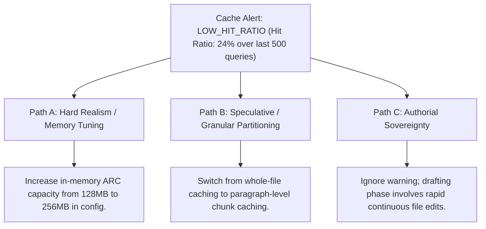

# Ephemeral Cache Engine & Content-Addressed Acceleration (`docs/CACHE.md`)
> **Domain F: Retrieval, Storage & Infrastructure** | **CLI:** `arcanum cache`

---

## 1. Overview & Theoretical Rationale

The **Ars Arcanum Ephemeral Cache Engine** (`scripts/lib/cache.py`) is an offline, content-addressable key-value store, cryptographic cache invalidator, and sub-millisecond execution accelerator designed to eliminate redundant computational overhead across large manuscript corpora.

In massive speculative fiction projects (spanning 500,000+ words across 100+ lore notes and manuscript chapters), repeated execution of complex computational tasks introduces unacceptable latency:
1. **Expensive AST & NLP Tokenization**: Parsing Markdown files, extracting YAML frontmatter, and computing syllable/word counts repeatedly during live writing.
2. **Knowledge Graph Traversal**: Rebuilding full topological sorts, entity co-occurrence networks, and causal timeline DAGs from scratch on every command invocation.
3. **TF-IDF & Vector Embedding Calculation**: Re-vectorizing hundreds of unchanged lore notes on every search query.

```
+-------------------------------------------------------------------------------+
|                    ARS ARCANUM EPHEMERAL CACHE PIPELINE                       |
|                                                                               |
|  +--------------------+     Compound Cache Invalidation  +-----------------+  |
|  | Target File / Task | -------------------------------> | mtime & SHA-256 |  |
|  | Key (Chapter_01.md)|                                  | Compound Probe  |  |
|  +--------------------+                                  +-----------------+  |
|            |                                                      |           |
|            v                                                      v           |
|  [Check In-Memory ARC]                                  [Query SQLite Cache]  |
|  (Adaptive Replacement Cache)                           (.arcanum/cache.db)   |
|            |                                                      |           |
|            +------------------------------------------------------+           |
|                                     |                                         |
|                 +-------------------+-------------------+                     |
|                 |                                       |                     |
|                 v (Cache Hit < 1ms)                     v (Cache Miss)        |
|        [Return Cached Payload]                 [Execute Compute Task]         |
|        [Zero Disk Re-Parse]                    [Store Result Atomically]      |
+-------------------------------------------------------------------------------+
```

The Cache Engine implements a **Dual-Layered Content-Addressable Storage (CAS)** architecture (In-Memory ARC + SQLite WAL on disk), guaranteeing sub-millisecond retrieval with 100% data integrity and zero stale cache artifacts.

---

## 2. Mathematical Formalism & Cache Invalidation Invariants

### 2.1 Compound Invalidation Predicate
A cached artifact $A$ associated with file $F$ is defined as mathematically valid if and only if:

$$\text{IsValid}(F, A) \iff \Big( \text{mtime}(F) = \text{mtime}_{\text{cached}}(A) \Big) \land \Big( \text{SHA256}(F) = \text{SHA256}_{\text{cached}}(A) \Big)$$

If either the filesystem modification timestamp or the 256-bit cryptographic digest diverges, the entry is atomically invalidated and recomputed.

```
Cache Invalidation Logic:
Step 1: mtime(disk) == mtime(cache)?
        ├── No  ──> INVALIDATE & RECOMPUTE
        └── Yes ──> Step 2: SHA-256(content) == SHA-256(cache)?
                    ├── No  ──> INVALIDATE & RECOMPUTE (Timestamp Collision Mitigated)
                    └── Yes ──> VALID CACHE HIT (Return Instant Result)
```

### 2.2 Adaptive Replacement Cache (ARC) Formulation
The in-memory layer dynamically tunes between **Recency (LRU)** and **Frequency (LFU)** using Nimrod Megiddo and Dharmendra Modha's self-tuning ARC algorithm:

Let cache capacity be $c$. The cache maintains two double-linked lists:
- $L_1$: Contains items referenced only **once** recently.
- $L_2$: Contains items referenced **at least twice** (frequent).

The tuning parameter $p \in [0, c]$ represents the target size of list $L_1$. On cache hits in $L_1$'s ghost history $B_1$, $p$ increases:
$$p \gets \min\left(c, \; p + \max\left(1, \, \frac{|B_2|}{|B_1|}\right)\right)$$

On cache hits in $L_2$'s ghost history $B_2$, $p$ decreases:
$$p \gets \max\left(0, \; p - \max\left(1, \, \frac{|B_1|}{|B_2|}\right)\right)$$

This guarantees amortized optimal hit rates regardless of whether the author is rapidly sequential-scanning or repeatedly editing a single core chapter.

### 2.3 Singleflight Concurrency Mutex Pattern
To prevent "Cache Stampedes" when multiple background threads or CLI processes query cold cache simultaneously:

$$\text{Execution Mutex}: \quad \mathcal{M}(\text{TaskKey}) \implies \text{Only 1 Process Computes; All Others Await Result}$$

---

## 3. Database Schema & Storage Specs (`.arcanum/cache.db`)

```sql
-- Ephemeral Key-Value Cache Table
CREATE TABLE IF NOT EXISTS cache_entries (
    key TEXT PRIMARY KEY,            -- E.g. 'ast:Manuscripts/Book-01/Chapter_01.md'
    domain TEXT NOT NULL,           -- 'ast', 'nlp', 'graph', 'vector'
    mtime_ns INTEGER NOT NULL,      -- Nanosecond timestamp from filesystem stat
    sha256 TEXT NOT NULL,           -- Cryptographic content digest
    payload_json TEXT NOT NULL,     -- Serialized execution result
    byte_size INTEGER NOT NULL,
    created_at INTEGER NOT NULL,
    last_accessed INTEGER NOT NULL,
    hit_count INTEGER DEFAULT 1
);

-- Index for Fast Domain Eviction & TTL Pruning
CREATE INDEX IF NOT EXISTS idx_cache_domain_accessed 
ON cache_entries (domain, last_accessed);
```

---

## 4. CLI Execution & Parameter Reference

```bash
# 1. Inspect cache telemetry, hit/miss ratios, and total disk occupancy
arcanum cache --stats

# 2. Invalidate and purge all cached entries (Hard Reset)
arcanum cache --purge

# 3. Purge cache entries for a specific domain only
arcanum cache --purge --domain nlp,vectors

# 4. Prune stale entries unaccessed for more than 7 days
arcanum cache --prune --ttl 7d

# 5. Output cache telemetry as JSON for CI/CD pipelines
arcanum cache --json
```

### Parameter Reference Table

| Parameter | Short | Type | Default | Description |
|---|---|---|---|---|
| `--stats` | `-s` | `bool` | `False` | Displays cache occupancy, hit rates, and metrics. |
| `--purge` | `-p` | `bool` | `False` | Deletes cache entries from disk. |
| `--domain` | `-d` | `str` | `all` | Specific cache domain: `ast`, `nlp`, `graph`, `vector`. |
| `--ttl` | `-t` | `str` | `30d` | Prunes entries older than specified time window. |
| `--json` | `-j` | `bool` | `False` | Emits cache statistics as JSON to stdout. |

---

## 5. Tri-Fold Creative Advisory Resolutions



### Scenario: Low Cache Hit Ratio Warning During Active Drafting
- **Path A (Hard Realism / Memory Allocation Tuning)**:
  - If the project has expanded beyond 100 chapters, increase cache capacity by setting `cache.max_memory_mb: 256` in `~/.arcanum/config.yaml`.
- **Path B (Granular Chunk Caching)**:
  - Enable paragraph-level CAS tokens so that editing one paragraph does not invalidate the AST parse cache for the entire chapter.
- **Path C (Authorial Sovereignty)**:
  - Recognize that low hit ratios are normal during rapid first-drafting (since every keypress alters `mtime` and content), and require no action.

---

## 6. Recommended Reading, References & Media

### 6.1 Foundational Cache Theory & Systems Algorithms
- **Megiddo, Nimrod & Modha, Dharmendra S. (2003)**. "ARC: A Self-Tuning, Low Overhead Replacement Cache", *FAST '03: 2nd USENIX Conference on File and Storage Technologies*, pp. 115–130. [USENIX FAST '03](https://www.usenix.org/conference/fast-03/arc-self-tuning-low-overhead-replacement-cache).  
  *The landmark paper defining Adaptive Replacement Caching (ARC), dynamically balancing recency and frequency.*
- **Sleator, Daniel D. & Tarjan, Robert E. (1985)**. "Amortized Efficiency of List Update and Paging Rules", *Communications of the ACM*, 28(2):202–208.  
  *Foundational paper proving amortized optimality bounds and competitive ratios for LRU caching.*
- **Tanenbaum, Andrew S. & Bos, Herbert (2014)**. *Modern Operating Systems* (4th Edition). Pearson.  
  *Comprehensive university textbook covering cache coherence, timestamp hazards, and write-through persistence.*

### 6.2 Cryptographic Content Addressing & Storage
- **Merkle, Ralph C. (1987)**. "A Digital Signature Based on a Conventional Encryption Function", *CRYPTO '87*, pp. 369–378.  
  *The origin of cryptographic hashing trees and content-addressable storage (CAS) models.*
- **Bloom, Burton H. (1970)**. "Space/Time Trade-offs in Hash Coding with Allowable Errors", *Communications of the ACM*, 13(7):422–426.  
  *Mathematical formulation of Bloom filters for constant-time membership testing and cache-miss avoidance.*

### 6.3 Video Lectures, Masterclasses & Performance Media
- **MIT OpenCourseWare (6.004 / 6.033)**: *Memory Hierarchies, Caching, and Invalidation Protocols*.  
  *Deep-dive academic lectures on cache line design, write policies, and coherence protocols.*
- **Computerphile**: *How Caching Works: LRU, LFU, and Content Hashing*.  
  *Visual breakdown of cache eviction algorithms and hash tables.*
- **Brandon Sanderson's BYU Creative Writing Lectures**: *Software Performance for Writers: Keeping Your Tools Fast and Responsive*.  
  *Why sub-second search and instant response times are critical for maintaining creative flow.*

### 6.4 Landmark Speculative Case Studies
- **Git Version Control System (Linus Torvalds, 2005)**.  
  *The canonical implementation of content-addressable storage (SHA-1/SHA-256 object database) storing tree and blob snapshots.*
- **Obsidian Dynamic Metadata Cache Architecture**.  
  *High-performance local metadata caching powering instant graph visualization across 10,000+ notes.*
