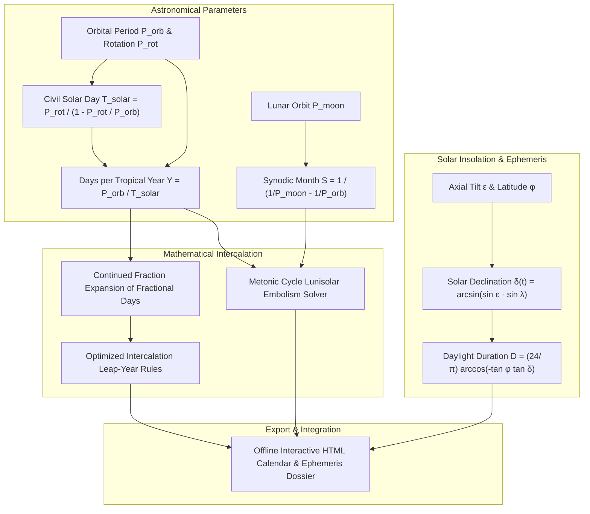

# Planetary Chronology, Intercalation & Astronomical Calendars (`docs/CALENDAR.md`)
> **Domain A: Astrophysics, Climate, Cartography & Celestial Mechanics** | **CLI:** `arcanum calendar` / `arcanum epoch`

---

## 1. Executive Summary & Epistemological Architecture

The **Ars Arcanum Calendar & Chronology Engine** (`scripts/lib/calendar.py`) is an offline astronomical calendar generator, continued-fraction intercalation optimizer, lunisolar Metonic cycle reconciler, and daylight variance calculator designed for speculative worldbuilders, astronomers, and chronologists.

Translating planetary orbital dynamics into civic calendars requires rigorous mathematical synchronization between non-integer physical cycles:
1. **The Incommensurable Year Problem (`CAL-101`)**: Planetary orbital periods are almost never clean integer multiples of planetary rotation days (e.g., Earth’s $365.242189\text{ days}$). Unchecked calendars drift rapidly, disconnecting solstices from agriculture.
2. **Lunisolar Phase Desynchronization (`CAL-102`)**: Lunar religious festivals drifting across solar agricultural seasons without an explicit Metonic or embolismic leap-month algorithm.
3. **Sidereal vs Solar Day Confusion**: Equating sidereal rotation period ($P_{\text{sidereal}}$) with civil solar day length ($T_{\text{solar}}$), generating cumulative diurnal timing drift.
4. **Daylight Invariance Errors**: Depicting identical 12-hour day/night cycles at all latitudes and seasons regardless of axial tilt ($\epsilon$).

The Calendar Engine calculates solar day lengths, optimizes leap-year rules via continued fraction expansions, computes lunisolar embolisms, and generates seasonal daylight curves.



---

## 2. Planetary Astronomy to Calendar Conversion

### 2.1 Sidereal vs Civil Solar Day
A planet rotates on its axis in sidereal period $P_{\text{sidereal}}$, but as it orbits its star, it must rotate an additional fraction of a turn to realign the sun with the local meridian.

$$\frac{1}{T_{\text{solar}}} = \frac{1}{P_{\text{sidereal}}} - \frac{1}{P_{\text{orbital}}} \implies T_{\text{solar}} = \frac{P_{\text{sidereal}}}{1 - \frac{P_{\text{sidereal}}}{P_{\text{orbital}}}}$$

*(For prograde rotation. For retrograde rotation, replace the minus sign with a plus).*

### 2.2 Synodic Lunar Month
The time required for a moon to return to the same phase (e.g., New Moon to New Moon) as seen from the planetary surface:

$$\frac{1}{S_{\text{synodic}}} = \frac{1}{P_{\text{moon}}} - \frac{1}{P_{\text{planet}}} \implies S_{\text{synodic}} = \frac{P_{\text{moon}} \cdot P_{\text{planet}}}{P_{\text{planet}} - P_{\text{moon}}}$$

---

## 3. Calendar Architectures

```
                      [ CALENDAR SYSTEM ARCHETYPES ]
  1. PURE SOLAR CALENDAR   ──► Tracks tropical year (Julian, Gregorian, Jalali)
  2. PURE LUNAR CALENDAR   ──► Tracks 12 lunar months (Hijri: 354 days; drifts 11 days/yr)
  3. LUNISOLAR CALENDAR    ──► Reconciles solar years & lunar months via Metonic leaps
  4. CIVIC / ARBITRARY     ──► Fixed ritual weeks; decoupling from celestial mechanics
```

---

## 4. Continued Fractions & Intercalation Mathematics

Let a planet's tropical year have $Y = N + f$ civil solar days, where $N$ is the integer days and $f \in (0, 1)$ is the fractional remainder. To keep civic calendars synchronized with astronomical seasons, we add $L$ leap days every $M$ years:

$$\frac{L}{M} \approx f$$

### 4.1 Continued Fraction Expansions
Any real number $f$ can be represented as an infinite continued fraction:

$$f = [a_0; a_1, a_2, a_3, \dots] = a_0 + \frac{1}{a_1 + \frac{1}{a_2 + \frac{1}{a_3 + \dots}}}$$

The successive rational truncations (convergents $\frac{p_k}{q_k}$) provide the **mathematically best possible rational approximations** with the smallest possible denominators.

#### Example: Earth Fractional Year ($f = 0.242189\text{ days}$)
1. $a_0 = 0$
2. $\frac{1}{0.242189} = 4.1290 \implies a_1 = 4$ (First convergent: $\frac{p_1}{q_1} = \frac{1}{4} = 0.2500$ $\to$ **Julian Calendar: 1 leap day every 4 years**; drifts 1 day every 128 years).
3. $\frac{1}{0.1290} = 7.747 \implies a_2 = 7$ (Second convergent: $\frac{p_2}{q_2} = \frac{7}{29} \approx 0.24138$ $\to$ 7 leap days every 29 years).
4. $\frac{1}{0.747} = 1.338 \implies a_3 = 1$ (Third convergent: $\frac{p_3}{q_3} = \frac{8}{33} \approx 0.24242$ $\to$ **Omar Khayyám's Persian Jalali Calendar: 8 leap days every 33 years**; drifts 1 day every 5,000 years).
5. Further expansion yields $\frac{97}{400} = 0.24250$ $\to$ **Gregorian Calendar: 97 leap days every 400 years** (Leap year every 4th year, excluding century years not divisible by 400; drifts 1 day every 3,236 years).

---

## 5. Lunisolar Reconciliations & The Metonic Cycle

In lunisolar calendars (e.g., Hebrew, Babylonian, Attic Greek), civil months follow the lunar synodic cycle ($S \approx 29.5306\text{ days}$), while the overall calendar must match the solar year ($Y \approx 365.2422\text{ days}$).

```
  12 Lunar Months = 12 * 29.5306 = 354.3672 days  (Shortfall: ~10.875 days per year)
  Metonic Equation: 19 Solar Years ≈ 235 Synodic Lunar Months
  19 * 365.2422 = 6939.60 days  <───►  235 * 29.5306 = 6939.69 days (Error: 2 hours in 19 yrs)
```

### 5.1 Embolismic Month Distribution
To prevent drift, **7 intercalary (embolismic) 13th months** are added over every 19-year Metonic cycle:
- Intercalary leap years in cycle: **Years 3, 6, 8, 11, 14, 17, and 19**.

---

## 6. Axial Tilt, Solar Declination & Daylight Variance

```
      Daylight Duration (Hours)
           ▲
        24 ┼ - - - - - - - - - - - - - - - - - - - Summer Solstice (Midnight Sun)
           │                   ╭────────────────── High Latitude (φ = 65° N)
           │                 ╭─╯
        12 ┼───────────────╭─┼─────────────────── Equator (φ = 0°: Exactly 12h all year)
           │             ╭─╯ │
           │           ╭─╯   │
         0 ┼───────────┴─────┴────────────────────► Day of Year (t)
                         Winter Solstice (Polar Night)
```

### 6.1 Solar Declination Formula ($\delta$)
For a planet with axial tilt $\epsilon$, the solar declination $\delta$ as a function of orbital longitude $\lambda_\odot(t) \in [0, 2\pi]$:

$$\sin\delta = \sin\epsilon \cdot \sin\lambda_\odot(t)$$

### 6.2 Hour Angle at Sunrise / Sunset ($\omega_0$)
$$\cos\omega_0 = -\tan\phi \cdot \tan\delta$$

Where:
- $\phi$ is the geographic latitude.
- If $-\tan\phi \tan\delta \ge 1.0 \implies \omega_0 = 0 \implies \text{Polar Night (0 hours daylight)}$.
- If $-\tan\phi \tan\delta \le -1.0 \implies \omega_0 = \pi \implies \text{Midnight Sun (24 hours daylight)}$.

### 6.3 Daily Daylight Duration ($D$)
$$D = \frac{T_{\text{solar}}}{\pi} \arccos\left( -\tan\phi \cdot \tan\delta \right)$$

---

## 7. Worked Step-by-Step Calendar Design

### Scenario: The World of Aurelia
- Orbital period: $P_{\text{orbital}} = 412.3840\text{ Earth days}$.
- Sidereal rotation period: $P_{\text{sidereal}} = 23.8500\text{ hours} = 0.99375\text{ days}$.
- Moon orbital period: $P_{\text{moon}} = 32.4000\text{ Earth days}$.
- Axial tilt: $\epsilon = 26.0^\circ$.

#### Step 1: Compute Solar Day Length
$$\frac{1}{T_{\text{solar}}} = \frac{1}{0.99375} - \frac{1}{412.3840} = 1.006289 - 0.002425 = 1.003864$$
$$T_{\text{solar}} = \frac{1}{1.003864} = 0.99615\text{ Earth days} = 23.9076\text{ hours}$$

#### Step 2: Compute Days per Tropical Year
$$Y = \frac{412.3840}{0.99615} = 414.0305\text{ civil solar days}$$
The year has **$414\text{ base days}$** with a fractional remainder $f = 0.0305\text{ days/year}$.

#### Step 3: Continued Fraction Expansion for Leap Years
$$\frac{1}{0.0305} = 32.787 \implies a_1 = 32$$
$$\frac{1}{0.787} = 1.27 \implies a_2 = 1 \implies \text{Fraction: } \frac{1}{32} \text{ or } \frac{1}{33}$$

*Optimal Intercalation Rule*: **Add 1 leap day every 33 years** ($\frac{1}{33} \approx 0.03030$; calendar accuracy lasts over 50,000 years without drifting).

#### Step 4: Compute Synodic Month and Year Structure
$$\frac{1}{S_{\text{synodic}}} = \frac{1}{32.40} - \frac{1}{412.384} = 0.030864 - 0.002425 = 0.028439$$
$$S_{\text{synodic}} = 35.163\text{ Earth days} = \frac{35.163}{0.99615} \approx 35.30\text{ Aurelian solar days}$$
- $414 / 35.30 \approx 11.73\text{ months/year}$.
- The realm adopts **11 months of 37 days** ($407\text{ days}$) plus a **7-day intercalary midwinter festival week** ($414\text{ days total}$).

---

## 8. Practical YAML Schemas

```yaml
schema_version: "2.0"
calendar_system:
  id: "aurelian_imperial_calendar"
  planet_id: "aurelia"
  days_per_year_exact: 414.0305
  base_year_days: 414
  solar_day_hours: 23.9076
  axial_tilt_deg: 26.0

intercalation_rule:
  type: "fractional_periodic"
  leap_days: 1
  period_years: 33
  leap_month_id: "intercalary_midwinter"

months:
  - id: "primus"
    name: "Primus Aurel"
    days: 37
    season: "early_spring"
  - id: "secundus"
    name: "Floralis"
    days: 37
    season: "mid_spring"
  # ... (months 3 to 11, each 37 days)
  - id: "intercalary_midwinter"
    name: "Festival of the Unconquered Sun"
    days: 7 # Becomes 8 days on leap years (every 33rd year)
    is_festival_intercalation: true
```

---

## 9. CLI Reference & Scriptorium Integration

```bash
# Calculate exact solar day and continued fraction leap rules for exoplanet
arcanum calendar --orbit-days 412.384 --rotation-hours 23.85

# Compute daylight duration curve across latitudes for axial tilt 26 deg
arcanum epoch --daylight --tilt 26.0 --latitude 45.0

# Generate standalone offline HTML interactive calendar atlas
arcanum calendar --calendar World/Chronology/imperial_calendar.yaml --html reports/calendar_dossier.html
```

---

## 10. Recommended Reading, References & Media

### Foundational Craft & Academic Textbooks
- **Richards, E.G. (1998)**. *Mapping Time: The Calendar and Its History*. Oxford University Press.  
  *The definitive mathematical and historical masterwork on calendar algorithms, continued fraction expansions, and lunar cycles.*
- **Blackburn, Bonnie, & Holford-Strevens, Leofranc (1999)**. *The Oxford Companion to the Year*. Oxford University Press.  
  *Exhaustive historical compendium of festival dates, calendrical systems, and astronomical timekeeping.*
- **Duncan, David Ewing (1998)**. *Calendar: Humanity's Epic Struggle to Determine a True and Accurate Year*. Avon Books.  
  *Vivid narrative history detailing the social and scientific crises of Julian calendar drift and the Gregorian reform.*
- **Meeus, Jean (1998)**. *Astronomical Algorithms* (2nd ed.). Willmann-Bell.  
  *The gold-standard computational handbook for calculating ephemerides, solar declinations, and planetary positions.*

### Seminal Video Lectures, Masterclasses & Channels
- **Artifexian** (YouTube Series: *Designing a Realistic Fantasy Calendar*, *Lunisolar Calendars & Metonic Cycles*).  
  *The industry benchmark step-by-step video guide for translating planetary orbital mechanics into functioning calendars.*
- **Numberphile** (*Leap Years and Continued Fractions*).  
  *Brilliant intuitive visual explanations of why continued fractions yield optimal leap year rules.*
- **PBS Space Time** (*The True Physics of Timekeeping and Orbital Motion*).  
  *Rigorous relativistic and classical breakdowns of planetary rotation, precession, and celestial cycles.*

### Landmark Speculative Case Studies
- **Tolkien, J.R.R.** *The Lord of the Rings* (Appendices D & E: Shire Calendar, Rivendell Reckoning, and Númenórean Kings' Reckoning with intercalary festival days).
- **Martin, George R.R.** *A Song of Ice and Fire* (The Citadel’s white ravens announcing seasons on a world with chaotic multi-year orbital fluctuations).
- **Wolfe, Gene**. *The Book of the New Sun* (Urth's decaying astronomical calendar reflecting red giant stellar death).
- **Asimov, Isaac**. *Nightfall* (The complex multi-star calendar of Kalgash, where total darkness occurs only once every 2,049 years).
