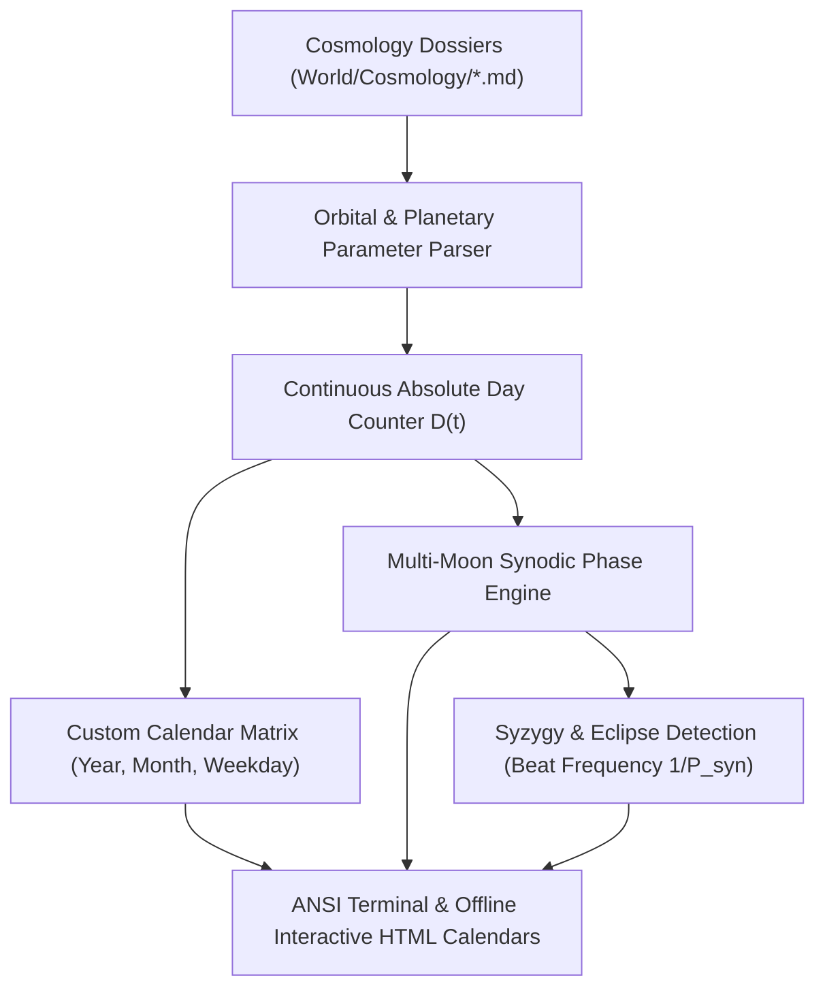
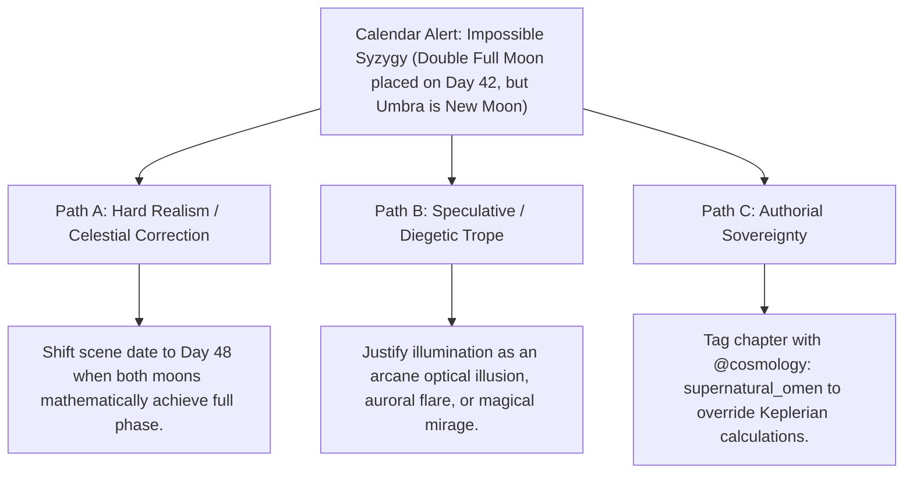

# Custom Planetary Calendars, Multi-Moon Synodic Cycles & Syzygies (`docs/CALENDARS.md`)
> **Domain A: Astrophysics, Climate, Cartography & Celestial Mechanics** | **CLI:** `arcanum calendar` / `arcanum moon`

---

## 1. Overview & Theoretical Rationale

The **Ars Arcanum Calendar Engine** (`scripts/lib/calendar.py`) is an offline celestial timekeeping, orbital arithmetic, multi-moon phase calculator, and syzygy/eclipse predictor designed for science fiction and fantasy worldbuilders.

Timekeeping across fictional worlds is intimately bound to orbital mechanics and cultural rituals. Writers frequently encounter three core temporal contradictions:
1. **Lunisolar Drift & Leap Day Errors**: Creating a calendar with integer months and days that accumulates vast seasonal drift against the planet's fractional orbital period ($P_{\text{orbit}} \ne N_{\text{days}}$).
2. **Multi-Moon Phase Desynchronization**: Describing multiple full moons in a night sky without accounting for their independent orbital velocities and synodic resonance.
3. **Inconsistent Eclipse & Syzygy Timing**: Declaring mystical "Blood Moon Conjunctions" on dates where the celestial geometry mathematically precludes conjunction.

The Calendar Engine parses planetary parameters in `World/Cosmology/*.md`, tracks continuous absolute day counters, models multi-moon sinusoidal illumination curves, calculates synodic beat frequencies, and generates interactive monthly calendar grids.

---

## 2. Astronomical Timekeeping & Mathematical Formulation



### 2.1 Planetary Year, Day Fractions & Intercalary Cycles
For a planet with orbital period $Y$ days and day length $H$ hours:

$$\text{Fractional Day Remainder } \delta = Y - \lfloor Y \rfloor$$

To prevent seasonal drift over century scales, intercalary leap cycles satisfy continued fraction approximations $\frac{p}{q} \approx \delta$:

$$\text{Leap Day Insertion Rule}: \quad \text{Year } k \text{ is Leap} \iff (k \cdot p) \pmod q < p$$

### 2.2 Multi-Moon Synodic Cycles & Illumination Fraction
For moon $m$ with synodic period $P_m$ and initial epoch offset $\delta_m$:

$$\phi_m(D) = \frac{(D + \delta_m) \pmod{P_m}}{P_m} \in [0.0, 1.0)$$

The visual illumination percentage seen from the planetary surface is:
$$\mathcal{I}_m(D) = \frac{1 - \cos(2\pi \cdot \phi_m(D))}{2} \times 100\%$$

### 2.3 Synodic Beat Period & Celestial Syzygy Alignment
For two orbiting moons with periods $P_1$ and $P_2$, the synodic beat period between successive mutual conjunctions is:

$$\frac{1}{P_{\text{syn}}} = \left| \frac{1}{P_1} - \frac{1}{P_2} \right| \implies P_{\text{syn}} = \frac{P_1 P_2}{|P_1 - P_2|}$$

$$\text{Grand Syzygy (Double Full Moon)} \iff \forall m \in \mathcal{M}, \quad |\phi_m(D) - 0.50| \le \epsilon_{\text{window}}$$

---

## 3. Subfeatures Matrix

| Subfeature | Algorithmic Mechanism | Diagnostic Output / Rule | Narrative Craft Significance |
|---|---|---|---|
| **Non-Standard Calendar Arithmetic**| Arbitrary days/year, hours/day, month counts, and weekday names. | Emits localized date timestamps (e.g. `Year 102, Sunhigh 14, Moonday`). | Replaces Earth-centric Gregorian assumptions with native cosmology. |
| **Multi-Moon Phase Tracker** | Computes independent sinusoidal illumination curves for $N$ moons. | Emits phase names and Unicode glyphs (`🌑`, `🌓`, `🌕`, `🌗`). | Provides instant nocturnal sensory cues for drafting night scenes. |
| **Syzygy & Eclipse Detector** | Calculates phase intersections across all active natural satellites. | Flags `ASTRONOMICAL_SYZYGY` (Grand Alignment / Blood Eclipse). | Validates celestial timing for prophecy climaxes and magical rituals. |
| **Interactive HTML Calendar** | Compiles monthly grid with visual moon phase discs and event tags. | Emits standalone offline `.html` calendar. | Enables authors to visually plan scene sequences against lunar cycles. |
| **Date Advance Simulator** | Computes future celestial states given day/hour increments. | Emits exact phase transitions for time jumps (`--advance 45`). | Keeps timelines consistent across lengthy journeys or time leaps. |

---

## 4. Author Extension & Configuration Guide

### 4.1 Cosmology Calendar Schema (`World/Cosmology/Aethelgard.md`)
```markdown
---
name: "Aethelgard"
type: cosmology
days_per_year: 384
hours_per_day: 26
months:
  - "Dawnwatch"
  - "Sunhigh"
  - "Embertide"
  - "Frostfall"
weekdays:
  - "Moonday"
  - "Fireday"
  - "Waterday"
  - "Earthday"
  - "Starday"
  - "Voidday"
moons:
  - name: "Selene"
    period: 24.0
    offset: 0.0
  - name: "Umbra"
    period: 16.0
    offset: 4.0
---

# Aethelgard Cosmology
The planetary realm governed by twin moons and a 384-day solar orbit.
```

---

## 5. Command-Line Interface (CLI) Reference

```bash
# View calendar month and active moon phases
arcanum calendar World/ -y 1 -m 1 -d 1

# Advance simulation by +60 days to inspect future celestial configuration
arcanum calendar World/ -y 1 -m 1 -d 1 --advance 60

# Export standalone offline interactive HTML calendar
arcanum calendar World/ -y 1 -m 2 --html exports/month_2_calendar.html

# Output raw JSON astronomical metrics
arcanum calendar World/ --json

# Query multi-moon synodic math and beat period formulas
arcanum doc calendars --math --why
```

---

## 6. Tri-Fold Creative Advisory Resolutions



### Scenario: Impossible Syzygy Warning
- **Path A (Hard Realism / Mathematical Sync)**:
  - Advance the chapter date to the next calculated grand conjunction date ($D = 48$) to align narrative with astrophysics.
- **Path B (Speculative / Diegetic Trope)**:
  - Reframe the second moon's sudden brightness as an artificial event: a planar rift reflecting the primary star, an exploding comet in orbit, or a divine omen.
- **Path C (Authorial Sovereignty)**:
  - Declare that the secondary satellite is non-orbital (e.g. a stationary floating citadel in high atmosphere) by tagging scene with `@moon_override: stationary`.

---

## 7. Content Security Policy & Offline Isolation

Generated HTML calendars and SVG lunar discs operate 100% offline with zero CDN dependencies:

```html
<meta http-equiv="Content-Security-Policy" content="default-src 'none'; style-src 'unsafe-inline'; script-src 'unsafe-inline'; img-src data:; media-src data: blob:;">
```
