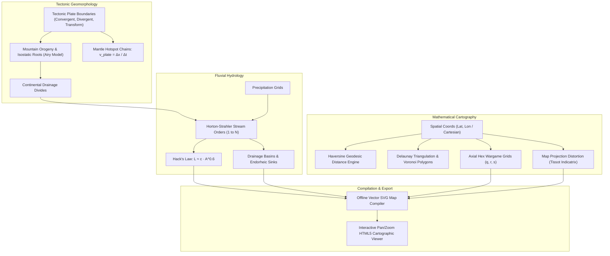

# Master Craft Reference: Plate Tectonics, Geomorphology, Hydrology & Map Projections (`docs/CARTOGRAPHY.md`)
> **Domain A: Astrophysics, Climate, Cartography & Celestial Mechanics** | **Master Craft Reference Manual**
> **Primary Active Toolchain:** [Wonderdraft](https://www.wonderdraft.net/) (Vector Map Studio) + [Obsidian Leaflet](file:///templates/world-bible/.obsidian/plugins/obsidian-leaflet-plugin) + [Storyteller Suite](file:///templates/world-bible/.obsidian/plugins/storyteller-suite) | **Reference CLI:** `arcanum map`

---

## 1. Executive Summary & Epistemological Architecture

This document serves as the **Master Craft Reference Manual** for physical geography, tectonic orogeny, hydrological drainage networks, and map projections in speculative fiction worldbuilding. Active in-vault map viewing, coordinate pinning, and distance measurement are powered by **Obsidian Leaflet** and **Storyteller Suite**, while publication-ready vector map creation is designed in **Wonderdraft** (see [Master External Tools Guide](file:///docs/guides/EXTERNAL_TOOLS_AND_PLUGINS.md)).

Creating geographic maps without understanding planetary physics results in four glaring geological anomalies:
1. **River Splitting Paradoxes**: Rivers drawn splitting into multiple branches as they flow downstream toward the ocean (violating Playfair's Law and gravity, except in rare depositional delta wetlands).
2. **Ignored Tectonic Orogeny**: High mountain ranges placed in the center of stable continental cratons without an active or fossil tectonic collision suture.
3. **Severe Projection Distortions**: Flat Euclidean grid measurements applied to high-latitude polar regions without spherical Haversine or geodesic corrections.
4. **Endorheic Drainage Omission**: Internal drainage basins lacking oceanic outlets depicted as freshwater paradises rather than hyper-saline terminal lakes (e.g., Dead Sea, Caspian Sea, Great Salt Lake).

The Cartography Engine ingests geographic metadata (`World/Locations/*.md`), constructs tectonic plate graphs, models mountain isostasy, computes Horton-Strahler river stream orders, applies Hack's Law for drainage basins, and generates distortion-corrected SVG maps and offline HTML5 interactive viewers.



---

## 2. Plate Tectonics & Geotectonic Architecture

Planetary crust is divided into rigid lithospheric plates floating on the ductile asthenosphere. The life cycle of ocean basins and continents is governed by the **Wilson Cycle** ($\sim 300\text{–}500\text{ Myr}$ supercontinent cycle).

```
                      [ PLATE BOUNDARY DYNAMICS ]
  1. CONVERGENT (Collision / Subduction)
     Oceanic ──► Continental : Deep Trench + Coastal Volcanic Cordillera (Andes)
     Oceanic ──► Oceanic     : Deep Trench + Volcanic Island Arc (Mariana, Japan)
     Cont.   ──► Continental : Crustal Thickening + Non-Volcanic Orogeny (Himalayas)

  2. DIVERGENT (Rifting / Spreading)
     Oceanic ◄──► Oceanic     : Mid-Ocean Spreading Ridge + Basalt Pillow Lavas
     Cont.   ◄──► Continental : Rift Valley + Linear Lake System (East African Rift)

  3. TRANSFORM (Lateral Shear)
     Plate A ▲ | ▼ Plate B   : Strike-Slip Fault + Pull-Apart Basins (San Andreas)
```

### 2.1 Continental Cratons & Mantle Hotspots
- **Cratons & Shields**: Ancient, geologically inert cores of continents (e.g., Canadian Shield, Baltic Shield). Mountain ranges found here are deeply eroded, rounded fossil roots (e.g., Appalachians, Urals).
- **Mantle Hotspots**: Stationary upwellings of deep thermal plumes generating age-progressive linear volcanic chains as the tectonic plate drifts overhead:
  $$\mathbf{v}_{\text{plate}} = \frac{\Delta \mathbf{x}_{\text{island}}}{\Delta t_{\text{age}}}$$
  *(e.g., Hawaiian-Emperor Seamount Chain, Yellowstone track).*

### 2.2 Mountain Orogeny & Airy-Heiskanen Isostasy
According to Airy isostasy, mountain elevations $h$ are buoyant crustal blocks floating in the higher-density mantle ($\rho_m \approx 3300\text{ kg/m}^3$) with crustal density ($\rho_c \approx 2700\text{ kg/m}^3$).

```
                ▲ Topographic Peak (Elevation h)
       ─────────┼──────────────────────── Sea Level (z = 0)
       Crust    │ Normal Crust Thickness (t_0 ≈ 35 km)
       ─────────┼──────────────────────── Moho Discontinuity
       Mantle   ▼ Deep Isostatic Crustal Root (Depth r)
```

The depth $r$ of the deep crustal root supporting surface elevation $h$:

$$r = h \left( \frac{\rho_c}{\rho_m - \rho_c} \right) \approx h \left( \frac{2700}{3300 - 2700} \right) = h \left( \frac{2700}{600} \right) = 4.5 \, h$$

*Physical Law*: For every $1\text{ km}$ of mountain elevation rising above the surface, an isostatic root extends $4.5\text{ km}$ deep into the mantle below the crustal baseline.

---

## 3. Fluvial Geomorphology & River Drainage Physics

Rivers are deterministic physical systems driven by gravity, kinetic energy, and fluid discharge. 

```
                                [ STREAM NETWORK PATTERNS ]
         Dendritic                       Trellis                        Radial
       (Uniform Rock)             (Folded Ridge Belts)           (Volcanic Peaks)
            \ | /                        | | |                          \ | /
             \|/                        -+-+-+-                         --O--
              |                          | | |                          / | \
```

### 3.1 Playfair’s Law & The Non-Splitting Rule
- **Playfair's Law (1802)**: Tributaries join rivers at grade (elevation matches smoothly); drainage networks are converging trees, not diverging nets.
- **Rule of Cartographic Realism**: In natural topography, rivers **never split** as they flow downstream, except in:
  1. Temporary braided gravel channels in high-slope glacial outwash plains.
  2. Depositional river deltas directly entering a base level body of water (ocean or terminal lake) where sediment drops out.

### 3.2 Horton-Strahler Stream Order Classification
A mathematical topological numbering system for river networks:
1. **Order 1 (Headwaters)**: Fingertip streams with no upstream tributaries.
2. **Order $k+1$ Stream**: Formed only when two streams of identical order $k$ join:
   $$\text{Order}(u \cup v) = \begin{cases}
   k + 1 & \text{if } \text{Order}(u) = \text{Order}(v) = k \\
   \max(\text{Order}(u), \text{Order}(v)) & \text{if } \text{Order}(u) \ne \text{Order}(v)
   \end{cases}$$

```
  Order 1 ──┐
            ├──► Order 2 ──┐
  Order 1 ──┘              │
                           ├──► Order 3 (Major River) ──► Ocean / Sink
  Order 1 ──┐              │
            ├──► Order 2 ──┘
  Order 1 ──┘
```

### 3.3 Hack's Law of Drainage Basins
The empirical power-law relationship between river channel length $L$ and total upstream catchment drainage basin area $A$:

$$L = c \, A^h$$

Where:
- $L$ is main river channel length ($\text{km}$).
- $A$ is drainage basin area ($\text{km}^2$).
- $c \approx 1.4\text{--}1.6$ is a regional morphology constant.
- $h \approx 0.56\text{--}0.60$ (consistently $< 0.60$ globally, proving that drainage basins elongate as they grow larger).

### 3.4 Endorheic Basins & Terminal Sinks
When tectonic rifting or enclosing mountain cordilleras prevent rivers from reaching the ocean, the river terminates in an **endorheic basin**.
- **Hydrological Equilibrium**: Inflow equals evaporation:
  $$\sum Q_{\text{inflow}} = E_{\text{evap}} \times A_{\text{lake}}$$
- **Salinity Evolution**: Minerals dissolve from rocks and concentrate perpetually, turning endorheic lakes into hyper-saline dead seas or salt flats (playas).

---

## 4. Map Projections & Distortions

Projecting an oblate spheroid or sphere onto a flat 2D plane creates mathematical distortions in area, shape, distance, or direction (Gauss's *Theorema Egregium*).

```
                      [ MAP PROJECTION TAXONOMY ]
  Projection Family       Preserves Property          Primary Distortion
  ─────────────────       ──────────────────          ──────────────────
  Conformal (Mercator)    Local Angles & Shapes       Extreme Polar Area Inflation (sec φ)
  Equal-Area (Equal Earth)True Relative Land Areas    High-Latitude Angular Shearing
  Equidistant             Distances from Center Point Distorts Outer Boundary Shapes
  Compromise (Robinson)   Aesthetic Visual Balance    Minor Balanced Distortions
```

### 4.1 Tissot's Indicatrix of Distortion
Tissot's indicatrix visualizes local distortion by projecting infinitesimal circles of unit radius from the sphere onto the map. The projected ellipse has semi-major axis $a$ and semi-minor axis $b$:
- **Conformal**: $a = b$ (circles remain circles; local angles preserved).
- **Equal-Area**: $a \cdot b = 1$ (ellipse area remains equal to original circle area).
- **Areal Scale Factor**: $s = a \cdot b$.
- **Maximum Angular Deformation**: $2\theta = 2 \arcsin\left(\frac{a - b}{a + b}\right)$.

### 4.2 Mercator Scale Inflation
In a standard Mercator projection, linear scale factor $k$ inflates with latitude $\phi$:

$$k = \sec\phi = \frac{1}{\cos\phi}$$

At $\phi = 60^\circ$, landmasses are rendered with $4\times$ their true geographic area; at $\phi = 80^\circ$, area is inflated by $33.2\times$.

---

## 5. Hexagonal Wargaming Grids & Geodesic Geometry

### 5.1 Axial and Cube Hexagonal Coordinates
For discrete overland travel, tactical wargaming, and procedural map simulation, hexagonal tiles eliminate the diagonal movement distortions of square grids.

```
       +s / -r
          \  +q / -s
           ___
     -r   /   \   +q
     ─── | q,r | ───
     +r   \___/   -q
          /   \
       -q / +s \  -s / +r
```

Cube coordinates $(q, r, s)$ satisfy the constraint:

$$q + r + s = 0$$

The exact **Hexagonal Distance** between tile $A(q_A, r_A, s_A)$ and tile $B(q_B, r_B, s_B)$:

$$D_{\text{hex}}(A, B) = \frac{|q_A - q_B| + |r_A - r_B| + |s_A - s_B|}{2} = \max(|q_A - q_B|, |r_A - r_B|, |s_A - s_B|)$$

### 5.2 Haversine Geodesic Distance Formula
For spherical planetary distance between two coordinates $(\phi_1, \lambda_1)$ and $(\phi_2, \lambda_2)$ on a world of radius $R_p$:

$$a = \sin^2\left(\frac{\Delta\phi}{2}\right) + \cos\phi_1 \cos\phi_2 \sin^2\left(\frac{\Delta\lambda}{2}\right)$$
$$c = 2 \operatorname{atan2}\left(\sqrt{a}, \sqrt{1 - a}\right)$$
$$d_{\text{geodesic}} = R_p \cdot c$$

---

## 6. Worked Step-by-Step Geomorphological Calculation

### Scenario:
A worldbuilder places a major continental river basin. The main river length is mapped at $L = 1800\text{ km}$. The headwaters begin at an elevation of $2400\text{ m}$ in a young collision cordillera.

#### Step 1: Calculate Drainage Basin Area via Hack's Law
Using $c = 1.5$ and $h = 0.58$:

$$L = 1.5 \, A^{0.58} \implies A^{0.58} = \frac{1800}{1.5} = 1200$$

$$A = 1200^{1 / 0.58} = 1200^{1.7241} \approx 208,450 \text{ km}^2$$

*Result*: The river drains a massive basin of approximately $208,500\text{ km}^2$ (roughly equivalent to the Rhine basin or Columbia River basin).

#### Step 2: Calculate Isostatic Root Beneath Headwater Mountains
Headwater elevation $h = 2.4\text{ km}$.
$$r = 4.5 \times 2.4\text{ km} = 10.8\text{ km}$$
Total crustal thickness beneath the mountain pass:
$$t_{\text{total}} = t_0 + h + r = 35\text{ km} + 2.4\text{ km} + 10.8\text{ km} = 48.2\text{ km}$$

#### Step 3: Verify Settlement Density via Delaunay Triangulation
For 8 major cities mapped in this basin, the engine constructs a Delaunay triangulation to confirm that trade roads do not cross impassable $2400\text{ m}$ mountain crests without explicit pass waypoints.

---

## 7. Practical YAML Schemas

```yaml
schema_version: "2.0"
map_metadata:
  world_id: "aethelgard"
  planetary_radius_km: 6371.0
  projection: "equal_earth"

tectonic_plates:
  - id: "plate_borealis"
    crust_type: "continental"
    drift_vector: [1.2, -0.4] # cm/year
    boundary_type_with_australis: "convergent_collision"

river_systems:
  - id: "river_valdur"
    name: "The Great Valdur River"
    headwater_coord: [45.2, 12.8] # Lat, Lon
    mouth_coord: [38.1, 24.5]
    total_length_km: 1800.0
    catchment_area_km2: 208450.0
    max_stream_order: 5
    is_endorheic: false
    tributaries:
      - "valdur_upper_east"
      - "valdur_upper_west"
      - "silver_creek"

geodesic_waypoints:
  - id: "city_solis"
    name: "Solis Imperialis"
    coordinates: [42.15, 18.30]
    hex_axial: [14, -8]
  - id: "port_marina"
    name: "Port Marina"
    coordinates: [38.10, 24.50]
    hex_axial: [22, -15]
```

---

## 8. CLI Reference & Scriptorium Integration

```bash
# Calculate geodesic distance and hex steps between two cities
arcanum map --distance city_solis port_marina

# Audit river network for illegal branching or elevation violations
arcanum cartography --audit-rivers World/Geography/rivers.yaml

# Generate standalone SVG map and interactive HTML5 pan/zoom viewer
arcanum map --render World/Geography/map.yaml --svg out/map.svg --html reports/world_map.html
```

### 8.1 In-Vault Interactive Maps: Obsidian Storyteller Suite
For interactive pin mapping directly inside Obsidian, the pre-bundled [`storyteller-suite`](file:///docs/guides/EXTERNAL_TOOLS_AND_PLUGINS.md#13-storyteller-suite) plugin allows you to load custom high-resolution image maps, place interactive POI markers with custom icons, and link locations directly to your World Bible location notes. See the [Storyteller Suite Documentation](file:///docs/guides/EXTERNAL_TOOLS_AND_PLUGINS.md#13-storyteller-suite).

---

## 9. Recommended Reading, References & Media

### Foundational Craft & Academic Textbooks
- **Field, Kenneth (2018)**. *Cartography.* Esri Press. ISBN: 978-1589484399.  
  *The definitive modern visual and technical bible of map design, color palettes, typographic hierarchy, and visual symbology.*
- **Snyder, John P. (1987)**. *Map Projections—A Working Manual*. USGS Professional Paper 1395, US Government Printing Office.  
  *The authoritative mathematical treatise detailing forward and inverse equations for every standard map projection.*
- **Monmonier, Mark (2018)**. *How to Lie with Maps* (3rd ed.). University of Chicago Press.  
  *Critical exploration of cartographic distortion, political bias, scale generalization, and symbolic framing.*
- **Strahler, Arthur N. (1952)**. "Hypsometric (area-altitude) analysis of erosional topography." *Geological Society of America Bulletin*, 63(11), 1117–1142.  
  *Foundational formulation of fluvial stream ordering and erosional drainage morphology.*

### Landmark Scientific Papers
- **Hack, John T. (1957)**. "Studies of longitudinal stream profiles in Virginia and Maryland." *USGS Professional Paper* 294-B.  
  *The seminal paper establishing Hack's Law relating river channel length to drainage area.*
- **Wilson, J. Tuzo (1966)**. "Did the Atlantic close and then re-open?" *Nature*, 211(5050), 676–681.  
  *Formulated the Wilson Cycle governing supercontinent assembly, rifting, and ocean basin evolution.*

### Seminal Video Lectures, Masterclasses & Channels
- **Artifexian** (YouTube Series: *Plate Tectonics*, *River Networks & Hack's Law*, *Map Projections Masterclass*).  
  *Gold-standard procedural tutorials on creating realistic tectonic plates, continental margins, and river drainage systems.*
- **Questing Beast** (*Dungeon & Wilderness Hex-Mapping Guides*).  
  *Deep masterclasses on hexagonal wargame map topology, point-to-point pathfinding, and overland readability.*
- **WASD20** (YouTube Series: *Fantasy Cartography, Shading Mountains & River Systems*).  
  *Practical artistic techniques for drawing believable physical landforms, coastlines, and mountain shading.*

### Landmark Speculative Case Studies
- **Tolkien, J.R.R. & Tolkien, Christopher**. *The Lord of the Rings* & *The Atlas of Middle-earth* (Karen Wynn Fonstad's peerless geomorphological analysis of Mordor's tectonic volcanic basin and the Anduin river basin).
- **Martin, George R.R.** *A Song of Ice and Fire* (*The Lands of Ice and Fire* maps, analyzing Westeros's north-south climatic stretching and mountain divides).
- **Le Guin, Ursula K.** *Earthsea Cycle* (Archipelagic geography, nautical navigation currents, and localized island microclimates).
- **Sanderson, Brandon**. *The Stormlight Archive* (Roshar, a map structurally molded by unidirectional Highstorms, generating asymmetric continental washouts and crem-stone sedimentology).
