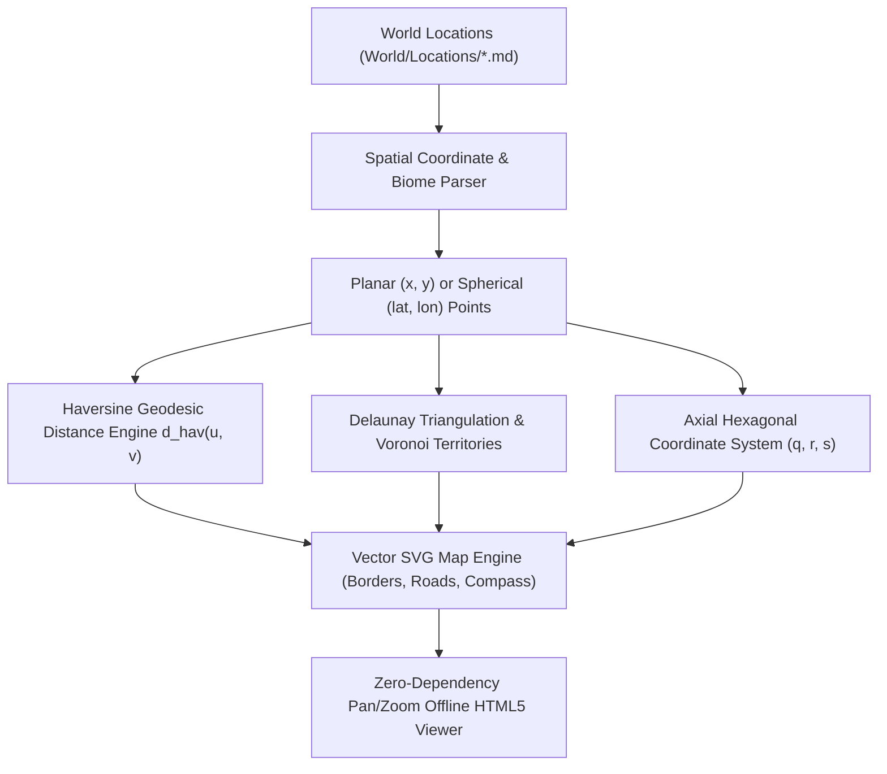
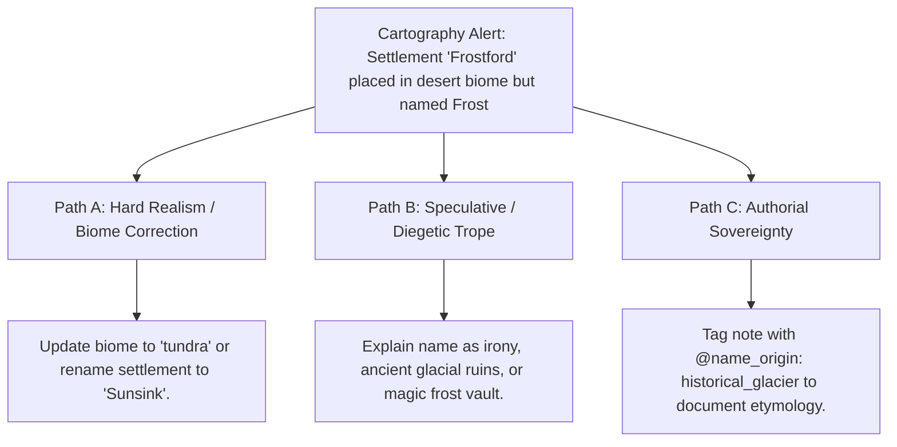

# Offline Vector Cartography, Spherical Geodesics & Spatial Territory (`docs/CARTOGRAPHY.md`)
> **Domain A: Astrophysics, Climate, Cartography & Celestial Mechanics** | **CLI:** `arcanum map` / `arcanum cartography`

---

## 1. Overview & Theoretical Rationale

The **Ars Arcanum Cartography Engine** (`scripts/lib/cartography.py`) is an offline vector map compiler, spherical geodesic distance engine, Voronoi territorial partitioner, and interactive HTML5 canvas viewer engineered for fantasy worldbuilders and speculative novelists.

Spatial inconsistencies frequently compromise worldbuilding realism:
1. **Impossible Distance Distortions**: Projecting flat 2D maps onto planetary spheres without accounting for spherical curvature or map distortion metrics.
2. **Nonsensical Political Boundaries**: Drawing borders that ignore natural geographical barriers (rivers, mountain ranges, coastlines).
3. **Disconnected Settlement Networks**: Placing major trade ports and inland capitals with zero navigable river or road connectivity.

The Cartography Engine extracts location metadata from `World/Locations/*.md`, computes Euclidean and Haversine distances, constructs Delaunay triangulation proximity graphs, generates hexagonal wargaming grids, and compiles publication-quality SVG maps and interactive pan/zoom HTML viewers.

---

## 2. Geodesics, Spatial Geometry & Mathematical Formulation



### 2.1 Haversine Spherical Geodesic Formula
For planetary coordinates $(\phi_1, \lambda_1)$ and $(\phi_2, \lambda_2)$ on a world of radius $R$:

$$a = \sin^2\left(\frac{\Delta \phi}{2}\right) + \cos(\phi_1) \cos(\phi_2) \sin^2\left(\frac{\Delta \lambda}{2}\right)$$
$$c = 2 \operatorname{atan2}\left(\sqrt{a}, \sqrt{1-a}\right)$$
$$d_{\text{geodesic}} = R \cdot c$$

### 2.2 Hexagonal Coordinate Arithmetic (Axial $q, r$)
For hexagonal wargame map grids, the engine utilizes cube/axial coordinates satisfying $q + r + s = 0$:

$$\text{Hex Distance } D(A, B) = \frac{|q_A - q_B| + |r_A - r_B| + |s_A - s_B|}{2}$$
$$\text{Pixel Cartesian Center}: \quad x = \text{size} \cdot \left(\sqrt{3} q + \frac{\sqrt{3}}{2} r\right), \quad y = \text{size} \cdot \left(\frac{3}{2} r\right)$$

### 2.3 Delaunay Triangulation & Natural Trade Road Graph
For settlement set $P = \{p_1, p_2, \dots, p_n\}$, the engine computes proximity edges $E_{\text{trade}}$ where Euclidean distance $d(u, v) \le D_{\text{max-march}}$:

$$E_{\text{trade}} = \left\{ (u, v) \in P \times P \mid 0 < \|u - v\|_2 \le 450\text{px} \land \nexists w \text{ blocking transit} \right\}$$

---

## 3. Subfeatures Matrix

| Subfeature | Algorithmic Mechanism | Diagnostic Output / Rule | Narrative Significance |
|---|---|---|---|
| **Location Lore Parser** | Extracts coordinates, biomes, and factions from frontmatter. | Constructs unified universe spatial database. | Synchronizes map rendering with narrative world notes. |
| **Vector SVG Cartography** | Emits scalable vector graphics with compass rose, borders, and scale bar. | Produces print-ready high-resolution `.svg` maps. | Delivers publication-quality novel endpaper maps. |
| **Interactive HTML5 Viewer** | Zero-dependency canvas with mouse drag panning and smooth zoom. | Standalone offline interactive map dashboard. | Enables friction-free exploration of vast world geographies. |
| **Hex Grid Coordinate Engine** | Computes axial hex overlays with coordinate numbering. | Generates wargaming and campaign hex crawl grids. | Supports tabletop RPG and military campaign spatial tracking. |
| **Automated Route Generator** | Computes Delaunay trade routes and annotates march days. | Draws dashed transit roads with march duration labels. | Gives immediate travel time estimates between all landmarks. |

---

## 4. Author Extension & Configuration Guide

### 4.1 Location Dossier (`World/Locations/Sun_Citadel.md`)
```markdown
---
name: "Sun Citadel"
type: "capital"
faction: "Solar Hegemony"
biome: "plains"
x: 600
y: 400
elevation_m: 350
population: 120000
---

# Sun Citadel
The golden capital of the Solar Hegemony, situated at the nexus of the Imperial Road.
```

---

## 5. Command-Line Interface (CLI) Reference

```bash
# Generate vector SVG map with hexagonal grid overlay
arcanum map World/ --svg dist/world_map.svg --grid hex

# Compile interactive offline HTML5 map viewer with search and zoom
arcanum map World/ --html dist/world_map.html

# Generate square grid map without automatic route lines
arcanum map World/ --grid square --no-routes --html dist/custom_map.html

# Output raw JSON spatial coordinate graph
arcanum map World/ --json

# Query cartographic math and Haversine distance formulas
arcanum doc cartography --math --why
```

---

## 6. Tri-Fold Creative Advisory Resolutions



### Scenario: Biome-Toponym Inconsistency Warning
- **Path A (Hard Realism / Geographic Accuracy)**:
  - Correct the biome to `tundra` or `sub-arctic`, or rename the settlement to reflect its desert environment.
- **Path B (Speculative / Diegetic Trope)**:
  - Justify the name as historical irony or supernatural geology: the desert was an ancient frozen sea before a cataclysm, or an enchanted underground cryogenic spring keeps the fortress walls chilled.
- **Path C (Authorial Sovereignty)**:
  - Add `etymology: "Named after Lord Frost, founder of the settlement"` in frontmatter.

---

## 7. Content Security Policy & Offline Isolation

Generated HTML map viewers and SVG graphics are 100% offline and compliant with the Ars Arcanum manifesto:

```html
<meta http-equiv="Content-Security-Policy" content="default-src 'none'; style-src 'unsafe-inline'; script-src 'unsafe-inline'; img-src data:; media-src data: blob:;">
```
