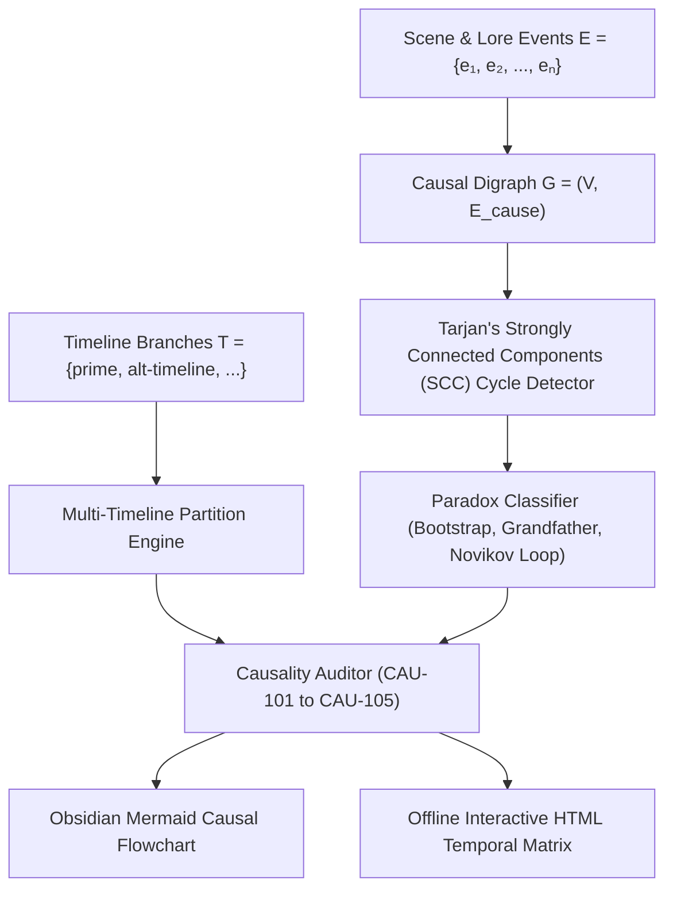
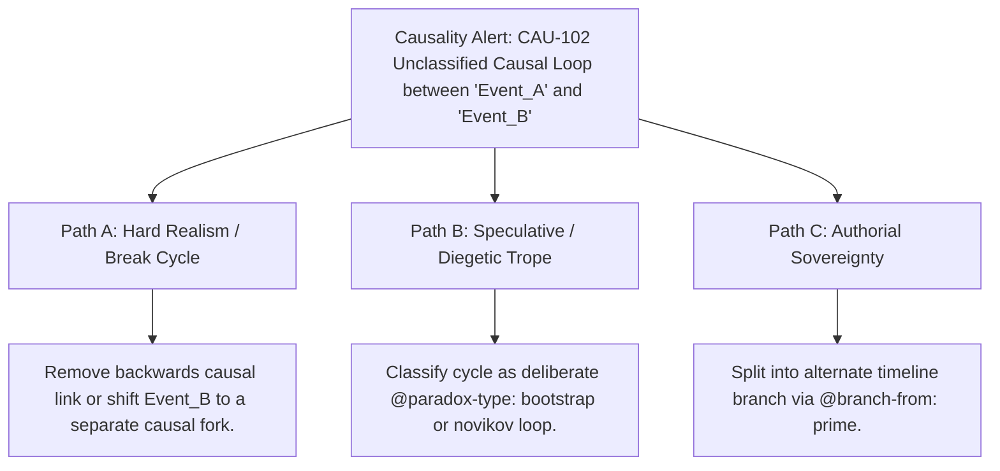

# Causal DAGs, Temporal Mechanics & Paradox Validation (`docs/CAUSALITY.md`)
> **Domain C: Magic Systems, Metaphysics, Metasystems & Causality** | **CLI:** `arcanum causality` / `arcanum timeline-dag`

---

## 1. Overview & Theoretical Rationale

The **Ars Arcanum Causality Engine** (`scripts/lib/causality.py`) is an offline causal Directed Acyclic Graph (DAG) analyzer, multi-timeline branching tracker, and temporal paradox validator engineered for speculative fiction authors, time-travel novelists, and complex non-linear narrative architects.

Writing time-travel, multiverse, or intricate multi-faction causal plots introduces formidable logical hazards:
1. **Unintentional Causal Loops & Circular Dependencies (`CAU-102`)**: Event $A$ causes Event $B$, which causes Event $C$, which circularly causes Event $A$ without an intentional `@paradox-type` classification.
2. **Dangling Causal References (`CAU-101`)**: Scenes declaring causes or causal prerequisites that point to non-existent historical events.
3. **Orphan Timeline Branches (`CAU-103`)**: Alternate history timelines defined without a root branching origin from the prime timeline.
4. **Novikov Self-Consistency Violations**: Time-travel narratives that claim fixed deterministic timelines yet introduce mutable grandfather paradoxes.

The Causality Engine extracts `@event`, `@causes`, `@causal-origin`, and `@timeline` directives across `Manuscript/` and `World/History/`, builds in-memory causal digraphs, runs Tarjan's cycle detection, validates Novikov self-consistency constraints, and generates Mermaid.js flowcharts and offline HTML reports.

---

## 2. Temporal Graph Theory & Mathematical Formulation



### 2.1 Causal Digraph & Topological Sortability
A universe's causality across timeline $T$ is modeled as a directed graph $G = (V, E)$:
- $V = \{e_1, e_2, \dots, e_n\}$: Set of historical and narrative events with in-world timestamp $t(e) \in \mathbb{R}$.
- $E \subseteq V \times V$: Directed causal edges $(u, v)$ where event $u$ is a necessary or sufficient causal precursor to event $v$.

#### Classical Acyclicity Invariant (Linear / Branching Multiverse):
$$\forall (u, v) \in E, \quad t(u) < t(v) \implies G \text{ is a Directed Acyclic Graph (DAG)}$$
A topological sort $\text{TopoSort}(G) = (e_{\pi(1)}, e_{\pi(2)}, \dots, e_{\pi(n)})$ exists if and only if $G$ contains zero cycles.

### 2.2 Closed Timelike Curves (CTCs) & Novikov Self-Consistency
When time travel occurs, an edge $(u, v)$ may exist such that $t(u) > t(v)$, creating a potential directed cycle $C = (e_1, e_2, \dots, e_k, e_1)$.

#### The Novikov Self-Consistency Principle
In a deterministic single-timeline universe with Closed Timelike Curves:
$$P(\text{Global History Execution}) = \prod_{e \in C} P(e \mid \text{Predecessors}(e)) = 1.0$$
The probability of events that alter the past in a globally contradictory way is mathematically identically zero ($P = 0$).

#### Paradox Classification Taxonomy:
1. **Bootstrap Paradox (Ontological Loop)**:
   $$\text{Information / Object exists without origin}: \quad e_1 \to e_2 \to \dots \to e_k \to e_1$$
   *Tagged in prose with*: `@paradox-type: bootstrap`
2. **Grandfather Paradox (Causal Inconsistency / Invalidation)**:
   $$\text{Event } u \text{ causes } v \text{ which prevents } u \implies \text{Contradiction / Branch Splitting}$$
   *Requires alternate timeline branch*: `@timeline: alt-branch` + `@branch-from: prime`
3. **Predestination Loop (Novikov Loop)**:
   The traveler's attempt to prevent an event becomes the very cause of that event.

---

## 3. Subfeatures Matrix & Diagnostic Codes

| Code / Feature | Algorithmic Mechanism | Severity | Diagnostic Rule / Remediation | Narrative Craft Significance |
|:---|---|:---:|---|---|
| **`CAU-101`** | Graph referential integrity scanner. | `ERROR` | **Dangling Causal Link**: `@causes` points to an unregistered event ID. | Catches broken causal references across scenes. |
| **`CAU-102`** | Tarjan's SCC cycle detection algorithm. | `ERROR` | **Unclassified Causal Loop**: Directed cycle detected without `@paradox-type` tag. | Flags accidental circular dependencies in story logic. |
| **`CAU-103`** | Root reachability on timeline forest. | `WARNING` | **Orphan Timeline**: Timeline has no `@branch-from` origin or events. | Identifies disconnected multiverse branches. |
| **`CAU-104`** | Chronological ordering audit. | `WARNING` | **Temporal Inversion**: Cause timestamp is later than effect timestamp without time-travel tag. | Catches accidental date typos in historical lore. |
| **`CAU-105`** | Semantic validation of `@paradox-type`. | `INFO` | **Intentional Paradox**: Validates bootstrap/Novikov loops. | Authorizes deliberate ontological loops in narrative. |

---

## 4. Author Extension & Configuration Guide

### 4.1 In-Prose Directive Syntax (Markdown Body)
```markdown
# Scene 14: The Temporal Gate
@event: The Temporal Gate Activation
@timeline: prime
@time: 1422 3E
@causal-origin: discovery-of-the-chronos-core
@causes: fall-of-the-high-spire, arrival-in-ancient-valen
@paradox-type: bootstrap

Sean activated the gate, throwing the core into the past to save his younger self.
```

### 4.2 Frontmatter Metadata Format
```yaml
---
name: "The Conclave Convenes"
timeline: "alt-mage-war"
time: "1419 3E"
causal_origin: "founding-of-the-tower"
causes:
  - "the-great-sundering"
  - "collapse-of-dawnhold"
paradox_type: "novikov-violation"
branch_from: "prime"
---
```

---

## 5. Command-Line Interface (CLI) Reference

```bash
# Audit causal graph across full manuscript and world history
arcanum causality Manuscript/ -w World/History/

# Generate Obsidian Mermaid flowchart diagram
arcanum causality Manuscript/ -w World/History/ --mermaid dist/causal_dag.md

# Export standalone offline interactive HTML temporal matrix
arcanum causality Manuscript/ -w World/History/ --html reports/causality_report.html

# Output machine-readable JSON causal graph
arcanum causality Manuscript/ -w World/History/ --json

# Query causal graph theory and Novikov mathematics
arcanum doc causality --math --why
```

---

## 6. Tri-Fold Creative Advisory Resolutions



### Scenario: Unclassified Causal Cycle Alert (`CAU-102`)
- **Path A (Hard Realism / Strict DAG Acyclicity)**:
  - Remove the cyclic `@causes:` link, ensuring all effects strictly succeed their causes in linear time.
- **Path B (Speculative / Diegetic Trope)**:
  - If the loop is intentional time travel (e.g. an elder character giving their younger self a book that inspired them to build the time machine), add `@paradox-type: bootstrap` to explicitly authorize the ontological loop.
- **Path C (Authorial Sovereignty / Multiverse Branching)**:
  - Reframe the intervention as creating a new divergent timeline branch: set `@timeline: timeline-beta` and `@branch-from: prime`.

---

## 7. Content Security Policy & Offline Isolation

All causal DAG visualizers and HTML temporal reports operate 100% offline with zero CDN dependencies:

```html
<meta http-equiv="Content-Security-Policy" content="default-src 'none'; style-src 'unsafe-inline'; script-src 'unsafe-inline'; img-src data:; media-src data: blob:;">
```
