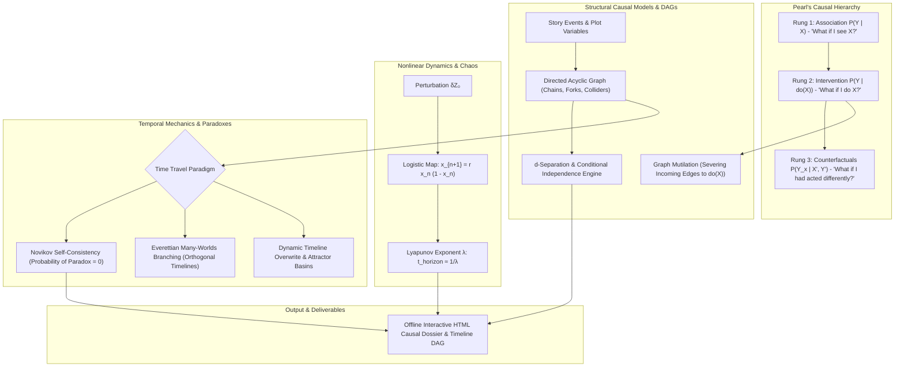

# Causal Inference, Temporal Branching & Paradox Resolution (`docs/CAUSALITY.md`)
> **Domain B: Societies, Lineages, Geopolitics & Tactical War** | **CLI:** `arcanum causality` / `arcanum timeline`

---

## 1. Executive Summary & Epistemological Architecture

The **Ars Arcanum Causality & Temporal Logic Engine** (`scripts/lib/causality.py`) is an offline structural causal graph auditor, Judea Pearl *do*-calculus simulator, temporal paradox detector, and nonlinear butterfly effect analyzer designed for sci-fi authors, complex plot architects, and branching narrative game designers.

Complex narratives and speculative time-travel systems collapse when causal mechanisms are loosely defined:
1. **The Confounder Confusion Fallacy (`CAU-101`)**: Confusing pure observational correlation ($P(Y \mid X)$) with genuine causal intervention ($P(Y \mid do(X))$), resulting in plotlines where manipulating an effect is mistakenly assumed to alter the cause.
2. **Collider Conditioning Traps (`CAU-102`)**: Conditioning on a common descendant (collider) of two independent plot events, inadvertently inducing false spurious correlations between unrelated characters or factions.
3. **Temporal Paradox Incoherence (`CAU-103`)**: Blending mutually contradictory time-travel paradigms (e.g., using Novikov self-consistency in Act I, but switching to Everettian branching in Act III without in-world physical justification).
4. **Chaos Horizon Amnesia**: Depicting massive, centuries-spanning time-travel interventions that alter major wars but leave individual character lineages and micro-histories 100% identical, ignoring the positive Lyapunov exponent of chaotic atmospheric and biological systems.

The Causality Engine constructs Directed Acyclic Graphs (DAGs), enforces the three rungs of Pearl's Causal Hierarchy, models deterministic chaos via the Logistic Map, and audits temporal loop self-consistency.



---

## 2. Structural Causal Models (SCMs) & Directed Acyclic Graphs

In Judea Pearl’s Structural Causal framework, reality is formalized as an SCM consisting of endogenous variables $V$, exogenous background variables $U$, and deterministic structural equations $F$:

$$v_i = f_i(\text{Parents}(v_i), u_i)$$

```
                                [ THE THREE CAUSAL TRIADS ]
        1. THE CHAIN                      2. THE FORK                      3. THE COLLIDER
       (Mediation)                      (Confounding)                    (Selection Bias)
        X ──► Z ──► Y                    X ◄─── Z ───► Y                  X ──► Z ◄── Y
  Z transmits causality.           Z confounds X and Y.            Z is a collider.
  Conditioning on Z BLOCKS path.   Conditioning on Z BLOCKS path.  Conditioning on Z OPENS path!
```

### 2.1 The Three Core Graph Topologies
1. **The Chain ($X \to Z \to Y$)**: $Z$ is a causal mediator. $X$ and $Y$ are dependent; conditioning on $Z$ d-separates $X$ and $Y$ ($(X \perp Y \mid Z)$).
2. **The Fork ($X \leftarrow Z \to Y$)**: $Z$ is a common cause (confounder). Spurious correlation exists between $X$ and $Y$; controlling for $Z$ blocks the backdoor path ($(X \perp Y \mid Z)$).
3. **The Collider ($X \to Z \leftarrow Y$)**: $Z$ is a common effect. $X$ and $Y$ are marginally **independent** ($(X \perp Y)$). However, conditioning on collider $Z$ (or its descendants) **actively induces dependency** between $X$ and $Y$, creating selection bias.

---

## 3. Judea Pearl’s Causal Hierarchy & *Do*-Calculus

```
  Level          Mathematical Operator    Epistemological Question           Example
  ─────          ─────────────────────    ────────────────────────           ───────
  1. ASSOCIATION P(Y | X)                 "What does observing X tell us?"   "If the barometer falls, will it rain?"
  2. INTERVENTION P(Y | do(X))            "What will happen if we take X?"   "If we smash the barometer, will it rain?"
  3. COUNTERFACTUAL P(Y_x | X', Y')       "Had we done X, what would be?"    "Had we killed the tyrant, would war occur?"
```

### 3.1 Graph Surgery (The $do(X)$ Operator)
When an agent actively intervenes in a causal system to set variable $X = x$ (represented as $do(X = x)$), the intervention **severs all incoming causal arrows directed into $X$ from its parents**, transforming the graph into the mutilated submodel $G_{\bar{X}}$.

```
        ORIGINAL GRAPH G                          MUTILATED GRAPH G_X (Under do(X))
             (Confounder Z)                                 (Confounder Z)
               /        \                                              \
              ▼          ▼                                              ▼
          (Action X) ──► (Outcome Y)                  [Action X = x] ──► (Outcome Y)
```

In the mutilated graph $G_{\bar{X}}$, the backdoor path $X \leftarrow Z \to Y$ is completely destroyed, isolating the true direct causal impact:

$$P(Y = y \mid do(X = x)) = \sum_{z} P(Y = y \mid X = x, Z = z) P(Z = z)$$

---

## 4. Chaos Theory & The Butterfly Effect

The Butterfly Effect is the popular term for sensitive dependence on initial conditions in deterministic nonlinear dynamical systems.

```
      x_{n+1}
         ▲
       1 ┼                       ╭─────────── Parabolic Curve: rx(1 - x)
         │                     ╭─╯ ╲
         │                   ╭─╯     ╲
         │                 ╭─╯         ╲
         │               ╭─╯             ╲
         │             ╭─╯                 ╲
       0 ┼─────────────┴─────────────────────┴────► x_n
         0                                   1
```

### 4.1 The Logistic Map & Period-Doubling Bifurcations
The fundamental model of deterministic population chaos:

$$x_{n+1} = r \, x_n (1 - x_n) \quad \text{where } x_n \in [0, 1]$$

- **$r < 3.0$**: Stable fixed-point attractor.
- **$3.0 \le r < 3.449$**: Period-2 oscillation.
- **$3.449 \le r < 3.544$**: Period-4 oscillation.
- **$r = 3.56995\dots$**: Onset of infinite period-doubling chaos (governed by the universal Feigenbaum constant $\delta \approx 4.6692016$).
- **$r = 4.0$**: Fully developed deterministic chaos; values fill the entire interval $[0, 1]$ pseudo-randomly.

### 4.2 The Lyapunov Exponent ($\lambda$)
For two trajectories starting with infinitesimal separation $\delta Z_0$, their separation at time $t$ grows exponentially:

$$|\delta Z(t)| \approx |\delta Z_0| e^{\lambda t}$$

$$\lambda = \lim_{t \to \infty} \frac{1}{t} \ln \frac{|\delta Z(t)|}{|\delta Z_0|}$$

- If $\lambda > 0$, the system is **chaotic**.
- **Lyapunov Horizon ($t_{\text{horizon}}$)**: The time limit beyond which long-term prediction or microscopic historical stability becomes physically impossible:
  $$t_{\text{horizon}} \approx \frac{1}{\lambda} \ln \left( \frac{\Delta_{\text{macroscopic}}}{|\delta Z_0|} \right)$$
  *(For planetary weather on Earth, $\lambda \approx 0.1\text{ day}^{-1} \implies t_{\text{horizon}} \approx 14\text{ days}$. Time travelers stepping on a butterfly cannot prevent global storm shifts after 2 weeks).*

---

## 5. Temporal Mechanics & Paradox Resolution Paradigms

```
                      [ TEMPORAL PARADOX RESOLUTION TAXONOMY ]
  1. NOVIKOV SELF-CONSISTENCY ──► Closed Timelike Curves (CTCs); Probability of paradox = 0
  2. EVERETTIAN MANY-WORLDS   ──► Time travel branches into orthogonal parallel quantum timelines
  3. DYNAMIC ELASTIC OVERWRITE──► Timeline overwrites forward; attractor basins resist small shifts
```

### 5.1 Closed Timelike Curves (CTCs) & Novikov Self-Consistency
In General Relativity, solutions to Einstein's field equations with extreme angular momentum or exotic geometry (e.g., Gödel metric, Kerr spinning black hole interiors, Tipler cylinders) permit **Closed Timelike Curves (CTCs)** where a worldline intersects its own causal past.

#### The Novikov Self-Consistency Principle (Igor Novikov, 1990):
> **The only events that can occur in spacetime along a closed timelike curve are those that are globally self-consistent. The probability of any local event occurring that would create a self-inconsistent causal paradox is identically zero ($P = 0$).**

- **The Bootstrap Paradox (Ontological Loop)**: An artifact or idea exists without ever being created (e.g., a time traveler brings Shakespeare's published works back to Shakespeare, who copies them word-for-word). Information loops are dynamically consistent under Novikov, even if their causal origin is ungrounded.

### 5.2 Everettian Many-Worlds Branching
Under the Everett interpretation of quantum mechanics, traveling into the past ($t_0$) does not modify timeline $U$; it instantiates a new branch universe $U'$ with identical initial state $\Psi(t_0)$ plus the traveler:

$$\mathcal{H}_{\text{global}} = \mathcal{H}_U \oplus \mathcal{H}_{U'}$$

- **Grandfather Paradox Resolution**: The traveler shoots the grandfather in universe $U'$. Grandfather dies in $U'$, so the traveler is never born in $U'$. However, the traveler originated from universe $U$ where the grandfather lived. Global conservation laws are preserved with zero logical contradiction.

---

## 6. Worked Step-by-Step Causal Inference Example

### Scenario: The King's Poisoning & The Royal Guard
King Brandon dies of nightshade poisoning ($Y = 1$).
- Variable $X$: Captain Roderick was on guard duty ($X = 1$).
- Confounder $Z$: Grand Inquisitor's loyalty faction ($Z = 1$ if traitor, $Z = 0$ if loyal).
- Observational data: When Roderick is on duty ($X = 1$), King's death rate is $P(Y = 1 \mid X = 1) = 0.80$. The court concludes Roderick is an assassin.

```
       (Grand Inquisitor Z)
          /            \
         ▼              ▼
  (Roderick Guard X) ──► (King Poisoned Y)
```

#### Step 1: Identify Confounding
The Inquisitor assigns Roderick to guard the King specifically when the Inquisitor plans a poisoning ($Z \to X$ and $Z \to Y$). Thus, $X \leftarrow Z \to Y$ is an active backdoor path.

#### Step 2: Apply Pearl's Backdoor Adjustment Formula
To evaluate the true causal impact of Roderick being on guard ($P(Y = 1 \mid do(X = 1))$):

$$P(Y = 1 \mid do(X = 1)) = P(Y = 1 \mid X=1, Z=1) P(Z=1) + P(Y = 1 \mid X=1, Z=0) P(Z=0)$$

Given historical ground truth:
- If Inquisitor attacks ($Z = 1$), poisoning occurs $90\%$ of the time regardless of guard: $P(Y = 1 \mid X=1, Z=1) = 0.90$.
- If Inquisitor does not attack ($Z = 0$), poisoning occurs $0\%$ of the time under Roderick: $P(Y = 1 \mid X=1, Z=0) = 0.00$.
- Base traitor probability: $P(Z = 1) = 0.20$.

$$P(Y = 1 \mid do(X = 1)) = (0.90 \times 0.20) + (0.00 \times 0.80) = 0.18$$

*Conclusion*: Ordering Roderick to guard the King yields only an $18\%$ risk of poisoning (matching the baseline plot frequency). Roderick is innocent; the apparent $80\%$ correlation was entirely an artifact of confounding by the Inquisitor.

---

## 7. Practical YAML Schemas

```yaml
schema_version: "2.0"
causal_model:
  id: "assassination_of_king_brandon"
  temporal_paradigm: "novikov_self_consistency"

variables:
  - id: "Z_inquisitor_traitor"
    type: "binary"
    is_confounder: true
    prior_probability: 0.20

  - id: "X_roderick_guard"
    type: "binary"
    parents: ["Z_inquisitor_traitor"]

  - id: "Y_king_poisoned"
    type: "binary"
    parents: ["X_roderick_guard", "Z_inquisitor_traitor"]

structural_equations:
  - equation: "P(Y=1 | X=1, Z=1) = 0.90"
  - equation: "P(Y=1 | X=1, Z=0) = 0.00"
  - equation: "P(Y=1 | X=0, Z=1) = 0.95"
  - equation: "P(Y=1 | X=0, Z=0) = 0.01"

temporal_loops:
  - id: "loop_ancient_scroll"
    type: "bootstrap_ontological_loop"
    carried_information: "royal_cipher_key"
    is_self_consistent: true
    paradox_status: "resolved_novikov"
```

---

## 8. CLI Reference & Scriptorium Integration

```bash
# Audit causal DAG for unblocked backdoor paths and collider bias
arcanum causality --audit World/Plot/assassination_dag.yaml

# Compute interventional effect P(Y | do(X)) using Pearl backdoor criterion
arcanum causality --intervene --action X_roderick_guard --outcome Y_king_poisoned

# Check temporal loop for grandfather contradictions or branch stability
arcanum timeline --paradox-check World/Plot/time_loops.yaml
```

---

## 9. Recommended Reading, References & Media

### Foundational Craft & Academic Textbooks
- **Pearl, Judea, & Mackenzie, Dana (2018)**. *The Book of Why: The New Science of Cause and Effect*. Basic Books.  
  *The landmark revolutionary accessible treatise on causal DAGs, the Ladder of Causation, and do-calculus.*
- **Gleick, James (1987)**. *Chaos: Making a New Science*. Viking.  
  *The classic narrative masterwork detailing the discovery of deterministic chaos, strange attractors, and the butterfly effect.*
- **Deutsch, David (1997)**. *The Fabric of Reality: The Science of Parallel Universes—and Its Implications*. Penguin.  
  *Profound exploration of the Everettian Multiverse and the quantum resolution of time-travel paradoxes.*
- **Strogatz, Steven H. (2014)**. *Nonlinear Dynamics and Chaos* (2nd ed.). Westview Press.  
  *The university standard for phase-space orbits, bifurcations, and Lyapunov exponents.*

### Landmark Scientific Papers
- **Pearl, Judea (1995)**. "Causal diagrams for empirical research." *Biometrika*, 82(4), 669–688.  
  *The formal mathematical paper establishing the rules of do-calculus and d-separation.*
- **Novikov, Igor D. (1990)**. "Cauchy problem in spacetimes with closed timelike curves." *Physical Review D*, 42(4), 1079.  
  *The foundational paper formulating the Novikov Self-Consistency Principle.*
- **Deutsch, David (1991)**. "Quantum mechanics near closed timelike lines." *Physical Review D*, 44(10), 3197.  
  *Proved that quantum density matrices resolve all time-travel paradoxes without grandfather inconsistencies.*

### Seminal Video Lectures, Masterclasses & Channels
- **Veritasium** (*The Butterfly Effect and the Math of Chaos*).  
  *Brilliant visual explanation of why nonlinear systems become fundamentally unpredictable beyond the Lyapunov horizon.*
- **PBS Space Time** (YouTube Series: *The Paradoxes of Time Travel*, *Closed Timelike Curves*, *Quantum Mechanics of Time Loops*).  
  *The premier hard-physics breakdown of general relativistic spacetime manifolds and causality preservation.*
- **3Blue1Brown** (YouTube Series: *Differential Equations, Dynamical Systems & Phase Space*).  
  *Exquisite visual animations of attractors, vector fields, and mathematical causality.*
- **Tale Foundry** (*The Five Rules of Fictional Time Travel & Paradox Resolution*).  
  *Superb craft guide on choosing and maintaining consistent temporal rules in speculative storytelling.*

### Landmark Speculative Case Studies
- **Chiang, Ted**. *The Merchant and the Alchemist's Gate* (Flawlessly executed Novikov self-consistency time travel in medieval Baghdad: *"Past and future are the same, and we cannot change either, only know them more fully"*).
- **Steins;Gate** (Attractor field divergence numbers, worldline convergence points, and timeline overwrite mechanics).
- **Heinlein, Robert A.** *'—All You Zombies—'* (The ultimate extreme bootstrap closed causal loop of identity and origin).
- **Dick, Philip K.** *The Minority Report* (Collider bias and self-fulfilling prophetic causality in precognitive crime prevention).
- **Nolan, Christopher**. *Tenet* & *Interstellar* (Block universe determinism, temporal entropy inversion, and relativistic gravitational time dilation).
