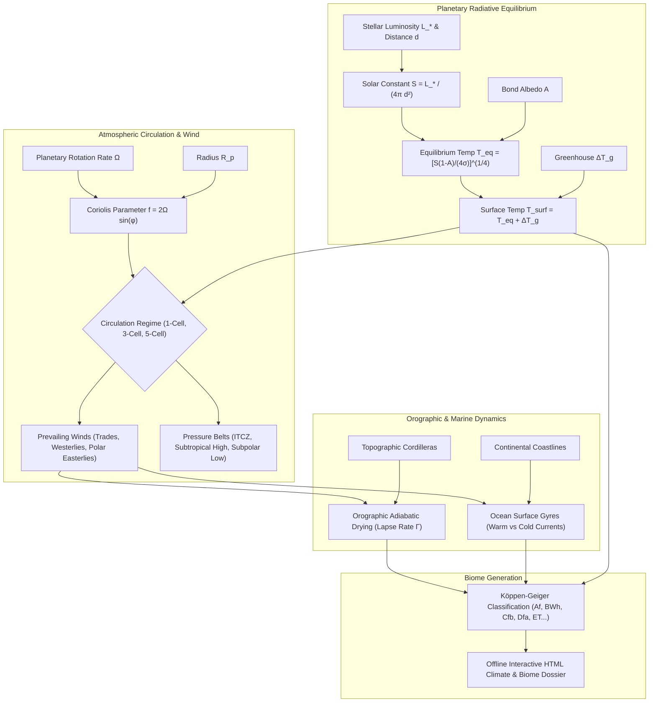

# Planetary Climatology, Atmospheric Circulation & Orographic Biomes (`docs/CLIMATE.md`)
> **Domain A: Astrophysics, Climate, Cartography & Celestial Mechanics** | **CLI:** `arcanum climate`

---

## 1. Executive Summary & Epistemological Architecture

The **Ars Arcanum Climate Engine** (`scripts/lib/climate.py`) is an offline, zero-dependency planetary climatology simulator and biome compiler engineered for speculative worldbuilders, geographers, and sci-fi novelists.

Planetary climate is governed by fluid dynamics, thermodynamic radiation balances, and rotational mechanics. Fictional maps frequently suffer from severe climatological errors:
1. **Deserts in Humid Zones**: Deserts placed arbitrarily on eastern continental coastlines within equatorial moist trade wind bands.
2. **Ignored Rain Shadows**: Lush temperate rainforests positioned immediately downwind of $4,000\text{ m}$ cordilleras where adiabatic drying produces rain-shadow deserts.
3. **Absence of Coriolis Deflection**: Prevailing winds flowing directly north-south along meridians instead of curving into trade winds, mid-latitude westerlies, and polar easterlies.
4. **Thermohaline Amnesia**: Coastlines adjacent to cold upwelling oceanic currents rendered as sweltering tropical rainforests rather than coastal fog-deserts (e.g., Atacama / Namib analogs).

The Climate Engine resolves these inconsistencies by computing planetary insolation, Rossby deformation numbers, multi-cell atmospheric circulation bands, oceanic gyre heat transport, and Köppen-Geiger biome classifications.



---

## 2. Planetary Radiation Balance & Insolation

### 2.1 Stellar Irradiance & Solar Constant
The stellar irradiance $S$ incident at the top of a planet's atmosphere at semi-major axis $d$ (in AU):

$$S = \frac{L_*}{4\pi d^2} = S_0 \left( \frac{L_*/L_\odot}{(d/\text{AU})^2} \right) \quad \text{where } S_0 \approx 1361 \text{ W/m}^2$$

### 2.2 Blackbody Equilibrium Temperature
A planet intercepts radiation over its cross-sectional area $\pi R_p^2$ and reradiates thermal infrared energy over its entire spherical surface area $4\pi R_p^2$. In thermodynamic equilibrium with Bond albedo $A$:

$$P_{\text{absorbed}} = S (1 - A) \pi R_p^2$$
$$P_{\text{emitted}} = 4\pi R_p^2 \epsilon \sigma T_{\text{eq}}^4$$

Setting $P_{\text{absorbed}} = P_{\text{emitted}}$ (with emissivity $\epsilon \approx 1.0$):

$$T_{\text{eq}} = \left( \frac{S(1 - A)}{4\sigma} \right)^{1/4} = \left( \frac{L_*(1 - A)}{16\pi \sigma d^2} \right)^{1/4}$$

Actual surface temperature $T_{\text{surf}}$ includes atmospheric greenhouse gas absorption:

$$T_{\text{surf}} = T_{\text{eq}} + \Delta T_{\text{greenhouse}}$$

---

## 3. Atmospheric Circulation Regimes & Wind Belts

```
                                [ THREE-CELL ATMOSPHERIC MODEL ]
    90° N ──► [ Polar High ] ────────────────── Polar Easterlies ──────────────────
    60° N ──► [ Subpolar Low / Polar Front ] ── Mid-Latitude Westerlies ───────────
    30° N ──► [ Subtropical High / Horse Lat ] ── Northeast Trade Winds ────────────
     0°   ──► [ ITCZ / Doldrums (Low Pressure) ] ──────────────────────────────────
    30° S ──► [ Subtropical High / Horse Lat ] ── Southeast Trade Winds ────────────
    60° S ──► [ Subpolar Low / Polar Front ] ── Mid-Latitude Westerlies ───────────
    90° S ──► [ Polar High ] ────────────────── Polar Easterlies ──────────────────
```

### 3.1 Coriolis Acceleration & the Rossby Deformation Radius
Fluid parcels in motion on a rotating sphere experience Coriolis acceleration:

$$\mathbf{a}_c = -2 (\mathbf{\Omega} \times \mathbf{v})$$
$$F_c = 2 m v \Omega \sin\phi = m v f$$

Where:
- $\Omega = \frac{2\pi}{P_{\text{rot}}}$ is planetary angular rotation velocity ($\text{rad/s}$).
- $\phi$ is geographic latitude.
- $f = 2\Omega \sin\phi$ is the Coriolis parameter.

The **Rossby Deformation Radius** $R_D$ defines the length scale at which rotational forces dominate buoyancy/pressure forces:

$$R_D = \frac{\sqrt{g H}}{f} = \frac{\sqrt{g H}}{2\Omega \sin\phi}$$

Where $H$ is atmospheric scale height ($H = \frac{k_B T}{m_{\text{air}} g} \approx 8.5\text{ km}$ on Earth).

### 3.2 Held-Hou Model for Hadley Cell Extent
The latitudinal boundary $\phi_H$ of the equatorial Hadley cell is derived from angular momentum conservation in the upper troposphere (Held & Hou, 1980):

$$\phi_H = \left( \frac{5 \, g H \, \Delta\theta_{\text{EP}}}{3 \, \Omega^2 R_p^2 \, \theta_0} \right)^{1/2}$$

Where $\frac{\Delta\theta_{\text{EP}}}{\theta_0}$ is the fractional equator-to-pole potential temperature gradient ($\approx 0.1\text{--}0.15$).

#### Circulation Regimes as a Function of Rotation Rate:
1. **Slow Rotators / Tidally Locked ($\phi_H \ge 90^\circ$, $P_{\text{rot}} > 120\text{ hours}$)**:
   - **1-Cell Global Circulation (Venusian / Eyeball regime)**.
   - Heated air rises at the subsolar point and circulates directly to the poles/nightside without intermediate cells.
2. **Intermediate Rotators ($\phi_H \approx 30^\circ$, $16\text{ h} \le P_{\text{rot}} \le 36\text{ h}$)**:
   - **3-Cell Circulation (Earth-like regime)**: Hadley Cell ($0^\circ\text{–}30^\circ$), Ferrel Cell ($30^\circ\text{–}60^\circ$), Polar Cell ($60^\circ\text{–}90^\circ$).
3. **Rapid Rotators ($\phi_H < 15^\circ$, $P_{\text{rot}} < 12\text{ hours}$)**:
   - **5+ Cell Banded Circulation (Jovian regime)**: Multiple narrow alternating jet streams and zonal cloud bands.

---

## 4. Oceanic Gyres & Thermohaline Conveyor Belts

Ocean surface currents are driven by frictional wind stress from atmospheric wind belts, redirected by continents and Coriolis deflection into giant circulating **Gyres**.

```
                        [ OCEANIC GYRE & CURRENT ARCHITECTURE ]
  Latitude           Wind Belt               West Coast of Continent      East Coast of Continent
  ─────────          ─────────               ───────────────────────      ───────────────────────
  45°–60°            Westerlies              Warm Maritime Current        Cold Polar Current
                                             (Milder winters, Cfb)        (Harsh subarctic, Dfc)
  
  15°–30°            Trade Winds             Cold Eastern Boundary        Warm Western Boundary
                                             (Upwelling, Fog Desert, BWh) (Hurricanes, Humid, Cfa)
```

### 4.1 Boundary Currents & Climate Modulation
- **Western Boundary Currents (East Coasts of Continents at Subtropics)**: Deep, fast, warm currents (e.g., Gulf Stream, Kuroshio). Inject massive sensible and latent heat into mid-latitudes, generating humid subtropical biomes (`Cfa`) and intense cyclones.
- **Eastern Boundary Currents (West Coasts of Continents at Subtropics)**: Shallow, slow, cold currents (e.g., California, Benguela, Humboldt/Peru). Drive cold-water upwelling, suppressing atmospheric convection and creating extreme coastal deserts (`BWk`/`BWh`) like the Atacama and Namib.

---

## 5. Orographic Precipitation & Rain Shadow Thermodynamics

When moisture-laden oceanic air encounters a topographic barrier (mountain range), it is forced to ascend, cool adiabatically, condense, and precipitate on the windward flank.

```
       Windward Flank (Moist Ascent)              Leeward Flank (Dry Descent)
            [ Condensation Cloud ]
                 ┌───────▲───────┐ ── Mountain Crest (Elevation z_max)
                ╱        │        ╲
   Precipitation         │         ╲ Foehn / Chinook Effect:
   Rain / Snow           │          ╲ Adiabatic Compression Heating
   (Γ_moist ≈ 5.0 K/km)  │           ╲ (Γ_dry ≈ 9.8 K/km)
              ╱          │            ▼
   Sea Level ────────────┴──────────────────────── High-Arid Rain Shadow Desert
```

### 5.1 Adiabatic Lapse Rates & Thermodynamics
The thermal lapse rate is defined as:

$$\Gamma = -\frac{dT}{dz}$$

1. **Dry Adiabatic Lapse Rate (DALR, $\Gamma_d$)**:
   $$\Gamma_d = \frac{g}{c_p} \approx 9.8\text{ K/km} \quad (\text{for dry air on Earth})$$

2. **Moist / Saturated Adiabatic Lapse Rate (MALR / SALR, $\Gamma_s$)**:
   As saturated air ascends, water vapor condenses, releasing latent heat of vaporization $L_v \approx 2.5 \times 10^6\text{ J/kg}$, offsetting cooling:
   $$\Gamma_s = g \frac{1 + \frac{L_v r_s}{R_d T}}{c_p + \frac{L_v^2 r_s \epsilon}{R_d T^2}} \approx 4.0\text{–}6.5\text{ K/km}$$
   Where $r_s$ is the saturation mixing ratio.

3. **Foehn / Chinook Wind Warming (Leeward Compression)**:
   - Air ascends the windward slope from sea level ($z = 0$) to ridge height $z_{\text{max}}$, cooling at the moist rate $\Gamma_s$.
   - Precipitation strips moisture from the air mass (lowering specific humidity).
   - The dehydrated air spills over the crest and descends the leeward slope, warming at the much steeper *dry* rate $\Gamma_d$.
   - **Temperature Anomaly at Leeward Sea Level**:
     $$\Delta T = z_{\text{max}} (\Gamma_d - \Gamma_s) \approx z_{\text{max}} (9.8 - 5.0)\text{ K/km} = 4.8\text{ K per km of ridge height}$$
   A $3,000\text{ m}$ cordillera produces leeward air that is $+14.4^\circ\text{C}$ hotter and hyper-arid, creating absolute rain-shadow deserts.

---

## 6. Köppen-Geiger Biome Classification System

The engine assigns biomes via the standard three-letter Köppen-Geiger taxonomy based on Mean Annual Temperature ($MAT$, $^\circ\text{C}$), Mean Annual Precipitation ($MAP$, $\text{mm}$), and seasonal precipitation distribution ($P_{\text{dry}}$, $P_{\text{wet}}$).

| Köppen Code | Classification Name | Thermal Criteria | Moisture Criteria | Fictional Analogs & Examples |
|---|---|---|---|---|
| **Af** | Tropical Rainforest | $T_{\text{coldest}} \ge 18^\circ\text{C}$ | $P_{\text{driest month}} \ge 60\text{ mm}$ | Amazon, Congo, Chult |
| **Am** | Tropical Monsoon | $T_{\text{coldest}} \ge 18^\circ\text{C}$ | $P_{\text{dry}} < 60\text{ mm}$, but $MAP \ge 25(100 - P_{\text{dry}})$ | Western Ghats, Southeast Asia |
| **Aw / As** | Tropical Savanna | $T_{\text{coldest}} \ge 18^\circ\text{C}$ | $P_{\text{dry}} < 60\text{ mm} \land MAP < 25(100 - P_{\text{dry}})$ | Serengeti, Llanos |
| **BWh** | Hot Hyper-Arid Desert | $MAT \ge 18^\circ\text{C}$ | $MAP < 10 \times P_{\text{threshold}}$ | Sahara, Rub' al Khali, Harad |
| **BWk** | Cold Mid-Latitude Desert | $MAT < 18^\circ\text{C}$ | $MAP < 10 \times P_{\text{threshold}}$ | Gobi, Great Basin |
| **BSh / BSk**| Semiarid Steppe (Hot/Cold) | Hot: $MAT \ge 18$; Cold: $< 18$ | $10 P_{\text{th}} \le MAP < 20 P_{\text{th}}$ | Sahel, Kazakh Steppe, Dothraki Sea |
| **Csa / Csb**| Mediterranean (Hot/Warm Summer)| $0 < T_{\text{cold}} < 18$; Dry summer | $P_{\text{s.dry}} < 40\text{ mm} \land P_{\text{s.dry}} < \frac{P_{\text{w.wet}}}{3}$ | Greece, Southern California, Dorne |
| **Cfa** | Humid Subtropical | $0 < T_{\text{cold}} < 18; T_{\text{warm}} \ge 22$ | Uniform rainfall, hot humid summers | American South, Eastern China |
| **Cfb** | Temperate Oceanic | $0 < T_{\text{cold}} < 18; T_{\text{warm}} < 22$ | Mild all year, $T \ge 10^\circ\text{C}$ for $\ge 4$ mo | Britain, New Zealand, The Shire |
| **Dfa / Dfb**| Humid Continental | $T_{\text{cold}} \le 0^\circ\text{C}; T_{\text{warm}} \ge 10^\circ\text{C}$| Significant snowpack, warm/hot summers | New England, Poland, Winterfell |
| **Dfc / Dfd**| Subarctic / Taiga | $T_{\text{cold}} \le 0^\circ\text{C}$; 1–3 mo $\ge 10^\circ\text{C}$| Long severe winters, brief cool summers | Siberia, Northern Canada |
| **ET** | Polar Tundra | $0^\circ\text{C} \le T_{\text{warmest}} < 10^\circ\text{C}$ | Permafrost, dwarf shrubs, moss | Arctic coasts, Land of Always Winter |
| **EF** | Perpetual Ice Cap | $T_{\text{warmest}} < 0^\circ\text{C}$ | Permanent glacial ice sheets | Antarctica, Central Greenland |

---

## 7. Worked Step-by-Step Climate Calculation

### Scenario:
A worldbuilder constructs an Earth-like continent at latitude $40^\circ\text{ N}$ (Prevailing Westerly winds). An oceanic air mass at sea level has base temperature $T_0 = 18.0^\circ\text{C}$ and base precipitation $P_0 = 1400\text{ mm/yr}$. The air strikes a coastal mountain range of height $z_{\text{ridge}} = 3500\text{ m}$ ($3.5\text{ km}$).

#### Step 1: Windward Mountain Ascent
- Condensation level begins at $z = 500\text{ m}$.
- Below condensation ($0\text{ to }0.5\text{ km}$): cools at $\Gamma_d = 9.8\text{ K/km}$.
  $$T(500\text{m}) = 18.0 - (0.5 \times 9.8) = 18.0 - 4.9 = 13.1^\circ\text{C}$$
- Above condensation ($0.5\text{ to }3.5\text{ km} = 3.0\text{ km}$): cools at moist rate $\Gamma_s \approx 5.2\text{ K/km}$.
  $$T(\text{crest}) = 13.1 - (3.0 \times 5.2) = 13.1 - 15.6 = -2.5^\circ\text{C}$$
- **Windward Crest Biome**: At $-2.5^\circ\text{C}$ with maximum orographic precipitation ($P \approx 2800\text{ mm}$), the crest is an Alpine Glacier / Tundra (`ET`/`EF`).

#### Step 2: Leeward Rain-Shadow Descent
- The completely dehydrated air descends from $3500\text{ m}$ down to an inland continental plateau at elevation $z_{\text{plateau}} = 500\text{ m}$ ($\Delta z = 3000\text{ m} = 3.0\text{ km}$).
- Entire descent follows the dry adiabatic lapse rate $\Gamma_d = 9.8\text{ K/km}$:
  $$T(\text{plateau}) = T(\text{crest}) + (\Delta z \times \Gamma_d) = -2.5^\circ\text{C} + (3.0 \times 9.8) = -2.5 + 29.4 = 26.9^\circ\text{C}$$
- **Precipitation Collapse**: Precipitation drops by $85\%$ due to moisture exhaustion:
  $$P(\text{plateau}) = 1400\text{ mm} \times (1 - 0.85) = 210\text{ mm/yr}$$

#### Step 3: Biome Classification of Plateau
- $MAT = 26.9^\circ\text{C} \ge 18^\circ\text{C}$.
- $MAP = 210\text{ mm} < 250\text{ mm}$ aridity threshold.
- **Result**: `BWh` (Hot Subtropical Rain-Shadow Desert).

---

## 8. Practical YAML Configuration Schema

```yaml
schema_version: "2.0"
planet_climate:
  id: "elysium_prime"
  stellar_irradiance_w_m2: 1420.0
  bond_albedo: 0.28
  greenhouse_warming_k: 35.0
  rotation_period_hours: 22.0
  axial_tilt_deg: 24.5

topographic_transects:
  - id: "western_cordillera_transect"
    latitude_deg: 38.5
    wind_belt: "mid_latitude_westerlies"
    ocean_current_type: "warm_western_maritime"
    windward_base:
      elevation_m: 0
      temp_c: 19.5
      precip_mm: 1650
      koppen_biome: "Cfb_temperate_oceanic"
    mountain_ridge:
      elevation_m: 4200
      crest_temp_c: -4.8
      crest_precip_mm: 3200
      koppen_biome: "EF_alpine_glacial"
    leeward_basin:
      elevation_m: 300
      basin_temp_c: 28.2
      basin_precip_mm: 140
      koppen_biome: "BWh_rainshadow_desert"
```

---

## 9. CLI Reference & Scriptorium Integration

```bash
# Run planetary insolation and global circulation cell calculation
arcanum climate --star-lum 1.15 --distance-au 1.08 --rotation-hours 22.0

# Calculate exact orographic rain shadow across a 4000m mountain range
arcanum climate --mountain-elevation 4000 --base-temp 20.0 --base-precip 1500

# Export comprehensive standalone HTML climate and biome atlas
arcanum climate --star-lum 1.0 --distance-au 1.0 --albedo 0.30 --html reports/climate_atlas.html
```

---

## 10. Recommended Reading, References & Media

### Foundational Craft & Academic Treatises
- **Köppen, Wladimir (1936)**. "Das geographische System der Klimate." In *Handbuch der Klimatologie*, Vol. 1, Part C (ed. W. Köppen and R. Geiger), Gebrüder Borntraeger.  
  *The historical foundation for mathematical climate classification and vegetative boundaries.*
- **Vallis, Geoffrey K. (2017)**. *Atmospheric and Oceanic Fluid Dynamics: Fundamentals and Large-Scale Circulation* (2nd ed.). Cambridge University Press.  
  *The definitive university reference for geostrophic balance, Rossby waves, and baroclinic instability.*
- **Pierrehumbert, Raymond T. (2010)**. *Principles of Planetary Climate*. Cambridge University Press.  
  *Exhaustive textbook covering radiative-convective equilibrium, runaway greenhouses, and exoplanetary atmospheres.*
- **Hartmann, Dennis L. (2016)**. *Global Physical Climatology* (2nd ed.). Elsevier / Academic Press.  
  *Masterwork on global energy budgets, adiabatic thermodynamics, and general circulation.*
- **Whittaker, Robert H. (1975)**. *Communities and Ecosystems* (2nd ed.). Macmillan.  
  *The classic Whittaker biome matrix relating Mean Annual Temperature and Mean Annual Precipitation.*

### Landmark Scientific Papers
- **Held, Isaac M., & Hou, Arthur Y. (1980)**. "Nonlinear Axially Symmetric Circulations in a Nearly Inviscid Atmosphere." *Journal of the Atmospheric Sciences*, 37(3), 515–533.  
  *Analytical derivation of Hadley cell width as a function of planetary radius and rotation rate.*
- **Peel, M. C., Finlayson, B. L., & McMahon, T. A. (2007)**. "Updated world map of the Köppen-Geiger climate classification." *Hydrology and Earth System Sciences*, 11(5), 1633–1644.  
  *The modern algorithmic standard for classifying temperature and precipitation grids into Köppen biomes.*

### Seminal Video Lectures, Masterclasses & Channels
- **Artifexian** (YouTube Series: *Atmospheric Circulation*, *Ocean Currents*, *Köppen Biomes Worldbuilding Series*).  
  *The premier step-by-step masterclass for worldbuilders designing realistic planetary climates and biomes.*
- **Geoff Pack** (*Climate Cookbook & Planetary Geography Guides*).  
  *Pioneering systematic worldbuilding methodology for placing deserts, rainforests, and wind belts on fictional maps.*
- **Nick B (Worldbuilding Pasta)** (*Climate Modeling for Worldbuilders Series*).  
  *Exceptional hard-science blog and video breakdowns of ExoPlaSim and GCM simulations applied to fictional maps.*
- **Kurzgesagt – In a Nutshell** (*What If Earth Swapped Orbits?*, *How Ocean Currents Control the World*).  
  *Visually intuitive breakdowns of thermohaline circulation and planetary heat distribution.*

### Landmark Speculative Case Studies
- **Herbert, Frank**. *Dune* (Arrakis, showcasing atmospheric moisture scarcity, coriolis storms, and Hadley cell desert dynamics).
- **Le Guin, Ursula K.** *The Left Hand of Darkness* (Gethen/Winter, exploring high-latitude glaciated maritime climates and human biological adaptation).
- **Aldiss, Brian**. *Helliconia Trilogy* (*Spring, Summer, Winter*, depicting the multi-century climate swings of an eccentric binary star system).
- **Robinson, Kim Stanley**. *Mars Trilogy* (*Red Mars, Green Mars, Blue Mars*, detailing atmospheric thickening, moisture delivery, and synthetic climate engineering).
