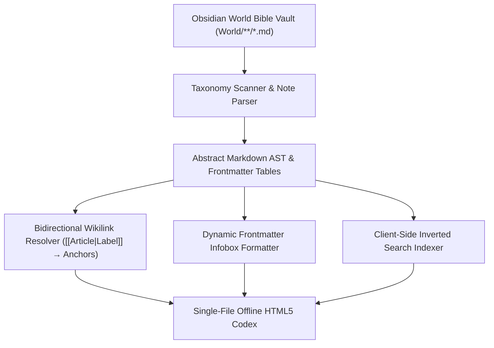
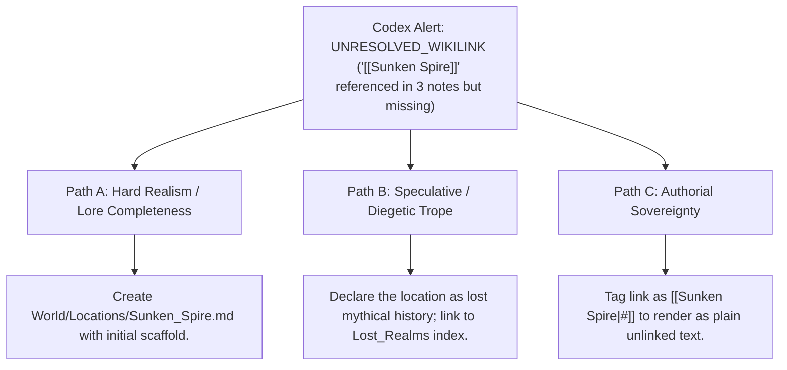

# Static World Wiki & Offline Codex Exporter (`docs/CODEX_EXPORT.md`)
> **Domain F: Corpus Analytics, Diff, Continuity, RAG & Search** | **CLI:** `arcanum codex` / `arcanum wiki`

---

## 1. Overview & Theoretical Rationale

The **Ars Arcanum Codex Exporter** (`scripts/lib/codex_export.py`) is an offline static site generator, bidirectional wikilink compiler, frontmatter infobox builder, and client-side search indexer engineered for worldbuilders and speculative novelists.

Authors who organize expansive World Bibles in Obsidian or Markdown often face difficulty sharing their lore with alpha readers, tabletop roleplayers, or editors who do not have Obsidian installed. Traditional static site generators (like Hugo, Jekyll, or MkDocs) require node/ruby/pip runtimes, online CDN dependencies, and complex deployment pipelines.

The Codex Exporter compiles an entire hierarchical World Bible vault into a single, self-contained offline HTML encyclopedia with zero external network requests, complete with interactive search, dark/light themes, and automatic infobox sidebars.

---

## 2. Compilation Architecture & Mathematical Indexing



### 2.1 Bidirectional Wikilink Resolution ($[[Target \mid Label]]$)
The parser transforms internal Obsidian links into semantic in-page anchors:

$$\text{Regex}: \quad \texttt{\[\[([^\|\]]+)(?:\|([^\]]+))?\]\]} \implies \texttt{<a href="#slug(\$1)">\$2 \text{ or } \$1</a>}$$

Where $\text{slug}(s) = \operatorname{lower}(\operatorname{replace}(s, \text{" "}, \text{"-"}) \text{ stripped of non-alphanumerics})$.

### 2.2 Inverted Full-Text Search Index
To achieve sub-millisecond offline search without external libraries, the engine embeds a precomputed inverted index $I: \text{Term} \to [\text{ArticleID}_1, \text{ArticleID}_2, \dots]$:

$$I(t) = \{ d \in \mathcal{D} \mid t \in \operatorname{tokenize}(\text{Title}(d) \cup \text{Body}(d)) \}$$

The client-side search routine computes intersection scores:
$$\text{Score}(d, q) = \sum_{t \in q} \left( 3.0 \cdot \mathbb{I}(t \in \text{Title}(d)) + 1.0 \cdot \mathbb{I}(t \in I^{-1}(d)) \right)$$

---

## 3. Subfeatures Matrix

| Subfeature | Algorithmic Mechanism | Diagnostic Output / Rule | Narrative Craft Significance |
|---|---|---|---|
| **Taxonomy Auto-Categorizer** | Scans subdirectories (`Characters/`, `Factions/`, `Locations/`). | Organizes lore articles into collapsible sidebar categories. | Preserves organized world hierarchy in compiled output. |
| **Wikilink Anchor Resolver** | Replaces Obsidian wikilinks with localized anchor tags. | Enables seamless in-browser hypertext navigation. | Allows readers to explore deep rabbit holes of interconnected lore. |
| **Dynamic YAML Infoboxes** | Formats frontmatter key-value pairs into Wikipedia-style infoboxes. | Emits styled side infobox cards with badges. | Presents vital statistics (role, faction, status) at a glance. |
| **Client-Side Inverted Search** | Serializes lightweight inverted index into HTML `<script>`. | Delivers instant offline search filtering as user types. | Eliminates friction when looking up obscure world terminology. |
| **Multi-Theme Reader** | Pure CSS theming (Dark, Light, Sepia Papyrus) with local persistence. | Toggles visual reading modes via client-side JavaScript. | Delivers a comfortable reading experience across all devices. |

---

## 4. Author Extension & Configuration Guide

### 4.1 Note Structure (`World/Characters/Kaelen.md`)
```markdown
---
name: Kaelen Vane
role: Major Protagonist
status: Active
faction: Silver Concordat
origin: High Vale
---

# Kaelen Vane
A master swordsman hailing from [[High Vale|The High Vale]].
He serves as captain within the [[Silver Concordat]].
```

---

## 5. Command-Line Interface (CLI) Reference

```bash
# Export single-file offline static codex for current world vault
arcanum codex World/

# Specify custom output destination
arcanum codex World/ -o dist/Aethelgard_Codex.html

# Query codex compilation logic
arcanum doc codex_export --math --why
```

---

## 6. Tri-Fold Creative Advisory Resolutions



### Scenario: Broken Wikilink Warning in Codex Compilation
- **Path A (Hard Realism / Complete Worldbuilding)**:
  - Create the missing note `World/Locations/Sunken_Spire.md` to ensure all hypertext references resolve cleanly.
- **Path B (Speculative / Diegetic Mystery)**:
  - Intentionally leave the link unresolved as an in-world "Lost Archive / Burned Knowledge" fragment, adding a glossary note on forbidden lore.
- **Path C (Authorial Sovereignty)**:
  - Leave as unlinked text or configure `ignore_unresolved_links: true` in export settings.

---

## 7. Content Security Policy & Offline Isolation

Generated HTML codex encyclopedias are completely standalone and strictly offline:

```html
<meta http-equiv="Content-Security-Policy" content="default-src 'none'; style-src 'unsafe-inline'; script-src 'unsafe-inline'; img-src data:; media-src data: blob:;">
```
