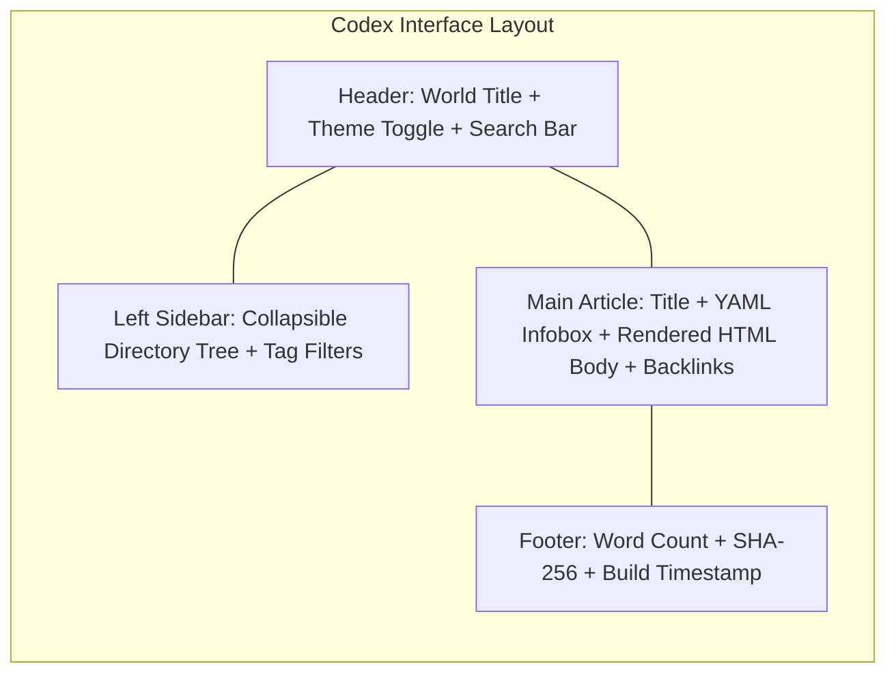
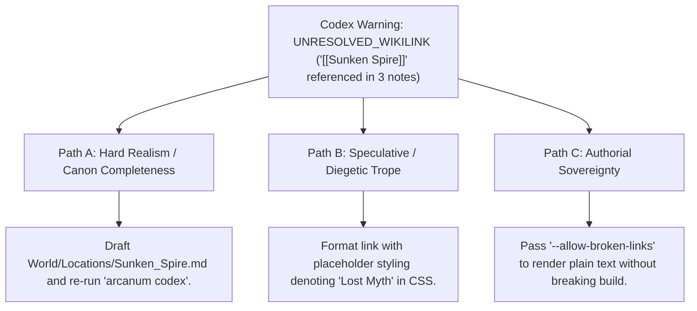

# Static World Wiki & Offline Codex Exporter (`docs/CODEX_EXPORT.md`)
> **Domain F: Corpus Analytics, Diff, Continuity, RAG & Search** | **CLI:** `arcanum codex` / `arcanum wiki`

---

## 1. Overview & Theoretical Rationale

The **Ars Arcanum Codex Exporter** (`scripts/lib/codex_export.py`) is an offline static encyclopedia compiler, hypertext link resolver, frontmatter metadata visualizer, and client-side inverted search engine engineered for worldbuilders, authors, tabletop game masters, and lore archivists.

Maintaining a vast, interconnected World Bible inside Markdown vaults (like Obsidian) empowers the author during the drafting phase. However, distributing this world to alpha readers, beta reviewers, developmental editors, or collaborative co-authors creates substantial friction:
- External readers may lack Obsidian, custom CSS themes, or requisite plugins.
- Traditional static site generators (SSGs) such as Hugo, Jekyll, MkDocs, or Docusaurus require complex build environments (Node.js, Ruby, Python virtual environments), online CDN script dependencies, and fragile deployment servers.
- Hosting sensitive, unreleased fictional universes on public or semi-private web servers introduces severe piracy, intellectual property exposure, and data privacy vulnerabilities.

```
+-------------------------------------------------------------------------------+
|                       ARS ARCANUM CODEX EXPORT PIPELINE                      |
|                                                                               |
|  +---------------------+      Static AST Engine        +-------------------+  |
|  | Markdown World Bible| ----------------------------> | Hypertext Resolver|  |
|  | (World/**/*.md)     |                               | & Inverted Index  |  |
|  +---------------------+                               +-------------------+  |
|            |                                                     |            |
|            v                                                     v            |
|  [YAML Frontmatter]                                    [Responsive Layout]    |
|  [Wikilink Graph]                                      [Embedded Search JS]   |
|            |                                                     |            |
|            +-----------------------------------------------------+            |
|                                         |                                     |
|                                         v                                     |
|                         [Standalone Single-File HTML5]                        |
|                         [Zero-CDN / 100% Air-Gapped]                          |
|                         [CSP: default-src 'none']                             |
+-------------------------------------------------------------------------------+
```

The Codex Exporter compiles an entire hierarchical directory of Markdown lore notes into a **single, air-gapped, zero-dependency HTML5 file** featuring responsive tree navigation, dynamic Wikipedia-style infoboxes, interactive full-text search, and multi-theme reading modes.

---

## 2. Mathematical Formalism & Hypertext Graph Theory

### 2.1 Hypertext Network Graph & Lore Centrality
A World Bible can be represented as a directed multigraph $G = (V, E)$, where $V$ represents individual lore articles (characters, locations, relics, events) and directed edges $E = \{(u, v)\}$ represent Obsidian wikilinks $[[v]]$ embedded in article $u$.

#### In-Degree & Out-Degree Centrality
The canonical importance $C_{\text{in}}(v)$ (diegetic significance) and connective breadth $C_{\text{out}}(u)$ are defined as:

$$C_{\text{in}}(v) = \sum_{u \in V} A_{u, v}, \quad C_{\text{out}}(u) = \sum_{v \in V} A_{u, v}$$

Where $A$ is the binary adjacency matrix of the lore vault:
$$A_{u, v} = \begin{cases} 1 & \text{if } u \text{ links to } v \\ 0 & \text{otherwise} \end{cases}$$

#### Local Clustering Coefficient
To measure narrative cohesion within lore clusters (e.g., all factions within the High Vale domain):

$$C_i = \frac{2 e_i}{k_i(k_i - 1)} = \frac{|\{ (v_j, v_k) \in E : v_j, v_k \in N_i \}|}{k_i(k_i - 1)}$$

Where $N_i = \{ v_j \in V : (v_i, v_j) \in E \lor (v_j, v_i) \in E \}$ is the neighborhood of entity $i$, and $k_i = |N_i|$ is its degree.

```
Lore Hub Centrality (e.g. [[The High Citadel]]):
          [Character A] ---> (High Citadel) <--- [Faction X]
                                ^     |
                                |     v
                          [Battle of Vale]
```

### 2.2 Inverted Search Index & Trigram Tokenization
The embedded search engine utilizes an in-memory inverted index $I: \text{Token} \to \{(d, w_{t, d})\}$.

For short, zero-dependency client-side execution, relevance scores are calculated as:

$$\text{Relevance}(d, Q) = \sum_{q \in Q} \Big( 5.0 \cdot \mathbb{I}_{\text{title}}(q, d) + 3.0 \cdot \mathbb{I}_{\text{alias}}(q, d) + 1.0 \cdot \text{TF}(q, d) \Big)$$

To support fuzzy typo tolerance without external libraries, the engine evaluates character-level trigram Jaccard similarity between query tokens $q$ and document tokens $t$:

$$J_{\text{tri}}(q, t) = \frac{|\text{tri}(q) \cap \text{tri}(t)|}{|\text{tri}(q) \cup \text{tri}(t)|}$$

Where $\text{tri}(s)$ denotes the multiset of consecutive 3-character substrings of $s$.

---

## 3. Architecture, Layout & Subfeatures



| Subfeature | Algorithmic Mechanism | Diagnostic Output / Rule | Narrative Craft Significance |
|---|---|---|---|
| **Single-File Bundling** | Inlines CSS, fonts, icons, and JavaScript into base64 / text blocks. | Emits a single `.html` file ($< 2\text{ MB}$ for 500k words). | Zero setup for beta readers; opens instantly in any browser. |
| **Hierarchical Directory Tree** | Recursively maps folder taxonomy to nested `<details><summary>` DOM. | Preserves nested folders (`World/Factions/Northern_Clans/`). | Intuitive geographical and geopolitical exploration. |
| **Bidirectional Wikilinks** | Converts `[[Target#Heading\|Alias]]` to internal document anchors. | Generates jump links and populates reverse "Backlinks" panels. | Reveals unexpected lore connections across sprawling bibles. |
| **Automatic YAML Infoboxes** | Formats frontmatter key-values into styled metadata sidebar cards. | Displays badges for `Status`, `Origin`, `Lifespan`, `Threat Level`. | Delivers instant high-level character/faction profiles. |
| **Multi-Theme Engine** | Pure CSS variables switching between *Obsidian Dark*, *Parchment Sepia*, and *Classic Editorial*. | Persists reader preference via `localStorage`. | Ensures maximum typographic comfort across long reading sessions. |

---

## 4. CLI Execution & Configuration Reference

```bash
# 1. Compile entire World/ directory into dist/World_Codex.html
arcanum codex World/

# 2. Specify custom output destination and custom codex title
arcanum codex World/ -o dist/Aethelgard_Encyclopedia.html --title "Chronicles of Aethelgard"

# 3. Include manuscript chapters alongside lore notes
arcanum codex World/ Manuscripts/ -o dist/Complete_Bible.html

# 4. Filter categories or exclude draft notes
arcanum codex World/ --exclude-tags "wip,draft,spoilers"

# 5. Emit minified standalone build
arcanum codex World/ --minify
```

### CLI Option Reference

| Parameter | Short | Type | Default | Description |
|---|---|---|---|---|
| `vault_paths` | (Positional) | `Path...` | `World/` | Source directory or directories to compile. |
| `--output` | `-o` | `Path` | `dist/Codex.html` | Path for the compiled standalone HTML file. |
| `--title` | `-t` | `str` | `"World Codex"` | Codex header title and HTML page title. |
| `--theme` | `-m` | `choice` | `dark` | Initial default theme (`dark`, `sepia`, `light`). |
| `--exclude-tags` | `-x` | `str` | `""` | Comma-separated frontmatter tags to skip. |
| `--minify` | `-z` | `bool` | `False` | Minifies inline CSS and JavaScript bundle. |

---

## 5. Security & Content Security Policy (CSP)

To guarantee that proprietary worldbuilding documents cannot be leaked via cross-site scripting or external asset injection, every generated Codex embeds a strict Level 3 Content Security Policy:

```html
<meta http-equiv="Content-Security-Policy" 
      content="default-src 'none'; 
               style-src 'unsafe-inline'; 
               script-src 'unsafe-inline'; 
               img-src data: blob:; 
               font-src data:; 
               connect-src 'none';">
```

- `default-src 'none'`: Blocks all outbound network requests, websockets, and telemetry beacons.
- `connect-src 'none'`: Prevents `fetch()` or `XMLHttpRequest` exfiltration.
- `img-src data: blob:`: Allows embedded base64 artwork and local diagrams while preventing external tracking pixels.

---

## 6. Tri-Fold Creative Advisory Resolutions



### Scenario: Broken Wikilink Warning During Compilation
- **Path A (Hard Realism / Lore Completeness)**:
  - The author creates the missing file `World/Locations/Sunken_Spire.md` with comprehensive geography, population, and historical records, then recompiles.
- **Path B (Speculative / Diegetic Framing)**:
  - The missing entry represents forgotten pre-cataclysm architecture. The link renders with a distinct visual aura indicating "Lost / Mythological Knowledge" to the reader.
- **Path C (Authorial Sovereignty)**:
  - The author continues drafting freely. The compiler automatically falls back to rendering `[[Sunken Spire]]` as styled inert text with a subtle tooltip.

---

## 7. Recommended Reading, References & Media

### 7.1 Foundational Hypertext & Web Architecture Treatises
- **Berners-Lee, Tim, Fielding, Roy, & Masinter, Larry (2005)**. *Uniform Resource Identifier (URI): Generic Syntax*. RFC 3986, Internet Engineering Task Force (IETF). [RFC 3986](https://www.rfc-editor.org/rfc/rfc3986).  
  *The architectural foundation of universal resource identification and localized fragment anchoring.*
- **Nelson, Theodor Holm (1987)**. *Literary Machines: The Report On, and of, Project Xanadu Concerning Word Processing, Electronic Publishing, Hypertext, Thinkertoys, Tomorrow's Intellectual... Revolution*. Mindful Press. ISBN: 978-0893470555.  
  *The seminal philosophical treatise on non-linear writing, interconnected docuverses, and bidirectional transclusion.*
- **W3C Web Application Security Working Group (2016)**. *Content Security Policy Level 3*. W3C Working Draft. [W3C CSP3](https://www.w3.org/TR/CSP3/).  
  *The definitive security standard for air-gapped web client isolation.*

### 7.2 Graph Theory & Information Architecture
- **Newman, Mark (2018)**. *Networks: An Introduction*. Oxford University Press. ISBN: 978-0198805090.  
  *Comprehensive mathematical textbook on graph theory, degree centrality, clustering coefficients, and network topologies.*
- **Rosenfeld, Louis, Morville, Peter, & Arango, Jorge (2015)**. *Information Architecture: For the Web and Beyond* (4th Edition). O'Reilly Media. ISBN: 978-1491911686.  
  *The classic manual on taxonomy design, hierarchical navigation systems, and search indexing structures.*

### 7.3 Video Lectures, Masterclasses & Technical Media
- **Artifexian**: *Organizing Your Worldbuilding Vault: Maps, Encyclopedias, and Wikis*.  
  *Practical video masterclasses on structuring fictional encyclopedias and geographical gazetteers.*
- **Biblaridion**: *Worldbuilding Masterclass: Documenting Mythologies, Conlangs, and Kingdoms*.  
  *Techniques for systematically archiving world lore.*
- **Tale Foundry**: *The Anatomy of Fictional Encyclopedias: From Tolkien to the SCP Foundation*.  
  *Deep-dive analysis into encyclopedic worldbuilding and collaborative lore curation.*
- **Computerphile**: *Inside Inverted Indexes and Search Engines*.  
  *Mathematical and algorithmic explanations of how client-side and server-side text indexes parse and score search queries.*

### 7.4 Landmark Speculative Case Studies
- **The SCP Foundation Wiki** (`scp-wiki.wikidot.com`).  
  *The defining collaborative hypertext fictional encyclopedia, utilizing structured infoboxes, containment protocols, and cross-linking.*
- **Wookieepedia (Star Wars Collaborative Lore Archive)**.  
  *Massive hierarchical canon index tracking complex continuity tiers (Canon vs Legends).*
- **Borges, Jorge Luis**: "The Library of Babel" & "The Garden of Forking Paths" (1941).  
  *Philosophical foundations of infinite interconnected literary mazes and hypertext narrative structures.*
