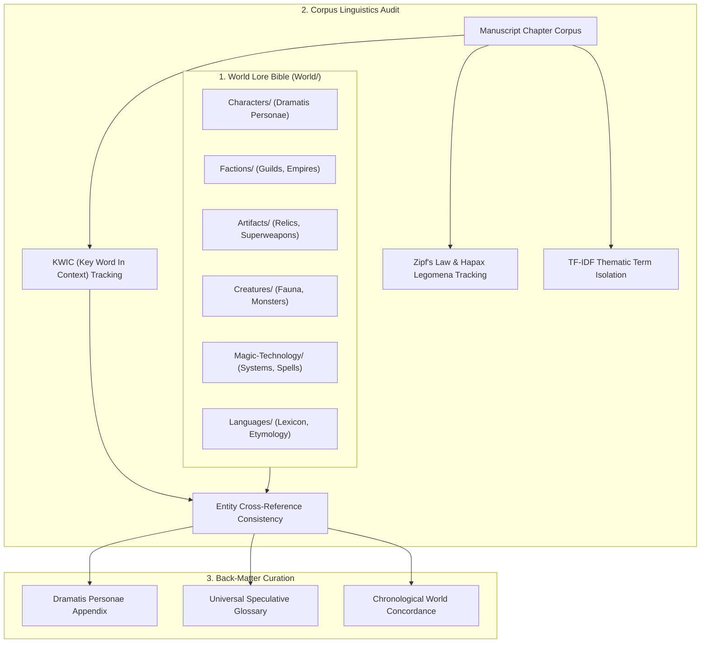
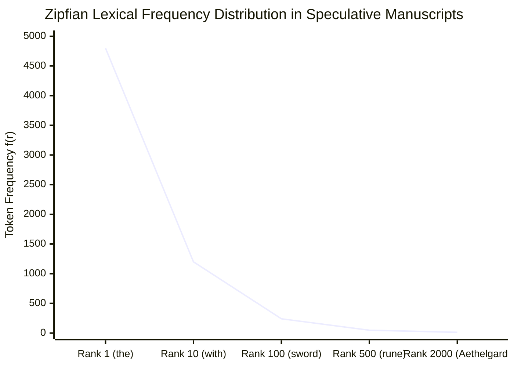
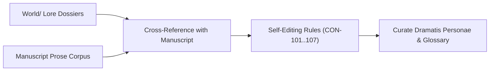

# Author Craft Masterclass: Speculative Lexicography, Nomenclature & Back-Matter Design (`docs/CONCORDANCE.md`)
> **Domain A: World Architecture, Lore & Cosmology** | **Category:** Author Craft & Narrative Doctrine | **Status:** Theoretical Framework & Writing Rubric

---

## 1. Overview & Architectural Mission

In massive speculative fiction projects (spanning 200,000 to 1,000,000+ words), worldbuilding terminology is prone to severe lexical degradation:

1. **The "Call a Rabbit a Smeerp" Syndrome**: Inventing unnecessary neologisms for mundane objects without thematic justification, fatiguing the reader.
2. **Orphaned Lore & Hapax Legomena**: Introducing complex named entities, spells, or artifacts in Chapter 3 that are never mentioned or resolved again in the entire series.
3. **Phonotactic Inconsistency & Apostrophe Glut**: Creating alien or fantasy names with random apostrophes and clashing phonology (*"K'zhl'tark"* next to *"Bob"*), shattering cultural linguistic coherence.
4. **Semantic Drift & Alias Fragmentation**: Referring to the same entity by multiple conflicting names (*"The Sun-Blade"*, *"Dawn-Cleaver"*, *"The Blade of Light"*) across volumes without unified tracking.
5. **Back-Matter Compilation Nightmare**: Manually assembling hundreds of character entries, faction descriptions, and glossary terms for end-of-book appendices.

This masterclass establishes principles of speculative lexicography, terminology governance, and back-matter indexing to maintain reader trust and linguistic immersion across expansive universes.



---

## 2. Theoretical Foundations of Speculative Lexicography & Corpus Linguistics

### 2.1 J.R.R. Tolkien's Glossopoeia & Linguistic Cohesion
In his 1931 essay *"A Secret Vice: On Language and Art"*, J.R.R. Tolkien established that believable worldbuilding originates from **linguistic cohesion (Glossopoeia)**:

> *"The making of language and mythology are related functions... Your language construction must have an aesthetic fitness; the names of places and persons must belong to the same phonetic and morphological fabric."*

When naming characters, factions, and thaumaturgical artifacts, the author must avoid arbitrary phonemic collisions. A northern mountain tribe should not possess Hellenic suffixes (*-opoulos*) while their immediate neighbors possess Anglo-Saxon toponyms (*-bury*, *-wick*) unless justified by historical colonization or language contact.

### 2.2 Corpus Linguistics & Statistical Lexicology
Classical corpus linguistics principles formalized by John Sinclair (*Corpus, Concordance, Collocation*, 1991) provide powerful lenses for self-editing:

- **Collocation**: The habitual co-occurrence of words (e.g., in a sci-fi manuscript, tracking how often *"antimatter"* collocates with *"containment failure"* vs. *"warp injector"*).
- **Key Word In Context (KWIC)**: Auditing every instance of a search term flanked by its immediate left and right sentential context to detect semantic drift.
- **Hapax Legomenon ($\text{Hapax}$)**: A word that occurs only once within an entire corpus. In speculative fiction, hapax terms frequently represent either typos (e.g., *"Theron"* misspelled as *"Theorn"*) or forgotten, abandoned worldbuilding concepts that require either expansion or pruning.

### 2.3 The Terminology Governance Hierarchy
To maintain reader trust, speculative vocabulary should follow the **Rule of Three-Tier Lexical Economy**:

```
 ┌─────────────────────────────────────────────────────────────┐
 │  TIER 1: Universal Common English Words                     │
 │  (Door, sword, horse, plasma, king, soldier)                 │
 ├─────────────────────────────────────────────────────────────┤
 │  TIER 2: Translucent Compound Metaphors                     │
 │  (Sun-lance, void-skiff, blood-ward, storm-glass)            │
 ├─────────────────────────────────────────────────────────────┤
 │  TIER 3: Diegetic Neologisms / Conlang Proper Nouns          │
 │  (Reserved exclusively for culturally unique concepts)      │
 └─────────────────────────────────────────────────────────────┘
```

---

## 3. Mathematical Models & Corpus Formulations



### 3.1 Zipf's Law & Natural Lexicon Distribution
George Kingsley Zipf established that the frequency $f(r)$ of any word is inversely proportional to its frequency rank $r$ in the corpus:

$$f(r; s, N) = \frac{C}{r^s}, \qquad \sum_{r=1}^V f(r) = N$$

Where:
- $r$: Frequency rank of the word ($r=1$ is the most common word, e.g., *"the"*).
- $s \approx 1.0$: The Zipfian exponent for natural human language.
- $N$: Total token count of the manuscript.

Authors should watch for **Lexical Skews**: if invented conlang words or specialized sci-fi terms exhibit $s > 1.8$, the text suffers from obsessive term-repetition; if conlang terms are overwhelmingly hapax ($s < 0.4$), the worldbuilding is unanchored.

### 3.2 Term Frequency-Inverse Document Frequency (TF-IDF)
To extract distinctive worldbuilding terms unique to specific chapters or factions:

$$\text{TF-IDF}(t, d, D) = \text{TF}(t, d) \times \text{IDF}(t, D)$$

Where:
$$\text{TF}(t, d) = \frac{f_{t, d}}{\sum_{t' \in d} f_{t', d}}$$

$$\text{IDF}(t, D) = \log\left(\frac{1 + |D|}{1 + |\{d \in D : t \in d\}|}\right) + 1.0$$

Where $d$ is a single chapter and $D$ is the full manuscript corpus. High TF-IDF scores isolate the defining thematic vocabulary of each narrative sequence.

### 3.3 Hapax Legomena Ratio ($H_{\text{ratio}}$)
The ratio of single-occurrence words to the total vocabulary size $V$:

$$H_{\text{ratio}} = \frac{V_1}{V} = \frac{|\{w \in V \mid f(w) = 1\}|}{|V|}$$

- Healthy speculative fiction manuscripts typically exhibit $H_{\text{ratio}} \in [0.38, 0.52]$.
- An elevated $H_{\text{ratio}} > 0.65$ warns of rampant glossopoeic clutter and unedited proper-noun inflation.

---

## 4. Lore Directory Structure & Frontmatter Schema

World dossiers are organized inside the sovereign `World/` tree:

```
World/
├── Characters/         # Dramatis Personae (Nobles, Operatives, Deities)
├── Factions/           # Guilds, Empires, Religious Orders, Syndicates
├── Artifacts/          # Relics, Weapons, Cyberware, Ancient Tomes
├── Creatures/          # Bestiary, Flora, Fauna, Chimeras
├── Magic-Technology/   # Thaumaturgical Laws, Drive Grids, Spell Schools
└── Languages/          # Conlang Glossaries, Idioms, Etymologies
```

### 4.1 Canonical Lore Entity Frontmatter (YAML)

```markdown
---
name: "Dawnstrider"
type: "Artifact"
category: "Solarite Weaponry"
summary: "A greatsword forged from compressed solarite crystal, attuned to the bloodline of Theron."
aliases:
  - "The Sun-Cleaver"
  - "Blade of the Dawn"
pronunciation: "DAWN-stry-der"
first_appearance: "Manuscript/Act_1/Chapter_01.md"
related_entities:
  - "Theron of Elyria"
  - "Sun-Smiths of Elyria"
tags: ["relic", "solarite", "royal_regalia"]
---

# Dawnstrider

Forged during the Second Solar Eclipse by the master smiths of Elyria...
```

---

## 5. Author Self-Editing Rubric & Terminology Audit Matrix



### 5.1 Diagnostic Self-Editing Codes Matrix

| Code | Severity | Description | Remediating Action |
|---|---|---|---|
| `CON-101` | **HIGH** | Orphan Lore Entity (Entity in `World/` never mentioned in manuscript) | Integrate entity into the story, or mark as background apocrypha. |
| `CON-102` | **HIGH** | Unregistered Proper Noun / Potential Typo (Hapax capitalization) | Check for spelling typos of existing character names, or create a world dossier. |
| `CON-103` | **MEDIUM** | Alias Semantic Fragmentation (Entity referred to by unindexed moniker) | Add alias to the entity's frontmatter `aliases:` list. |
| `CON-104` | **LOW** | Glossopoeic Clutter ($H_{\text{ratio}} > 0.65$) | Standardize vocabulary; replace unnecessary neologisms with transparent English compounds. |
| `CON-105` | **MEDIUM** | First Appearance Metadata Mismatch | Update `first_appearance:` in YAML to match true earliest chapter occurrence. |
| `CON-106` | **LOW** | Phonotactic Collision in Culture Naming | Audit conlang naming rules to ensure phonetic harmony within the faction. |
| `CON-107` | **HIGH** | Broken Lore Cross-Reference (`related_entities` target missing) | Correct target entity filename in YAML frontmatter. |

---

## 6. Practical Authorial Worksheets & Worked Masterclass Examples

### 6.1 Sample Back-Matter Concordance & Glossary Output

```markdown
# Concordance & Universe Index

## Dramatis Personae

### Theron of Elyria
*The Last Solar Warden, Crown Prince of the Fallen Reaches.*
- **Pronunciation**: *THEH-ron of eh-LEER-ee-uh*
- **Aliases**: The Sun-Scion, Warden of the Third Gate
- **Key Appearances**: Chapter 1 (p. 3), Chapter 4 (p. 45), Chapter 12 (p. 168)
- **Dossier Reference**: `World/Characters/Theron_of_Elyria.md`

### Inquisitor Malakor Vane
*High Magistrate of the Iron Synod, Overseer of the Reductio.*
- **Pronunciation**: *MAL-uh-kor VANE*
- **Aliases**: The Glass Inquisitor, Hand of Iron
- **Key Appearances**: Chapter 2 (p. 18), Chapter 8 (p. 112), Chapter 14 (p. 204)
- **Dossier Reference**: `World/Characters/Inquisitor_Vane.md`

---

## Relics & Artifacts

### Dawnstrider
*A two-handed broadsword carved from deep-mantle solarite.*
- **Aliases**: The Sun-Cleaver, Blade of the Dawn
- **Bearer**: Theron of Elyria
- **Key Appearances**: Chapter 1 (p. 7), Chapter 14 (p. 210)
- **Dossier Reference**: `World/Artifacts/Dawnstrider.md`
```

---

### 6.2 Speculative Terminology Governance Audit (YAML Schema)

```yaml
---
concordance_audit_policy:
  strict_mode: true
  min_term_occurrences_for_glossary: 2
  flag_hapax_proper_nouns: true
  
phonotactic_rules:
  culture: "Valyrian-Imperial"
  allowed_vowels: ["a", "e", "i", "o", "u", "ae", "y"]
  prohibited_clusters: ["zk", "qg", "pw", "xch"]
  max_consecutive_apostrophes: 0

alias_mappings:
  "The Sun-Cleaver": "Dawnstrider"
  "The Blade of Dawn": "Dawnstrider"
  "The Glass Inquisitor": "Inquisitor Malakor Vane"
---
```

---

## 7. Recommended Reading, References & Media

### 7.1 Foundational Craft & Academic Books
- **Sinclair, John (1991)**. *Corpus, Concordance, Collocation*. Oxford University Press. ISBN: 978-0194371445.  
  *The landmark work that established modern corpus linguistics, KWIC indexing, and collocation analysis.*
- **Leech, Geoffrey; Rayson, Paul & Wilson, Andrew (2001)**. *Word Frequencies in Written and Spoken English: Based on the British National Corpus*. Routledge. ISBN: 978-0582320079.  
  *The authoritative study on lexical rank distributions, Zipf's law behavior, and frequency profiling.*
- **Tolkien, J.R.R. (1931/1983)**. "A Secret Vice: On Language and Art". In *The Monsters and the Critics and Other Essays*. George Allen & Unwin. ISBN: 978-0048090195.  
  *Tolkien's philosophical foundation of glossopoeia, linguistic fitness, and language-mythology symbiosis.*
- **Rosenfelder, Mark (2010)**. *The Language Construction Kit*. Yonagu Books. ISBN: 978-0984470006.  
  *The premier practical guide to phonotactics, morphology, naming consistency, and conlang syntax.*
- **Rosenfelder, Mark (2014)**. *The Planet Construction Kit*. Yonagu Books. ISBN: 978-0984470037.  
  *Crucial methodologies for organizing speculative world lore, naming conventions, and terminology management.*
- **Peterson, David J. (2015)**. *The Art of Language Invention: From Horse-Lords to Dark Elves*. Penguin Books. ISBN: 978-0143126461.  
  *Deep dive into phonetic aesthetic coherence, writing systems, and avoiding common fantasy naming tropes.*

### 7.2 Landmark Lectures, Video Masterclasses & Linguistics Tools
- **Biblaridion (2018–2024)**. *Feature Focus: Conlang Naming Languages and Lexicon Building*. YouTube Series.  
  *Exhaustive video masterclasses on designing believable phonology, lexical evolution, and culture-specific naming conventions.*
- **Artifexian (2016–2024)**. *Constructed World Lexicons, Sound Changes, and Phonology*. YouTube Masterclass.  
  *Step-by-step algorithms for building coherent worldbuilding lexicons and tracking terminology.*
- **Sanderson, Brandon (2020)**. *BYU Creative Writing Lecture 8: Worldbuilding Lexicon and Information Management*. Brigham Young University / YouTube.  
  *How to manage massive series world bibles, avoiding the 'Call a Spade a Laser' trap, and compiling glossaries.*

### 7.3 Landmark Speculative Fiction Case Studies
- **Herbert, Frank (1965)**. *Dune*. Chilton Books.  
  *The gold standard of speculative concordance and back-matter appendices (Terminology of the Imperium, Religion of Dune).*
- **Tolkien, J.R.R. (1955)**. *The Return of the King (Appendices)*. George Allen & Unwin.  
  *The ultimate literary model for annals, genealogies, pronunciations, and linguistic concordance.*
- **Wolfe, Gene (1983)**. *The Citadel of the Autarch (Appendix)*. Timescape.  
  *Brilliant authorial meta-glossary explaining the translation and etymology of archaic speculative terms.*
