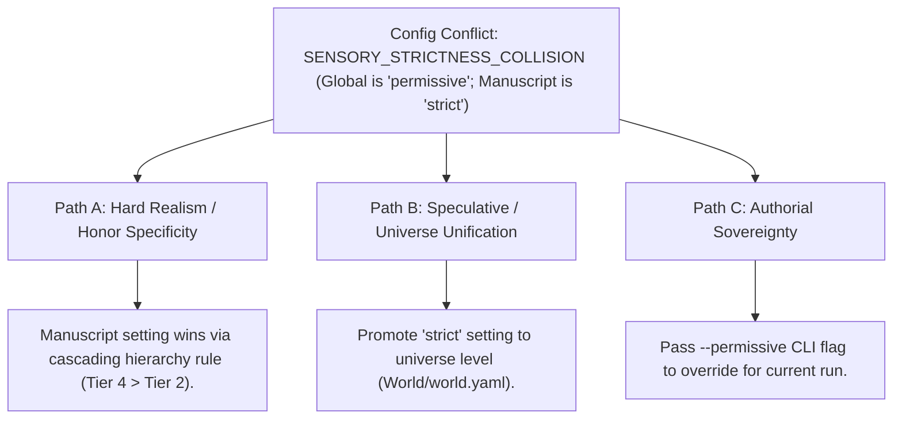

# Universal Cascading Configuration Engine (`docs/CONFIG.md`)
> **Domain F: Retrieval, Storage & Infrastructure** | **CLI:** `arcanum config` / `arcanum settings`

---

## 1. Overview & Theoretical Rationale

The **Ars Arcanum Configuration Engine** (`scripts/lib/config.py`) provides an offline, deterministic, multi-tiered cascading configuration model, YAML parser, type-coercion system, and author preference registry engineered for novelists, narrative designers, and technical editors.

Creative writing projects require granular control over validation strictness, pacing models, typography standards, and export targets. However, authors frequently work across disparate scopes:
1. **Global Preferences**: General author defaults (e.g. favorite typeface, standard trim size, daily word count goal) that should apply across all books.
2. **Universe-Specific Rules**: High-level worldbuilding strictness and conlang phoneme settings that govern an entire multi-trilogy universe.
3. **Manuscript / Volume Overrides**: Local chapter pacing targets, POV constraints, or experimental genre styles tailored to an individual book.
4. **Ad-Hoc CLI Flags**: Ephemeral runtime overrides for single-shot commands (e.g. `--strict`, `--json`).

```
+-------------------------------------------------------------------------------+
|                 ARS ARCANUM CASCADING RESOLUTION HIERARCHY                    |
|                                                                               |
|  [Tier 1: Engine Built-In Defaults]                                           |
|       |                                                                       |
|       v                                                                       |
|  [Tier 2: Global User Config]    (~/.arcanum/config.yaml)                     |
|       |                                                                       |
|       v                                                                       |
|  [Tier 3: Universe World Config] (World/world.yaml)                           |
|       |                                                                       |
|       v                                                                       |
|  [Tier 4: Manuscript Book Config](Manuscripts/Book-01/manuscript.yaml)        |
|       |                                                                       |
|       v                                                                       |
|  [Tier 5: Explicit CLI Arguments](--strict --target-words 90000)              |
|                                                                               |
|  [Result: Deterministic Resolved Runtime Context C_resolved]                  |
+-------------------------------------------------------------------------------+
```

The Configuration Engine merges these layers in order of increasing specificity, guaranteeing reproducible, deterministic behavior across all Ars Arcanum commands without cloud dependencies.

---

## 2. Mathematical Formalism & Cascading Merge Operator

### 2.1 Non-Commutative Associative Merge Operator ($\oplus$)
Let $\mathcal{C}_1$ and $\mathcal{C}_2$ be two configuration mappings from keys $K$ to values $V$.

The right-dominant merge operator $\oplus$ is defined as:

$$(\mathcal{C}_1 \oplus \mathcal{C}_2)(k) = \begin{cases} 
\mathcal{C}_1(k) \oplus \mathcal{C}_2(k) & \text{if } \mathcal{C}_1(k) \text{ and } \mathcal{C}_2(k) \text{ are nested dictionaries} \\
\mathcal{C}_2(k) & \text{if } k \in \operatorname{dom}(\mathcal{C}_2) \land \mathcal{C}_2(k) \ne \text{nil} \\
\mathcal{C}_1(k) & \text{if } k \in \operatorname{dom}(\mathcal{C}_1) \land k \notin \operatorname{dom}(\mathcal{C}_2)
\end{cases}$$

The fully resolved configuration $\mathcal{C}_{\text{resolved}}$ evaluates sequentially:

$$\mathcal{C}_{\text{resolved}} = \mathcal{C}_{\text{defaults}} \oplus \mathcal{C}_{\text{global}} \oplus \mathcal{C}_{\text{universe}} \oplus \mathcal{C}_{\text{manuscript}} \oplus \mathcal{C}_{\text{cli}}$$

```
Merge Precedence:
[ Defaults ] <--- [ Global ] <--- [ Universe ] <--- [ Book ] <--- [ CLI Flags (Highest) ]
```

### 2.2 Dot-Notation Property Key Path Resolution
Nested configuration keys are addressed using dot-separated paths $p = \langle k_1.k_2.\dots.k_n \rangle$:

$$\text{Lookup}(C, \langle k_1, k_2, \dots, k_n \rangle) = \begin{cases} C[k_1] & \text{if } n = 1 \\ \text{Lookup}(C[k_1], \langle k_2, \dots, k_n \rangle) & \text{if } n > 1 \land k_1 \in \operatorname{dom}(C) \\ \text{None} & \text{otherwise} \end{cases}$$

---

## 3. Master Configuration Schema Reference

```yaml
# Global / Manuscript Configuration (config.yaml / manuscript.yaml)

pacing:
  default_paradigm: "save_the_cat"     # three_act, save_the_cat, heros_journey, etc.
  target_words_per_scene: 2500          # Ideal word target per scene unit
  max_scene_word_overrun: 1.5           # Flags scenes exceeding target * 1.5
  cliffhanger_frequency_target: 0.70    # Expected percentage of chapters ending on hooks

sensory:
  min_channels_per_scene: 3             # Non-visual sensory channels required (sound, smell, touch...)
  overpowering_visual_ratio: 0.85       # Flags chapters where sight exceeds 85% of sensory words

typography:
  style: "american"                     # 'american' (em-dash) or 'british' (spaced en-dash)
  enforce_directional_quotes: true      # Convert straight quotes to curly
  enforce_nonbreaking_spaces: true      # Lock units and chapter titles
  max_measure_characters: 75            # Bringhurst line-length boundary

worldbuilding:
  strictness: "warning"                 # 'error', 'warning', 'permissive'
  allow_unresolved_wikilinks: false     # Flags missing lore notes
  enforce_chronology: true              # Validates birth/death/event timelines

typesetting:
  page_size: "6x9in"                    # Standard trade paperback trim size
  font_family: "Minion Pro"             # Primary serif reading face
  font_size_pt: 11.0
  line_height_ratio: 1.40

autosave:
  interval_sec: 60                      # Local snapshot persistence interval
  max_backup_snapshots: 50              # Rolling snapshot retention limit
```

---

## 4. CLI Execution & Option Reference

```bash
# 1. Display all currently resolved configuration settings
arcanum config --list

# 2. Query a specific setting value using dot-notation
arcanum config get pacing.default_paradigm

# 3. Set a global user-level parameter
arcanum config set sensory.min_channels_per_scene 4 --global

# 4. Set a local manuscript-level parameter (writes to active manuscript.yaml)
arcanum config set typography.style british

# 5. Reset configuration key to factory defaults
arcanum config reset pacing.max_scene_word_overrun

# 6. Output active configuration as JSON
arcanum config --json
```

### Parameter Reference Table

| Parameter | Short | Type | Default | Description |
|---|---|---|---|---|
| `command` | (Positional) | `choice` | `list` | Operation: `list`, `get`, `set`, `reset`. |
| `key_path` | (Positional) | `str` | `None` | Dot-separated configuration key path. |
| `value` | (Positional) | `str` | `None` | New value to set (with automatic type coercion). |
| `--global` | `-g` | `bool` | `False` | Targets `~/.arcanum/config.yaml` rather than local repo. |
| `--json` | `-j` | `bool` | `False` | Outputs resolved configuration tree as JSON. |

---

## 5. Tri-Fold Creative Advisory Resolutions



### Scenario: Cascading Override Discrepancy
- **Path A (Hard Realism / Mathematical Hierarchy)**:
  - The engine adheres strictly to the cascading rule: the local manuscript file has highest precedence over global settings.
- **Path B (Universe Unification)**:
  - If the author intends for all books in the series to share the same strict sensory standard, promote the setting to `World/world.yaml`.
- **Path C (Authorial Sovereignty)**:
  - Pass runtime CLI flags (e.g. `arcanum preflight --permissive`) to bypass local configuration constraints for emergency drafting sessions.

---

## 6. Recommended Reading, References & Media

### 6.1 Foundational Configuration & Systems Architecture Treatises
- **Wiggins, Adam (2011)**. *The Twelve-Factor App: Configuration*. [12factor.net/config](https://12factor.net/config).  
  *The defining software doctrine on strict separation of configuration from code, environment-specific overrides, and declarative manifests.*
- **Fowler, Martin (2002)**. *Patterns of Enterprise Application Architecture*. Addison-Wesley. ISBN: 978-0321127426.  
  *Classical architectural treatise establishing layered parameter inheritance, registry patterns, and immutable value objects.*
- **Abelson, Harold, Sussman, Gerald Jay, & Sussman, Julie (1996)**. *Structure and Interpretation of Computer Programs* (2nd Edition). MIT Press.  
  *Foundational principles of layered evaluation frames, lexical scoping, and symbol resolution tables.*

### 6.2 Data Serialization & Schema Standards
- **Ben-Kiki, Oren, Evans, Clark, & döt Net, Ingy (2009)**. *YAML Ain't Markup Language (YAML™) Version 1.2*. YAML.org. [yaml.org/spec/1.2.2](https://yaml.org/spec/1.2.2/).  
  *The normative specification for hierarchical data serialization, anchor references, and type schemas.*
- **Wright, Austin & Andrews, Henry (2020)**. *JSON Schema: A Media Type for Describing JSON Documents*. IETF Draft. [json-schema.org](https://json-schema.org/).  
  *International standard for structural validation, type constraints, and default value propagation.*

### 6.3 Video Lectures, Masterclasses & Workflow Media
- **Brandon Sanderson's BYU Creative Writing Lectures**: *Customizing Your Writing Environment and Tracking Parameters*.  
  *Structuring authorial parameters for word counts, goals, and style guidelines.*
- **Obsidian Community**: *Global vs Vault-Level Settings: Architecting Multi-Project Workspaces*.  
  *Best practices for cascading vault configurations.*
- **Computerphile**: *Parsing and Lexing Data: How Configuration Files are Evaluated*.  
  *Step-by-step breakdown of AST parsing and dictionary merges.*

### 6.4 Landmark Speculative Case Studies
- **Sanderson, Brandon**: *The Cosmere Internal Style Guide and Dragonsteel Parameters*.  
  *Detailed configuration guidelines governing terminology, capitalizations, and magic system naming across dozens of novels.*
- **Lucasfilm Story Group**: *Star Wars Holocron Continuity Database Tiering*.  
  *Multi-tier canon authority hierarchy (G-Canon, T-Canon, C-Canon, S-Canon) analogous to cascading configuration resolution.*
