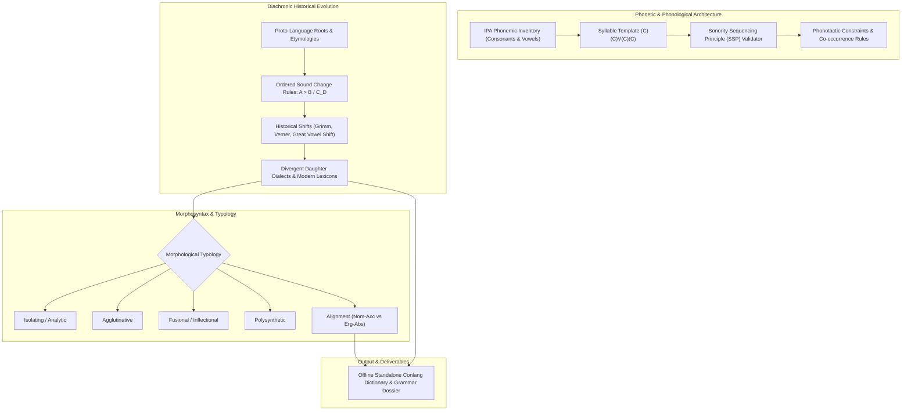

# Constructed Languages, Phonology, Morphology & Historical Sound Change (`docs/CONLANG.md`)
> **Domain C: Characters, Society, Conlangs & Magic** | **CLI:** `arcanum conlang` / `arcanum ipa`

---

## 1. Executive Summary & Epistemological Architecture

The **Ars Arcanum Conlang & Linguistics Engine** (`scripts/lib/conlang.py`) is an offline phonetic inventory compiler, phonotactic rule validator, diachronic sound change simulator, and morphological typology analyzer engineered for conlangers, worldbuilders, and speculative novelists.

Language is the primary cultural operating system of any sentient species. Fictional constructed languages (conlangs) frequently suffer from amateur design pitfalls:
1. **The Re-Lexified English Fallacy (`LNG-101`)**: Creating a conlang that simply swaps English words 1:1 for invented strings while retaining identical English grammar, idioms, and irregular syntax.
2. **Apostrophe / Letter Salad (`LNG-102`)**: Inserting unpronounceable clusters and arbitrary apostrophes without defining underlying glottal stops, ejective consonants, or phonotactic constraints.
3. **Phonotactic Lawlessness (`LNG-103`)**: Generating root words that violate the Sonority Sequencing Principle (e.g., word-initial $/rtk-/$) without epenthesis or historical phonological justification.
4. **Diachronic Amnesia (`LNG-104`)**: Depicting an ancient proto-language remaining 100% unchanged across 3,000 years without regular sound shifts, grammatical erosion, or dialect branching.

The Conlang Engine ingests phonemic matrices, validates syllable templates against the Sonority Hierarchy, executes regular diachronic sound change cascades ($A > B \ / \ C \_ D$), and builds structured morphological lexicons.



---

## 2. Phonetic Inventory Design & The IPA Matrix

A naturalistic conlang begins with a balanced subset of the **International Phonetic Alphabet (IPA)**.

```
                      [ CONSONANT ARTICULATION GRID ]
  Place:  Bilabial  Alveolar  Postalveolar  Palatal  Velar  Uvular  Glottal
  Plosive   p  b      t  d                   c  ɟ    k  g    q  ɢ     ʔ
  Nasal        m         n                   ɲ       ŋ
  Fricative    ɸ  β   s  z      ʃ  ʒ         ç  ʝ    x  ɣ    χ  ʁ     h
  Approximant  w         l                   j       w
```

### 2.1 Consonant Naturalism & Symmetry
- **Symmetry Principle**: Natural languages exhibit phonemic symmetry. If a language has $/p, t, k/$, it almost always has corresponding voiced stops $/b, d, g/$ or nasals $/m, n, \eta/$.
- **Phoneme Count**: Typical human languages utilize $20\text{–}35$ consonants and $5\text{–}8$ vowels (e.g., Spanish: 19 consonants, 5 vowels; Hawaiian: 8 consonants, 5 vowels; Georgian: 28 consonants, 5 vowels; Ubykh: 84 consonants, 2 vowels).

### 2.2 Vowel Space (The Trapezius)
Vowels are defined by tongue height, tongue backness, and lip rounding:

```
             Front         Central         Back
   Close:    i   y            ɨ            u   o
   Mid:      e   ø            ə            o
   Open:     a                             ɑ
```

---

## 3. Phonotactics & The Sonority Sequencing Principle (SSP)

Phonotactics governs which phoneme combinations are legally permissible within a syllable.

```
                           [ SYLLABLE ANATOMY ]
                               Syllable (σ)
                               /          \
                        Onset (O)       Rime (R)
                                        /      \
                                  Nucleus (N)   Coda (C)
```

### 3.1 The Universal Sonority Scale
Phonemes possess an intrinsic acoustic loudness and sonority rank:

$$\text{Low Sonority} \longleftrightarrow \text{High Sonority}$$

$$\begin{array}{ccccccccc}
\text{Voiceless Stops} & < & \text{Voiced Stops} & < & \text{Fricatives} & < & \text{Nasals} & < & \text{Liquids } (l, r) & < & \text{Glides } (w, j) & < & \text{Vowels} \\
(0) & & (1) & & (2\text{--}3) & & (4) & & (5) & & (6) & & (7)
\end{array}$$

### 3.2 The Sonority Sequencing Principle (SSP)
> In any valid syllable, **sonority must rise monotonically from the onset to the peak nucleus (vowel), and fall monotonically from the nucleus to the coda**.

- *Valid Onset*: $/p/ (0) \to /l/ (5) \to /a/ (7)$ in English *"play"*.
- *Invalid Onset (`LNG-103`)*: $/l/ (5) \to /p/ (0) \to /a/ (7)$ (*"lpa"*) violates the SSP because sonority drops before reaching the nucleus.

---

## 4. Diachronic Sound Change & Historical Linguistics

Natural languages evolve via regular, exceptionless sound shifts. Sound change is written in standard linguistic notation:

$$A > B \ / \ C \_ D$$
*(Sound $A$ becomes sound $B$ when preceded by environment $C$ and followed by environment $D$).*

```
                 [ HISTORICAL SOUND LAW EXAMPLES ]
  1. Lenition (Weakening):        V_V  :  p, t, k > b, d, g > β, ð, ɣ > Ø
  2. Palatalization before /i, e/: k > tʃ > ʃ  (e.g., Latin centum [k] > Fr. cent [s])
  3. Final Vowel Deletion (Apocope): V# > Ø   (e.g., Proto-Germanic *dōmaz > Eng. doom)
```

### 4.1 Landmark Historical Laws

#### 1. Grimm’s Law (Proto-Indo-European $\to$ Proto-Germanic)
1. PIE voiceless stops become voiceless fricatives:
   $$*p, *t, *k > *f, *\theta, *h \quad (\text{PIE } *p\acute{e}d- \to \text{Eng. } foot, \text{Latin } pes/pedis)$$
2. PIE voiced stops become voiceless stops:
   $$*b, *d, *g > *p, *t, *k \quad (\text{PIE } *d\acute{e}k\widehat{m} \to \text{Eng. } ten, \text{Latin } decem)$$
3. PIE voiced aspirated stops become voiced stops/fricatives:
   $$*b^h, *d^h, *g^h > *b, *d, *g \quad (\text{PIE } *b^h\acute{e}r- \to \text{Eng. } bear, \text{Latin } fero)$$

#### 2. The Great Vowel Shift (Middle English $\to$ Early Modern English)
All Middle English long vowels underwent systematic raising and diphthongization:
- $/i:/ > /a\text{ɪ}/$ (*bite*: $/bi:t/ \to /ba\text{ɪ}t/$)
- $/u:/ > /a\text{ʊ}/$ (*house*: $/hu:s/ \to /ha\text{ʊ}s/$)
- $/e:/ > /i:/$ (*feed*: $/fe:d/ \to /fi:d/$)
- $/o:/ > /u:/$ (*boot*: $/bo:t/ \to /bu:t/$)

---

## 5. Morphological Typology & Grammatical Alignment

```
                        [ MORPHOLOGICAL SPECTRUM ]
  ISOLATING / ANALYTIC ──► 1 word = 1 morpheme; zero affixes (Mandarin, Vietnamese)
  AGGLUTINATIVE        ──► Linear affixes chained cleanly like beads (Turkish, Finnish, Quenya)
  FUSIONAL             ──► Multiple grammatical categories fused in 1 affix (Latin, Russian)
  POLYSYNTHETIC        ──► Entire complex sentences encoded in 1 giant verb (Navajo, Inuktitut)
```

### 5.1 Morphological Typology Grid

| Typology Type | Morpheme-to-Word Ratio | Morpheme Boundary Clarity | Example Construction | Real & Fictional Analogs |
|---|---|---|---|---|
| **Isolating (Analytic)** | $1 : 1$ | No affixes; rigid syntax | *I PAST eat apple* | Mandarin, Classical Chinese |
| **Agglutinative** | $3\text{–}6 : 1$ | Crystal clear, transparent | *house-my-in-from* | Turkish, Finnish, Quenya |
| **Fusional (Synthetic)**| $2\text{–}4 : 1$ | Fused, unsegmentable | *am-o* ("I love" - 1st, Sing, Pres, Indic) | Latin, Ancient Greek, Sindarin |
| **Polysynthetic** | $> 6 : 1$ | Nouns incorporated into verbs | *he-it-sword-with-struck-them* | Inuktitut, Nahuatl, Klingon |

### 5.2 Grammatical Alignment: Accusative vs Ergative

```
  NOMINATIVE-ACCUSATIVE (English, Latin)
  - Intransitive: [The King] (NOM) sleeps.
  - Transitive:   [The King] (NOM) sees [the dragon] (ACC).
  
  ERGATIVE-ABSOLUTIVE (Basque, Sumerian, Klingon)
  - Intransitive: [The dragon] (ABS) sleeps.
  - Transitive:   [The King] (ERG) slays [the dragon] (ABS).
```

- **Nominative-Accusative**: Marks the Subject of an intransitive verb and the Agent of a transitive verb identically (Nominative), while marking the Patient differently (Accusative).
- **Ergative-Absolutive**: Marks the Subject of an intransitive verb identically to the Patient/Object of a transitive verb (Absolutive), while giving a special marked case to the Agent (Ergative).

---

## 6. Worked Step-by-Step Conlang Evolution

### Scenario: Evolving Proto-Solar into High Aurelian

#### Step 1: Define Proto-Language Root Lexicon
- `*katar` ("sun / star")
- `*pok-` ("to burn")
- `*mori` ("water / ocean")
- `*dwen` ("mountain")

#### Step 2: Apply Historical Sound Change Cascade
1. **Rule 1 (Intervocalic Voicing)**: Voiceless stops become voiced between vowels:
   $$p, t, k > b, d, g \ / \ V \_ V$$
   - `*katar` $\to$ `*kadar`
   - `*pok-` + `-a` $\to$ `*poga`
2. **Rule 2 (Velar Palatalization)**: Velars become postalveolar affricates before front vowels $/i, e/$:
   $$k, g > tʃ, dʒ \ / \ \_ [i, e]$$
   - `*katar` (no change: $/a/$ is back/open).
3. **Rule 3 (Apocope)**: Final short unstressed vowels drop:
   $$V_{\text{final}} > \emptyset \ / \ \_ \#$$
   - `*kadar` $\to$ `*kadar`
   - `*mori` $\to$ `*mor`
4. **Rule 4 (Spirantization of Voiced Stops)**:
   $$b, d, g > v, \delta, \gamma \ / \ V \_ V$$
   - `*kadar` $\to$ `*kaðar`
   - `*poga` $\to$ `*poɣa`

#### Step 3: Resulting Modern High Aurelian Words
- `kaðar` [ˈka.ðar] = "The Sun" (Noun)
- `poɣa` [ˈpo.ɣa] = "To blaze / burn" (Verb)
- `mor` [mɔr] = "The Sea" (Noun)
- `dwen` [dwen] = "Peak / Citadel" (Noun)

---

## 7. Practical YAML Schemas

```yaml
schema_version: "2.0"
conlang:
  id: "high_aurelian"
  name: "High Aurelian"
  typology: "agglutinative"
  alignment: "ergative_absolutive"
  basic_word_order: "SOV"

phonology:
  consonants_ipa: ["p", "b", "t", "d", "k", "g", "m", "n", "s", "z", "ð", "ɣ", "l", "r", "w", "j"]
  vowels_ipa: ["i", "e", "a", "o", "u"]
  syllable_template: "(C)(C)V(C)"
  sonority_scale_enforced: true

sound_change_rules:
  - id: "intervocalic_voicing"
    notation: "p,t,k > b,d,g / V_V"
    chronology_order: 1
  - id: "final_apocope"
    notation: "V > 0 / _#"
    chronology_order: 2

lexicon:
  - id: "sun_root"
    proto_form: "*katar"
    modern_form: "kaðar"
    ipa: "/ˈka.ðar/"
    part_of_speech: "noun"
    gloss: "sun, celestial sovereign"

  - id: "burn_verb"
    proto_form: "*pok-"
    modern_form: "poɣa"
    ipa: "/ˈpo.ɣa/"
    part_of_speech: "verb"
    gloss: "to burn, to radiate"
```

---

## 8. CLI Reference & Scriptorium Integration

```bash
# Validate IPA phoneme inventory and syllable template against SSP rules
arcanum conlang --audit World/Linguistics/aurelian.yaml

# Execute diachronic sound change simulation on proto-lexicon
arcanum conlang --evolve --proto World/Linguistics/proto_roots.yaml --rules World/Linguistics/sound_laws.yaml

# Generate standalone offline HTML grammar and dictionary compendium
arcanum conlang --dictionary World/Linguistics/aurelian.yaml --html reports/conlang_dossier.html
```

---

## 9. Recommended Reading, References & Media

### Foundational Craft & Academic Textbooks
- **Rosenfelder, Mark (2010)**. *The Language Construction Kit*. Yonagu Books.  
  *The undisputed foundational bible of amateur and professional constructed languages.*
- **Peterson, David J. (2015)**. *The Art of Language Invention: From Horse-Lords to Dark Elves, the Words Behind World-Building*. Penguin Books.  
  *Masterclass by the creator of Dothraki and High Valyrian on phonetic naturalism, case morphology, and sound change.*
- **Campbell, Lyle (2013)**. *Historical Linguistics: An Introduction* (3rd ed.). MIT Press.  
  *The university standard on the comparative method, sound shift notation, internal reconstruction, and dialect geography.*
- **Comrie, Bernard (1989)**. *Language Universals and Linguistic Typology* (2nd ed.). University of Chicago Press.  
  *Authoritative study of grammatical alignment (ergativity, accusativity) and cross-linguistic word order patterns.*
- **Tolkien, J.R.R. (1931/1983)**. "A Secret Vice: An Essay on Invented Languages." In *The Monsters and the Critics*, George Allen & Unwin.  
  *Tolkien's philosophical treatise on the aesthetic pleasure of phonetic co-fitness and linguistic worldbuilding.*

### Landmark Scientific & Linguistic Papers
- **Grimm, Jacob (1822)**. *Deutsche Grammatik* (2nd ed.). Dieterich.  
  *Formulated Grimm's Law of Germanic consonant shifts.*
- **Verner, Karl (1877)**. "Eine Ausnahme der ersten Lautverschiebung." *Zeitschrift für vergleichende Sprachforschung*, 23(2), 97–130.  
  *Formulated Verner's Law demonstrating that apparent exceptions to sound laws are governed by accentual rules.*
- **Greenberg, Joseph H. (1963)**. "Some universals of grammar with particular reference to the order of meaningful elements." In *Universals of Language*, MIT Press.  
  *The bedrock paper identifying 45 cross-linguistic grammatical implicational universals.*

### Seminal Video Lectures, Masterclasses & Channels
- **Biblaridion** (YouTube Series: *Feature Conlang Series: Phonology, Morphology & Sound Shifts*).  
  *The gold standard of step-by-step diachronic conlang construction on YouTube.*
- **Artifexian** (YouTube Series: *Phonetics, IPA, Syllable Structure & Grammar Masterclasses*).  
  *Extremely clear, visual animations teaching conlang mechanics for worldbuilders.*
- **NativLang** (YouTube Series: *The History of Writing*, *How Proto-Indo-European Conquered the World*).  
  *Deep historical linguistics animations illustrating real-world language evolution.*

### Landmark Speculative Case Studies
- **Tolkien, J.R.R.** *The Lord of the Rings* & *The Silmarillion* (Quenya and Sindarin as fully realized historical languages descending from Primitive Quendian).
- **Peterson, David J.** *Game of Thrones* (Dothraki and High Valyrian, illustrating agglutination, four grammatical genders, and noun classes).
- **Okrand, Marc**. *Star Trek* (Klingon, designed with OVS syntax, glottal stops, and harsh uvular fricatives to sound aggressively alien).
- **Chiang, Ted**. *Story of Your Life* (Arrival) (Heptapod B as a non-linear, semasiographic visual language reflecting a non-sequential perception of time).
