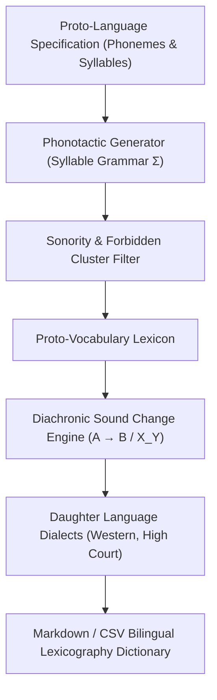
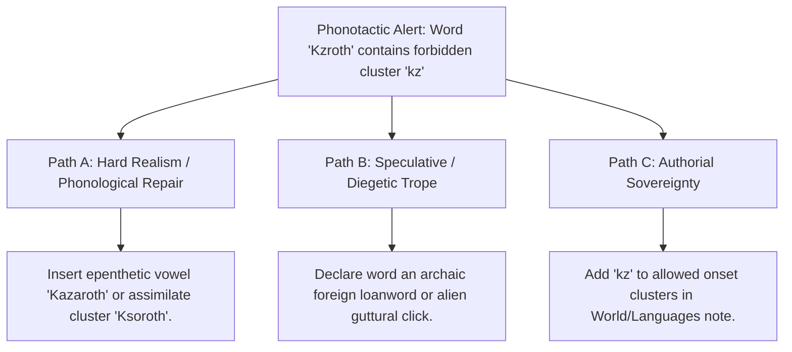

# Conlang Phonotactics, Historical Sound-Change & Lexicography (`docs/CONLANG.md`)
> **Domain B: Linguistics, Conlang, Idioms & Stylistics** | **CLI:** `arcanum conlang` / `arcanum mutate`

---

## 1. Overview & Theoretical Rationale

The **Ars Arcanum Conlang Engine** (`scripts/lib/conlang.py`) is an offline linguistic generator, phonotactic constraint enforcer, diachronic sound-shift simulator, and bilingual lexicography manager designed for worldbuilders, fantasy novelists, and narrative conlangers.

Randomly invented fantasy names and alien terms frequently sound jarring, generic, or phonologically incoherent. When an author names one city *Kz'rath* and its neighbor *Llanfairion*, readers perceive linguistic inconsistency unless an explicit historical migration or language family explains the disparity.

The Conlang Engine applies principles of formal phonology (the Sonority Sequencing Principle, syllable template grammars, and phonotactic filters) and historical-comparative linguistics (Neogrammarian regular sound change laws $A \to B / X\_Y$, Grimm's/Verner's sound shifts) to generate consistent vocabulary, simulate language family evolution, and manage bilingual glossaries with deterministic reproducibility.

---

## 2. Formal Linguistics & Mathematical Formulation



### 2.1 Syllable Grammar & Combinatoric Space
Let a language define consonant inventory $\mathcal{C}$ and vowel inventory $\mathcal{V}$. A syllable structure template $T \in \mathcal{T}$ defines allowable clusters:

$$\Sigma = C_0^{k} \, V_1^{m} \, C_0^{j} \quad (k = \text{max onset consonants}, m = \text{nucleus vowels}, j = \text{max coda consonants})$$

The raw combinatoric capacity for a disyllabic word template $T_1 T_2 = (\text{CVC})(\text{CVC})$ is:
$$|\mathcal{W}| = |\mathcal{C}| \times |\mathcal{V}| \times |\mathcal{C}| \times |\mathcal{C}| \times |\mathcal{V}| \times |\mathcal{C}| = |\mathcal{C}|^4 |\mathcal{V}|^2$$

### 2.2 Sonority Sequencing Principle (SSP)
The engine validates that within any syllable, sonority strictly rises toward the nucleus and strictly falls toward the coda:

$$\mathcal{S}(\text{Plosive/Stop}) < \mathcal{S}(\text{Fricative}) < \mathcal{S}(\text{Nasal}) < \mathcal{S}(\text{Liquid}) < \mathcal{S}(\text{Glide}) < \mathcal{S}(\text{Vowel})$$
$$\text{SSP Invariant}: \quad \frac{\partial \mathcal{S}}{\partial x_{\text{onset}}} > 0 \quad \text{and} \quad \frac{\partial \mathcal{S}}{\partial x_{\text{coda}}} < 0$$

Forbidden consonant clusters (e.g. `["thk", "sr", "kp"]`) are eliminated via regex lookahead masks before output.

### 2.3 Formal Diachronic Sound Shift Laws ($A \to B / X\_Y$)
Historical phonetic evolution is modeled as deterministic rewrite rules evaluated in discrete chronological strata:

$$A \to B \quad / \quad X \underline{\quad} Y$$

Where:
- $A$: Target phoneme string undergoing mutation.
- $B$: Resulting phoneme string ($\emptyset$ indicates deletion/apocope).
- $X$: Left context constraint ($V$ for vowel, $C$ for consonant, $\#$ for word boundary, or literal phonemes).
- $Y$: Right context constraint.

Examples of formal sound laws implemented:
- **Intervocalic Lenition**: `p > b / V_V` (e.g., *apata* $\to$ *abata*)
- **Palatalization**: `k > ch / _[e,i]` (e.g., *keli* $\to$ *cheli*)
- **Word-Final Apocope**: `e > 0 / _#` (e.g., *mate* $\to$ *mat*)
- **Initial Debuccalization**: `s > h / #_` (e.g., *solas* $\to$ *holas*)

---

## 3. Subfeatures Matrix

| Subfeature | Algorithmic Mechanism | Diagnostic Output / Rule | Narrative Craft Significance |
|---|---|---|---|
| **Phonotactic Word Generator** | Syllable template assembler filtered by sonority hierarchy. | Generates phonotactically legal names, places, and terms. | Ensures all invented names in a culture sound natively authentic. |
| **Contextual Sound-Shift Engine** | Evaluates regular expressions for $A \to B / X\_Y$ transformations. | Simulates dialect drift and daughter language derivation. | Models natural historical language evolution over centuries. |
| **Forbidden Cluster Validator** | Regex token scanner against language profile blacklist. | Flags `PHONO_ILLEGAL_CLUSTER` in manuscript terms. | Catches spelling mistakes and non-canonical phoneme combinations. |
| **Markdown Lexicon Parser** | Extracts GFM tables from `World/Languages/*.md`. | Builds searchable bilingual dictionary (JSON/CSV). | Organizes in-world vocabulary without requiring external spreadsheet tools. |
| **Deterministic Seeding Engine** | Pseudo-random number generator anchored by `--seed INT`. | Produces identical name-sets on repeat invocations. | Guarantees test reproducibility and consistent world generation. |

---

## 4. Author Extension & Configuration Guide

### 4.1 Language Specification File (`World/Languages/High_Valyrian.md`)
```markdown
---
name: "High Valyrian"
type: language
family: "Valyrian"
consonants: [k, l, r, m, n, s, v, th, p, t, z, d, g]
vowels: [a, e, i, o, u, ae, oe]
syllable_structures: ["CV", "CVC", "CCV", "VC"]
forbidden_clusters: ["thk", "sr", "kp", "td"]
stress_rule: "penultimate"
sound_changes:
  - "p > b / V_V"
  - "k > ch / _[e,i]"
  - "e > 0 / _#"
---

# High Valyrian
The liturgical tongue of the dragonlords.

## Essential Vocabulary
| Foreign Word | Part of Speech | Pronunciation | English Translation | Cultural Connotation |
| :--- | :--- | :--- | :--- | :--- |
| *Drakarys* | Noun / Imperative | /dra'ka.rys/ | Dragonfire | Command to breathe flame |
| *Valar* | Noun (Plural) | /'va.lar/ | All Men | Philosophical collective |
| *Morghulis* | Verb | /mor'gu.lis/ | Must Die | Fatalistic mortal truth |
```

---

## 5. Command-Line Interface (CLI) Reference

```bash
# Generate 10 character names in Solar Tongue
arcanum conlang generate "Solar Tongue" -w World/ -n 10 -t name

# Generate 5 toponyms (places) with deterministic seed
arcanum conlang generate "Solar Tongue" -w World/ -n 5 -t place --seed 1337

# Apply historical sound shifts from language note to a phrase
arcanum conlang mutate "Solar Tongue" "apata keli mate" -w World/

# Apply an ad-hoc custom sound law directly from terminal
arcanum conlang mutate "Solar Tongue" "solas" -w World/ -r "s > h / #_"

# Search language vocabulary for translation or meaning
arcanum conlang lexicon "Solar Tongue" -w World/ -q "fire"

# Export vocabulary table to CSV
arcanum conlang lexicon "Solar Tongue" -w World/ --export-csv exports/solar_dict.csv

# Query linguistic theory and Neogrammarian sound law mechanics
arcanum doc conlang --math --why
```

---

## 6. Tri-Fold Creative Advisory Resolutions



### Scenario: Forbidden Cluster Alert in Term `Kzroth`
- **Path A (Hard Realism / Phonological Repair)**:
  - Insert an epenthetic vowel to break the illegal consonant cluster (*Kazaroth* or *Kezroth*).
  - Or, assimilate the plosive-fricative cluster to follow natural phonotactics (*Ksoroth*).
- **Path B (Speculative / Diegetic Trope)**:
  - Justify the anomalous phonetics as a loanword inherited from an ancient subterranean goblin dialect or non-human physiology (e.g., vocal tracts with dual syrinxes).
- **Path C (Authorial Sovereignty)**:
  - Add `kz` to `syllable_structures` in the language profile YAML frontmatter, declaring it a canonical feature of the language.

---

## 7. Content Security Policy & Offline Isolation

All conlang generation and lexicon exports execute 100% offline with zero cloud API dependencies:

```html
<meta http-equiv="Content-Security-Policy" content="default-src 'none'; style-src 'unsafe-inline'; script-src 'unsafe-inline'; img-src data:; media-src data: blob:;">
```
