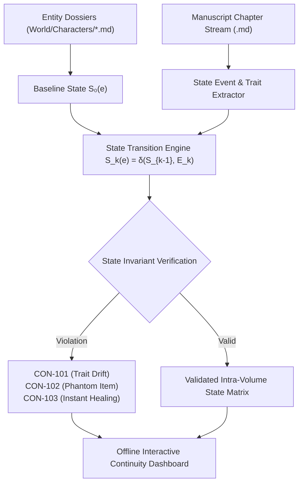

# Intra-Volume Continuity Verifier & State Transition Auditor (`docs/CONTINUITY.md`)
> **Domain D: Stylistics, Polish & Continuity** | **CLI:** `arcanum continuity` / `arcanum state`

---

## 1. Overview & Theoretical Rationale

The **Ars Arcanum Continuity Engine** (`scripts/lib/continuity.py`) is a deterministic state-machine validator, entity lifecycle tracker, and factual consistency auditor engineered for novelists and developmental editors.

During the drafting of a 100,000+ word manuscript, human working memory naturally decays across months of writing. This decay creates common intra-volume continuity bugs:
1. **Physical Trait Mutation (`CON-101`)**: A character's eyes shift from amber to violet between Chapter 4 and Chapter 22; scars or amputations spontaneously vanish.
2. **Spontaneous Inventory Creation / Vanishing (`CON-102`)**: A warrior draws a broadsword that was shattered in the prior chapter, or expends arrows with an empty quiver.
3. **Wound Recovery Deficit (`CON-103`)**: A protagonist suffers a broken femur in Chapter 12 and is running full sprints in Chapter 13 without medical or magical healing latency.
4. **Spatial Bilocation & Warp Travel (`CON-104`)**: A character travels 300 miles on horseback in four hours without magical transport.
5. **Canonical Fact Drift (`CON-105`)**: Historical dates, fortress names, or lineage titles shifting within the same book.

The Continuity Engine maintains an entity attribute state transition graph across manuscript chapters, validating that every state change is mediated by an explicit in-text causal event.



---

## 2. Mathematical State Machine Formulation & Invariants

### 2.1 The Entity State Invariance Theorem
Let an entity $e \in \mathcal{E}$ possess a set of properties $\mathcal{P}(e) = \{p_1, p_2, \dots, p_m\}$ (e.g. `eye_color`, `dominant_hand`, `health_status`, `location`, `inventory`).

Let scene $S_k$ occur at narrative index $k$. The state of entity $e$ at scene $S_k$ is represented by the vector $\vec{\sigma}_k(e) = [p_1(k), p_2(k), \dots, p_m(k)]$.

$$\text{State Transition Function}: \quad \vec{\sigma}_k(e) = \delta\left( \vec{\sigma}_{k-1}(e), \, \mathcal{E}_k(e) \right)$$

Where $\mathcal{E}_k(e)$ is the set of explicit causal modification events occurring in scene $k$.

$$\text{Continuity Invariant}: \quad \forall p \in \mathcal{P}(e), \quad p(k) \neq p(k-1) \implies \exists \text{ Explicit Event } E \in \mathcal{E}_k(e) \text{ modifying } p$$

If $p(k) \neq p(k-1)$ and $\mathcal{E}_k(e) = \emptyset$, the engine deterministically raises an invariant breach (`CON-101` or `CON-102`).

### 2.2 Wound Healing & Trauma Latency Dynamics
Physical injuries $W$ possess an anatomical severity score $S(W) \in [1, 10]$ and an expected physiological recovery half-life $t_{\text{half}}$ (measured in in-world calendar days):

$$H(t) = 1.0 - \exp\left( -\frac{\ln(2) \cdot (t - t_{\text{injury}})}{t_{\text{half}} \cdot \kappa_{\text{care}}} \right)$$

Where $\kappa_{\text{care}}$ is the medical care modifier ($\kappa = 1.0$ for standard rest, $\kappa = 0.2$ for battlefield triage, $\kappa = 5.0$ for master alchemical regeneration).

$$\text{Action Feasibility}: \quad \text{ExertionRequirement}(A) \le (1.0 - S(W) \cdot (1.0 - H(t)))$$

If a character attempts sprint combat ($A = 0.90$) while $H(t) = 0.10$ for a shattered clavicle ($S = 8$), the engine flags `CON-103: TRAUMA_LATENCY_VIOLATION`.

### 2.3 Overland Velocity & Spatial Reachability
For an entity moving between coordinates $\vec{x}_A$ and $\vec{x}_B$ over elapsed time $\Delta t = t_B - t_A$:

$$v_{\text{required}} = \frac{\mathcal{D}_{\text{geodesic}}(\vec{x}_A, \vec{x}_B) \cdot \tau_{\text{terrain}}}{\Delta t}$$

$$\text{Spatial Validity} \iff v_{\text{required}} \le v_{\text{max}}(\text{TransportMode})$$

Where $v_{\text{max}}(\text{Foot}) \approx 5\text{ km/h}$, $v_{\text{max}}(\text{Cavalry}) \approx 15\text{ km/h}$, $v_{\text{max}}(\text{Carriage}) \approx 8\text{ km/h}$.

---

## 3. The 4-Tier Canon Hierarchy Matrix

```
+-----------------------------------------------------------------------------------+
|                        ARS ARCANUM CANON HIERARCHY LEVELS                         |
+-------------------+---------------------------------------------------------------+
| LEVEL 0: ALPHA    | Immutable Core Canon: Manuscript text already published /     |
| (Hard Invariant)  | finalized. Hard physical laws of the universe.                |
+-------------------+---------------------------------------------------------------+
| LEVEL 1: BETA     | In-World Lore Dossiers: World Bible files, historical logs,   |
| (World Bible)     | accepted genealogy trees, established faction treaties.       |
+-------------------+---------------------------------------------------------------+
| LEVEL 2: GAMMA    | Authorial Outlines & Scaffolding: Beat sheets, scene cards,   |
| (Draft Scaffolds) | tentative character notes subject to developmental revision.   |
+-------------------+---------------------------------------------------------------+
| LEVEL 3: DELTA    | Speculative / Folk Hypotheses: Unverified in-world character  |
| (Diegetic Rumor)  | rumors, unreliable narrator claims, folk mythologies.         |
+-------------------+---------------------------------------------------------------+
```

When two statements conflict, the engine resolves priority strictly in descending order ($\text{Alpha} > \text{Beta} > \text{Gamma} > \text{Delta}$).

---

## 4. Subfeatures Matrix & Diagnostic Codes

| Diagnostic Code | Flag | Trigger Condition | Corrective Action |
|---|---|---|---|
| `CON-101` | `TRAIT_MUTATION` | Character eye, hair, scar, or height differs from dossier without shapeshifting tag. | Reconcile prose description with `World/Characters/*.md`. |
| `CON-102` | `PHANTOM_ITEM` | Item used in scene without prior acquisition or after being recorded destroyed. | Insert item pickup in earlier chapter or change item used. |
| `CON-103` | `INSTANT_HEALING` | Character performs intense physical combat during active severe injury window. | Add passage of time, healing potion, or tone down injury severity. |
| `CON-104` | `BILOCATION_WARP` | Character appears in two disparate locations with impossible travel speed. | Adjust calendar timestamps or provide mounts / teleporters. |
| `CON-105` | `FACT_CONTRADICTION` | Historical date, monarch title, or castle name conflicts with Alpha canon. | Correct the errant proper noun in chapter prose. |
| `CON-106` | `GHOST_SPEECH` | Character speaks in dialogue after their death timestamp. | Remove line or tag scene explicitly as `@flashback` / `@vision`. |

---

## 5. Frontmatter Directives & State Mutation Schemas

### 5.1 Character Dossier (`World/Characters/Lady_Isolde.md`)
```yaml
---
name: "Lady Isolde of House Vance"
canon_tier: "alpha"
physical_traits:
  eye_color: "hazel_green"
  hair_color: "raven_black"
  dominant_hand: "left"
  height_cm: 172
  scars:
    - location: "left_cheek"
      origin: "duel_at_sunken_spire"
initial_inventory:
  - item: "ancestral_stiletto"
  - item: "poison_signet_ring"
---
```

### 5.2 Manuscript Scene Frontmatter & Directives (`Manuscript/Chapter-08.md`)
```markdown
---
title: "The Ambush at Blackwood"
chapter: 8
in_world_date: "1422-04-12"
location: "Blackwood_Forest"
pov: "Lady Isolde"
state_mutations:
  - entity: "Lady_Isolde"
    action: "injured"
    type: "fractured_rib"
    severity: 6 # Scale 1-10
    recovery_half_life_days: 21
  - entity: "Lady_Isolde"
    action: "lost_item"
    item: "ancestral_stiletto"
---

The club struck Isolde's ribs with a sickening crack. The stiletto tumbled into the churning mud.
```

---

## 6. Worked Step-by-Step Example

### Scenario: Tracking Wound Progression & Weapon Loss across 5 Chapters
1. **Chapter 8 ($t = 0\text{ days}$)**: Isolde suffers fractured rib ($S = 6$) and loses `ancestral_stiletto`.
2. **Chapter 9 ($t = 2\text{ days}$)**: Isolde negotiates with an apothecary. Walking is painful ($A = 0.20 \le 0.40 \implies \text{Valid}$).
3. **Chapter 10 ($t = 4\text{ days}$)**: Draft prose writes: *"Isolde drew her ancestral stiletto and scaled the 30-foot castle wall."*
   - **Audit Execution**:
     - `CON-102 Breach`: `ancestral_stiletto` was lost in Chapter 8 and never recovered.
     - `CON-103 Breach`: Scaling a 30-foot wall requires exertion $A = 0.85$, but current recovery is $H(4) = 0.12$, allowing max exertion $0.47$.
4. **Correction**:
   - Isolde purchases an iron dagger from the apothecary.
   - Isolde relies on a rope ladder lowered by her ally, clutching her bandaged ribs in agony.

---

## 7. Recommended Reading, References & Media

### 7.1 Foundational Craft & Academic Books
- **Wolf, Mark J. P. (2012)**. *Building Imaginary Worlds: The Theory and History of Subcreation*. Routledge. ISBN: 978-0415631204.  
  *The authoritative treatise on secondary world completeness, consistency, and realm ontology.*
- **Doležel, Lubomír (1998)**. *Heterocosmica: Fiction and Possible Worlds*. Johns Hopkins University Press. ISBN: 978-0801858499.  
  *Philosophical analysis of fictional authentication, truth-value within text, and intra-diegetic consistency.*
- **Egri, Lajos (1946)**. *The Art of Dramatic Writing*. Simon & Schuster. ISBN: 978-0671213329.  
  *Emphasizes character tridimensionality (Physiology, Sociology, Psychology) and behavioral constancy.*
- **Okuda, Michael & Okuda, Denise (1999)**. *The Star Trek Encyclopedia: A Reference Guide to the Future*. Pocket Books. ISBN: 978-0671536091.  
  *The industry benchmark for institutional continuity tracking, character lifecycle indexing, and canon registries.*

### 7.2 Landmark Scientific / Worldbuilding Papers & Textbooks
- **Ryan, Marie-Laure (1991)**. *Possible Worlds, Artificial Intelligence, and Narrative Theory*. Indiana University Press. ISBN: 978-0253350046.  
  *Models fictional worlds as modal systems with dynamic agent epistemic states and factual verification.*
- **Lewis, David (1978)**. "Truth in Fiction", *American Philosophical Quarterly*, 15(1), 37–46.  
  *The foundational philosophical paper defining truth conditions and counterfactual logic in storytelling.*

### 7.3 Seminal Video Lectures, Masterclasses & Channels
- **Brandon Sanderson (2020)**. *Worldbuilding Continuity & Team Workflows*, BYU Creative Writing Lectures. YouTube.  
  *Details how continuity editors (Peter Ahlstrom) maintain wiki databases and fact-check sprawling manuscripts.*
- **Tale Foundry (2019)**. *The Lore Master's Guide to Canon & Retcons*. YouTube.  
  *Examines the tiers of canon and how inconsistencies break suspension of disbelief.*
- **Hello Future Me (Tim Hickson, 2021)**. *Writing Realistic Injuries & Combat Recovery*. YouTube.  
  *Detailed medical and narrative analysis of injury recovery latencies in fiction.*

### 7.4 Landmark Speculative Case Studies
- **J.R.R. Tolkien, *The Lord of the Rings* (1954–1955)**: Tolkien's meticulous phase-of-the-moon and marching distance cross-checks between Frodo and Aragorn's timelines.
- **Patrick O'Brian, *Aubrey-Maturin Series* (1969–2000)**: Unrivaled maritime historical continuity tracking naval supplies, crew rosters, and physical wounds across 20 novels.
