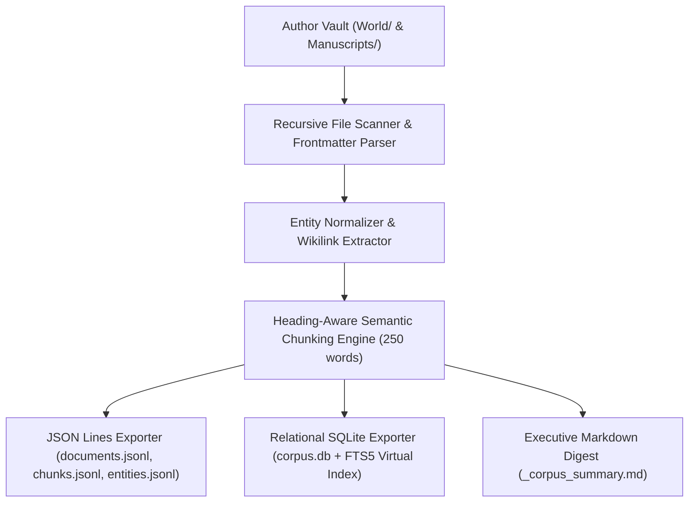
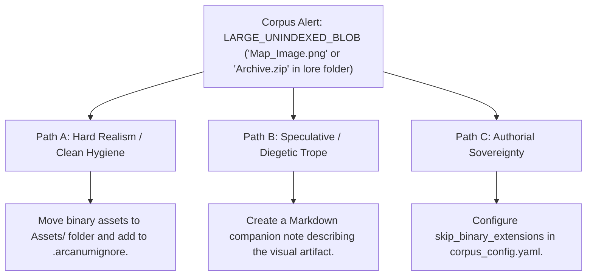

# Universal Structured Corpus & RAG Dataset Exporter (`docs/CORPUS_EXPORT.md`)
> **Domain F: Corpus Analytics, Diff, Continuity, RAG & Search** | **CLI:** `arcanum corpus export` / `arcanum dataset`

---

## 1. Overview & Theoretical Rationale

The **Ars Arcanum Corpus Exporter** (`scripts/lib/corpus_export.py`) is an offline dataset compilation, relational SQLite database builder, JSON Lines vector preparation, and vault backup engine engineered for authors and AI researchers.

Authors who wish to build custom local AI writing assistants or semantic search tools need structured, clean datasets extracted from their Markdown files. Hand-parsing folders of markdown notes often fails due to complex frontmatter formats, broken relative paths, unstandardized entity names, and inconsistent chunk boundaries.

The Corpus Exporter transforms messy directories of worldbuilding notes and manuscript chapters into normalized, production-grade JSONL datasets and indexed SQLite databases with built-in FTS5 virtual tables, cryptographic SHA-256 integrity checksums, and zero-loss vault restoration capabilities.

---

## 2. Dataset Compilation Pipeline & Database Schema



### 2.1 Heading-Aware Chunking Strategy
To avoid splitting sentences or isolating definitions from their headings, the chunking algorithm partitions text based on Markdown structural boundaries:

$$\text{Chunk Partitioning Priority}: \quad \texttt{\#\# Section} \implies \texttt{\#\#\# Subsection} \implies \texttt{\\n\\n (Paragraph)} \implies \texttt{. (Sentence)}$$

- Target Chunk Size: $200 - 300\text{ words}$ ($250 - 400\text{ tokens}$).
- Overlap: $25\text{ words}$ sliding context window to maintain semantic continuity across chunk borders.

### 2.2 Relational SQLite Schema
```sql
-- Core Documents Table
CREATE TABLE documents (
    id TEXT PRIMARY KEY,
    corpus_type TEXT NOT NULL,       -- 'lore' or 'manuscript'
    category TEXT NOT NULL,          -- 'Characters', 'Locations', 'Chapters'
    title TEXT NOT NULL,
    path TEXT NOT NULL,
    word_count INTEGER NOT NULL,
    token_count_est INTEGER NOT NULL,
    frontmatter_json TEXT,
    body TEXT NOT NULL,
    sha256 TEXT NOT NULL
);

-- Semantic Chunks Table with FTS5 Full-Text Virtual Index
CREATE TABLE chunks (
    id TEXT PRIMARY KEY,
    doc_id TEXT NOT NULL REFERENCES documents(id),
    doc_title TEXT NOT NULL,
    doc_category TEXT NOT NULL,
    corpus_type TEXT NOT NULL,
    chunk_index INTEGER NOT NULL,
    heading TEXT,
    text TEXT NOT NULL,
    word_count INTEGER NOT NULL,
    token_count_est INTEGER NOT NULL,
    entities_json TEXT
);

CREATE VIRTUAL TABLE chunks_fts USING fts5(
    text, heading, doc_title, doc_category,
    content='chunks', content_rowid='rowid'
);
```

---

## 3. Subfeatures Matrix

| Subfeature | Algorithmic Mechanism | Diagnostic Output / Rule | Narrative Significance |
|---|---|---|---|
| **Multi-Format Compilation** | Emits JSON Lines (`.jsonl`), SQLite (`.db`), and Markdown digests. | Produces standardized machine-readable releases. | Bridges plaintext author notes with AI vector embeddings. |
| **Heading-Aware Semantic Chunker**| Splits notes at Markdown headers while preserving hierarchy. | Emits chunks annotated with parent headings and entities. | Delivers optimal chunk sizes for local RAG retrieval models. |
| **SQLite FTS5 Virtual Index** | Builds full-text search tables with tokenized BM25 ranking. | Enables instant indexed SQL queries across entire corpus. | Provides high-speed offline query capabilities for applications. |
| **Entity Graph Extractor** | Parses wikilinks and YAML properties into relational entity nodes. | Emits `entities.jsonl` with aliases and outgoing links. | Maps cross-references between characters, factions, and places. |
| **Cryptographic Hash Verification**| Computes SHA-256 digests for all indexed documents. | Validates data integrity during export and vault restore. | Guarantees against accidental corruption or data loss. |

---

## 4. Author Extension & Configuration Guide

### 4.1 CLI Command Reference
```bash
# Export world and manuscripts to both JSONL and SQLite in dist/corpus
arcanum corpus export World/

# Export only SQLite database with custom path
arcanum corpus export World/ --format sqlite -o dist/world_corpus.db

# Export JSON Lines dataset with custom 300-word chunk size
arcanum corpus export World/ --format jsonl --chunk-size 300 -o dist/dataset/

# Dry-run inspection without writing files to disk
arcanum corpus export World/ --dry-run

# Output export statistics as JSON
arcanum corpus export World/ --json

# Query corpus export logic and database schema
arcanum doc corpus_export --math --why
```

---

## 5. Tri-Fold Creative Advisory Resolutions



### Scenario: Binary Asset Ingestion Warning
- **Path A (Hard Realism / Clean Dataset Hygiene)**:
  - Move non-markdown files (`.png`, `.pdf`, `.zip`) to a dedicated `Assets/` directory and list it in `.arcanumignore`.
- **Path B (Speculative / Diegetic Companion Note)**:
  - Create a companion markdown note (e.g. `World/Artifacts/Ancient_Map.md`) with textual descriptions and lore transcription of the image so that AI models can retrieve its content.
- **Path C (Authorial Sovereignty)**:
  - Ignore the warning; the engine automatically skips binary files exceeding $2\text{ MB}$.

---

## 6. Content Security Policy & Offline Isolation

All dataset exports and SQLite generation operate 100% offline with zero cloud telemetry:

```html
<meta http-equiv="Content-Security-Policy" content="default-src 'none'; style-src 'unsafe-inline'; script-src 'unsafe-inline'; img-src data:; media-src data: blob:;">
```
