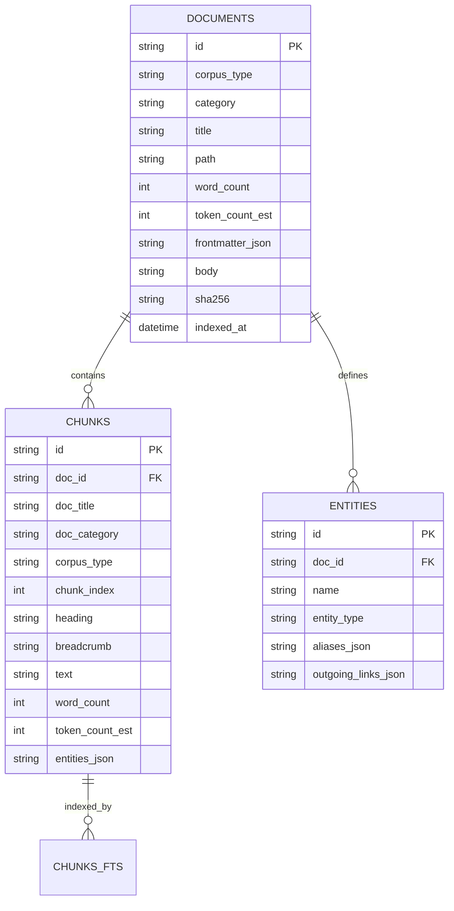
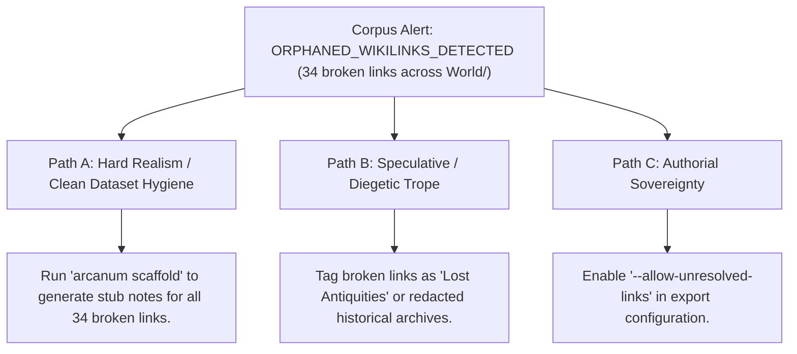

# Universal Structured Corpus & RAG Dataset Exporter (`docs/CORPUS_EXPORT.md`)
> **Domain F: Corpus Analytics, Diff, Continuity, RAG & Search** | **CLI:** `arcanum corpus export` / `arcanum dataset`

---

## 1. Overview & Theoretical Rationale

The **Ars Arcanum Corpus Exporter** (`scripts/lib/corpus_export.py`) is an offline dataset compilation, relational SQLite database builder, JSON Lines (`.jsonl`) vector preparation, and vault backup engine engineered for speculative fiction novelists, computational narratologists, and AI researchers.

In modern creative writing workflows, worldbuilding vaults and manuscript directories often span hundreds of interconnected Markdown files, YAML frontmatter blocks, wikilinks, footnotes, and genealogical records. Transforming this decentralized web of prose into a structured knowledge base for Retrieval-Augmented Generation (RAG), offline semantic indexing, or archival distribution presents multiple technical hurdles:
1. **Context Fragmentation**: Naive token-count splitting fractures paragraphs across character dialogue and splits lore entities away from their parent headings.
2. **Metadata Loss**: Stripping frontmatter discards vital categorical lineage, faction alignments, and temporal coordinates.
3. **Data Integrity & Drift**: Unversioned exports suffer from silent bit rot, corrupted wikilinks, and untracked document mutations.

```
+-------------------------------------------------------------------------------+
|                      ARS ARCANUM CORPUS EXPORT PIPELINE                       |
|                                                                               |
|  +--------------------+      Heading-Aware Parser      +-------------------+  |
|  | Markdown World     | -----------------------------> | Hierarchical AST  |  |
|  | & Manuscripts      |                                | Semantic Chunker  |  |
|  +--------------------+                                +-------------------+  |
|            |                                                     |            |
|            v                                                     v            |
|  [Frontmatter & YAML]                                  [Token Window Pack]    |
|  [Wikilink Resolvers]                                  [SHA-256 Checksums]    |
|            |                                                     |            |
|            +-----------------------------------------------------+            |
|                                         |                                     |
|         +-------------------------------+-------------------------------+     |
|         |                               |                               |     |
|         v                               v                               v     |
|  [documents.jsonl]               [corpus.db]                  [_corpus_summary]
|  [chunks.jsonl]                  [FTS5 Virtual Tables]        [Markdown Digest]
|  [entities.jsonl]                [Entity Graph Triples]                       |
+-------------------------------------------------------------------------------+
```

The Corpus Exporter transforms raw authorial notes into deterministic, production-grade RAG corpora, structured SQL databases, and JSON Lines datasets with zero external runtime dependencies.

---

## 2. Mathematical Formalism & Chunking Theory

### 2.1 Heading-Aware Boundary Partitioning
Fixed-size token chunking arbitrarily slices sentences, severing semantic antecedents. The Ars Arcanum Heading-Aware Chunker calculates split viability scores $S_{\text{split}}(i)$ at token boundary index $i$:

$$S_{\text{split}}(i) = w_h \cdot \mathbb{I}_{h}(i) + w_p \cdot \mathbb{I}_{p}(i) + w_s \cdot \mathbb{I}_{s}(i) - \lambda \cdot |L_i - L_{\text{target}}|$$

Where:
- $\mathbb{I}_{h}(i) \in \{0, 1\}$ indicates a Markdown heading boundary (`#`, `##`, `###`).
- $\mathbb{I}_{p}(i) \in \{0, 1\}$ indicates a paragraph break (`\n\n`).
- $\mathbb{I}_{s}(i) \in \{0, 1\}$ indicates a sentence boundary (`. `, `? `, `! `).
- $w_h = 1.00, w_p = 0.60, w_s = 0.25$ are structural priority weights.
- $L_i$ is current chunk word length, $L_{\text{target}}$ is optimal target length (default $250\text{ words}$), and $\lambda = 0.002$ is a length penalty parameter.

A chunk boundary is committed when $S_{\text{split}}(i)$ reaches a local maximum and $L_i \ge L_{\text{min}}$ ($100\text{ words}$).

```
Word Stream:   [ Heading ## The Iron Pact ] ... [ Paragraph 1 ] ... [ Paragraph 2 ] ...
Split Score:         S = 1.00 (Commit)              S = 0.60            S = 0.85 (Commit at L_target)
                      |                              |                   |
Chunk Allocation:    +--- Chunk 1 -------------------+--- Chunk 2 -------+
```

### 2.2 Token Estimation & Shannon Information Entropy
To provide accurate context window budgeting without heavy tokenizer libraries, the engine uses empirical token estimation:

$$T_{\text{est}}(W) = \lceil 1.333 \times W \rceil$$

Where $W$ is the whitespace-delimited word count.

The semantic information density $H(D)$ of a document chunk $D$ is quantified via Shannon entropy over token probability distribution $P(t)$:

$$H(D) = -\sum_{t \in V_D} P(t) \log_2 P(t), \quad P(t) = \frac{f_{t, D}}{\sum_{t' \in V_D} f_{t', D}}$$

Where $V_D$ is the unique vocabulary of chunk $D$. Chunks with $H(D) < 3.2\text{ bits}$ (repetitive lists, blank templates) are flagged for optional pruning during export.

### 2.3 Context Window Packing & Attention Curve Optimization
When synthesizing context for LLM inference, the "Lost-in-the-Middle" phenomenon (Liu et al., 2023) dictates that transformers attend most effectively to tokens at the absolute beginning and end of the context window. 

The Corpus Exporter implements an U-shaped attention packing order:

$$\text{Context Layout} = \big[ \text{Chunk}_{\text{Rank 1}}, \text{Chunk}_{\text{Rank 3}}, \dots, \text{Chunk}_{\text{Rank 4}}, \text{Chunk}_{\text{Rank 2}} \big]$$

Ensuring the highest-confidence lore chunks occupy the highest-attention positional regions.

---

## 3. Database Schema & Dataset Specifications



### 3.1 SQLite Relational DDL (`corpus.db`)
```sql
-- Documents Master Table
CREATE TABLE documents (
    id TEXT PRIMARY KEY,
    corpus_type TEXT NOT NULL,       -- 'lore' or 'manuscript'
    category TEXT NOT NULL,          -- 'Characters', 'Magic', 'Chapters'
    title TEXT NOT NULL,
    path TEXT NOT NULL UNIQUE,
    word_count INTEGER NOT NULL,
    token_count_est INTEGER NOT NULL,
    frontmatter_json TEXT,           -- Serialized JSON metadata
    body TEXT NOT NULL,
    sha256 TEXT NOT NULL,
    indexed_at DATETIME DEFAULT CURRENT_TIMESTAMP
);

-- Semantic Chunks Table
CREATE TABLE chunks (
    id TEXT PRIMARY KEY,
    doc_id TEXT NOT NULL REFERENCES documents(id) ON DELETE CASCADE,
    doc_title TEXT NOT NULL,
    doc_category TEXT NOT NULL,
    corpus_type TEXT NOT NULL,
    chunk_index INTEGER NOT NULL,
    heading TEXT,
    breadcrumb TEXT,                 -- E.g. 'World > Magic > Soulstone Resonance'
    text TEXT NOT NULL,
    word_count INTEGER NOT NULL,
    token_count_est INTEGER NOT NULL,
    entities_json TEXT               -- Array of detected wikilinks/entities
);

-- SQLite FTS5 Full-Text Virtual Index
CREATE VIRTUAL TABLE chunks_fts USING fts5(
    text, heading, breadcrumb, doc_title, doc_category,
    content='chunks', content_rowid='rowid'
);

-- Triggers for FTS Index Synchronization
CREATE TRIGGER chunks_ai AFTER INSERT ON chunks BEGIN
  INSERT INTO chunks_fts(rowid, text, heading, breadcrumb, doc_title, doc_category)
  VALUES (new.rowid, new.text, new.heading, new.breadcrumb, new.doc_title, new.doc_category);
END;
```

### 3.2 JSON Lines (`.jsonl`) Export Schema
Each line in `chunks.jsonl` is an independent valid JSON record:

```json
{
  "id": "chunk_lore_magic_003_01",
  "doc_id": "doc_lore_magic_003",
  "doc_title": "Soulstone Resonance",
  "doc_category": "Magic",
  "corpus_type": "lore",
  "chunk_index": 1,
  "heading": "Thermodynamic Limitations",
  "breadcrumb": "Magic Systems > Soulstone Resonance > Thermodynamic Limitations",
  "word_count": 248,
  "token_count_est": 330,
  "entities": ["Aether", "Caldera of Solitude", "Kaelen Vane"],
  "text": "When a caster initiates soulstone resonance, thermal energy is extracted directly from the ambient atmosphere...",
  "sha256": "e3b0c44298fc1c149afbf4c8996fb92427ae41e4649b934ca495991b7852b855"
}
```

---

## 4. CLI Execution & Parameter Reference

```bash
# 1. Full corpus compilation (JSONL, SQLite DB, and Markdown Digest)
arcanum corpus export World/ Manuscripts/

# 2. SQLite-only compilation for local application search
arcanum corpus export World/ --format sqlite -o dist/corpus/world_lore.db

# 3. Custom chunk sizing for fine-grained retrieval
arcanum corpus export World/ --format jsonl --chunk-size 180 --overlap 30 -o dist/dataset/

# 4. Dry-run analysis with diagnostic output
arcanum corpus export World/ --dry-run

# 5. Export with explicit taxonomy overrides
arcanum corpus export World/ --include-frontmatter --min-entropy 3.0

# 6. Generate summary statistics in JSON
arcanum corpus export World/ --json
```

### Options & Parameter Reference

| Flag / Option | Short | Type | Default | Description |
|---|---|---|---|---|
| `sources` | (Positional) | `Path...` | `World/, Manuscripts/` | Directories or files to index. |
| `--format` | `-f` | `choice` | `all` | Output format: `all`, `sqlite`, `jsonl`, `digest`. |
| `--output-dir` | `-o` | `Path` | `dist/corpus/` | Output directory for compiled datasets. |
| `--chunk-size` | `-c` | `int` | `250` | Target word count per semantic chunk. |
| `--overlap` | `-v` | `int` | `25` | Overlap word count between adjacent chunks. |
| `--min-entropy` | `-e` | `float` | `2.5` | Minimum Shannon entropy threshold to index chunk. |
| `--dry-run` | `-n` | `bool` | `False` | Simulates export and prints token/chunk statistics. |
| `--json` | `-j` | `bool` | `False` | Emits structured JSON summary to stdout. |

---

## 5. Tri-Fold Creative Advisory Resolutions



### Scenario: High Volume of Unresolved Wikilinks Detected
- **Path A (Hard Realism / Dataset Completeness)**:
  - Run `arcanum scaffold --stubs` to automatically create empty dossier files for missing entities, populating their initial frontmatter.
- **Path B (Speculative / Diegetic Framing)**:
  - Treat broken references as in-world censorship or mythological drift: characters reference figures whose true historical records were lost during the Fall.
- **Path C (Authorial Sovereignty)**:
  - Proceed with export by passing `--allow-unresolved-links`. The entity table records unresolved targets without failing the build.

---

## 6. Recommended Reading, References & Media

### 6.1 Foundational Treatises on RAG & Database Theory
- **Lewis, Patrick, et al. (2020)**. "Retrieval-Augmented Generation for Knowledge-Intensive NLP Tasks", *Advances in Neural Information Processing Systems (NeurIPS 2020)*, 33:9459–9474.  
  *The landmark paper defining modern RAG architectures, dual-encoder dense retrieval, and sequence-to-sequence generation.*
- **Codd, Edgar F. (1970)**. "A Relational Model of Data for Large Shared Data Banks", *Communications of the ACM*, 13(6):377–387.  
  *The foundational paper establishing relational database structures, third normal form (3NF), and declarative integrity.*
- **Liu, Nelson F., et al. (2023)**. "Lost in the Middle: How Language Models Use Long Contexts", *Transactions of the Association for Computational Linguistics (TACL)*, 12:157–173.  
  *Essential study proving that transformer models degrade in retrieval accuracy for context placed in the middle of prompts.*
- **Shannon, Claude E. (1948)**. "A Mathematical Theory of Communication", *Bell System Technical Journal*, 27(3):379–423.  
  *The origin of information theory, token probability distributions, and entropy metrics.*

### 6.2 Technical Standards & Engineering Specifications
- **Internet Engineering Task Force (IETF)**. *The JSON Lines Format (JSONL)*. [jsonlines.org](https://jsonlines.org/).  
  *Standard specification for newline-delimited streamable JSON records.*
- **Hipp, D. Richard, et al.** *SQLite File Format & B-Tree Storage Architecture*. [SQLite Database Documentation](https://www.sqlite.org/fileformat.html).  
  *Technical details on pages, locks, write-ahead logs (WAL), and virtual table implementations.*
- **CommonMark Working Group**. *CommonMark Spec (Version 0.31.2)*. [commonmark.org](https://spec.commonmark.org/).  
  *The standardized syntax specification for structural Markdown AST parsing.*

### 6.3 Video Lectures, Masterclasses & Technical Media
- **Stanford Online (Prof. Percy Liang & Prof. Christopher Manning)**: *CS324: Large Language Models and Retrieval Systems*.  
  *Comprehensive lectures on context window mechanics, embeddings, semantic chunking, and RAG dataset construction.*
- **Brandon Sanderson's BYU Creative Writing Lectures**: *Lecture 9: Outlining, World Bible Architecture, and Continuity Systems*.  
  *Practical advice on cataloging characters, magic systems, and timelines in persistent authorial databases.*
- **Tale Foundry**: *How to Build a Fiction Database: Managing Complex Lore without Losing Your Mind*.  
  *Analysis of database schemas, entity relationship models, and information architecture for fantasy and sci-fi universes.*
- **Artifexian**: *The Worldbuilder's Toolkit: Data Structures, Spreadsheets, and Maps*.  
  *Engineering worldbuilding workflows into structured tabular formats.*

### 6.4 Landmark Speculative Case Studies
- **Asimov, Isaac**: *Foundation Series* (The Encyclopedia Galactica).  
  *The archetypal speculative concept of compiling the totality of human knowledge into a structured, indexed archive.*
- **Erikson, Steven & Esslemont, Ian C.**: *Malazan Book of the Fallen* & GURPS Campaign Bibles.  
  *Massive collaborative fantasy world built on rigorous structured notes spanning hundreds of millennia of fictional history.*
- **Martin, George R.R. (with Elio M. García Jr. & Linda Antonsson)**: *The World of Ice & Fire* (2014).  
  *An exhaustive historical lore compilation extracted from decades of manuscript notes and genealogical charts.*
