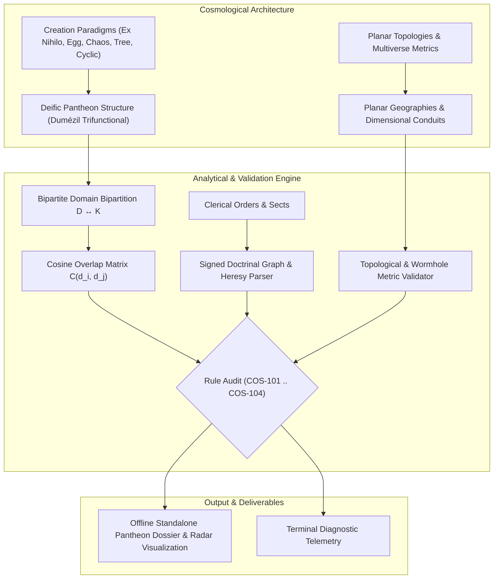

# Cosmological Topologies, Planar Geographies & Deific Pantheon Hegemony (`docs/COSMOLOGY.md`)
> **Domain C: Characters, Society, Conlangs & Magic** | **CLI:** `arcanum cosmology` / `arcanum pantheon`

---

## 1. Executive Summary & Epistemological Architecture

The **Ars Arcanum Cosmology & Deific Pantheon Engine** (`scripts/lib/cosmology.py`) is an offline, local-first theological domain validator, planar topology compiler, and religious schism diagnostic suite engineered for fantasy worldbuilders, speculative cosmologists, and mythographers.

Cosmological systems define the metaphysical coordinate system of any speculative world. When worldbuilders construct pantheons, planar multiverses, and deific pantheons without rigorous structural boundaries, worldbreaking logical ruptures inevitably emerge:
1. **Unchecked Portfolio Hegemony (`COS-101`)**: Multiple omnipotent or major deities claiming absolute, unpartitioned dominion over identical cosmic domains (e.g., dual supreme sun deities) without an explicit territorial treaty, pantheon hierarchy, or active mythic civil war.
2. **Ritual Catalyst Contradictions (`COS-102`)**: Invocations and divine miracles demanding sacrificial reagents, ecological elements, or astrological alignments that are physically or geographically impossible within the local theater.
3. **Doctrinal Schism & Holy Heresies (`COS-103`)**: Allied clerical sects and theological orders preaching mutually exclusive ethical dogmas, taboo violations, or cosmic creation narratives without an in-world theological schism or historical heresy.
4. **Divine Energy Accounting Deficits (`COS-104`)**: Deities executing reality-altering cosmic miracles without an adequate demographic worship base, prayer enthalpy, or sacrificial energetic foundation.

The Cosmology Engine ingests World Bible manifests (`Cosmology/*.md`, `Factions/*.md`), constructs multidimensional bipartite domain graphs, audits planar topological line elements, verifies sacrificial reagent ecosystems, and enforces mathematical conservation of divine energy.



---

## 2. Cosmological Creation Paradigms & Metaphysical Models

Speculative cosmogonies generally instantiate one of five primary archetypal creation paradigms. Each paradigm establishes hard boundary conditions for metaphysics, magic systems, entropy, and divine psychology.

```
                      ┌─────────────────────────────────────────┐
                      │    COSMIC CREATION PARADIGM SPECTRUM    │
                      └────────────────────┬────────────────────┘
                                           │
         ┌───────────────────┬─────────────┴───────┬───────────────────┐
         ▼                   ▼                     ▼                   ▼
   [ Ex Nihilo ]     [ Cosmic Egg ]       [ Primordial Chaos ]   [ World Tree ]
 (Singularity /    (Orphic Hatching /    (Tiamatic Division /   (Axis Mundi /
  Thermodynamic)    Embryonic Shell)      Abyssal Slaying)       Conduit Trunk)
         │                   │                     │                   │
         └───────────────────┼─────────────────────┴───────────────────┘
                             ▼
                    [ Cyclic Eon / Kalpa ]
                  (Big Bounce / Ouroboric Loop)
```

### 2.1 The Five Cosmological Archetypes

#### 1. *Creatio Ex Nihilo* (Creation from the Void)
- **Metaphysical Structure**: Reality emerges spontaneously or via the unprompted fiat of a Transcendent Prime Mover from absolute non-existence ($\emptyset \to \mathcal{U}$).
- **Thermodynamic Implication**: Instantaneous injection of maximum negative entropy (negentropy). The universe is strictly directional, with an arrow of time driving toward cosmic Heat Death (*Götterdämmerung*).
- **Deific Psychology**: The Creator is distant, hyper-rational, non-material, and unapproachable. Faith and grace supersede transactional sacrifice.

#### 2. *Cosmic Egg / Orphic Primordium*
- **Metaphysical Structure**: The cosmos incubates inside a primeval egg (e.g., *Hiranyagarbha*, *Pangu*, *Orphic Egg*). The hatching splits the shell into the celestial dome (firmament) and the yolk into terrestrial tectonic continents.
- **Thermodynamic Implication**: Conservation of initial primeval mass-energy. The shell boundaries enforce a strictly closed universe with hard planar walls.
- **Deific Psychology**: Deities are embryonic siblings; biological lineage, family trauma, and visceral organic metaphors dominate religious rituals.

#### 3. *Primordial Chaos & Tiamatic Abyss*
- **Metaphysical Structure**: Unformed, chaotic, fluid hyper-matter pre-exists the cosmos (e.g., *Ginnungagap*, *Tiamat/Apsu*, *Tehom*, *Nu/Nun*). Creation occurs through *Theomachy*—the slaying or butchering of a primordial leviathan by demiurgic champions, whose dismembered corpse forms the sky, mountains, and oceans.
- **Thermodynamic Implication**: High background entropy. Reality is fundamentally unstable and actively threatened by chaotic dissolution at its geographic periphery.
- **Deific Psychology**: Deities are paranoid conquerors maintaining martial vigilance. Sacrifices are militaristic tributes designed to reinforce cosmic battlements against the Void.

#### 4. *World Tree / Axis Mundi*
- **Metaphysical Structure**: The cosmos is structured as an immense biological or crystalline hyper-structure (e.g., *Yggdrasil*, *Jianmu*, *Ashvattha*). Roots anchor the underworld/abyss; trunk supports the mortal sphere; canopy houses celestial realms.
- **Thermodynamic Implication**: Continuous open-system energy circulation. Dimensional sap flows act as magical conduits; structural blight or root-rot threatens universal collapse.
- **Deific Psychology**: Ecological interdependence. Deities occupy specialized planar branches and must nurture the core trunk through symbiotic stewardship.

#### 5. *Cyclic Eon / Kalpa & Ouroboric Recurrence*
- **Metaphysical Structure**: The cosmos exists in an infinite series of cosmic births, expansions, decays, dissolutions, and rebirths (e.g., *Mahāyugas*, *Stoic Ekpyrosis*, *Nietzschean Eternal Recurrence*, *Big Bounce Cosmology*).
- **Thermodynamic Implication**: Cyclic entropy reset. Time is non-linear; historical epochs rhyme structurally across kalpas.
- **Deific Psychology**: Fatalistic detachment. Deities recognize their own inevitable doom in the next cosmic cycle, driving either tranquil cosmic duty (*Dharma*) or frantic attempts to escape the cycle.

---

## 3. Planar Topologies, Multiverse Metrics & Dimensional Bridges

Planar worldbuilding requires exact topological and geometrical definitions to avoid arbitrary teleportation hand-waving.

```
          [ UPPER PLANES: Celestia / Empyrean (Low Entropy, High Negentropy) ]
                                    ▲
                                    │ Bifröst Ley Conduit / Topological Throat
                                    ▼
       [ TRANSITIVE PLANES: Astral / Ethereal / Shadow (Hyper-dimensional Phase) ]
                                    ▲
                                    │ Lorentzian Wormhole Bridge
                                    ▼
     [ MATERIAL PLANE: Four-Dimensional Spacetime (x, y, z, t) - The Arena ]
                                    ▲
                                    │ Abyssal Rift / Gravitational Funnel
                                    ▼
          [ LOWER PLANES: Nether / Tartarus (High Entropy, Thermal Dissolution) ]
```

### 3.1 Non-Orientable and Higher-Dimensional Topologies
- **Flat Planar Disk with Firmament Vault**: A Euclidean 2D plane with radius $R_{\text{disc}}$ enclosed by a hemispherical celestial dome of radius $R_{\text{vault}}$.
- **Nested Spherical Hyperspace (Ptolemaic Epycycles)**: Concentric 3-spheres $S^3$ embedded in $\mathbb{R}^4$, where each sphere rotates with angular velocity $\omega_k$ modulating elemental influences.
- **Möbius and Klein-Bottle Planar Loops**: Non-orientable 4D spacetime manifolds. Traversing a cosmological boundary inverts a traveller's spatial chirality (left-handed biological molecules flip to right-handed enantiomers) or shifts them into a mirrored anti-plane.

### 3.2 Traversable Wormholes & Dimensional Bridge Metrics
Interplanar portals and dimensional conduits are mathematically modeled using static, spherically symmetric Morris-Thorne traversable wormhole metrics in spacetime coordinates $(t, l, \theta, \phi)$:

$$ds^2 = -e^{2\Phi(l)} c^2 dt^2 + dl^2 + r^2(l) (d\theta^2 + \sin^2\theta \, d\phi^2)$$

Where:
- $l \in (-\infty, +\infty)$ is the proper radial distance coordinate passing through the portal throat.
- $\Phi(l)$ is the tidal acceleration potential (must be finite everywhere to prevent lethal spaghettification of travellers; $\Phi(l) \approx 0$ for benign gates).
- $r(l) = \sqrt{r_0^2 + l^2}$ defines the wormhole throat radius $r_0$. At the throat ($l = 0$), the surface area is minimized at $A = 4\pi r_0^2$.

#### Negative Energy / Exotic Matter Requirement
To hold a dimensional portal open against gravitational collapse, exotic matter or localized magical mana must violate the Null Energy Condition (NEC):

$$T_{\mu\nu} k^\mu k^\nu < 0$$

The total exotic mass-energy $M_{\text{exotic}}$ required to stabilize a portal throat of radius $r_0$ traversed over temporal duration $\Delta t$:

$$M_{\text{exotic}} \approx -\frac{c^2 r_0}{G} \approx -1.35 \times 10^{27} \text{ kg} \times \left(\frac{r_0}{10\text{ meters}}\right)$$

In speculative magic systems, this establishes a hard thermodynamic cost: maintaining a permanent interplanar gate demands an immense magical tap or constant sacrificial enthalpy to sustain the negative energy tensor.

---

## 4. Pantheon Divine Hierarchy Models & Portfolio Hegemony

Pantheons are sociopolitical, ideological, and metaphysical institutions. Drawing on Georges Dumézil’s Trifunctional Hypothesis and comparative religious sociology, deific hierarchies organize along specific functional axes.

```
                           [ SUPREME OVERGOD / DEMIURGE ]
                                         │
                 ┌───────────────────────┼───────────────────────┐
                 ▼                       ▼                       ▼
       [ First Function ]      [ Second Function ]     [ Third Function ]
      Sovereignty & Magic        Martial Power          Fertility & Wealth
      - Cosmic Order (Rta)       - War & Conquest       - Agriculture / Herds
      - Secret Magic / Law       - Physical Defense     - Commerce / Craft
      - Juridical Authority      - Storm / Lightning    - Biological Vitality
```

### 4.1 Deific Hierarchy Typology
1. **Monotheism with Angelic/Demonic Hierarchies**: Single infinite deity; intermediary archons manage specialized cosmic domains.
2. **Henotheism / Kathenotheism**: Worship of one supreme god at a time without denying the existence or legitimacy of other deities (e.g., Vedic hymns).
3. **Polytheism with Bureaucratic Specialization**: Rigid division of labor overseen by a King/Queen of the Gods (e.g., Greco-Roman, Olympian, Chinese Celestial Bureaucracy).
4. **Animistic / Shintoist Panpsychism**: Millions of localized *kami* / genius loci inhabiting rivers, forests, and stones; power scales strictly with geographic boundary.

---

## 5. Mathematical & Theological Hegemony Principles

The Ars Arcanum Cosmology Engine enforces mathematical rigor upon divine domain allocations and energy balances.

### 5.1 Bipartite Domain Hegemony & Overlap Metric
Let $\mathcal{D} = \{d_1, d_2, \dots, d_n\}$ be the set of deities in the pantheon, and $\mathcal{K} = \{k_1, k_2, \dots, k_m\}$ be the set of canonical cosmological domains (e.g., `Sun`, `Ocean`, `War`, `Death`, `Magic`, `Harvest`, `Storms`, `Void`, `Craft`, `Justice`).

Each deity $d_i$ possesses a weighted portfolio vector:

$$\vec{P}(d_i) = \langle w_{i,1}, w_{i,2}, \dots, w_{i,m} \rangle \in [0, 1]^m, \quad \text{where } \sum_{k=1}^m w_{i,k} = 1.0$$

The **Domain Conflict Metric** $C(d_i, d_j)$ between two distinct deities $d_i$ and $d_j$:

$$C(d_i, d_j) = \frac{\vec{P}(d_i) \cdot \vec{P}(d_j)}{\|\vec{P}(d_i)\|_2 \|\vec{P}(d_j)\|_2} = \frac{\sum_{k=1}^m w_{i,k} w_{j,k}}{\sqrt{\sum_{k=1}^m w_{i,k}^2} \sqrt{\sum_{k=1}^m w_{j,k}^2}}$$

```
Portfolio Overlap Metric:
  C(d_i, d_j) < 0.30  ──> Harmonious Coexistence (No intervention needed)
  0.30 <= C <= 0.69  ──> Minor Theological Friction (Sectarian debates)
  C(d_i, d_j) >= 0.70 ──> COS-101 DOMAIN_PORTFOLIO_CONFLICT (Flags Holy War / Schism)
```

### 5.2 Divine Energy Accounting & Miracle Conservation
Divine power is subject to the First Law of Metaphysical Thermodynamics. A deity cannot expend more divine enthalpy $\mathcal{E}_{\text{miracle}}$ than the total harvested worship flux:

$$\mathcal{E}_{\text{harvested}}(d_i) = \sum_{f \in \text{Cults}(d_i)} \left[ N_{\text{devotees}}(f) \times \Phi_{\text{fervor}}(f) \times \eta_{\text{faith}} \right] + \sum_{s \in \text{Sacrifices}} \mathcal{E}_{\text{sac}}(s)$$

Where:
- $N_{\text{devotees}}(f)$ is the census population of worshipping adherents in cult $f$.
- $\Phi_{\text{fervor}}(f) \in [0.1, 5.0]$ is the emotional/spiritual devotion intensity (casual lay-worshipper = $0.2$, fanatical martyr = $5.0$).
- $\eta_{\text{faith}} \in [0, 1]$ is the clerical transmission efficiency.
- $\mathcal{E}_{\text{sac}}(s)$ is the enthalpy yield of ritual offerings (hecatomb, blood sacrifice, consecrated relics).

#### Miracle Feasibility Index (MFI)
For a candidate deific intervention of tier $\mathcal{T}$ (energy cost $E_{\text{cost}}(\mathcal{T})$):

$$\text{MFI}(d_i, \mathcal{T}) = \frac{\mathcal{E}_{\text{harvested}}(d_i) - \mathcal{E}_{\text{maintenance}}(d_i)}{E_{\text{cost}}(\mathcal{T})}$$

If $\text{MFI} < 1.0$, the miracle causes a divine deficit, triggering `COS-104: DIVINE_DEFICIT`, causing deific dormancy, spiritual bankruptcy, or soul-drain among mortal clerics.

### 5.3 Signed Doctrinal Consistency & Heresy Classification
Clerical alliances and religious factions are audited using a signed graph $G = (V, E, \sigma)$, where vertices $V$ are theological orders and edges carry signs $\sigma(e) \in \{+1, -1\}$:
- $+1$ (Mutual Communion / Shared Sacred Dogma).
- $-1$ (Anathema, Excommunication, Heresy Declaration).

The engine audits all cycles in $G$. By Harary's Structural Balance Theorem, a religious alliance network is balanced if and only if every cycle has an even number of negative edges:

$$\prod_{e \in \text{Cycle } C} \sigma(e) = +1$$

Unbalanced cycles (e.g., Sect A allies with Sect B, Sect B allies with Sect C, but Sect A declares Sect C damned heretics) trigger `COS-103: DOCTRINAL_HERESY`.

---

## 6. Worked Step-by-Step Example

### Scenario: The Solar Hegemony Schism
In the Empire of Solis, two prominent cults worship major solar deities:
1. **Sol-Invictus**: Deity of the High Noon, Sovereign Law, and Conquering Light.
2. **Ignis-Mater**: Deity of the Dawn, Hearth Fire, Agricultural Warmth, and Solar Rebirth.

#### Step 1: Define Domain Vectors
Cosmological domain basis: $\mathcal{K} = \langle \text{Sun}, \text{Law}, \text{War}, \text{Harvest}, \text{Fire}, \text{Death} \rangle$.

$$\vec{P}(\text{Sol-Invictus}) = \langle 0.50, 0.30, 0.20, 0.00, 0.00, 0.00 \rangle$$
$$\vec{P}(\text{Ignis-Mater}) = \langle 0.45, 0.05, 0.00, 0.30, 0.20, 0.00 \rangle$$

#### Step 2: Compute Dot Product and Norms
$$\vec{P}_1 \cdot \vec{P}_2 = (0.50 \times 0.45) + (0.30 \times 0.05) + (0.20 \times 0.00) + 0 + 0 + 0 = 0.225 + 0.015 = 0.240$$

$$\|\vec{P}_1\|_2 = \sqrt{0.50^2 + 0.30^2 + 0.20^2} = \sqrt{0.25 + 0.09 + 0.04} = \sqrt{0.38} \approx 0.6164$$
$$\|\vec{P}_2\|_2 = \sqrt{0.45^2 + 0.05^2 + 0.30^2 + 0.20^2} = \sqrt{0.2025 + 0.0025 + 0.09 + 0.04} = \sqrt{0.335} \approx 0.5788$$

#### Step 3: Calculate Cosine Overlap Metric
$$C(\text{Sol-Invictus}, \text{Ignis-Mater}) = \frac{0.240}{0.6164 \times 0.5788} = \frac{0.240}{0.3568} \approx 0.6726$$

*Result*: $C \approx 0.673$ is very close to the critical threshold $\tau = 0.70$. The engine issues a warning: "High theological friction between Sol-Invictus and Ignis-Mater over the Solar domain; requires explicit syncretism lore, diurnal partition (Day vs Dawn), or holy tension."

---

## 7. Practical YAML Schemas

### 7.1 Deific Pantheon Specification (`World/Cosmology/pantheon.yaml`)

```yaml
schema_version: "2.0"
pantheon:
  id: "solar_pantheon_aurelia"
  name: "The Aurelian Celestial Synod"
  creation_paradigm: "cosmic_egg"
  planar_topology: "nested_spheres"

deities:
  - id: "sol_invictus"
    name: "Sol Invictus, The Unconquered Sun"
    tier: "greater_deity"
    portfolio_weights:
      sun: 0.50
      law: 0.30
      war: 0.20
      harvest: 0.00
      fire: 0.00
      death: 0.00
    demographics:
      total_devotees: 1500000
      mean_fervor: 1.85
      sacrificial_yield_mj: 450000.0
    taboos:
      - "no_blood_at_noon"
      - "oathbreaking_punished_by_blindness"

  - id: "ignis_mater"
    name: "Ignis Mater, Mother of the Hearth"
    tier: "intermediate_deity"
    portfolio_weights:
      sun: 0.45
      law: 0.05
      war: 0.00
      harvest: 0.30
      fire: 0.20
      death: 0.00
    demographics:
      total_devotees: 2200000
      mean_fervor: 1.20
      sacrificial_yield_mj: 120000.0
    taboos:
      - "extinguishing_hearth_fire_forbidden"
```

### 7.2 Planar Node & Conduit Schema (`World/Cosmology/planes.yaml`)

```yaml
schema_version: "2.0"
planes:
  - id: "material_prime"
    name: "Mortal Prime Terrene"
    dimension_type: "four_spacetime"
    entropy_rate: "standard_positive"
    coordinates: [0, 0, 0]

  - id: "empyrean_vault"
    name: "Empyrean High Light"
    dimension_type: "celestial_high_order"
    entropy_rate: "negentropic"
    coordinates: [0, 0, 1]

conduits:
  - id: "bifrost_chasm"
    source: "material_prime"
    target: "empyrean_vault"
    throat_radius_m: 12.5
    exotic_energy_rate_gw: 168.75
    stability_type: "harmonic_resonance"
    traversal_hazard: "spaghettification_risk_low"
```

---

## 8. CLI Reference & Scriptorium Integration

```bash
# Audit full pantheon for domain conflicts and theological heresies
arcanum cosmology --audit World/Cosmology

# Calculate cosine overlap between two specific deities
arcanum cosmology --compare sol_invictus ignis_mater

# Validate sacrificial reagent availability across regional biomes
arcanum cosmology --check-reagents World/Cosmology/rituals.yaml

# Generate offline interactive HTML theological radar dossier
arcanum cosmology --html reports/pantheon_dossier.html
```

---

## 9. Recommended Reading, References & Media

### Foundational Craft & Academic Treatises
- **Eliade, Mircea (1957)**. *The Sacred and the Profane: The Nature of Religion*. Harcourt, Brace & World.  
  *Core Concept: The morphology of hierophanies, sacred space vs profane space, axis mundi, and the myth of the eternal return.*
- **Campbell, Joseph (1959–1968)**. *The Masks of God* (4 vols: *Primitive, Oriental, Occidental, Creative Mythology*). Viking Press.  
  *Core Concept: Comparative structural cosmologies, psychological archetypes of deific emergence, and ritual sacrifice.*
- **Carroll, Sean (2016)**. *The Big Picture: On the Origins of Life, Meaning, and the Universe Itself*. Dutton.  
  *Core Concept: Poetic naturalism, emergence, core cosmological physics, and the arrow of time.*
- **Greene, Brian (2011)**. *The Hidden Reality: Parallel Universes and the Deep Laws of the Cosmos*. Vintage.  
  *Core Concept: Exhaustive taxonomy of multiverses (Quilted, Inflationary, Brane, Many-Worlds, Holographic, Simulated).*
- **Dumézil, Georges (1958)**. *L'Idéologie tripartie des Indo-Européens*. Collection Latomus.  
  *Core Concept: The Trifunctional Hypothesis governing pantheon structures (Sovereignty/Law, Force, Fertility).*
- **Otto, Rudolf (1917)**. *Das Heilige* (*The Idea of the Holy*). Oxford University Press.  
  *Core Concept: The numinous experience—mysterium tremendum et fascinans—as the psychological origin of gods.*

### Landmark Scientific & Worldbuilding Papers
- **Morris, Michael S., & Thorne, Kip S. (1988)**. "Wormholes in spacetime and their use for interstellar travel: A tool for teaching general relativity." *American Journal of Physics*, 56(5), 395–412.  
  *The definitive physical derivation of traversable Lorentzian wormholes and exotic matter requirements.*
- **Guth, Alan H. (1981)**. "Inflationary universe: A possible solution to the horizon and flatness problems." *Physical Review D*, 23(2), 347.  
  *Foundational paper for cosmic inflation and eternal bubble multiverses.*
- **Tegmark, Max (2003)**. "Parallel Universes." In *Science and Ultimate Reality*, Cambridge University Press.  
  *Four-level classification of multiverses from infinite Hubble volumes to mathematical structures.*

### Seminal Video Lectures, Masterclasses & Channels
- **Brandon Sanderson** (BYU Creative Writing Lectures: *Worldbuilding Part 2 — Gods, Religion & Magic Systems*).  
  *Pragmatic design of living, functioning fictional religions with cultural constraints.*
- **Tale Foundry** (YouTube Series: *The Anatomy of Mythological Cosmologies & Pantheon Conflicts*).  
  *Deconstructive video essays on how mythologies reflect cultural anxieties and geographic realities.*
- **PBS Space Time** (*The True Shape of the Universe*, *Topological Defect Strings & Cosmic Foam*).  
  *Rigorous visual derivations of cosmic curvature, wormhole physics, and multi-dimensional manifolds.*
- **Isaac Arthur — Science & Futurism with Isaac Arthur (SFIA)** (*Civilizations at the End of Time*, *Matrioshka Gods & Megastructures*).  
  *Deep technological exploration of god-like cosmic engineering and artificial planar realms.*

### Landmark Speculative Case Studies
- **Tolkien, J.R.R.** *The Silmarillion* (*Ainulindalë*). The Music of the Ainur as an *Ex Nihilo* harmonic creation model challenged by Discord.
- **Sanderson, Brandon**. *The Cosmere* (The Shattering of Adonalsium into sixteen functional Shards of divine intent).
- **Moorcock, Michael**. *The Elric Saga & The Multiverse* (The cosmic balance between Law and Chaos across infinite intersecting spheres).
- **Gaiman, Neil**. *American Gods* & *The Sandman* (Demographic prayer enthalpy directly determining divine power and mortality).
- **Liu Cixin**. *The Three-Body Problem / Death's End* (Dimensional reduction attacks dropping 4D spacetime into 3D, and 3D into 2D).
