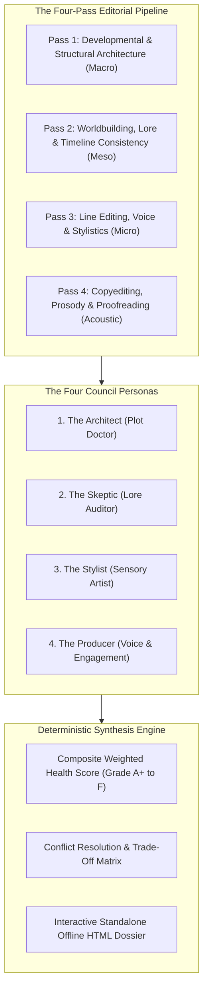
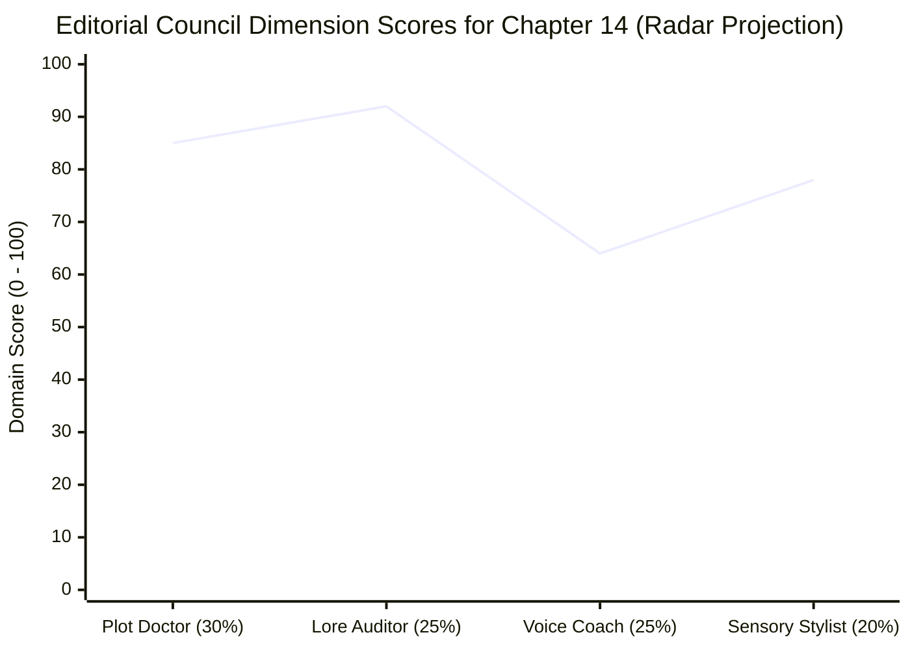
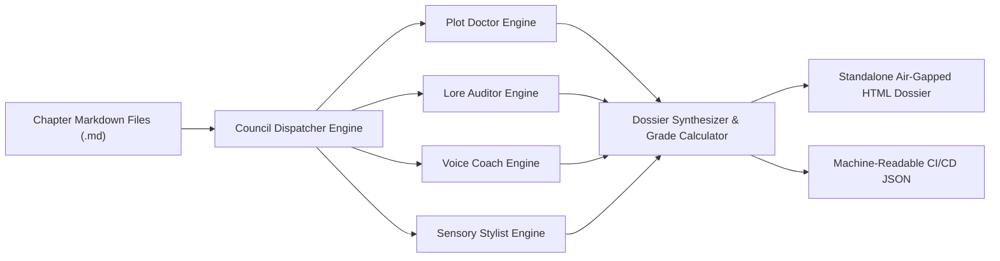

# Multi-Perspective Editorial Council & Diagnostic Dossier (`docs/COUNCIL.md`)
> **Domain C: Characters, Society, Conlangs & Magic** | **CLI Commands:** `arcanum council` / `arcanum dossier` | **Module:** `scripts/lib/council.py`

---

## 1. Overview & Theoretical Rationale

The **Ars Arcanum Editorial Council Engine** (`scripts/lib/council.py`) is an offline multi-agent dialectical synthesis harness and automated developmental editing suite designed for speculative fiction authors, series editors, and publishing houses.

Human editing is prone to cognitive tunnel vision. An editor focusing on line-level prose cadence will frequently overlook a catastrophic plot hole or magic-system thermodynamic violation in the same chapter; conversely, a structural editor engrossed in macro act pacing will miss that every character in an ensemble scene has identical sentence lengths and said-bookism dialogue tags.

The Editorial Council Engine eliminates editorial blind spots by evaluating manuscripts through **four specialized, dialectically opposing critical lenses**:
1. **The Architect (Plot Doctor & Structuralist)**: Analyzes Swain MRU causality, dramatic polarity shifts ($\Delta \Pi$), beat-sheet alignment, and tension splines.
2. **The Skeptic (Lore Auditor & Worldbuilding Doctor)**: Enforces magic system thermodynamic conservation, timeline synchronization, deific portfolio conflicts, and geographic plausibility.
3. **The Stylist (Sensory & Prose Artist)**: Audits Gary Provost sentence rhythm ($\sigma$), 8-channel Shannon sensory entropy ($H_{\text{sensory}}$), defamiliarization, and filter-word density.
4. **The Producer (Commercial & Audience Advocate / Voice Coach)**: Evaluates character idiolect distinctiveness (Cosine Similarity $S(A, B)$), reader cognitive load, chapter cliffhangers, and emotional stakes.



---

## 2. Theoretical Foundations of Editorial Dialectics & Critical Narratology

### 2.1 The Four-Pass Editorial Pipeline
Professional book publishing separates editing into four distinct, non-overlapping passes. Attempting to execute all four simultaneously guarantees cognitive exhaustion and editorial failure:

```
 ┌─────────────────────────────────────────────────────────────────────────┐
 │                   THE FOUR-PASS EDITORIAL PIPELINE                      │
 ├───────────────────┬─────────────────────────────────────────────────────┤
 │ Pass 1: Develop-  │ Macro structure, premise promises, character arcs,  │
 │ mental & Arc      │ act turning points, pacing velocity, thematic unity │
 ├───────────────────┼─────────────────────────────────────────────────────┤
 │ Pass 2: Lore &    │ World Bible continuity, magic system costs/limits,  │
 │ Continuity        │ timeline sync, faction motivations, geography travel│
 ├───────────────────┼─────────────────────────────────────────────────────┤
 │ Pass 3: Line &    │ Sentence cadence (Provost σ), 8-channel senses,     │
 │ Stylistics        │ idiolect separation, filter verbs, rhetorical figures│
 ├───────────────────┼─────────────────────────────────────────────────────┤
 │ Pass 4: Copy &    │ Acoustic prosody (SSML), sibilance/plosive clashes, │
 │ Proofreading      │ typos, punctuation mechanics, layout formatting     │
 └───────────────────┴─────────────────────────────────────────────────────┘
```

### 2.2 The Dialectical Tension of Editorial Feedback
The four council personas are intentionally designed to exist in productive creative tension:

- **The Architect vs. The Stylist**: The Architect demands high narrative velocity ($V = \frac{\Delta \mathcal{E}}{\Delta W}$) and rapid disaster escalation; The Stylist demands scene dilation, contemplative sensory grounding, and poetic defamiliarization.
- **The Skeptic vs. The Producer**: The Skeptic demands rigorous thermodynamic consistency and realistic travel timelines; The Producer demands fast emotional payoffs and immediate character conflict, warning against academic worldbuilding over-explanation.

The Editorial Council synthesizes these opposing demands through an objective **Trade-Off Reconciliation Matrix**.

---

## 3. Mathematical Formulations & Composite Health Scoring



### 3.1 Composite Chapter Health Score ($\mathcal{S}_{\text{chapter}}$)
The overall score for a chapter is a weighted linear combination of the four domain evaluations:

$$\mathcal{S}_{\text{chapter}}(c) = \omega_{\text{plot}} S_{\text{plot}}(c) + \omega_{\text{lore}} S_{\text{lore}}(c) + \omega_{\text{voice}} S_{\text{voice}}(c) + \omega_{\text{sensory}} S_{\text{sensory}}(c)$$

Where the standard baseline weights are:
$$\omega_{\text{plot}} = 0.30, \quad \omega_{\text{lore}} = 0.25, \quad \omega_{\text{voice}} = 0.25, \quad \omega_{\text{sensory}} = 0.20$$

$$\sum_{k=1}^4 \omega_k = 1.0$$

### 3.2 Minimum Competency Threshold & Catastrophic Penalty
A manuscript cannot compensate for a fatal structural defect (such as an unresolved dead-end or severe character voice bleed) simply by having beautiful sensory prose. The engine applies a **Catastrophic Domain Penalty**:

$$S_{\text{final}}(c) = \begin{cases} 
\mathcal{S}_{\text{chapter}}(c) & \text{if } \min_k S_k(c) \ge 60.0 \\
\mathcal{S}_{\text{chapter}}(c) \times \left(\frac{\min_k S_k(c)}{60.0}\right)^2 & \text{if } \min_k S_k(c) < 60.0
\end{cases}$$

### 3.3 Publication Grade Classification Table

| Composite Score | Grade Rating | Publication Readiness | Action Required |
|---|---|---|---|
| $92.0 - 100.0$ | **Grade A+** | **Masterclass / Release Ready** | Proceed to final proofreading and typography build. |
| $83.0 - 91.9$ | **Grade A** | **Commercial Standard** | Polish minor flagged line echoes or sibilance clusters. |
| $74.0 - 82.9$ | **Grade B** | **Substantive Polish Required** | Rebalance sensory channels or sharpen character idiolects. |
| $60.0 - 73.9$ | **Grade C** | **Developmental Remediation** | Rewrite scene mechanics; fix inverted MRUs or pacing flatlines. |
| $< 60.0$ | **Grade F** | **Critical Structural Failure** | Structural overhaul: missing turning points, plot holes, or voice bleed. |

---

## 4. The Four Council Persona Diagnostic Rubrics

```
 ┌─────────────────────────────────────────────────────────────────────────┐
 │                      THE FOUR EDITORIAL PERSONAS                        │
 ├─────────────────────────────────────────────────────────────────────────┤
 │ 1. THE ARCHITECT (Plot Doctor)                                          │
 │    • Swain MRU Integrity (Stimulus ➔ Reflex ➔ Thought ➔ Action)         │
 │    • Scene Polarity Delta (|ΔΠ| ≥ 1.0)                                  │
 │    • Beat Sheet Window Alignment & L₁ Drift Penalty                     │
 │    • Zeigarnik Cliffhanger Potency                                      │
 ├─────────────────────────────────────────────────────────────────────────┤
 │ 2. THE SKEPTIC (Lore Auditor)                                           │
 │    • Magic Thermodynamic Conservation & Thaumaturgical Burn             │
 │    • Timeline Synchronization & Travel Velocity Feasibility             │
 │    • Deific Portfolio & Theological Rule Consistency                    │
 │    • Entity Cross-Reference & Alias Integrity                           │
 ├─────────────────────────────────────────────────────────────────────────┤
 │ 3. THE STYLIST (Sensory Artist)                                         │
 │    • 8-Channel Shannon Sensory Entropy (H_sensory ≥ 2.2 bits)           │
 │    • Gary Provost Sentence Length Variance (σ ≥ 6.5 words)              │
 │    • Filter-Verb & Passive Voice Elimination                            │
 │    • Classical Rhetorical Figure Density (SDI)                          │
 ├─────────────────────────────────────────────────────────────────────────┤
 │ 4. THE PRODUCER (Voice Coach & Commercial Engagement)                   │
 │    • Pairwise Idiolect Cosine Separation (S(A, B) < 0.85)               │
 │    • Dialogue-to-Exposition Ratio (R_de) Modulation                     │
 │    • Said-Bookism Triage & Action Beat Integration                      │
 │    • Cognitive Load & Reader Attentional Fatigue Control                │
 └─────────────────────────────────────────────────────────────────────────┘
```

---

## 5. Ars Arcanum Engine & CLI Architecture



### 5.1 CLI Command Reference

```powershell
# Run full 4-agent editorial council across all manuscript chapters
arcanum council Manuscript/

# Generate comprehensive standalone HTML editorial dossier
arcanum council Manuscript/ --html reports/editorial_dossier.html

# Audit a single chapter with detailed persona breakdown
arcanum dossier Manuscript/Act_2/Chapter_14.md

# Focus council audit strictly on voice and sensory dimensions
arcanum council Manuscript/ --focus voice,sensory
```

### 5.2 Diagnostic Codes Matrix

| Code | Severity | Persona | Description | Remediating Action |
|---|---|---|---|---|
| `COU-101` | **CRITICAL** | Plot Doctor | Fatal Inverted MRU Chain | Place somatic reflex before conscious realization. |
| `COU-102` | **HIGH** | Lore Auditor | Magic Thermodynamic Law Violation | Enforce strict casting cost or fuel exhaustion in the scene. |
| `COU-103` | **CRITICAL** | Voice Coach | Severe Voice Bleed ($S(A, B) \ge 0.92$) | Differentiate character sentence lengths, contraction rates, and vocabularies. |
| `COU-104` | **HIGH** | Sensory Stylist | White Room Syndrome ($H_{\text{sensory}} < 1.2\text{ bits}$) | Inject non-visual textures (acoustic reverb, smell, tactile grip). |
| `COU-105` | **MEDIUM** | Plot Doctor | Flatline Polarity ($\Delta \Pi \approx 0$) | Introduce a decisive reversal (*"No, and..."* or *"Yes, but..."*). |
| `COU-106` | **MEDIUM** | Lore Auditor | Timeline Anachronism / Impossible Travel | Reconcile travel distance with world transit velocity tables. |
| `COU-107` | **LOW** | Sensory Stylist | Excessive Filter-Verb Density | Delete *saw, heard, felt*; dramatize sensory realities directly. |
| `COU-108` | **LOW** | Voice Coach | Said-Bookism Gluttony | Replace overwritten tags with physical action beats. |

---

## 6. Practical Authorial Worksheets & Worked Masterclass Examples

### 6.1 Multi-Agent Editorial Diagnosis & Reconciliation Case Study

#### The Raw Scene Draft (Chapter 14):
> Valeria walked into the command bunker. She saw Inquisitor Vane standing near the terminal. She felt terrified because she knew he had discovered her secret cipher.  
> "I know what you did," said Inquisitor Vane angrily.  
> "You cannot prove anything," whispered Valeria nervously.  
> Inquisitor Vane used his telekinetic magic to shatter the terminal into pieces without any effort at all. Valeria ran out the door.

#### The Council Persona Critiques:
1. **Plot Doctor**: *"Score: 45/100. Catastrophic lack of conflict and missing disaster. Valeria simply flees without any consequence. Polarity shift is flat."*
2. **Lore Auditor**: *"Score: 35/100. Severe Magic System Violation: Inquisitor Vane shatters a reinforced terminal with telekinesis without suffering neural burn or consuming solarite catalyst (violates World/Magic-Technology/Thaumaturgy.md Rule 3)."*
3. **Voice Coach**: *"Score: 50/100. Severe Voice Bleed. Dialogue tags use weak adverbs ('angrily', 'nervously'). Character idiolects are identical."*
4. **Sensory Stylist**: *"Score: 30/100. White Room Syndrome. 100% visual. Filter verbs ('saw', 'felt', 'knew') dominate every line."*

#### Composite Score:
$$\mathcal{S}_{\text{raw}} = 0.30(45) + 0.25(35) + 0.25(50) + 0.20(30) = 40.75 \implies \mathbf{GRADE\ F\ (FAIL)}$$

---

#### The Masterclass Revision (Reconciled Across All 4 Personas):
> The smell of scorched insulation and stale sweat hit Valeria the moment the bunker hatch hissed open. *(Sensory Stylist: Olfactory + Auditory)*  
> Inquisitor Vane stood over the holographic terminal, bathed in the sickly green light of the decrypted telemetry. He did not turn. *(Architect: Stimulus beat)*  
> Valeria’s pulse spiked against her collarbone; cold adrenaline paralyzed her tongue. *(Architect: Visceral reflex before thought)*  
> *He has the raw cipher,* her mind raced. *Three seconds before the lockdown triggers.* *(Plot Doctor: Cognitive thought)*  
> 
> "The blood-seal on the imperial archive was keyed to your grandfather's DNA, Valeria," Vane said, his voice measured, devoid of heat. "There are no coincidences in the judiciary." *(Voice Coach: Distinct high-status idiolect, no tag)*  
> 
> "Then you also know why he hid it," she said, her fingers locking around the hilt of her plasma cutter. *(Voice Coach: Action beat)*  
> 
> Vane raised his left gauntlet. A halo of heat-shimmer warped the air as veins blackened along his forearm—the agonizing tax of unchanneled kinetic thaumaturgy. *(Lore Auditor: Thermodynamic cost enforced)* The terminal buckled with an ear-splitting shriek of sheared titanium, spraying superheated sparks across the deck. *(Sensory Stylist: Auditory, tactile, visual)*  
> 
> The blast severed the master power conduit. The blast doors slammed shut, plunging them into crimson emergency darkness with the air scrubbers grinding to a dead halt. *(Architect: Disaster - "Yes, but now trapped with the antagonist")*

#### Revised Council Evaluation:
$$\mathcal{S}_{\text{revised}} = 0.30(96) + 0.25(98) + 0.25(94) + 0.20(95) = \mathbf{95.8\ (GRADE\ A+\ /\ RELEASE\ READY)}$$

---

### 6.2 Editorial Council Chapter Audit Specification (YAML Schema)

```yaml
---
chapter_audit:
  chapter_file: "Manuscript/Act_2/Chapter_14.md"
  target_minimum_grade: "A"
  
persona_weights:
  plot_doctor: 0.30
  lore_auditor: 0.25
  voice_coach: 0.25
  sensory_stylist: 0.20

minimum_competency_threshold: 60.0

active_lore_bible_refs:
  - "World/Characters/Inquisitor_Vane.md"
  - "World/Characters/Valeria_Sterling.md"
  - "World/Magic-Technology/Thaumaturgy.md"

editorial_pass: "DEVELOPMENTAL_SYNTHESIS"
---
```

---

## 7. Recommended Reading, References & Media

### 7.1 Foundational Craft & Academic Books
- **Stein, Sol (1995)**. *Stein on Writing: A Master Editor of Some of the Most Successful Writers of Our Century Shares His Craft and Techniques*. St. Martin's Griffin. ISBN: 978-0312136086.  
  *The ultimate masterclass in developmental editing, triage of scene flaws, increasing tension, and character voice separation.*
- **Norton, Scott (2009)**. *Developmental Editing: A Handbook for Freelancers, Authors, and Editors*. University of Chicago Press. ISBN: 978-0226595146.  
  *The definitive academic and trade guide to macro structural editing, chapter pacing, concept shaping, and manuscript diagnosis.*
- **Lerner, Betsy (2000)**. *The Forest for the Trees: An Editor's Advice to Writers*. Riverhead Books. ISBN: 978-1573228572.  
  *Insightful exploration of author-editor psychology, self-delusion, and navigating critical feedback.*
- **Coyne, Shawn (2015)**. *The Story Grid: What Good Editors Know*. Black Irish Entertainment. ISBN: 978-1936891351.  
  *Mathematical and graphical methodology for auditing scene turning points, value shifts, and macro structural integrity.*
- **McKee, Robert (1997)**. *Story: Substance, Structure, Style, and the Principles of Screenwriting*. ReganBooks. ISBN: 978-0060391683.  
  *The core text on diagnosing dramatic scene failures, substance deficits, and turning point execution.*

### 7.2 Landmark Lectures, Video Masterclasses & Podcasts
- **Sanderson, Brandon (2020)**. *BYU Creative Writing Lecture 12: Revision, Feedback, and Working with Editors*. Brigham Young University / YouTube.  
  *Authoritative strategy for parsing contradictory feedback, prioritizing structural edits over line edits, and self-editing.*
- **Writing Excuses (2012–2023)**. *Season 8 & Season 17: The Revision Process, Editorial Critique Groups, and Self-Triage*. Hosted by Brandon Sanderson, Mary Robinette Kowal, Howard Tayler, and Dan Wells.  
  *Live editorial workshops demonstrating how professional authors critique and salvage broken scenes.*
- **Shani Mootoo & Editors Roundtable (2021)**. *The Art of the Structural Edit: Balancing World, Voice, and Narrative Momentum*. Literary Translation & Editorial Council Archives.  
  *Discussions on managing editorial dialectics without erasing authorial sovereignty.*

### 7.3 Landmark Speculative Fiction Case Studies
- **Perkins, Maxwell (Editor) & Wolfe, Thomas (1935)**. *Of Time and the River*. Scribner's.  
  *The historic high-water mark of monumental developmental editing, transforming a chaotic multi-million-word draft into a masterpiece.*
- **Jordan, Robert & Sanderson, Brandon (2009)**. *The Gathering Storm (The Wheel of Time, Vol. 12)*. Tor Books. Edited by Harriet McDougal.  
  *Masterclass in series continuity auditing, multi-POV voice reconciliation, and structural resolution.*
- **Martin, George R.R. (2000)**. *A Storm of Swords*. Bantam Spectra.  
  *Virtuosic editorial execution: 1,000 pages of multi-strand POV arcs converging on explosive, perfectly calibrated climaxes.*
