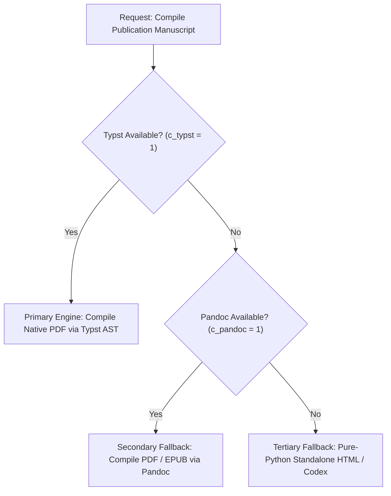
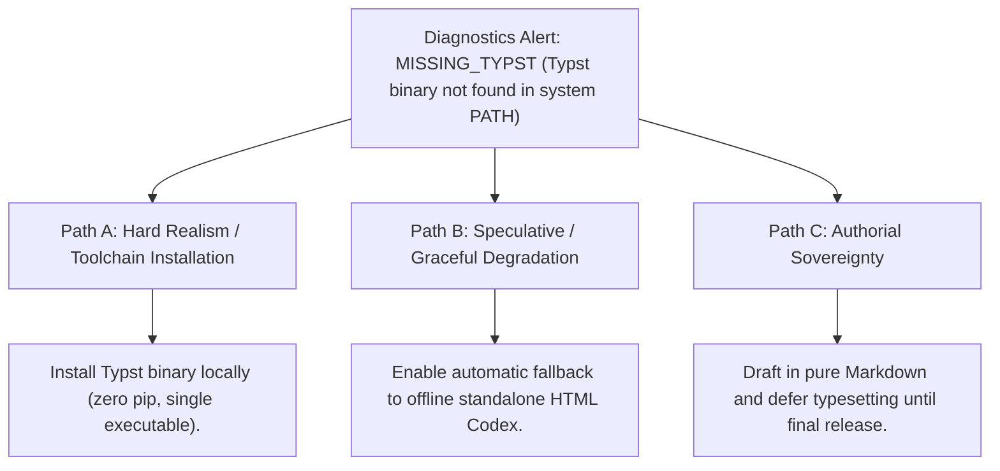

# System Diagnostics, Host Capabilities & Toolchain Integrity (`docs/DIAGNOSTICS.md`)
> **Domain F: Retrieval, Diagnostics & Infrastructure** | **CLI:** `arcanum doctor` / `arcanum diag`

---

## 1. Overview & Theoretical Rationale

The **Ars Arcanum Diagnostics Engine** (`scripts/lib/diagnostics.py`) is an offline host capability scanner, environment validator, filesystem integrity prober, and toolchain verifier engineered to guarantee deterministic execution across diverse operating systems (Linux, macOS, Windows).

Creative writers and digital publishers operate in heterogeneous technical environments ranging from air-gapped Linux laptops to macOS workstations and Windows desktop towers. Toolchain failures (such as missing typesetting engines, out-of-date Python interpreters, broken path separators, or lack of file-locking primitives) can lead to silent compilation failures, lost manuscript revisions, or degraded formatting.

```
+-------------------------------------------------------------------------------+
|                    ARS ARCANUM SYSTEM DIAGNOSTICS PROBE                       |
|                                                                               |
|  +--------------------+     Host Capability Prober    +--------------------+  |
|  | Host OS & Python   | ----------------------------> | Standard Library   |  |
|  | Runtime (3.10+)    |                               | System Introspect  |  |
|  +--------------------+                               +--------------------+  |
|            |                                                    |             |
|            v                                                    v             |
|  [External CLI Toolchain Probe]                       [Filesystem Durability] |
|  - Typst (Publication Engine)                         - Atomic Write (fsync)  |
|  - Pandoc (Doc Interchange)                           - Cross-Platform Locks  |
|  - Git & GPG (Sovereign VCS)                          - POSIX/NTFS Semantics  |
|            |                                                    |             |
|            +----------------------------------------------------+             |
|                                     |                                         |
|                                     v                                         |
|                   +-----------------------------------+                       |
|                   |  Host Compatibility Vector H_vec  |                       |
|                   |  Graceful Degraded Fallbacks      |                       |
|                   |  Machine-Readable JSON Diagnostics|                       |
|                   +-----------------------------------+                       |
|                                     |                                         |
|                                     v                                         |
|                     [Verified Sovereign Execution]                            |
|                     [Zero-Cloud Host Security Audit]                          |
+-------------------------------------------------------------------------------+
```

The Diagnostics Engine implements **Postel's Law of Environmental Robustness** ("Be conservative in what you do, be liberal in what you accept from others"): it rigorously validates host environment primitives, detects optional external CLI binaries, and calculates fallback degradation graphs to ensure Ars Arcanum runs flawlessly on any sovereign machine.

---

## 2. Mathematical Formalism & Capability Vector

### 2.1 Host Compatibility Score ($\mathcal{H}_{\text{host}}$)
Let $\mathbf{C} = \langle c_1, c_2, \dots, c_m \rangle \in \{0, 1\}^m$ represent the binary detection vector of host system capabilities:

$$\mathbf{C} = \Big[ c_{\text{python}}, \, c_{\text{atomic}}, \, c_{\text{lock}}, \, c_{\text{typst}}, \, c_{\text{pandoc}}, \, c_{\text{git}}, \, c_{\text{gpg}} \Big]^T$$

The mandatory core capability barrier $G_{\text{core}}$:
$$G_{\text{core}} = c_{\text{python}} \land c_{\text{atomic}} \land c_{\text{lock}}$$

The overall host compatibility score $\mathcal{H}_{\text{host}} \in [0.0, 100.0\%]$:

$$\mathcal{H}_{\text{host}} = G_{\text{core}} \times \left( \sum_{i=1}^m w_i \cdot c_i \right) \times 100\%$$

Where weights $w = [0.30, 0.20, 0.15, 0.15, 0.10, 0.05, 0.05]$ sum to $1.00$. If any core capability fails ($G_{\text{core}} = 0$), execution halts with an actionable system error.

### 2.2 Graceful Degradation Fallback Graph
When optional compilation binaries are absent, the engine dynamically selects the highest-fidelity available fallback path:



---

## 3. The Capability Matrix & Subsystem Probes

| Subsystem Probe | Verification Mechanism | Success Criteria | Fallback Behavior |
|---|---|---|---|
| **Python Runtime** | `sys.version_info` inspection. | Python $\ge 3.10.0$. | Critical Abort: Incompatible interpreter. |
| **Atomic Durability**| Probes `os.fsync` and `os.replace` on tempfile. | Directory entry & data flush success. | Emits disk buffer write hazard warning. |
| **Advisory Locks** | Probes `fcntl.flock` (POSIX) or `msvcrt.locking` (Win). | Non-blocking exclusive lock acquired. | Disables multi-process concurrency safe mode. |
| **Typst Compiler** | Executes `typst --version` via headless sub-process. | Clean exit code $0$, version $\ge 0.11.0$. | Falls back to Pandoc or HTML Codex compiler. |
| **Pandoc Bridge** | Executes `pandoc --version`. | Clean exit code $0$, version $\ge 2.19.0$. | Falls back to internal Python Markdown parser. |
| **Git Sovereign VCS**| Executes `git --version` and checks repo root. | Git repository initialized. | Disables revision snapshot & git-diff mode. |
| **GnuPG Encryption**| Executes `gpg --version`. | GPG binary discovered in `$PATH`. | Disables asymmetric envelope encryption. |

---

## 4. CLI Execution & Option Reference

```bash
# 1. Run full host environment diagnostic probe
arcanum doctor

# 2. Output detailed hardware and capability metrics as JSON for CI/CD
arcanum doctor --json

# 3. Target specific subsystem verification
arcanum doctor --probe filesystem,typesetting

# 4. Verbose debug mode (inspects environment variables and paths)
arcanum doctor --verbose

# 5. CLI aliases
arcanum diag
arcanum syscheck
```

### Parameter Reference Table

| Flag / Option | Short | Type | Default | Description |
|---|---|---|---|---|
| `--json` | `-j` | `bool` | `False` | Emits structured JSON diagnostics report to stdout. |
| `--probe` | `-p` | `str` | `all` | Specific probes to execute: `core`, `typesetting`, `security`, `all`. |
| `--verbose` | `-v` | `bool` | `False` | Prints resolved binary paths and kernel details. |
| `--strict` | `-s` | `bool` | `False` | Returns non-zero exit code if any optional tool is missing. |

---

## 5. Tri-Fold Creative Advisory Resolutions



### Scenario: Typst Binary Missing from Host Environment
- **Path A (Hard Realism / Sovereign Installation)**:
  - Download the official standalone Typst binary (a single portable executable, zero package managers required) and place it in the system `$PATH` or `./bin/`.
- **Path B (Graceful Degradation)**:
  - Continue using Ars Arcanum without disruption. The system routes all export requests through the built-in pure Python Codex and HTML compiler.
- **Path C (Authorial Sovereignty)**:
  - Keep the workspace focused purely on prose drafting in Markdown; postpone layout and PDF typesetting until the developmental editing phase.

---

## 6. Recommended Reading, References & Media

### 6.1 Site Reliability & System Architecture Treatises
- **Beyer, Betsy, Jones, Chris, Petoff, Jennifer, & Murphy, Niall Richard (2016)**. *Site Reliability Engineering: How Google Runs Production Systems*. O'Reilly Media. ISBN: 978-1491929124.  
  *The defining manual establishing telemetry health checks, subsystem invariant probes, and automated failure detection.*
- **Kernighan, Brian W. & Pike, Rob (1984)**. *The UNIX Programming Environment*. Prentice-Hall. ISBN: 978-0139376818.  
  *Classical treatise on modular tool composition, process diagnostic signals, and host capability detection.*
- **Postel, Jon (1981)**. *Transmission Control Protocol*. RFC 793, Internet Engineering Task Force (IETF). [IETF RFC 793](https://www.rfc-editor.org/rfc/rfc793).  
  *Formulates the Robustness Principle ("Postel's Law"), governing strict self-verification paired with graceful host environmental tolerance.*

### 6.2 Operating System Standards & Process Execution
- **IEEE & The Open Group (2018)**. *IEEE Std 1003.1-2017: Standard for Information Technology—Portable Operating System Interface (POSIX)*. IEEE Computer Society.  
  *Normative operating system standards for standard streams, file descriptor locking, child process exit statuses, and environment variables.*
- **Stevens, W. Richard & Rago, Stephen A. (2013)**. *Advanced Programming in the UNIX Environment* (3rd Edition). Addison-Wesley. ISBN: 978-0321637734.  
  *Authoritative text on cross-platform process spawning, binary discovery, signal handling, and execution isolation.*

### 6.3 Video Lectures, Masterclasses & Technical Media
- **Computerphile**: *Operating System Invariants, File Locks, and Process Spawning*.  
  *How operating systems manage execution boundaries and handle process signals.*
- **MIT OpenCourseWare (6.033)**: *Computer System Engineering: Reliability, Probing, and Fault Tolerance*.  
  *Techniques for building robust software that degrades gracefully under missing host components.*
- **Brandon Sanderson's BYU Creative Writing Lectures**: *Authorial Tooling Sovereignty: Never Rely on a Single Cloud Provider*.  
  *Why local toolchains and open data formats are essential for preserving creative work across decades.*

### 6.4 Landmark Speculative Case Studies
- **Gibson, William**: *Neuromancer* (Written on a 1927 Hermes 2000 Manual Typewriter).  
  *Historical exemplar of total toolchain sovereign isolation, completely immune to power outages and digital network vulnerabilities.*
- **Stephenson, Neal**: *Cryptonomicon* & *The Baroque Cycle* (Authored using Emacs and local Unix text tools).  
  *Case study in enduring plain-text longevity and sovereign authorial tooling.*
