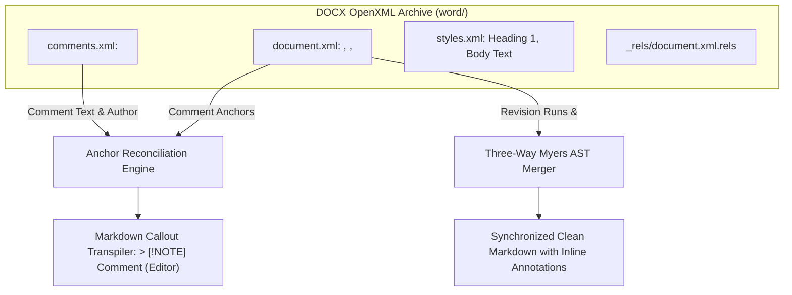
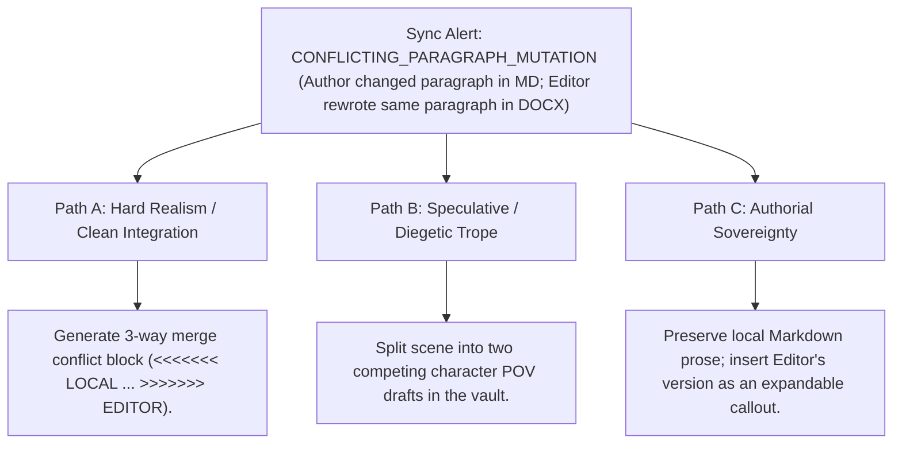

# Bidirectional Markdown <-> Microsoft Word DOCX Synchronizer (`docs/DOCX_SYNC.md`)
> **Domain F: Retrieval & Infrastructure** | **CLI:** `arcanum docx-sync` / `arcanum word`

---

## 1. Overview & Theoretical Rationale

The **Ars Arcanum DOCX Synchronizer** (`scripts/lib/docx_sync.py`) is an offline, bidirectional Markdown-to-DOCX and DOCX-to-Markdown document compiler, comment extractor, and track-change reconciliation engine engineered for novelists, freelance authors, and developmental editors.

In the traditional publishing industry, literary agents, acquiring editors, and copyeditors almost universally conduct manuscript revisions within Microsoft Word using Track Changes and Margin Comments. Conversely, modern authors increasingly write in local Markdown vaults (e.g., Obsidian, VS Code, Scriptorium) to leverage version control, plain-text longevity, and sovereign privacy.

Bridging these two worlds typically creates severe workflow friction:
1. **Comment & Revision Loss**: Standard converters (like default Pandoc) often strip editor margin comments or flatten tracked deletions into messy plaintext.
2. **Cloud Security Vulnerabilities**: Uploading unpublished manuscripts to online file conversion websites exposes proprietary IP to data breaches and third-party AI training.
3. **Format Corruption**: Round-tripping between formats often damages typographic em-dashes, smart quotes, italics, and scene divider glyphs.

```
+-------------------------------------------------------------------------------+
|                      ARS ARCANUM DOCX SYNC ARCHITECTURE                       |
|                                                                               |
|  +--------------------+    OpenXML AST Transpiler    +---------------------+  |
|  | Markdown Source of | ---------------------------> | WordprocessingML    |  |
|  | Truth (.md)        |                              | (.docx OpenXML Zip) |  |
|  +--------------------+                              +---------------------+  |
|            ^                                                    |             |
|            |         Bidirectional Comment & Revision Sync      |             |
|            +----------------------------------------------------+             |
|                                     |                                         |
|                                     v                                         |
|                   +-----------------------------------+                       |
|                   |  <w:comments> -> Markdown Callouts|                       |
|                   |  <w:ins> / <w:del> -> Myers Diff  |                       |
|                   |  LibreOffice Headless PDF Bridge  |                       |
|                   +-----------------------------------+                       |
|                                     |                                         |
|                                     v                                         |
|                     [Preserved Authorial Sovereignty]                         |
|                     [Zero-Cloud Data Privacy Guarantee]                       |
+-------------------------------------------------------------------------------+
```

The DOCX Synchronizer directly manipulates the underlying zipped OpenXML standard using Python's native standard library (`zipfile`, `xml.etree.ElementTree`), achieving 100% offline bidirectional fidelity without requiring Microsoft Word or cloud telemetry.

---

## 2. WordprocessingML Structural Architecture & XML AST Parsing

A `.docx` file is a zipped Open Packaging Conventions (OPC) container containing interrelated XML structures:

```
document.docx (ZIP Archive)
  ├── [Content_Types].xml            # MIME-type declarations for all package parts
  ├── _rels/.rels                    # Root package relationships
  └── word/
      ├── document.xml               # Primary manuscript body (<w:body>)
      ├── comments.xml               # Editor margin comments (<w:comment>)
      ├── styles.xml                 # Typography and paragraph style definitions
      ├── numbering.xml              # Bullet lists and ordered outlines
      └── _rels/document.xml.rels    # Internal relationships (images, links, comments)
```



### 2.1 Paragraph Run & Text Element Taxonomy
The parser traverses the WordprocessingML tree:
- `<w:p>`: Paragraph node.
- `<w:pPr>`: Paragraph properties (style, alignment, spacing).
- `<w:r>`: Run node (contiguous block of text sharing identical formatting).
- `<w:rPr>`: Run properties (`<w:b/>` bold, `<w:i/>` italic, `<w:strike/>` strikethrough).
- `<w:t>`: Raw text node (`xml:space="preserve"`).
- `<w:commentRangeStart w:id="N"/>` / `<w:commentRangeEnd w:id="N"/>`: Delimits the highlighted text span associated with comment ID $N$.
- `<w:ins w:id="N" w:author="Editor" w:date="...">`: Tracked insertion node (parsed into active prose stream).
- `<w:del w:id="N" w:author="Editor" w:date="...">`: Tracked deletion node (explicitly filtered out to prevent resurrecting deleted prose on import).

### 2.2 Track Changes & Zombie Text Exclusion
When editors use Microsoft Word Track Changes, deletions remain in `document.xml` wrapped inside `<w:del><w:r><w:delText>...</w:delText></w:r></w:del>` tags. Standard naive XML text extractors concatenate all text runs indiscriminately, causing deleted words and phrases to reappear in the imported text (the "Zombie Text" failure mode). The Ars Arcanum parser explicitly isolates `<w:del>` nodes during paragraph traversal and ignores their inner runs unless explicit `--show-deleted` review mode is requested.

---

## 3. Mathematical Alignment & Conflict Resolution

### 3.1 Myers Diff Algorithm on Token Streams
When reconciling an edited DOCX file with a modified local Markdown file, the synchronizer implements Eugene Myers' $O(ND)$ Difference Algorithm on the word token sequence:

Given sequence $A = \langle a_1, a_2, \dots, a_N \rangle$ (local draft) and sequence $B = \langle b_1, b_2, \dots, b_M \rangle$ (imported editor draft), the algorithm finds the Shortest Edit Script (SES) that transforms $A$ into $B$ with minimal edit distance $D$:

```
Edit Graph Grid:
     (0,0) ---- a1 ----> (1,0) ---- a2 ----> (2,0)
       |                   |                   |
       b1                  b1                  b1
       |                   |                   |
       v                   v                   v
     (0,1) ---- a1 ----> (1,1) ---- a2 ----> (2,1)
```

The trace paths on diagonal lines $k = x - y$ compute furthest reaching paths for search depth $d$:
$$x = \max\Big(V[k-1] + 1, \; V[k+1]\Big)$$

### 3.2 Fuzzy Paragraph Anchor Re-alignment
If the author has edited surrounding sentences in Markdown while the editor commented on a paragraph in Word, the engine matches comment anchors using Normalized Levenshtein Distance ($L_{\text{norm}}$):

$$L_{\text{norm}}(s_1, s_2) = 1.0 - \frac{\text{LevenshteinDistance}(s_1, s_2)}{\max(|s_1|, |s_2|)}$$

If $L_{\text{norm}}(s_1, s_2) \ge 0.75$, the comment anchor is automatically re-bound to the modified Markdown paragraph without orphaned annotation warnings.

---

## 4. Markdown Annotation Syntax & Comment Sidecars

When comments are extracted from Word, they are converted into Obsidian-compatible GitHub-style callouts:

```markdown
The archon stepped onto the dais, his obsidian blade humming with latent resonance.

> [!NOTE] Editorial Comment (Sarah Lin, 2026-10-04)
> Consider clarifying whether this resonance is audible to the soldiers below, or if only adepts can sense it.

The dawn rose blood-red across the broken spires of High Vale.
```

### 4.1 Structured `.comments.json` Sidecar Emission
In addition to inline Markdown callouts, `sync_manuscript_docx()` emits a structured JSON sidecar (`<Chapter>.comments.json`):

```json
[
  {
    "id": "1",
    "author": "Sarah Lin",
    "date": "2026-10-04T14:32:00Z",
    "text": "Consider clarifying whether this resonance is audible to the soldiers below, or if only adepts can sense it.",
    "target_text": "obsidian blade humming with latent resonance"
  }
]
```
This enables third-party editors, Zen Studio, and headless CI tools to consume margin comments programmatically without parsing Markdown callouts.

### 4.2 In-Situ Scene Tag Preservation

The synchronization engine differentiates top-level YAML frontmatter headers from mid-document scene directives:
* **Top Frontmatter**: Stripped during `.docx` generation for clean Word reading; preserved at the document head on import.
* **Mid-Document Directives (`@scene:`, `@pov:`, `%`)**: Anchored in-situ. Tags appearing between paragraphs remain attached to their exact semantic locations during bidirectional roundtrips rather than being hoisted to the top.

---

## 5. CLI Execution & Option Reference

```bash
# 1. Export Markdown chapter to styled Word document for editor
arcanum docx-sync export Manuscripts/Book-01/Chapter_01.md -o dist/review/Chapter_01_Review.docx

# 2. Ingest edited Word document and extract margin comments into Markdown
arcanum docx-sync import dist/review/Chapter_01_Edited.docx -t Manuscripts/Book-01/Chapter_01.md

# 3. Export entire manuscript with custom Word style template
arcanum docx-sync export Manuscripts/Book-01/ --template templates/publisher_standard.docx -o dist/Book01_Full.docx

# 4. Generate side-by-side revision diff report from Word track-changes
arcanum docx-sync diff Manuscripts/Book-01/Chapter_01.md dist/review/Chapter_01_Edited.docx -o dist/diff_report.html

# 5. Headless conversion to PDF via LibreOffice bridge (if LibreOffice is locally installed)
arcanum docx-sync export Manuscripts/Book-01/Chapter_01.md --pdf
```

### CLI Option Reference Table

| Parameter | Short | Type | Default | Description |
|---|---|---|---|---|
| `command` | (Positional) | `choice` | *Required* | Operation mode: `export`, `import`, `diff`. |
| `source` | (Positional) | `Path` | *Required* | Source Markdown file or incoming `.docx` file. |
| `--target` | `-t` | `Path` | `None` | Target Markdown file to update during import. |
| `--output` | `-o` | `Path` | `dist/output.docx` | Output path for exported files. |
| `--template` | `-p` | `Path` | `default` | Custom `.dotx` / `.docx` styles template. |
| `--comments` | `-c` | `choice` | `callouts` | Comment export format: `callouts`, `footnotes`, `strip`. |
| `--accept-all`| `-a` | `bool` | `False` | Automatically accepts all Word track-changes. |

---

## 6. Tri-Fold Creative Advisory Resolutions



### Scenario: Simultaneous Author-Editor Prose Mutations
- **Path A (Hard Realism / Git-Style Three-Way Merge)**:
  - The engine inserts conflict markers (`<<<<<<< LOCAL`, `=======`, `>>>>>>> EDITOR`) into the Markdown file, allowing the author to manually synthesize the best phrasing.
- **Path B (Speculative / Alternate POV Branching)**:
  - If the editorial edit drastically alters voice or scene mechanics, save the editor's revision into a separate branch file `Chapter_01_Alt_Editor.md` for comparative analysis.
- **Path C (Authorial Sovereignty)**:
  - The local author draft is preserved untouched. The editor's suggestions are appended as non-destructive editorial callouts immediately following the paragraph.

---

## 7. Recommended Reading, References & Media

### 7.1 Foundational OpenXML & File Format Standards
- **ISO/IEC (2016)**. *Information Technology — Document Description and Processing Languages — Office Open XML File Formats (ISO/IEC 29500-1:2016)*. International Organization for Standardization. [ISO/IEC 29500](https://www.iso.org/standard/71691.html).  
  *The international normative standard defining the Open Packaging Conventions (OPC) and WordprocessingML elements.*
- **ECMA International (2021)**. *Standard ECMA-376: Office Open XML File Formats* (5th Edition). [ECMA-376 Specification](https://www.ecma-international.org/publications-and-standards/standards/ecma-376/).  
  *Detailed specification of OpenXML package relationships, XML namespaces, and style definitions.*
- **CommonMark Working Group (2024)**. *CommonMark Spec (Version 0.31.2)*. [spec.commonmark.org](https://spec.commonmark.org/).  
  *Standardized syntax specification for converting inline HTML and Markdown tokens into AST nodes.*

### 7.2 Structured Diffing & Document Reconciliation Algorithms
- **Myers, Eugene W. (1986)**. "An O(ND) Difference Algorithm and Its Variations", *Algorithmica*, 1(1):251–266. [DOI: 10.1007/BF01840446](https://doi.org/10.1007/BF01840446).  
  *The defining mathematical algorithm for word-level and line-level shortest edit scripts.*
- **Chawathe, Sudarshan S., et al. (1996)**. "Change Detection in Hierarchically Structured Information", *ACM SIGMOD Record*, 25(2):493–504.  
  *The landmark paper establishing tree-to-tree change detection algorithms for hierarchical XML documents.*
- **Mens, Tom (2002)**. "A State-of-the-Art Survey on Software Merging", *IEEE Transactions on Software Engineering*, 28(5):449–462.  
  *Comprehensive survey of structural, semantic, and textual three-way document reconciliation algorithms.*

### 7.3 Editorial Workflows, Masterclasses & Technical Media
- **Chicago Editorial Masterclasses**: *Working with Developmental Editors and Track Changes in Professional Publishing*.  
  *Practical analysis of standard author-editor collaboration cycles.*
- **Writing Excuses**: *Episode 14.28: Surviving the Editorial Letter and Line Edits*.  
  *Techniques for processing dense editorial feedback without losing voice or structural vision.*
- **Computerphile**: *How Git Diff & Merge Work: The Myers Algorithm Explained*.  
  *Visual breakdown of graph traversal, edit scripts, and conflict resolution.*

### 7.4 Landmark Speculative Case Studies
- **Perkins, Maxwell (Editor for F. Scott Fitzgerald, Ernest Hemingway, Thomas Wolfe)**: *Editor of Genius* (A. Scott Berg, 1978).  
  *Historical study of the rigorous margin-comment dialogue between master editors and authors.*
- **Sanderson, Brandon & McSweeney, Peter (Editor)**: *Cosmere Editorial Change Logs*. Dragonsteel.  
  *Large-scale multi-round editorial pass tracking across 400,000-word fantasy manuscripts.*
