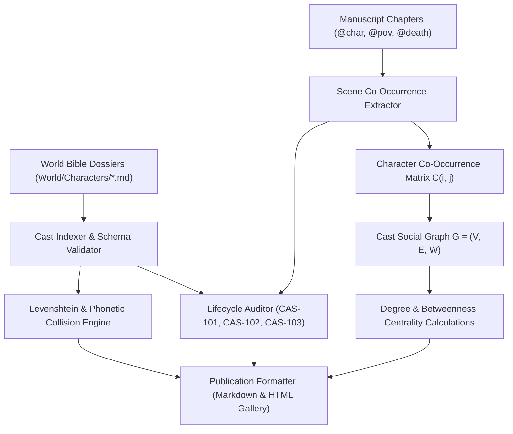

# Multi-Volume Dramatis Personae, Ensemble Dynamics & Name Collision Prevention (`docs/DRAMATIS_PERSONAE.md`)
> **Domain D: Sociology, Factions, Economics, Genealogy & Warfare** | **CLI:** `arcanum cast` / `arcanum dramatis-personae`

---

## 1. Overview & Theoretical Rationale

The **Ars Arcanum Dramatis Personae Engine** (`scripts/lib/dramatis_personae.py`) is an offline character indexer, social network graph analyzer, ensemble role balancer, and publication appendix compiler for single novels and sprawling multi-volume series.

In multi-character speculative epics, tracking a cast across dozens of factions, viewpoints, and story arcs creates severe cognitive load for both author and reader:
1. **Name Collision Confusion (`CAS-101`)**: Introducing characters with phonetically or orthographically identical names (e.g. *Kaelen* and *Kaelas*, *Vance* and *Vane*), leading to reader disorientation.
2. **Ghost Characters (`CAS-102`)**: Minor characters appearing in prose without canonical dossiers in `World/Characters/*.md`.
3. **Post-Mortem Actions (`CAS-103`)**: Characters speaking or acting in scenes chronologically subsequent to their recorded death.
4. **Cast Bloat & Zero-Agency Observers (`CAS-104`)**: Characters who populate scenes without speaking, acting, or exerting dramatic agency.
5. **Ensemble Role Monoculture**: A squad where every character possesses identical personality archetypes (e.g. all sarcastic cynics), lacking dramatic friction and functional team specialization.

The engine parses character dossiers, extracts scene co-occurrences, evaluates phoneme/edit distance collision risks, models ensemble dynamics via Belbin and foil theory, and compiles camera-ready publication appendices.



---

## 2. Mathematical Modeling & Social Network Formulations

### 2.1 Character Social Graph & Co-Occurrence Matrix
The cast is modeled as a weighted undirected graph $G = (V, E, W)$, where vertices $v \in V$ represent characters and edges $(u, v) \in E$ represent shared scene co-occurrences with weight $W(u, v) = \text{number of shared scenes}$.

The symmetric co-occurrence matrix $\mathbf{C} \in \mathbb{N}^{|V| \times |V|}$ satisfies:

$$C_{ij} = \sum_{s \in \text{Scenes}} \mathbb{I}(c_i \in s \land c_j \in s)$$

### 2.2 Graph Centrality & Cast Prominence Metrics
To quantify narrative importance independently of raw line counts:

1. **Degree Centrality ($C_D$)** (Immediate conversational/social reach):
   $$C_D(v) = \frac{\sum_{u \ne v} W(v, u)}{|V| - 1}$$

2. **Betweenness Centrality ($C_B$)** (Measures how often character $v$ acts as the sole communication bridge between isolated factions):
   $$C_B(v) = \sum_{s \ne v \ne t} \frac{\sigma_{st}(v)}{\sigma_{st}}$$
   Where $\sigma_{st}$ is the number of shortest paths between $s$ and $t$, and $\sigma_{st}(v)$ is the number of those paths traversing $v$.

3. **Agency & POV Ratio ($A_r$)**:
   $$A_r(v) = \frac{\text{Scenes where } v \text{ is POV}}{\text{Total Scenes containing } v} \in [0.0, 1.0]$$

### 2.3 Levenshtein & Phonetic Name Collision Prevention
To prevent confusing character names, the engine computes string edit distance and phonetic hashing:

$$\text{Levenshtein Edit Distance}: \quad \text{dist}_{\text{Lev}}(s_1, s_2) \le 2 \implies \text{Flag CAS-101 (High Collision Risk)}$$

$$\text{Phonetic Collision}: \quad \text{DoubleMetaphone}(s_1) == \text{DoubleMetaphone}(s_2) \implies \text{Flag CAS-101 (Phonetic Homophone)}$$

Example: *Brandon* vs *Brendan* ($\text{dist} = 2$, identical Metaphone `PRNTN`) triggers an immediate naming warning.

---

## 3. Ensemble Cast Dynamics & Character Foil Architecture

```
+-----------------------------------------------------------------------------------+
|                        THE 9 BELBIN TEAM ROLES IN FICTION                         |
+-------------------+-------------------------------+-------------------------------+
| 1. Plant (Vision) | 4. Monitor Evaluator (Logic)  | 7. Implementer (Execution)    |
| 2. Resource Inv.  | 5. Shaper (Drive & Pressure)  | 8. Completer Finisher (Detail)|
| 3. Coordinator    | 6. Teamworker (Empathy/Glue)  | 9. Specialist (Technical Lore)|
+-------------------+-------------------------------+-------------------------------+
```

### 3.1 Dialectical Character Foils
A character foil highlights another character's traits through direct contrast or mirrored symmetry:
- **Diametric Foils**: Opposite traits (e.g. The reckless idealist vs the calculating cynic).
- **Complementary Foils**: Shared goals but contrasting methodologies (e.g. The lawful paladin vs the pragmatic assassin).
- **Protagonist-Antagonist Moral Symmetry (The Shadow Self)**:
  - Identical origin trauma (e.g. both lost their families in the same siege).
  - Contrasting moral axiom adopted in response:
    $$\text{Protagonist}: \quad \text{"No one else shall suffer this fate." (Self-sacrifice)}$$
    $$\text{Antagonist}: \quad \text{"The world is cruel; I will rule it." (Domination)}$$

---

## 4. Subfeatures Matrix & Diagnostic Codes

| Diagnostic Code | Flag | Trigger Condition | Corrective Action |
|---|---|---|---|
| `CAS-101` | `NAME_COLLISION` | Two character names share Levenshtein $\le 2$ or identical phonetic sound. | Rename one character to vary starting letters and syllable count. |
| `CAS-102` | `GHOST_CHARACTER` | Named character speaks in manuscript without dossier in `World/Characters/`. | Generate dossier or tag character as background extra. |
| `CAS-103` | `POST_MORTEM_SCENE` | Character appears in scene chronologically after their recorded death. | Remove character or tag scene as `@flashback` / `@hallucination`. |
| `CAS-104` | `LOW_AGENCY_EXTRA` | Major named character present in $> 10$ scenes with zero dialogue or decisions. | Give character a proactive objective or prune them from scene. |
| `CAS-105` | `ROLE_MONOCULTURE` | All members of an ensemble squad share the identical Belbin role (e.g. all Shapers). | Diversify cast roles (add a Teamworker or Specialist). |

---

## 5. Character Dossier Schema & Publication Formatter

### 5.1 Character Dossier (`World/Characters/Commander_Vane.md`)
```yaml
---
name: "Commander Roderic Vane"
aliases:
  - "The Iron Warden"
  - "Old Rod"
faction: "Knights of the Sunken Spire"
belbin_role: "shaper" # plant | resource_investigator | coordinator | shaper | monitor_evaluator | teamworker | implementer | completer_finisher | specialist
moral_alignment: "lawful_neutral"
archetype: "hardened_veteran"
foil_target: "Lady_Isolde" # Complementary foil
lifecycle:
  birth_year: 388
  death_year: null
  status: "alive"
relationships:
  - target: "Lady_Isolde"
    type: "reluctant_ally"
    strength: 0.8
  - target: "Lord_Cassian"
    type: "rival"
    strength: -0.7
---
```

### 5.2 Scene Casting Directives (`Manuscript/Chapter-05.md`)
```markdown
# Chapter 5: The Council of War
@pov: Lady_Isolde
@cast: [Commander_Vane, Lord_Cassian, Archchancellor_Merrick]
@scene_dynamic: "Vane demands assault; Isolde advocates sabotage."

Vane slammed his gauntlet onto the strategy map. "We march at dawn, or we rot."
```

---

## 6. Worked Step-by-Step Example

### Scenario: Auditing a 6-Person Heist Ensemble
1. **Cast List**:
   - *Kaelen* (Role: `coordinator` / Mastermind)
   - *Kaelas* (Role: `specialist` / Locksmith) $\to$ **CAS-101 Flag: Levenshtein distance = 1, Phonetic Collision**.
   - *Brann* (Role: `shaper` / Brawler)
   - *Dorian* (Role: `plant` / Illusionist)
   - *Lyra* (Role: `resource_investigator` / Fence)
   - *Theron* (Role: `completer_finisher` / Getaway Driver)
2. **Name Collision Resolution**: Rename *Kaelas* $\to$ *Zephyr Vance*. Distance from Kaelen becomes 9, phonetic collision cleared.
3. **Belbin Balance Check**: Roles present: Coordinator, Specialist, Shaper, Plant, Resource Investigator, Completer Finisher.
   - **Balance Result**: 6 distinct roles across 6 members. Zero role monoculture.
4. **Foil Dynamic**:
   - *Brann (Action/Brute Force)* vs *Zephyr (Patience/Precision)* $\implies$ Natural comic and tactical friction during infiltration scenes.

---

## 7. Recommended Reading, References & Media

### 7.1 Foundational Craft & Academic Books
- **Egri, Lajos (1946)**. *The Art of Dramatic Writing: Its Basis in the Creative Interpretation of Human Motives*. Simon & Schuster. ISBN: 978-0671213329.  
  *The landmark text on character tridimensionality (physiology, sociology, psychology), orchestration, and dialectical premise.*
- **Card, Orson Scott (1988)**. *Characters & Viewpoint*. Writer's Digest Books. ISBN: 978-0898799262.  
  *Examines the creation of believable character hierarchies, emotional accessibility, and POV selection.*
- **Seger, Linda (1990)**. *Creating Unforgettable Characters*. Henry Holt & Co. ISBN: 978-0805011715.  
  *Comprehensive craft guide on character psychology, supporting cast orchestration, and contrast foils.*
- **Belbin, R. Meredith (1981)**. *Management Teams: Why They Succeed or Fail*. Heinemann. ISBN: 978-0750659192.  
  *The foundational management and behavioral psychology text establishing the 9 Team Roles applied across modern ensemble narratives.*
- **Propp, Vladimir (1928)**. *Morphology of the Folktale* (trans. Laurence Scott). University of Texas Press. ISBN: 978-0292783768.  
  *Structuralist taxonomy of the 7 character spheres of action (Hero, Villain, Donor, Helper, Princess/Sought Person, Dispatcher, False Hero).*

### 7.2 Landmark Scientific / Worldbuilding Papers & Textbooks
- **Wasserman, Stanley & Faust, Katherine (1994)**. *Social Network Analysis: Methods and Applications*. Cambridge University Press. ISBN: 978-0521387071.  
  *The definitive mathematical reference for graph centrality, sociograms, and dyadic tie strength in social structures.*
- **Levenshtein, Vladimir I. (1966)**. "Binary codes capable of correcting deletions, insertions, and reversals", *Soviet Physics Doklady*, 10(8), 707–710.  
  *The foundational paper defining the string metric for quantifying difference between two sequences.*

### 7.3 Seminal Video Lectures, Masterclasses & Channels
- **Brandon Sanderson (2020)**. *Lecture #4: Character Arcs, Viewpoints & Ensembles*, BYU Creative Writing Lectures. YouTube.  
  *Formulates character Likability, Competence, and Proactivity sliding scales and ensemble balance.*
- **Hello Future Me (Tim Hickson, 2019)**. *How to Write Great Character Foils & Ensemble Casts*. YouTube.  
  *Detailed breakdowns of Avatar: The Last Airbender and Lord of the Rings cast dynamics.*
- **Tale Foundry (2018)**. *The Secret to Writing Great Ensembles (and How to Avoid Character Bloat)*. YouTube.  
  *Analyzes character economy, unique dramatic functions, and preventing redundant cast members.*

### 7.4 Landmark Speculative Case Studies
- **George R.R. Martin, *A Game of Thrones* (1996)**: The pinnacle of large-cast social network complexity, POV balance, and moral symmetry (Eddard Stark vs Tywin Lannister).
- **Joe Abercrombie, *The First Law Trilogy* (2006–2008)**: Textbook masterclass in character foils, inverted archetypes, and cynical deconstructions (Logen, Glokta, Jezal).
- **Leigh Bardugo, *Six of Crows* (2015)**: Archetypal implementation of the 6-role Belbin heist ensemble with perfectly balanced complementary foils.
