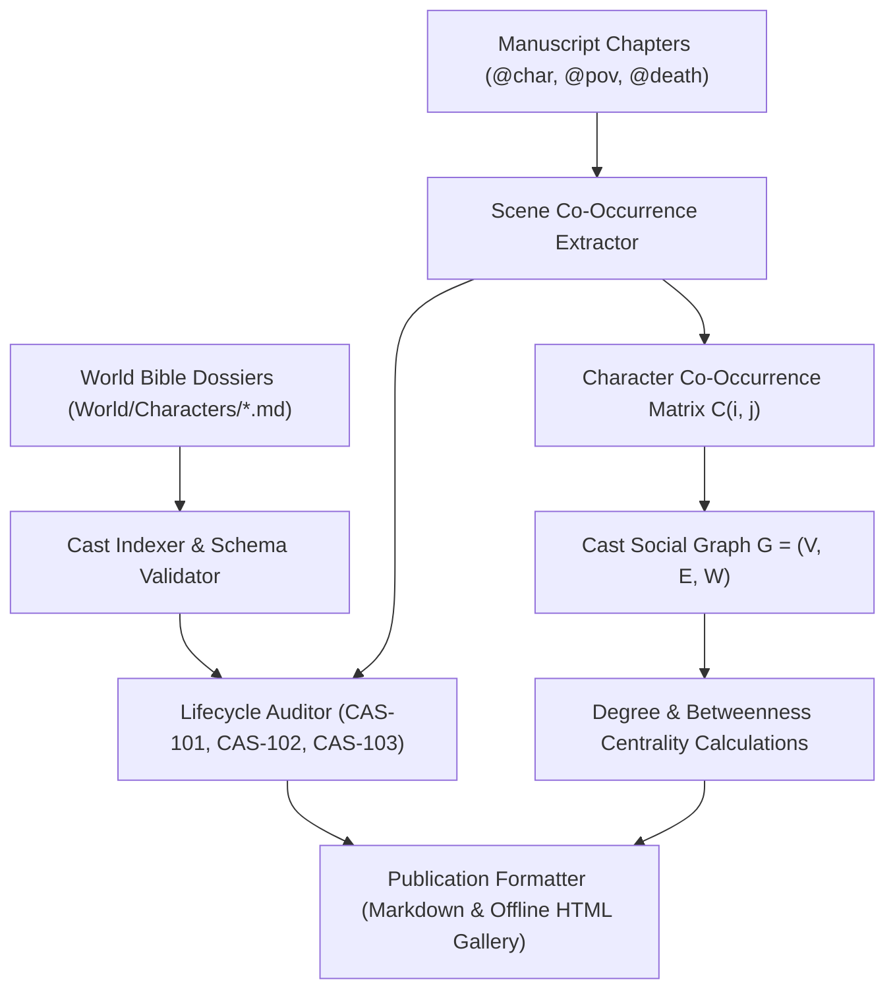
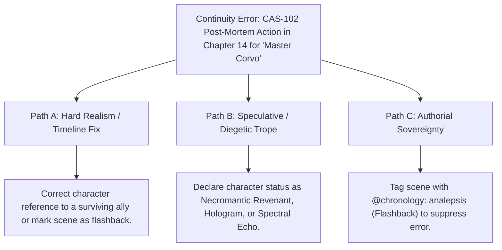

# Ars Arcanum Multi-Volume Dramatis Personae & Universe Cast Matrix (`docs/DRAMATIS_PERSONAE.md`)
> **Domain D: Sociology, Factions, Economics, Genealogy & Warfare** | **CLI:** `arcanum cast` / `arcanum dramatis-personae`

---

## 1. Overview & Theoretical Rationale

The **Ars Arcanum Dramatis Personae Engine** (`scripts/lib/dramatis_personae.py`) is an offline character indexer, social network graph analyzer, and publication-ready appendix compiler for single novels and multi-volume series.

In multi-character speculative epics, tracking a sprawling cast across dozens of factions, viewpoints, and story arcs creates immense cognitive friction. Authors encounter three major narrative continuity and character balance failure modes:
1. **Ghost Characters (`CAS-101`)**: Ephemeral characters introduced in prose without canonical dossiers in the World Bible, risking inconsistent backstories.
2. **Post-Mortem Actions (`CAS-102`)**: Characters appearing or speaking in scenes chronologically subsequent to their recorded death or exile.
3. **Orphan Lore Characters (`CAS-103`)**: Sprawling dossiers created in worldbuilding notes that never participate in the dramatic narrative.
4. **Cast Network Bloat & Low Agency**: Characters who inhabit scenes without driving conflict, exerting agency, or altering relationships.

The engine parses character dossiers (`World/Characters/*.md`), correlates `@char:`, `@cast:`, `@pov:`, and `@death:` directives across manuscript chapters, constructs a social co-occurrence network graph $G = (V, E)$, computes graph centrality indices, and generates formatted publication appendices.

---

## 2. Social Network Theory & Mathematical Formulation



### 2.1 Character Social Graph & Co-Occurrence Matrix
The cast is represented as a weighted undirected graph $G = (V, E, W)$, where vertices $V$ represent characters and edges $(u, v) \in E$ represent shared scene appearances with weight $W(u, v) = \text{number of shared scenes}$.

The symmetric co-occurrence matrix $\mathbf{C} \in \mathbb{N}^{|V| \times |V|}$ satisfies:
$$C_{ij} = \sum_{s \in \text{Scenes}} \mathbb{I}(c_i \in s \land c_j \in s)$$

### 2.2 Graph Centrality & Character Prominence Metrics
To measure character narrative importance independently of raw word count, the engine computes:

1. **Degree Centrality ($C_D$)**: Direct conversational and spatial connections:
   $$C_D(v) = \frac{\sum_{u \ne v} W(v, u)}{|V| - 1}$$

2. **Betweenness Centrality ($C_B$)**: Measures how often a character serves as a bridge between otherwise isolated factions or subplots:
   $$C_B(v) = \sum_{s \ne v \ne t} \frac{\sigma_{st}(v)}{\sigma_{st}}$$
   Where $\sigma_{st}$ is the total number of shortest paths from character $s$ to character $t$, and $\sigma_{st}(v)$ is the number of those paths passing through $v$.

3. **Agency & POV Ratio ($A_r$)**:
   $$A_r(v) = \frac{\text{Scenes where } v \text{ is POV}}{\text{Total Scenes containing } v}$$

---

## 3. Subfeatures Matrix

| Subfeature | Algorithmic Mechanism | Diagnostic Output / Rule | Narrative Significance |
|---|---|---|---|
| **Multi-Volume Cast Discovery** | Recursively scans `World/Characters/` indexing frontmatter metadata. | Indexes name, aliases, faction, role, and status. | Maintains a single authoritative source of truth for universe characters. |
| **Manuscript Cross-Referencing** | Scans `@char`, `@cast`, `@pov`, and `@death` tags across all chapters. | Maps scene timeline appearances and POV shares. | Verifies character screen-time and participation distribution. |
| **Lifecycle Continuity Auditor** | Compares appearance timestamps against `@death` directives and dossiers. | Emits `CAS-101` (Ghost), `CAS-102` (Post-Mortem), `CAS-103` (Orphan). | Guarantees dead characters stay dead and all named actors exist in lore. |
| **Social Network Analyzer** | Constructs weighted co-occurrence graph and computes centrality. | Surfaces isolated character islands and central network brokers. | Prevents bloated cast ensembles with disconnected character threads. |
| **Publication Appendix Formatter**| Generates structured Markdown and HTML grouped by faction/role. | Emits publication-ready `DRAMATIS_PERSONAE.md` back matter. | Produces reader-friendly character glossaries with zero manual formatting. |

---

## 4. Author Extension & Configuration Guide

### 4.1 Character Lore Dossier (`World/Characters/Elena_Vane.md`)
```markdown
---
name: Elena Vane
aliases:
  - The Star-Weaver
  - Lady of the Northern Spire
role: Major Protagonist
faction: Astromancers Guild
status: Active
origin: High Vale
importance: Primary
---

# Elena Vane
Elena is the youngest magister to sit on the High Astronomical Council...
```

### 4.2 In-Manuscript Scene Tags
```markdown
---
title: "The Siege of the Obsidian Gate"
pov: "Elena Vane"
characters:
  - "Vance Keller"
  - "Master Corvo"
---

@char: Vance Keller, Master Corvo
The air hummed with ionized mana.

@death: Master Corvo
Corvo collapsed as the ward failed. His staff clattered against the stone.
```

---

## 5. Command-Line Interface (CLI) Reference

```bash
# Analyze cast across full universe or manuscript directory
arcanum cast Universes/Eldoria/

# Generate publication-ready Markdown Dramatis Personae appendix
arcanum cast Universes/Eldoria/ --markdown Manuscripts/Book-01/Back_Matter/DRAMATIS_PERSONAE.md

# Export standalone offline interactive HTML character gallery
arcanum cast Universes/Eldoria/ --html reports/cast_gallery.html

# Output raw JSON cast graph data for visualization
arcanum cast Universes/Eldoria/ --json

# Query cast logic and network centrality theory
arcanum doc dramatis_personae --math --why
```

---

## 6. Tri-Fold Creative Advisory Resolutions



### Scenario: Post-Mortem Action Warning (`CAS-102`)
- **Path A (Hard Realism / Strict Continuity)**:
  - Verify chapter chronology. If the character died in Chapter 10, remove their dialogue in Chapter 14 or replace them with a surviving lieutenant.
- **Path B (Speculative / Diegetic Trope)**:
  - Reframe the appearance as a legitimate supernatural manifestation: a necromantic revenant, an AI holographic recording, or an astral projection. Update status in dossier to `Status: Undead`.
- **Path C (Authorial Sovereignty)**:
  - If Chapter 14 is a non-linear flashback (*analepsis*), tag the chapter frontmatter with `chronology: flashback` or `@time: 10_years_prior` to bypass sequential death validation.

---

## 7. Content Security Policy & Offline Isolation

Generated character galleries and HTML appendices operate strictly offline with zero external network access:

```html
<meta http-equiv="Content-Security-Policy" content="default-src 'none'; style-src 'unsafe-inline'; script-src 'unsafe-inline'; img-src data:; media-src data: blob:;">
```
