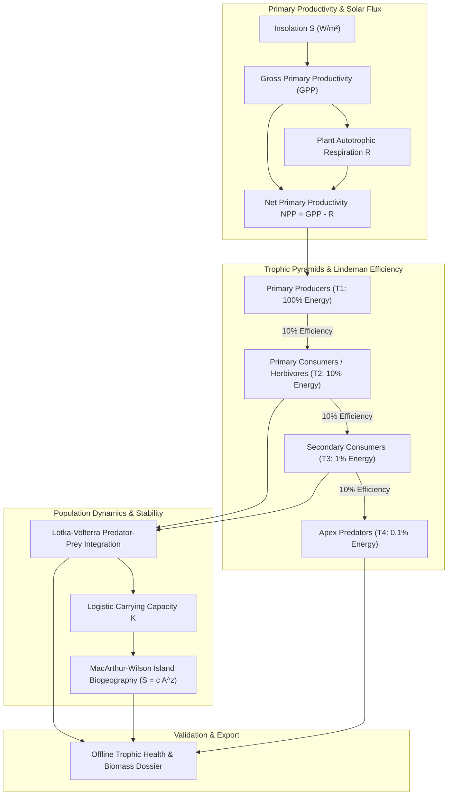

# Trophic Energetics, Population Dynamics & Biogeography (`docs/ECOLOGY.md`)
> **Domain A: Astrophysics, Climate, Cartography & Celestial Mechanics** | **CLI:** `arcanum ecology` / `arcanum biome`

---

## 1. Executive Summary & Epistemological Architecture

The **Ars Arcanum Ecology Engine** (`scripts/lib/ecology.py`) is an offline ecological dynamics simulator, trophic food-web auditor, and population carrying capacity calculator designed for fantasy and hard science fiction worldbuilders.

Ecological systems are constrained by mass-energy conservation, thermodynamic trophic dissipation, and demographic feedback loops. Fictional ecologies frequently suffer from foundational biological impossibilities:
1. **The Megafauna Carnivore Paradox**: Placing millions of gargantuan apex predators (dragons, hydras, giant spiders) in barren deserts or frozen wastelands with zero herbivore prey base to support their caloric demand.
2. **Infinite Exponential Growth Fallacies**: Depicting predatory or invasive species multiplying indefinitely without encountering logistic carrying capacity constraints ($K$) or catastrophic Malthusian die-offs.
3. **Island Biogeography Violations**: Populating isolated $10\text{ km}^2$ oceanic islands with hundreds of distinct, non-migratory megafauna species, violating the MacArthur-Wilson equilibrium.
4. **Niche Congestion**: Placing multiple distinct sentient or non-sentient species into identical ecological niches without niche partitioning or competitive exclusion.

The Ecology Engine parses biome and creature definitions (`World/Ecology/*.md`, `World/Beasts/*.md`), constructs directed trophic energy graphs, solves Lotka-Volterra differential equations, and audits food webs for energetic viability.



---

## 2. Ecosystem Energetics & Lindeman’s Efficiency Law

All biological life relies on the transformation of external energy (photons from stellar insolation or geothermal chemical bonds at hydrothermal vents) into organic biomass.

```
                           [ TROPHIC ENERGY PYRAMID ]
      ┌──────────────────────────────────────────────────────────────┐
      │  T4: APEX PREDATORS (Dragons, Lions)       ──► 10 Joules     │
      ├──────────────────────────────────────────────────────────────┤
      │  T3: SECONDARY CONSUMERS (Wolves, Snakes)  ──► 100 Joules    │
      ├──────────────────────────────────────────────────────────────┤
      │  T2: PRIMARY CONSUMERS (Deer, Oxen)        ──► 1,000 Joules  │
      ├──────────────────────────────────────────────────────────────┤
      │  T1: PRIMARY PRODUCERS (Forests, Grass)    ──► 10,000 Joules │
      └──────────────────────────────────────────────────────────────┘
```

### 2.1 Primary Productivity Metrics
- **Gross Primary Productivity (GPP)**: Total rate at which primary producers capture solar energy and synthesize chemical biomass ($\text{g C/m}^2/\text{yr}$ or $\text{kcal/m}^2/\text{yr}$).
- **Net Primary Productivity (NPP)**: Usable chemical energy remaining after plant cellular respiration ($R_{\text{plant}}$):
  $$\text{NPP} = \text{GPP} - R_{\text{plant}}$$

### 2.2 Lindeman's 10% Ecological Efficiency Law
Raymond Lindeman (1942) established that the trophic transfer efficiency $\lambda$ between adjacent trophic levels $n-1$ and $n$ is typically only $5\%\text{–}20\%$ (canonical average $\lambda \approx 0.10$):

$$\lambda = \frac{P_n}{P_{n-1}} \approx 0.10$$

The remaining $90\%$ of energy is dissipated as metabolic waste heat, movement, undigested biomass (feces/bones), and cellular maintenance.

#### Maximum Apex Predator Biomass Formula:
For an ecosystem with total terrestrial area $A$ ($\text{km}^2$) and mean annual $\text{NPP}$ ($\text{kcal/m}^2/\text{yr}$), the maximum sustainable biomass energy $E_{\text{apex}}$ at trophic level $T = 4$:

$$E_{\text{apex}} = A \times 10^6 \times \text{NPP} \times \lambda^{T - 1} = A \times 10^6 \times \text{NPP} \times (0.10)^3 = A \times 10^3 \times \text{NPP} \text{ kcal/yr}$$

*Hard Worldbuilding Rule*: Why are giant carnivores rare? Because sustaining a single $5000\text{ kg}$ apex predator requires an ecological footprint thousands of times larger than sustaining a $5000\text{ kg}$ herbivore.

---

## 3. Mathematical Population Dynamics

```
      Population (N)
           ▲
         K ┼ - - - - - - - - - - - - - - - - - - - Carrying Capacity K
           │                 ╭──────────────────── Logistic Growth Curve
           │               ╭─╯
           │             ╭─╯
           │           ╭─╯   Exponential Phase (r)
           │     ────╭─╯
         0 ┼─────────┴────────────────────────────► Time (t)
```

### 3.1 Logistic Growth & Carrying Capacity (Verhulst Equation)
When a population $N(t)$ expands in an environment with limiting resources, growth slows as population approaches the environmental **carrying capacity** $K$:

$$\frac{dN}{dt} = r N \left( 1 - \frac{N}{K} \right)$$

Where:
- $r$ is the intrinsic per-capita growth rate (biotic potential).
- $K$ is the maximum sustainable population supported by local primary productivity.

The analytical closed-form solution for initial population $N_0$:

$$N(t) = \frac{K}{1 + \left( \frac{K - N_0}{N_0} \right) e^{-r t}}$$

### 3.2 Lotka-Volterra Predator-Prey Differential Equations
For interacting prey population $x(t)$ and predator population $y(t)$:

$$\frac{dx}{dt} = \alpha x - \beta x y$$
$$\frac{dy}{dt} = \delta x y - \gamma y$$

Where:
- $\alpha$: Intrinsic prey birth rate.
- $\beta$: Predation rate coefficient (efficiency of prey capture).
- $\gamma$: Intrinsic predator starvation/mortality rate.
- $\delta$: Conversion efficiency of consumed prey into predator offspring.

#### Non-Trivial Stationary Equilibrium Points $(x^*, y^*)$:
Setting $\frac{dx}{dt} = 0$ and $\frac{dy}{dt} = 0$:

$$x^* = \frac{\gamma}{\delta}, \quad y^* = \frac{\alpha}{\beta}$$

In phase-space $(x, y)$, the populations trace closed periodic orbits around this neutral center, producing classic phase-lagged predator-prey population oscillations.

---

## 4. Island Biogeography & Metapopulation Theory

```
      Rate (per species)
           ▲
           │ \                                 / Extinction E(S)
           │   \                             /
  Immigration │     \                         /
    Rate I(S)│       \                       /
           │         \                     /
           │           \                 /
           │             \             /
           │               \         /
           │                 \     /
           │                   \ /
           │                    X ◄────── Equilibrium Richness Ŝ
           │                   / \
           │                 /     \
           │               /         \
         0 ┼──────────────┴───────────┴───────────► Species Richness (S)
                          0           P
```

### 4.1 The MacArthur-Wilson Equilibrium Model
The number of species $\hat{S}$ on an isolated habitat island represents a dynamic equilibrium between immigration rate $I(S)$ and extinction rate $E(S)$:

$$I(S) = I_{\text{max}} \left( 1 - \frac{S}{P} \right), \quad E(S) = E_{\text{max}} \left( \frac{S}{P} \right)$$

Where $P$ is the mainland species pool size.

$$\hat{S} = \frac{I_{\text{max}} P}{I_{\text{max}} + E_{\text{max}}}$$

- **Distance Effect**: Islands farther from mainland have reduced $I_{\text{max}} \implies$ lower equilibrium species richness $\hat{S}$.
- **Area Effect**: Smaller islands have smaller carrying capacities, higher demographic stochasticity, and higher extinction rates $E_{\text{max}} \implies$ lower $\hat{S}$.

### 4.2 The Arrhenius Species-Area Power Law
The canonical empirical relationship between geographic land area $A$ and species richness $S$:

$$S = c \, A^z$$

Where:
- $c$: Biome-dependent biodiversity constant.
- $z$: Scaling exponent ($z \approx 0.12\text{--}0.18$ for continuous mainland regions; $z \approx 0.25\text{--}0.35$ for isolated oceanic islands or fragmented fantasy enclaves).

*Rule of Thumb*: A $90\%$ reduction in land area ($A \to 0.10 A$) cuts biodiversity approximately in half ($S \to 0.10^{0.30} S \approx 0.50 S$).

---

## 5. Ecological Niche Theory & Life History Strategies

### 5.1 Gause’s Principle of Competitive Exclusion
Two distinct species competing for the exact same limiting resource cannot stably coexist at constant population values. The species with even the slightest competitive advantage will drive the other to local extinction.

#### Mechanisms of Coexistence (Niche Partitioning):
1. **Spatial Partitioning**: Foraging at different vertical canopy layers (e.g., Warblers in spruce trees).
2. **Temporal Partitioning**: Diurnal vs nocturnal activity cycles (e.g., Hawks vs Owls).
3. **Dietary / Trophic Partitioning**: Specializing on distinct prey size classes or tough plant parts.

### 5.2 $r$-Selection vs $K$-Selection Strategies

| Trait | $r$-Strategists (Opportunists) | $K$-Strategists (Competitors) |
|---|---|---|
| **Environment** | Unstable, unpredictable, high mortality | Stable, predictable, near carrying capacity $K$ |
| **Body Size** | Small (insects, rodents, goblins) | Large (elephants, whales, dragons, humans) |
| **Offspring Quantity** | Massive numbers (hundreds to thousands) | Few (1–2 per birth cycle) |
| **Parental Investment** | Minimal to zero | Extremely high, multi-year nurturing |
| **Lifespan** | Short ($< 1\text{ to } 5\text{ years}$) | Long ($50\text{ to } 500+\text{ years}$) |
| **Population Trajectory**| Boom-and-bust crashes | Stable equilibrium around $K$ |

---

## 6. Worked Step-by-Step Ecological Calculation: Dragon Apex Territory

### Scenario:
A worldbuilder wants to place a population of apex predatory dragons in a temperate mountainous valley of area $A = 12,000\text{ km}^2$.
- Valley $\text{NPP} = 4,000\text{ kcal/m}^2/\text{yr}$ (temperate woodland/pasture).
- An adult dragon weighs $M_d = 4,000\text{ kg}$ and requires $E_{\text{dragon}} = 80,000\text{ kcal/day} \approx 29,200,000\text{ kcal/yr}$.
- Trophic efficiency $\lambda = 0.10$. Dragons operate at Trophic Level 4 (feeding on deer, sheep, cattle at T2/T3).

#### Step 1: Compute Total Primary Energy of the Valley
$$E_{\text{total, T1}} = A \times 10^6 \text{ m}^2/\text{km}^2 \times \text{NPP} = 12,000 \times 10^6 \times 4,000 = 4.8 \times 10^{13} \text{ kcal/yr}$$

#### Step 2: Calculate Energy Available at Trophic Level 4
$$E_{\text{available, T4}} = E_{\text{total, T1}} \times \lambda^3 = 4.8 \times 10^{13} \times 0.001 = 4.8 \times 10^{10} \text{ kcal/yr}$$

#### Step 3: Compute Theoretical Maximum Dragon Carrying Capacity
$$K_{\text{dragons}} = \frac{E_{\text{available, T4}}}{E_{\text{dragon}}} = \frac{4.8 \times 10^{10} \text{ kcal/yr}}{2.92 \times 10^7 \text{ kcal/yr}} \approx 1,643 \text{ dragons}$$

#### Step 4: Apply Ecological Harvest & Competition Factor
In reality, other carnivores (wolves, bears, human hunters) consume $80\%$ of the prey biomass, and dragons cannot capture $100\%$ of available herbivore energy without collapsing prey reproduction (harvest efficiency $\eta \approx 0.15$):

$$N_{\text{sustainable}} = K_{\text{dragons}} \times 0.20 \times 0.15 \approx 1643 \times 0.03 \approx 49 \text{ adult dragons}$$

*Result*: The entire $12,000\text{ km}^2$ mountain basin can stably support a breeding population of approximately **40 to 50 adult dragons**. Placing 5,000 dragons in this valley would cause total prey extinction within months.

---

## 7. Practical YAML Schemas

```yaml
schema_version: "2.0"
biome_ecology:
  id: "valdur_temperate_basin"
  area_km2: 12000.0
  npp_kcal_m2_yr: 4000.0

trophic_levels:
  t1_producers:
    - id: "temperate_oak_pine"
      biomass_tons: 24000000.0
    - id: "riverine_grasslands"
      biomass_tons: 6000000.0

  t2_primary_consumers:
    - id: "valdur_red_deer"
      adult_mass_kg: 180.0
      population: 45000
      caloric_demand_kcal_day: 6500.0
      r_growth_rate: 0.25

  t3_secondary_consumers:
    - id: "timber_wolf"
      adult_mass_kg: 45.0
      population: 850
      caloric_demand_kcal_day: 2800.0

  t4_apex_predators:
    - id: "crested_drake"
      adult_mass_kg: 4000.0
      population: 48
      caloric_demand_kcal_day: 80000.0
      strategy: "K_selected"
```

---

## 8. CLI Reference & Scriptorium Integration

```bash
# Audit regional biome food web for trophic deficits or megafauna collapse
arcanum ecology --audit World/Ecology/valdur_basin.yaml

# Run Lotka-Volterra predator-prey numerical simulation over 50 years
arcanum ecology --simulate-prey --prey-pop 45000 --pred-pop 850 --years 50

# Compute island species equilibrium richness based on area and distance
arcanum biome --island-richness --area-km2 450.0 --distance-km 120.0
```

---

## 9. Recommended Reading, References & Media

### Foundational Craft & Academic Textbooks
- **Odum, Eugene P. (1971)**. *Fundamentals of Ecology* (3rd ed.). W.B. Saunders.  
  *The landmark foundational textbook that established ecosystem ecology, energy flow, and trophic systems.*
- **MacArthur, Robert H., & Wilson, Edward O. (1967)**. *The Theory of Island Biogeography*. Princeton University Press.  
  *The mathematical cornerstone for species-area scaling, immigration-extinction equilibria, and habitat fragmentation.*
- **Elton, Charles (1927)**. *Animal Ecology*. Sidgwick & Jackson.  
  *Introduced the ecological niche, food chains, and the pyramid of numbers.*
- **Hutchinson, G. Evelyn (1978)**. *An Introduction to Population Ecology*. Yale University Press.  
  *Formulated the multidimensional $n$-dimensional hypervolume niche model.*

### Landmark Scientific Papers
- **Lindeman, Raymond L. (1942)**. "The Trophic-Dynamic Aspect of Ecology." *Ecology*, 23(4), 399–417.  
  *The groundbreaking paper deriving thermodynamic efficiency and energy flow between trophic levels.*
- **Paine, Robert T. (1966)**. "Food Web Complexity and Species Diversity." *The American Naturalist*, 100(910), 65–75.  
  *Introduced the 'Keystone Species' concept via intertidal Pisaster sea star removal experiments.*
- **Gause, Georgii F. (1934)**. *The Struggle for Existence*. Williams & Wilkins.  
  *Empirical experimental verification of the Competitive Exclusion Principle.*

### Seminal Video Lectures, Masterclasses & Channels
- **Sir David Attenborough & BBC Natural History Unit** (*Planet Earth I & II*, *Life*, *The Blue Planet*).  
  *The ultimate visual encyclopedia of biome adaptation, predatory dynamics, and niche specialization.*
- **TierZoo** (YouTube Series: *The Evolutionary Meta & Trophic Tier Lists*).  
  *Ingenious gamified breakdowns of ecological niches, stat allocations, and evolutionary strategies.*
- **PBS Eons** (YouTube Series: *Why Megafauna Vanished*, *The Evolution of Apex Predators*).  
  *In-depth explorations of ancient food webs, carbon cycles, and extinction mechanics.*

### Landmark Speculative Case Studies
- **Herbert, Frank**. *Dune* (Pardot Kynes' ecological terraforming equations, desert trophic food chains, and sandworm physiology).
- **Cameron, James**. *Avatar* (Pandora's super-dense biomass, neural mycorrhizal networks, and hexapedal megafaunal energetics).
- **Watts, Peter**. *Blindsight* (Vampire biology as an obligate apex predator with predatory autism and Protocadherin gene expression).
- **VanderMeer, Jeff**. *The Southern Reach Trilogy* (*Annihilation*, depicting anomalous ecological transformation, trophic contamination, and genetic boundary decay).
