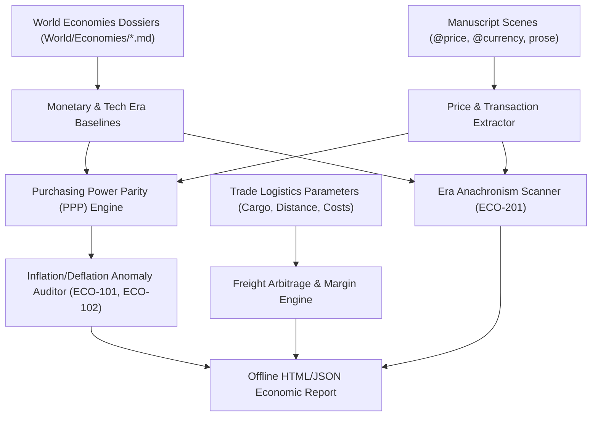
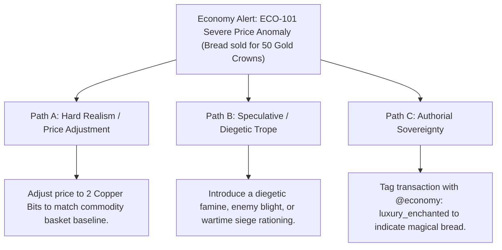

# In-World Macroeconomics, Purchasing Power Parity & Trade Logistics (`docs/ECONOMY.md`)
> **Domain D: Sociology, Factions, Economics, Genealogy & Warfare** | **CLI:** `arcanum economy` / `arcanum trade`

---

## 1. Overview & Theoretical Rationale

The **Ars Arcanum Economy Engine** (`scripts/lib/economy.py`) is an offline macroeconomic validator, Purchasing Power Parity (PPP) calculator, trade arbitrage modeler, and technological era anachronism auditor designed for worldbuilders and speculative novelists.

Economic inconsistencies shatter reader suspension of disbelief. Common worldbuilding failure modes include:
1. **Arbitrary Hyperinflation / Deflation (`ECO-101`)**: A loaf of bread costing 2 coppers in Chapter 1, but 50 gold coins in Chapter 12 without famine or monetary debasement.
2. **Unregistered Currencies (`ECO-102`)**: Spontaneously introducing currencies absent from the World Bible.
3. **Impossible Trade Route Margins**: Caravans or cargo starships hauling bulk low-value commodities across vast distances where transport costs dwarf destination market value.
4. **Technological Era Anachronisms (`ECO-201`)**: Accidental references to post-Industrial terms (*dynamite*, *plastic*, *radar*, *bacteria*) in Bronze Age or Medieval manuscripts.

The Economy Engine establishes mathematically sound monetary baselines, calculates inter-realm PPP exchange rates based on representative commodity baskets, models freight transport margins, and scans manuscripts for chronological lexical anachronisms.

---

## 2. Macroeconomic Theory & Mathematical Formulation



### 2.1 The Quantity Theory of Money (Fisher Equation)
In any realm's macroeconomy, the total monetary circulation balances total transactions:

$$M \cdot V = P \cdot Y$$

Where:
- $M$: Total money supply (coinage in circulation, paper scrip, or credit vouchers).
- $V$: Velocity of money (how frequently a unit of currency changes hands per year).
- $P$: Price level of goods.
- $Y$: Real aggregate output/transactions of the economy.

If an author introduces a massive dragon hoard into a local village, $\Delta M \gg 0$ while $Y$ remains fixed, resulting in immediate severe local price inflation: $\Delta P \propto \Delta M$.

### 2.2 Purchasing Power Parity (PPP) Basket Index
When converting values between Realm $A$ and Realm $B$, the engine computes the geometric or arithmetic relative basket cost across $K$ shared commodities:

$$\text{PPP}_{A \to B} = \frac{1}{K} \sum_{i=1}^{K} \frac{P_A(\text{Good}_i)}{P_B(\text{Good}_i)}$$

$$\text{Implied Exchange Rate Error} = \left| \frac{\text{OfficialExchangeRate}(A, B) - \text{PPP}_{A \to B}}{\text{PPP}_{A \to B}} \right|$$

### 2.3 Trade Route Freight Arbitrage & Net Profit Margin
For a merchant caravan or cargo freighter transporting $Q$ tons of goods over distance $d$:

$$\text{Gross Revenue} = Q \cdot P_{\text{destination}}$$
$$\text{Sourcing Cost} = Q \cdot P_{\text{origin}}$$
$$\text{Transport Cost} = Q \cdot d \cdot C_{\text{transit_per_ton_km}}$$
$$\text{Tariffs} = Q \cdot P_{\text{destination}} \cdot \tau_{\text{import}}$$
$$\text{Net Profit } \Pi = \text{Gross Revenue} - (\text{Sourcing Cost} + \text{Transport Cost} + \text{Tariffs})$$
$$\text{Profit Margin } (\%) = \frac{\Pi}{\text{Gross Revenue}} \times 100\%$$

$$\text{Economic Viability Condition} \iff \Pi > 0 \quad \land \quad \text{Margin} \ge \text{RiskPremium}_{\text{route}}$$

---

## 3. Subfeatures Matrix

| Subfeature | Algorithmic Mechanism | Diagnostic Output / Rule | Narrative Craft Significance |
|---|---|---|---|
| **Commodity Basket & PPP Engine**| Computes relative purchasing power across defined economies. | Emits normalized cross-realm exchange tables. | Enables realistic currency exchange and international trade. |
| **Price Anomaly Auditor** | Compares scene transactions against baseline commodity basket prices. | Flags `ECO-101: PRICE_ANOMALY` ($> 20\times$ deviation). | Catches unintentional economic hallucinations in dialogue and narration. |
| **Unregistered Currency Guard** | Scans prose currency references against `World/Economies/`. | Flags `ECO-102: UNREGISTERED_CURRENCY`. | Ensures every coin or monetary scrip is tied to a sovereign issuer. |
| **Trade Logistics Modeler** | Calculates freight costs, tariffs, and net margins across trade routes. | Emits trade route profitability and breakeven distance. | Prevents characters from pursuing economically impossible mercantile journeys. |
| **Era Anachronism Scanner** | Cross-references prose vocabulary against technological era lexicons. | Flags `ECO-201: ERA_ANACHRONISM` with line reference. | Protects medieval and ancient settings from modern linguistic slips. |

---

## 4. Author Extension & Configuration Guide

### 4.1 Economy Lore Dossier (`World/Economies/Solar_Empire.md`)
```markdown
---
name: "Solar Standard Economy"
base_currency: "Solar Crown"
tech_era: "medieval"
associated_faction: "Solar Empire"
currencies:
  - "Solar Crown: 1.0"
  - "Silver Sovereign: 0.1"
  - "Copper Bit: 0.01"
commodity_basket:
  - "loaf_of_bread: 0.02"    # 2 Copper Bits
  - "pint_of_ale: 0.01"       # 1 Copper Bit
  - "iron_dagger: 0.50"       # 5 Silver Sovereigns
  - "riding_horse: 15.0"      # 15 Solar Crowns
  - "wagon: 8.0"              # 8 Solar Crowns
---

# Solar Standard Economy
The official bullion-backed monetary system of the Solar Empire.
```

### 4.2 In-Manuscript Transaction Directives
```markdown
# Chapter 4: The Whispering Bazaar
@pov: Sean
@price: 0.50 Solar Crown for iron_dagger

The blacksmith slid the freshly oiled dagger across the counter.
"That will be five silver sovereigns," he grunted.
```

---

## 5. Command-Line Interface (CLI) Reference

```bash
# Scan manuscript for price anomalies and technological anachronisms
arcanum economy check World/ -m Manuscript/

# Calculate PPP exchange matrix between all world economies
arcanum economy ppp World/

# Calculate caravan or cargo freighter trade margin
arcanum economy trade --buy 50 --sell 120 --tons 20 --distance 500 --cost-per-km 0.25 --tariff 0.10

# Export standalone interactive HTML economy report
arcanum economy report World/ -m Manuscript/ --html reports/economy_report.html

# Output JSON economy diagnostics
arcanum economy check World/ -m Manuscript/ --json

# Query macroeconomic formulas and Fisher equation derivation
arcanum doc economy --math --why
```

---

## 6. Tri-Fold Creative Advisory Resolutions



### Scenario: Price Anomaly Warning (`ECO-101`)
- **Path A (Hard Realism / Price Realism)**:
  - Correct the transaction price in dialogue or narration to match established basket ratios.
- **Path B (Speculative / Diegetic Trope)**:
  - Justify the exorbitant price as an intentional plot point: the city is under total siege, a fungal blight destroyed the grain harvest, or the bread is enchanted with longevity spells.
- **Path C (Authorial Sovereignty)**:
  - Add `@price_override: true` to the scene directive, declaring an intentional micro-economic distortion.

---

## 7. Content Security Policy & Offline Isolation

All economic dashboards and trade margin visualizers execute 100% offline with zero CDN dependencies:

```html
<meta http-equiv="Content-Security-Policy" content="default-src 'none'; style-src 'unsafe-inline'; script-src 'unsafe-inline'; img-src data:; media-src data: blob:;">
```
