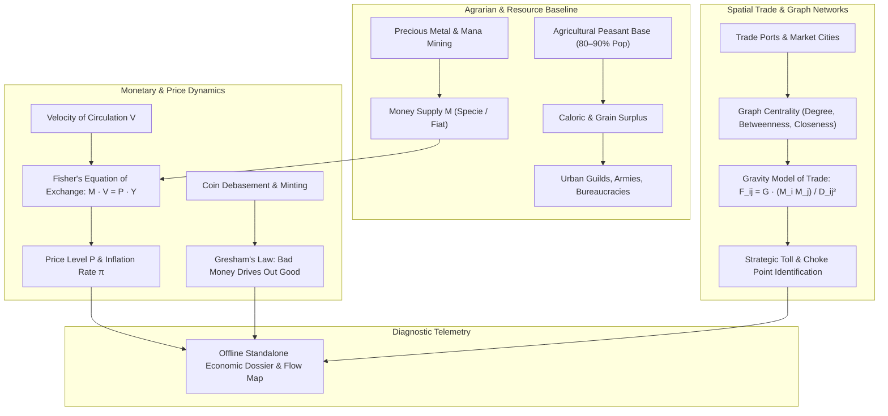

# Macroeconomic Systems, Monetary Dynamics & Trade Centrality (`docs/ECONOMY.md`)
> **Domain B: Societies, Lineages, Geopolitics & Tactical War** | **CLI:** `arcanum economy` / `arcanum trade`

---

## 1. Executive Summary & Epistemological Architecture

The **Ars Arcanum Economy Engine** (`scripts/lib/economy.py`) is an offline macroeconomic validator, currency debasement tracker, and trade route graph centrality analyzer engineered for fantasy worldbuilders, historical novelists, and game systems designers.

### Modular 4-Module Architecture

To maintain clear separation of concerns, high testability, and strict compliance with the `<800 lines/file` engineering limit, the macroeconomic engine is partitioned into four specialized modules:

1. **Macroeconomic Validator & CLI Dispatcher ([`scripts/lib/economy.py`](file:///scripts/lib/economy.py))**:
   - Manages CLI routing (`arcanum economy`, `arcanum trade`, `arcanum currency`).
   - Implements Fisher Equation simulations ($M \cdot V = P \cdot Y$), peasant surplus constraints, and Gresham's Law coin debasement auditing.
   - Integrates the thread-safe, cached `DataAccessLayer` (`get_data_access()`) for parsing regional YAML manifests and Markdown lore documents.

2. **Economic Data Structures & Schemas ([`scripts/lib/economy_data.py`](file:///scripts/lib/economy_data.py))**:
   - Defines strongly-typed dataclasses: `EconomicRegion`, `MonetarySystem`, `MarketCommodity`, and `TradeChokePoint`.
   - Provides default historical commodity baskets (food necessities, metals, textiles, luxuries) and baseline elasticity coefficients.

3. **Offline Report Visualizer ([`scripts/lib/economy_template.py`](file:///scripts/lib/economy_template.py))**:
   - Renders standalone HTML/SVG macroeconomic flow maps and inflation dossiers.
   - Enforces strict offline Content Security Policies (`default-src 'none'; style-src 'unsafe-inline'; script-src 'unsafe-inline'; img-src data:; media-src data: blob:;`).

4. **Spatial Trade & Network Centrality ([`scripts/lib/economy_trade.py`](file:///scripts/lib/economy_trade.py))**:
   - Computes graph-theoretic centrality metrics (degree, betweenness, and closeness) across continental trade route networks.
   - Implements the Gravity Model of Bilateral Trade ($F_{ij} = G \cdot \frac{M_i M_j}{D_{ij}^2}$) and automated commercial toll choke point detection.

Economic systems provide the structural engine for war, political stability, and civilization growth. Fictional worldbuilding frequently suffers from economic incoherence:
1. **The Dragon Hoard Liquidation Fallacy**: Protagonists dumping millions of gold coins into a small agrarian village without triggering catastrophic hyperinflation or the collapse of local currency purchasing power.
2. **Gresham's Law Inversion**: Depicting debased lead-copper coins circulating at parity with pure gold sovereigns without merchant counterfeiting resistance or bullion hoarding.
3. **Disconnected Trade Ports**: Positioning wealthy mercantile metropolises away from navigable waterways, high-degree graph choke points, or major commodity arbitrage routes.
4. **Zero Agricultural Foundation**: Depicting massive standing armies and towering stone cities in realms where $90\%$ of the population is not engaged in primary agricultural food production.

The Economy Engine audits currency purity, simulates the Equation of Exchange ($M \cdot V = P \cdot Y$), calculates network betweenness centrality across commercial trade routes, and calculates price elasticity under supply shocks.



---

## 2. Historical & Speculative Economic Modalities

```
                        [ ECONOMIC ARCHETYPE SPECTRUM ]
  1. RECIPROCITY & GIFTING  ──► Pre-agrarian bands; social debt & ritual obligations
  2. AGRARIAN MANORIALISM    ──► Feudal demesne; corvée labor, grain rents, serfdom
  3. MERCANTILE CAPITALISM  ──► Chartered monopoly guilds, bullionism, trade colonialism
  4. INDUSTRIAL MARKET      ──► Wage labor, capital markets, fiat fractional reserve
  5. SPECULATIVE POST-SCARCITY──► Energy-backed credit, matter synthesis, mana-standard
```

### 2.1 The Peasant Surplus Constraint (Pre-Industrial Baselines)
In pre-modern agrarian economies, food production is the fundamental limiting factor:
- A peasant farming family produces roughly $110\%\text{–}125\%$ of its own subsistence caloric needs in normal harvest years (a meager $10\%\text{–}20\%$ net surplus).
- Therefore, **$80\%\text{–}90\%$ of the total human population must work the land** to support the remaining $10\%\text{–}20\%$ in specialized urban roles (blacksmiths, priests, soldiers, scholars, nobility).
- Any fantasy realm featuring $50\%$ urban populations without industrialized synthetic agriculture or magical harvesting golems represents an immediate worldbuilding collapse.

---

## 3. Monetary Theory & Currency Mechanics

### 3.1 Currency Typology
1. **Commodity Money**: Currency whose value derives directly from the intrinsic physical material it is made of (e.g., silver specie, salt cakes, grain bushels, magical mana crystals).
2. **Representative Money**: Paper notes or tokens backed by a 1:1 redeemable physical reserve held in secure vault depositories (e.g., Early Bank of Venice receipts, Iron Bank promissory drafts).
3. **Fiat Money**: Currency with no intrinsic material value, established as legal tender solely by the decree, taxation authority, and martial enforcement of a sovereign state.

### 3.2 Gresham’s Law ("Bad Money Drives Out Good")
When a government or sovereign mint fixes an artificial exchange rate between two currencies of equal legal face value but different intrinsic intrinsic metallic worth, **the undervalued (good/pure) money is hoarded, melted down, or exported, while the overvalued (bad/debased) money remains in public circulation**.

$$\text{If } \frac{\text{Face Value}_A}{\text{Face Value}_B} = 1.0 \quad \text{but} \quad \text{Metallic Worth}_A > \text{Metallic Worth}_B \implies A \text{ is hoarded}, B \text{ circulates}$$

### 3.3 The Quantity Theory of Money & Fisher’s Equation of Exchange
Irving Fisher's fundamental identity connects money supply, money velocity, general price levels, and real economic output:

$$M \cdot V = P \cdot Y$$

Where:
- $M$: Total circulating nominal money supply ($\text{gold coins}$ or $\text{crowns}$).
- $V$: Velocity of circulation (the average number of times a single unit of currency changes hands per year).
- $P$: General aggregate price level of goods and services.
- $Y$: Real aggregate economic output (total physical volume of goods, services, and grain produced).

#### Specie Influx & The Dragon Hoard Shock
If an adventuring party or conquering emperor suddenly injects a colossal hoard $\Delta M$ into a local regional economy where output $Y$ is fixed in the short term by agricultural land limits:

$$\Delta P \approx P_0 \left( \frac{\Delta M}{M_0} \right)$$

*The Spanish Silver / Dragon Hoard Anomaly*: Doubling the circulating money supply ($\Delta M = M_0$) without increasing physical goods production causes a $100\%$ surge in the general price level ($P \to 2 P_0$), ruining wage earners, devaluing debt, and triggering civil unrest.

---

## 4. Trade Route Network Centrality & Spatial Economics

A commercial world is modeled as a weighted directed graph $G = (V, E, W)$, where vertices $V$ represent settlement market nodes, edges $E$ represent navigable roads/sea routes, and weights $W$ represent transport friction (days of travel or transit tariff costs).

```
                      [ TRADE NETWORK CHOKE POINT TOPOLOGY ]
      (City A) ───\                                    /─── (City D)
                   \───► [ THE CHOKE STRAIT ] ────────►
      (City B) ───/      (High Betweenness C_B)        \─── (City E)
```

### 4.1 Graph Centrality Measures for Commercial Power
1. **Degree Centrality $C_D(v)$**: Number of direct commercial road/sea links connected to city $v$:
   $$C_D(v) = \deg(v)$$
2. **Betweenness Centrality $C_B(v)$**: The fraction of all shortest commercial trade routes between all pairs of world cities that pass through node $v$:
   $$C_B(v) = \sum_{s \ne v \ne t} \frac{\sigma_{st}(v)}{\sigma_{st}}$$
   Where $\sigma_{st}$ is the total number of shortest paths from $s$ to $t$, and $\sigma_{st}(v)$ is the number of those paths passing through $v$.
   *Economic Meaning*: Cities with high $C_B$ (e.g., Constantinople, Malacca, Gibraltar) possess immense extortionate toll power and mercantile monopoly wealth.
3. **Closeness Centrality $C_C(v)$**: Mean topological proximity to all other markets in the world:
   $$C_C(v) = \frac{|V| - 1}{\sum_{u \ne v} d(v, u)}$$

### 4.2 The Gravity Model of Bilateral Trade
The trade volume $F_{ij}$ between two commercial hubs $i$ and $j$ scales with their economic sizes (population / GDP $M_i, M_j$) and decreases with geographic transit distance $D_{ij}$:

$$F_{ij} = G \frac{M_i^\alpha \, M_j^\beta}{D_{ij}^\theta}$$

Where $G$ is the trade friction constant, and typically $\alpha \approx 1, \beta \approx 1, \theta \approx 1\text{--}2$.

---

## 5. Price Elasticity of Demand & Commodity Shocks

When wars, sieges, or blights disrupt supply chains, price inflation depends on the **Price Elasticity of Demand** ($\varepsilon_d$):

$$\varepsilon_d = \frac{\% \Delta Q}{\% \Delta P} = \frac{\Delta Q / Q_0}{\Delta P / P_0}$$

```
  Price (P)
       ▲
       │     Inelastic Demand (Grain, Salt, Iron) -> Small supply cut causes massive price spike
       │     \
       │      \
       │       \    Elastic Demand (Spices, Silk, Fine Wine) -> Price spike causes buyers to abandon
       │        \
       │         \_________
       └────────────────────────► Quantity (Q)
```

1. **Inelastic Necessities ($|\varepsilon_d| < 0.5$)**: Food staple grains, salt, iron weapons, healing potions. A $20\%$ supply shortfall causes a $100\%\text{–}300\%$ catastrophic price surge, driving bread riots and peasant revolts.
2. **Elastic Luxuries ($|\varepsilon_d| > 1.5$)**: Spices, fine silks, enchanted jewelry. A supply shortfall simply depresses trade volume as buyers substitute or forgo purchases.

---

## 6. Worked Step-by-Step Economic Calculation

### Scenario: The Dragon Hoard Injection & Toll Monopoly
The adventuring Guild of the Golden Griffin recovers the Dragon of Mount Caldera's ancient hoard: $1,200,000\text{ gold sovereigns}$. They deposit the hoard into the frontier barony of Oakhaven.
- Pre-existing Oakhaven money supply: $M_0 = 300,000\text{ gold sovereigns}$.
- Annual local grain and goods production: $Y = 1,500,000\text{ bushels equivalent}$.
- Pre-hoard velocity of circulation: $V = 2.5\text{ turns/year}$.
- Pre-hoard baseline grain price: $P_0 = 0.50\text{ gold / bushel}$.

#### Step 1: Pre-Hoard Equilibrium Verification
$$M_0 \cdot V = 300,000 \times 2.5 = 750,000$$
$$P_0 \cdot Y = 0.50 \times 1,500,000 = 750,000 \quad (\text{Equation holds: } 750,000 = 750,000)$$

#### Step 2: Injecting the Dragon Hoard
The hoard is spent over 12 months on real estate, mercenaries, and equipment:
$$M_{\text{new}} = M_0 + \Delta M = 300,000 + 1,200,000 = 1,500,000\text{ gold} \quad (5\times \text{ increase})$$
Assuming velocity $V$ remains constant ($2.5$) and short-term agricultural real output $Y$ is fixed at $1,500,000\text{ bushels}$:

$$P_{\text{new}} = \frac{M_{\text{new}} \cdot V}{Y} = \frac{1,500,000 \times 2.5}{1,500,000} = 2.50\text{ gold / bushel}$$

#### Step 3: Economic Aftermath & Inflation Metric
$$\pi = \frac{P_{\text{new}} - P_0}{P_0} = \frac{2.50 - 0.50}{0.50} = \frac{2.00}{0.50} = +400\% \text{ Inflation}$$

*Narrative Consequence*: The price of bread quintuples ($0.50 \to 2.50\text{ gold}$). Peasant wages, fixed by tradition at $0.05\text{ gold/day}$, cannot purchase daily bread. Famine ensues, landlords demand rents in pure grain rather than debased gold coins, and the barony plunges into rebellion despite being "the richest province in the realm."

---

## 7. Practical YAML Schemas

```yaml
schema_version: "2.0"
economy_region:
  id: "barony_oakhaven"
  peasant_population: 85000
  urban_population: 15000
  agricultural_surplus_pct: 16.5

monetary_system:
  currency_name: "Aurelian Sovereign"
  standard_material: "gold"
  coin_weight_grams: 8.4
  purity_percent: 92.5
  money_supply_nominal: 300000.0
  velocity_of_money: 2.5
  price_index_base: 1.0

market_commodities:
  - id: "staple_wheat"
    category: "food_necessity"
    base_price_gold: 0.50
    annual_output_units: 1500000
    price_elasticity: 0.25

  - id: "silk_damask"
    category: "luxury_trade"
    base_price_gold: 24.0
    annual_output_units: 4500
    price_elasticity: 2.10

trade_choke_points:
  - id: "iron_gate_pass"
    node_a: "city_solis"
    node_b: "port_marina"
    betweenness_centrality: 0.84
    toll_rate_percent: 7.5
```

---

## 8. CLI Reference & Scriptorium Integration

```bash
# Audit regional economy for food surplus deficits or urban overpopulation
arcanum economy --audit World/Economy/oakhaven.yaml

# Simulate inflation shock from sudden money supply injection
arcanum economy --simulate-shock --money-supply 1500000 --velocity 2.5 --output 1500000

# Compute betweenness and degree centrality for continental trade graph
arcanum trade --centrality World/Geography/trade_routes.yaml --html reports/trade_network.html
```

---

## 9. Recommended Reading, References & Media

### Foundational Craft & Academic Textbooks
- **Smith, Adam (1776)**. *An Inquiry into the Nature and Causes of the Wealth of Nations*. W. Strahan and T. Cadell.  
  *The foundational treatise on the division of labor, market equilibrium, and the invisible hand.*
- **Graeber, David (2011)**. *Debt: The First 5,000 Years*. Melville House.  
  *Exhaustive anthropological history dismantling the myth of barter, exploring credit systems, and moral debt economies.*
- **Braudel, Fernand (1981–1984)**. *Civilization and Capitalism, 15th–18th Century* (3 vols: *The Structures of Everyday Life, The Wheels of Commerce, The Perspective of the World*). Harper & Row.  
  *The monumental masterpiece on material life, local market structures, and long-distance merchant networks.*
- **Fisher, Irving (1911)**. *The Purchasing Power of Money: Its Determination and Relation to Credit, Interest and Crises*. Macmillan.  
  *Formulated the rigorous mathematical Quantity Theory of Money and the Equation of Exchange ($M \cdot V = P \cdot Y$).*

### Landmark Scientific & Historical Papers
- **Devereaux, Bret (2019–2024)**. *A Collection of Unmitigated Pedantry* (ACOUP - Academic blog series: *The Pre-Industrial Peasant*, *Bread and Circuses*, *Coinage and Monetization*).  
  *Authoritative military-economic breakdowns of historical agricultural surplus, labor economics, and logistics.*
- **Freeman, Linton C. (1977)**. "A Set of Measures of Centrality Based on Betweenness." *Sociometry*, 40(1), 35–41.  
  *The seminal paper establishing graph-theoretic betweenness centrality applied to trade networks.*
- **Tinbergen, Jan (1962)**. *Shaping the World Economy: Suggestions for an International Economic Policy*. The Twentieth Century Fund.  
  *Introduced the Gravity Model of Bilateral Trade.*

### Seminal Video Lectures, Masterclasses & Channels
- **Economics Explained** (YouTube Series: *Hyperinflation Explained*, *How Monopolies Control Trade Routes*, *The Economics of Feudalism*).  
  *Pragmatic macroeconomic breakdowns of real-world financial collapses, debasement, and currency wars.*
- **Kraut** (YouTube Documentaries: *The Origins of Russian Authoritarianism*, *The Turkish Century*).  
  *Deep historical-economic analysis connecting geography, grain surpluses, and institutional governance.*
- **Tale Foundry** (*Building Realistic Fictional Economies*).  
  *Practical video guides on integrating trade goods, currency types, and merchant guilds into fiction.*

### Landmark Speculative Case Studies
- **Martin, George R.R.** *A Song of Ice and Fire* (The Iron Bank of Braavos enforcing sovereign loans: *"The Iron Bank will have its due"*).
- **Herbert, Frank**. *Dune* (The Spacing Guild and CHOAM mercantile monopoly controlling interstellar spice trade economics).
- **Abraham, Daniel**. *The Dagger and the Coin* series (*The Dragon's Path*, exploring banking networks, fractional reserve leverage, and economic war).
- **Stross, Charles**. *The Merchant Princes* series (Cross-dimensional economic arbitrage exploiting divergent technological and price baselines).
