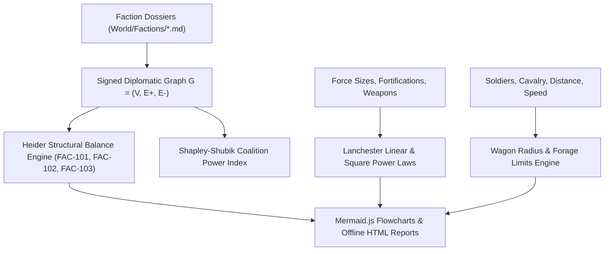
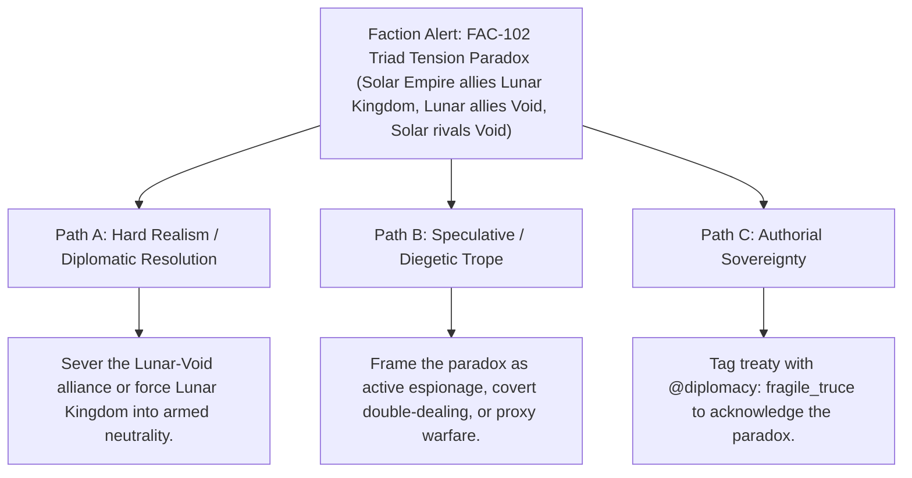

# Geopolitical Faction Matrix, Game Theory & Campaign Logistics (`docs/FACTIONS.md`)
> **Domain D: Sociology, Factions, Economics, Genealogy & Warfare** | **CLI:** `arcanum faction` / `arcanum diplomacy`

---

## 1. Overview & Theoretical Rationale

The **Ars Arcanum Factions Engine** (`scripts/lib/factions.py`) is an offline geopolitical network analyzer, diplomatic paradox validator, game-theoretic balance checker, and military logistics calculator built for speculative fiction worldbuilders and military fantasy novelists.

Complex multi-faction worldbuilding frequently creates silent diplomatic contradictions and unfeasible military logistics:
1. **Diplomatic Paradoxes & Asymmetries (`FAC-101`)**: Faction $A$ lists $B$ as an ally, but $B$ considers $A$ a mortal rival.
2. **Triad Structural Imbalance (`FAC-102`)**: Unstable diplomatic triangles ($A \text{ allies } B$, $B \text{ allies } C$, yet $A \text{ and } C$ are at total war) lacking recognized neutrality protocols.
3. **Vassal Treason Inconsistencies (`FAC-103`)**: A vassal house entering mutual defense pacts with their overlord's bitter enemies without triggering civil conflict.
4. **Impossible Military Operations**: Medieval armies marching thousands of kilometers without supply wagons or foraging infrastructure.

The Factions Engine models multilateral treaties as signed graphs, computes Heider balance metrics, calculates combat attrition via Lanchester Power Laws, and evaluates campaign logistics limits using historical wagon-radius formulas.

---

## 2. Diplomatic Graph Theory & Combat Mathematics



### 2.1 Heider Structural Balance on Signed Graphs
Diplomatic relations between faction set $V$ are represented as a signed graph where edges $(u, v)$ carry signs $s \in \{+1 \text{ (Ally)}, -1 \text{ (Rival)}\}$.

A triad $(A, B, C)$ is structurally balanced if and only if:
$$s(A, B) \cdot s(B, C) \cdot s(C, A) = +1$$

- **Balanced Triads**:
  - $(+, +, +)$: Three mutual allies.
  - $(+, -, -)$: Two allies sharing a common enemy.
- **Unbalanced Triads (Triggering FAC-102)**:
  - $(+, +, -)$: Two allies of each other, one of whom is allied with the other's enemy.
  - $(-, -, -)$: Three mutual enemies (fragile multipolar tension).

### 2.2 Lanchester's Combat Attrition Laws
1. **Lanchester's Linear Law (Direct Melee / Ineffective Fire)**:
   In close-quarters ancient/medieval hand-to-hand combat:
   $$\frac{dA}{dt} = -\beta D, \qquad \frac{dD}{dt} = -\alpha A \implies \alpha (A_0 - A(t)) = \beta (D_0 - D(t))$$

2. **Lanchester's Square Law (Modern Ranged Fire / Aimed Volleys)**:
   When ranged archers, artillery, or starship fleets concentrate fire:
   $$\frac{dA}{dt} = -\beta D, \qquad \frac{dD}{dt} = -\alpha A \implies \alpha (A_0^2 - A(t)^2) = \beta (D_0^2 - D(t)^2)$$
   Numerical superiority multiplies effective combat power quadratically.

### 2.3 Operational "Wagon Radius" Military Logistics
For an army of $N_{\text{inf}}$ infantry and $N_{\text{cav}}$ horses consuming $r_{\text{human}}$ kg/day and $r_{\text{horse}}$ kg/day, supported by wagons carrying capacity $C_{\text{wagon}}$ drawn by 2 horses:

$$R_{\text{wagon}} = \frac{C_{\text{wagon}}}{2 \cdot \text{DailyConsumption}_{\text{team}}} \times \text{Speed}_{\text{km/day}}$$

Historical horse-drawn supply trains cannot operate beyond approximately **$150 - 200 \text{ km}$** from their depot base without the draft horses consuming all the food in the wagons.

---

## 3. Subfeatures Matrix

| Subfeature | Algorithmic Mechanism | Diagnostic Output / Rule | Narrative Craft Significance |
|---|---|---|---|
| **Diplomatic Alignment Matrix** | Parses alliances, rivals, and vassals across `World/Factions/`. | Builds global multilateral treaty graph. | Maintains consistent geopolitical alliances across series. |
| **Heider Triad Paradox Auditor** | Audits signed graph cycles for structural imbalance. | Flags `FAC-102: TRIAD_TENSION` with involved factions. | Identifies realistic political conspiracy and betrayal triggers. |
| **Vassal Treason Guard** | Cross-references vassal ties against overlord rivalries. | Flags `FAC-103: VASSAL_ALLEGIANCE_CONFLICT`. | Surfaces geopolitical rebellions and feudal insurrections. |
| **Lanchester Combat Simulator** | Numerically integrates Linear and Square differential equations. | Emits casualties, duration, and victor force remaining. | Prevents improbable battle outcomes in military fantasy. |
| **Campaign Wagon Radius Modeler**| Calculates daily ration/fodder depletion over march distances. | Emits maximum operational radius and starvation thresholds. | Enforces realistic operational logistics on military campaigns. |

---

## 4. Author Extension & Configuration Guide

### 4.1 Faction Lore Dossier (`World/Factions/Solar_Empire.md`)
```markdown
---
name: "Solar Empire"
type: faction
faction_type: "Hegemony"
leader: "[[Emperor Sol]]"
headquarters: "[[Valenreach]]"
military_strength: 45000
allies:
  - "[[Lunar Kingdom]]"
rivals:
  - "[[Void Syndicate]]"
vassals:
  - "[[House Vance]]"
treaties:
  - "Treaty of the Spires"
---

# Solar Empire
The dominant solar hegemony spanning the eastern seaboard.
```

---

## 5. Command-Line Interface (CLI) Reference

```bash
# Check geopolitical consistency and diplomatic paradoxes
arcanum faction check World/

# Export Mermaid relationship flowchart to markdown note
arcanum faction check World/ --write-note World/Factions/Diplomacy_Map.md

# Export standalone interactive HTML faction matrix
arcanum faction check World/ --html reports/faction_matrix.html

# Simulate ranged/firepower battle (Square Law: 10,000 vs 5,000 with 2.5x Fortification)
arcanum faction battle -a 10000 -d 5000 --fort 2.5 --law square

# Calculate military campaign supply logistics for 12,000 troops over 300 km
arcanum faction logistics --infantry 10000 --cavalry 2000 --distance 300 --speed 25

# Output JSON data
arcanum faction check World/ --json

# Query diplomatic balance theory and Lanchester equations
arcanum doc factions --math --why
```

---

## 6. Tri-Fold Creative Advisory Resolutions



### Scenario: Triad Diplomatic Tension (`FAC-102`)
- **Path A (Hard Realism / Geopolitical Realism)**:
  - Dissolve the conflicting treaty: force the middle faction (*Lunar Kingdom*) to choose sides or declare strict armed neutrality.
- **Path B (Speculative / Diegetic Trope)**:
  - Embrace the instability as central narrative intrigue: the Lunar Queen is playing both superpowers against each other, selling weapons to both while plotting to usurp the Solar Throne.
- **Path C (Authorial Sovereignty)**:
  - Add `treaty_status: covert_non_aggression` in frontmatter, documenting the arrangement as an open secret.

---

## 7. Content Security Policy & Offline Isolation

All faction dashboards and military calculators execute 100% offline with zero CDN dependencies:

```html
<meta http-equiv="Content-Security-Policy" content="default-src 'none'; style-src 'unsafe-inline'; script-src 'unsafe-inline'; img-src data:; media-src data: blob:;">
```
