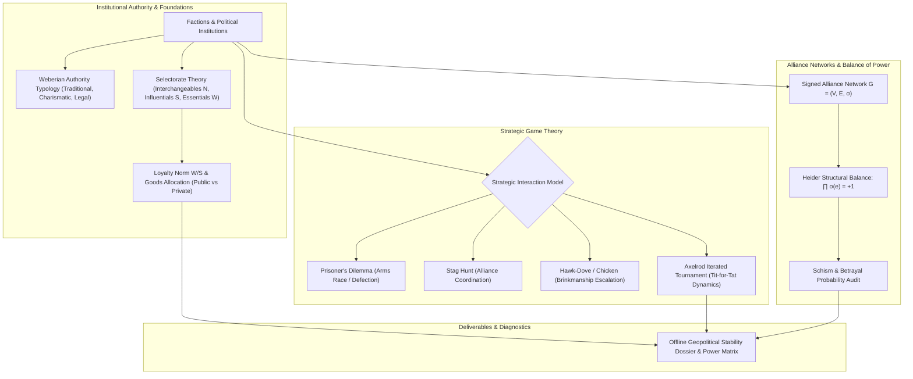

# Political Structures, Game Theory & Institutional Durability (`docs/FACTIONS.md`)
> **Domain B: Societies, Lineages, Geopolitics & Tactical War** | **CLI:** `arcanum faction` / `arcanum politics`

---

## 1. Executive Summary & Epistemological Architecture

The **Ars Arcanum Factions & Geopolitics Engine** (`scripts/lib/factions.py`) is an offline political stability simulator, game-theoretic conflict analyzer, and institutional durability auditor designed for fantasy worldbuilders, historical novelists, and game system architects.

Political factions and empires are complex adaptive systems held together by institutional incentives, resource flows, and strategic equilibria. Fictional factions often suffer from acute sociopolitical implausibilities:
1. **The Benevolent Omnipotent Tyrant Fallacy**: Depicting a single ruler acting completely alone without a coalition of military generals, oligarchs, and tax collectors whose private loyalty must be continuously bought.
2. **Infinite Charismatic Durability**: Depicting fanatical revolutionary movements retaining cohesion across generations without institutionalizing into bureaucratic rules or collapsing into factional infighting upon the founder's death.
3. **Irrational Strategic Betrayals**: Factions defecting from mutually beneficial alliances in situations where the game-theoretic payoff matrix overwhelmingly penalizes defection (violating Nash equilibria).
4. **Unbalanced Triadic Alliances**: Depicting three mutually hostile nations maintaining a stable three-way military alliance, violating Fritz Heider's Structural Balance Theorem.

The Factions Engine ingests institutional parameters (`World/Factions/*.md`), models selectorate coalitions ($N, S, W$), computes game-theoretic payoff matrices (Prisoner's Dilemma, Stag Hunt, Hawk-Dove), and audits structural balance across signed alliance networks.



---

## 2. Max Weber’s Tripartite Typology of Legitimate Authority

Max Weber (*Economy and Society*, 1922) demonstrated that no ruler can govern purely through raw violence; authority requires an underlying claim to **legitimacy**.

```
                        [ WEBERIAN AUTHORITY SPECTRUM ]
  ┌─────────────────────────┬─────────────────────────┬─────────────────────────┐
  │  TRADITIONAL AUTHORITY  │  CHARISMATIC AUTHORITY  │  RATIONAL-LEGAL ORDER   │
  ├─────────────────────────┼─────────────────────────┼─────────────────────────┤
  │ Sanctified custom       │ Heroic aura / Prophecy  │ Enacted statutory law   │
  │ Hereditary patriarchy   │ Magnetism of visionary  │ Bureaucratic office     │
  │ Feudal fealty / Vassals │ Revolutionary upheaval  │ Meritocratic procedure  │
  │ Succession: Hereditary  │ Succession: Collapse /  │ Succession: Rule-based  │
  │                         │ Routinization Crisis    │ institutional election  │
  └─────────────────────────┴─────────────────────────┴─────────────────────────┘
```

### 2.1 The Crisis of the "Routinization of Charisma"
Charismatic authority is inherently unstable because it is tied directly to the living body and psychic presence of an extraordinary individual prophet, sorcerer-king, or revolutionary general.
When the charismatic leader dies, the faction faces an existential crisis:
1. **Descent into Warlordism**: Sub-commanders fight civil wars over who inherits the mantle.
2. **Routinization into Tradition**: The leader’s lineage is sanctified into a dynastic royal house.
3. **Routinization into Bureaucracy (Legal-Rational)**: The leader’s doctrines are codified into a holy canon or legal constitution administered by trained bureaucrats.

---

## 3. Selectorate Theory & Institutional Durability

Developed by Bruce Bueno de Mesquita et al. (*The Dictator's Handbook*), Selectorate Theory models governance as a survival contest between a leader and their internal rivals.

```
       ┌─────────────────────────────────────────────────────────────┐
       │ NOMINAL SELECTORATE (N) : All disenfranchised inhabitants   │
       │   ┌─────────────────────────────────────────────────────────┤
       │   │ REAL SELECTORATE (S) : Influentials with vote / voice   │
       │   │   ┌─────────────────────────────────────────────────────┤
       │   │   │ WINNING COALITION (W) : Essentials needed to rule   │
       │   │   │   [ Leader + Generals + Oligarchs + High Clerisy ]  │
       └───┴───┴─────────────────────────────────────────────────────┘
```

### 3.1 The Three Core Political Groups
1. **Nominal Selectorate ($N$ / Interchangeables)**: The entire pool of individuals who have at least some nominal political claim (e.g., all citizens in a republic, all nobles in an aristocracy).
2. **Real Selectorate ($S$ / Influentials)**: The subset that actively selects the leader (e.g., voting citizens, imperial electors, high aristocracy).
3. **Winning Coalition ($W$ / Essentials)**: The critical core whose active support is required for the leader to retain power and survive (e.g., the top 12 military generals, secret police chiefs, oligarchs).

### 3.2 The Loyalty Norm ($W/S$ Ratio) & Public vs Private Goods
- **The Loyalty Ratio ($W/S$)**: The probability that a member of the current winning coalition will be included in a successor's winning coalition if they defect.
  - **Autocracy / Junta ($W$ small, $S$ large $\implies W/S \ll 1$)**: Coalition members are terrified of defecting because their chance of being retained by a rival is minuscule. The loyalty norm is extreme.
  - **Democracy / Republic ($W$ large, $S$ large $\implies W/S \approx 1/2$)**: Coalition members defect easily; leaders cannot buy individuals with private spoils and must instead provide broad **public goods** (roads, defense, clean water, low crime).

#### The Ruler's Budget Allocation Identity:
Total state revenue $R$ is divided between public goods $G_{\text{pub}}$ and private patronage payoffs $g_{\text{priv}}$ distributed to the $W$ essential members:

$$R = G_{\text{pub}} + W \cdot g_{\text{priv}} + \mathcal{L}_{\text{leader}}$$

```
  Governance Archetype     Coalition Size (W)    Primary Allocation Strategy
  ────────────────────     ──────────────────    ───────────────────────────
  Absolute Monarchy        Tiny (10–100 nobles)  100% Private Spoils & Tithes
  Military Junta           Small (Generals/Junta)Private Bribery & Immunity
  Aristocratic Republic    Medium (Senate/Guilds)Mixed Spoils & Commercial Law
  Constitutional Democracy Large (Millions)      100% Broad Public Goods
```

---

## 4. Game Theory in Factional Conflict & Strategic Interactions

Factions interact as strategic agents seeking to maximize payoffs in competitive or cooperative games.

```
                  [ PRISONER'S DILEMMA PAYOFF MATRIX ]
                             Faction B: Cooperate         Faction B: Defect
  Faction A: Cooperate      ( R = 3 , R = 3 )            ( S = 0 , T = 5 )
  Faction A: Defect         ( T = 5 , S = 0 )            ( P = 1 , P = 1 )
```

### 4.1 Archetypal Strategic Payoff Matrices

#### 1. The Prisoner’s Dilemma (Arms Races & Border Militarization)
- **Payoff Ordering**: $T > R > P > S$ (Temptation to defect $T=5 >$ Reward for cooperation $R=3 >$ Punishment for mutual defection $P=1 >$ Sucker's payoff $S=0$).
- **Nash Equilibrium**: (Defect, Defect). Even though mutual cooperation $(3, 3)$ is socially optimal, dominant individual strategy forces mutual militarization $(1, 1)$.

#### 2. The Stag Hunt (Alliance Coordination & Joint Crusades)
- **Payoff Ordering**: $R > T \ge P > S$.
- **Equilibria**: Two pure Nash equilibria: (Stag, Stag) [Payoff-dominant alliance] and (Hare, Hare) [Risk-dominant safe betrayal]. Success requires mutual trust.

#### 3. Chicken / Hawk-Dove (Brinkmanship & Imperial War Escalation)
- **Payoff Ordering**: $T > R > S > P$.
- **Dynamics**: Worst-case outcome is mutual collision / total war ($P = -10$). One faction must back down (Dove/Sucker $S = -1$) while the other claims victory ($T = +5$).

### 4.2 Axelrod’s Iterated Tournament & Evolution of Cooperation
In repeated long-term interactions (Iterated Prisoner's Dilemma), Robert Axelrod proved that the simplest strategy—**Tit-for-Tat**—consistently outperforms ruthless aggression.
- **Core Rules of Successful Factional Diplomacy**:
  1. *Be Nice*: Never be the first to defect/betray.
  2. *Be Provocable*: Immediately retaliate against any betrayal.
  3. *Be Forgiving*: Immediately resume cooperation once the rival ceases defection.
  4. *Be Clear*: Never act unpredictably; let rivals know your response is deterministic.

---

## 5. Structural Balance Theory in Geopolitics

Fritz Heider’s Structural Balance Theorem governs signed geopolitical alliance graphs $G = (V, E, \sigma)$ with relations $\sigma(e) \in \{+1, -1\}$.

```
       BALANCED TRIADS (∏ σ = +1)                 UNBALANCED TRIADS (∏ σ = -1)
             (+)                                        (+)
           A ─── B                                    A ─── B
            \   /                                      \   /
         (+) \ / (+)                                (+) \ / (-)
              C                                          C
   (3 Friends: "Allied Front")               (2 Friends, 1 Enemy: "Torn Loyalty")
  
             (-)                                        (-)
           A ─── B                                    A ─── B
            \   /                                      \   /
         (-) \ / (+)                                (-) \ / (-)
              C                                          C
  (2 Enemies share 1 Friend)                 (3 Mutual Enemies: "Volatile Chaos")
```

A triad of factions $(A, B, C)$ is structurally stable if and only if the product of its signed edges is positive:

$$\sigma(A, B) \times \sigma(B, C) \times \sigma(C, A) = +1$$

- **Balanced**:
  - $(+, +, +)$: Three mutual allies.
  - $(-, -, +)$: Two enemies share a mutual allied enemy (*"The enemy of my enemy is my friend"*).
- **Unbalanced ($COS-201$ / Schism Risk)**:
  - $(+, +, -)$: Two allies are allied to two opposing sides of an active war. This forces an immediate diplomatic crisis or betrayal.

---

## 6. Worked Step-by-Step Strategic Scenario

### Scenario: The Tripartite Succession Crisis
Upon the death of the High King, three regional duchies evaluate their strategic posture:
1. **Duchy of the North (N)**
2. **Duchy of the East (E)**
3. **Duchy of the South (S)**

- Historical relations: North and East are mutual trading allies ($\sigma(N, E) = +1$).
- North and South signed a defensive pact against orcish incursions ($\sigma(N, S) = +1$).
- East and South claim the exact same rich iron mines in the border marches ($\sigma(E, S) = -1$).

#### Step 1: Structural Balance Audit
$$\text{Triad Product} = \sigma(N, E) \times \sigma(N, S) \times \sigma(E, S) = (+1) \times (+1) \times (-1) = -1$$

*Diagnostic Alert*: `POL-201: UNBALANCED_ALLIANCE_TRIAD`. The diplomatic network is structurally unstable.

#### Step 2: Payoff Matrix Evaluation for the North (N)
The North must choose whether to maintain its alliance with the East or the South during the escalating border clash:

```
                                  North's Choice
                     Support East (+E)            Support South (+S)
  East Mobilizes     ( N: +4 , E: +5 , S: -8 )   ( N: -2 , E: -6 , S: +3 )
  South Mobilizes    ( N: +2 , E: +4 , S: -5 )   ( N: +1 , E: -4 , S: +4 )
```

#### Step 3: Game-Theoretic Resolution
Supporting the East yields a strictly dominant strategy for the North ($+4 > -2$ and $+2 > +1$). The North will inevitably betray its defensive pact with the South, flipping $\sigma(N, S) \to -1$.
- New Triad Product: $(+1) \times (-1) \times (-1) = +1$ (Structurally Stable Bipolar Alignment: North + East vs South).

---

## 7. Practical YAML Schemas

```yaml
schema_version: "2.0"
geopolitical_realm:
  id: "aurelian_imperium"
  regime_type: "autocratic_monarchy"
  weber_authority_type: "traditional"

selectorate_metrics:
  nominal_selectorate_size: 4500000 # Population
  real_selectorate_size: 12000 # Landed Nobility
  winning_coalition_size: 18 # Imperial Council & Arch-Dukes
  loyalty_norm_w_over_s: 0.0015 # Extreme loyalty norm
  annual_revenue_crowns: 8500000.0
  private_spoils_per_essential: 350000.0

factions:
  - id: "duchy_north"
    name: "Duchy of the North"
    leader: "Duke Alden"
    military_power_index: 85.0
    strategic_temperament: "tit_for_tat"

  - id: "duchy_east"
    name: "Duchy of the East"
    leader: "Duchess Valerie"
    military_power_index: 72.0
    strategic_temperament: "hawkish"

  - id: "duchy_south"
    name: "Duchy of the South"
    leader: "Duke Cassian"
    military_power_index: 68.0
    strategic_temperament: "dovish"

signed_diplomatic_matrix:
  - pair: ["duchy_north", "duchy_east"]
    relation: 1 # Allied
  - pair: ["duchy_north", "duchy_south"]
    relation: -1 # Hostile / Pact Broken
  - pair: ["duchy_east", "duchy_south"]
    relation: -1 # Border War
```

---

## 8. CLI Reference & Scriptorium Integration

```bash
# Audit institutional stability and selectorate vulnerability (exit 0 advisory default)
arcanum faction --audit World/Factions/imperium.yaml

# Check structural balance across all international alliance triads
arcanum politics --balance World/Factions/diplomacy.yaml

# Run game-theoretic payoff matrix simulation for factional dispute
arcanum faction --simulate-game stag_hunt --factions duchy_north duchy_east

# Run in strict mode (fails with exit code 1 if hard conflicts are detected)
arcanum faction --audit World/Factions/imperium.yaml --strict
```

### Diagnostic Telemetry & Severity Classification
Findings from the Factions engine are classified under Subsystem 2 (Advisory Craft Lenses):
- `FAC-101` (`[OBSERVATION]`): High schism vulnerability detected in charismatic faction without institutionalized succession.
- `FAC-102` (`[OBSERVATION]`): Bipolar structural imbalance or unstable alliance triad detected.
- `FAC-103` (`[OBSERVATION]`): Selectorate loyalty ratio indicates extreme vulnerability to defection.

*Note: All `FAC-*` findings are advisory by default (`exit 0`) and can be suppressed via `suppressed_rules: [FAC-101, FAC-102]` in `constitution.yaml`.*

---

## 9. Recommended Reading, References & Media

### Foundational Craft & Academic Textbooks
- **Machiavelli, Niccolò (1532)**. *Il Principe* (*The Prince*). Antonio Blado d'Asola.  
  *The timeless masterwork on political realism, power preservation, fear vs love, and institutional ruthlessness.*
- **Weber, Max (1922)**. *Wirtschaft und Gesellschaft* (*Economy and Society*). J.C.B. Mohr.  
  *The bedrock sociological treatise establishing the tripartite typology of legitimate authority and bureaucracy.*
- **Bueno de Mesquita, Bruce, & Smith, Alastair (2011)**. *The Dictator's Handbook: Why Bad Behavior is Almost Always Good Politics*. PublicAffairs.  
  *The definitive, accessible guide to Selectorate Theory ($N, S, W$) and ruler survival dynamics.*
- **Axelrod, Robert (1984)**. *The Evolution of Cooperation*. Basic Books.  
  *The landmark game-theory book establishing Tit-for-Tat and the conditions for sustainable cooperation without central authority.*
- **Schelling, Thomas C. (1960)**. *The Strategy of Conflict*. Harvard University Press.  
  *Pioneered the analysis of focal points (Schelling points), credible threats, and brinkmanship.*

### Landmark Scientific & Political Papers
- **Nash, John (1950)**. "Equilibrium points in n-person games." *Proceedings of the National Academy of Sciences*, 36(1), 48–49.  
  *Formulated the fundamental non-cooperative Nash Equilibrium.*
- **Heider, Fritz (1946)**. "Attitudes and cognitive organization." *The Journal of Psychology*, 21(1), 107–112.  
  *Introduced Structural Balance Theory for signed social and political graphs.*

### Seminal Video Lectures, Masterclasses & Channels
- **CGP Grey** (*The Rules for Rulers*).  
  *The viral, peerlessly lucid visual masterclass adapting Selectorate Theory for political worldbuilding.*
- **Prof. Ben Polak (Yale University)** (*Game Theory Open Course - ECON 159*).  
  *Exhaustive university lecture series covering Nash equilibria, backward induction, and evolutionary stable strategies.*
- **Kraut** (YouTube Series: *Autocracy vs Democracy: Historical Institutions*).  
  *Brilliant historical essays connecting institutional durability, geography, and political structures.*
- **Tale Foundry** (*Designing Believable Fictional Guilds and Power Structures*).  
  *Craft-focused guides on avoiding shallow villain tropes and building multi-layered political factions.*

### Landmark Speculative Case Studies
- **Herbert, Frank**. *Dune* (The precarious tripod balance of power: Padishah Emperor, Spacing Guild, and Landsraad houses).
- **Martin, George R.R.** *A Song of Ice and Fire* (Selectorate dynamics of feudal lords, betrayals at the Red Wedding, and unstable triads).
- **Asimov, Isaac**. *Foundation* (Seldon Crises demonstrating the historical transition from religious authority to economic monopoly to bureaucratic law).
- **Corey, James S.A.** *The Expanse* (Geopolitical cold war triangle: Earth UN, Mars MCRN, and Outer Planets Alliance OPA).
