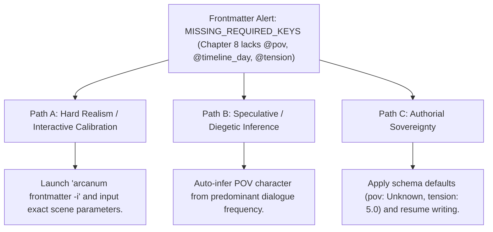

# Frontmatter Builder, Schema Validator & Metadata Normalizer (`docs/FRONTMATTER_BUILDER.md`)
> **Domain G: Publishing, Preflight & Infrastructure** | **CLI:** `arcanum frontmatter` / `arcanum metadata`

---

## 1. Overview & Theoretical Rationale

The **Ars Arcanum Frontmatter Builder** (`scripts/lib/frontmatter_builder.py`) is an offline YAML metadata normalizer, schema validator, interactive CLI metadata wizard, and bibliographic property synthesizer engineered for novelists, worldbuilders, and computational narratologists.

Modern digital writing ecosystems (such as Obsidian, Scriptorium, and Astro/Hugo static sites) rely heavily on YAML frontmatter delimiters (`---`) to anchor machine-readable metadata. In sprawling multi-year writing projects, metadata frequently suffers from progressive entropy:
1. **Schema Drift & Key Inconsistency**: Different writing phases introduce conflicting key aliases (e.g. `pov: Kaelen` vs `character: Kaelen` vs `narrator: Kaelen`; `setting: High Vale` vs `location: High Vale`).
2. **Type Violations & Missing Anchors**: Timeline indices stored as strings (`"Day 4"`) instead of integers (`4`), or missing tension scores breaking downstream revision heatmaps.
3. **Broken Tooling Interoperability**: Downstream linters, timeline sync engines, story canvases, and codex compilers fail silently when frontmatter schemas are malformed or missing required keys.

```
+-------------------------------------------------------------------------------+
|                   ARS ARCANUM FRONTMATTER BUILDER PIPELINE                    |
|                                                                               |
|  +--------------------+     YAML AST Parser (Safe)    +--------------------+  |
|  | Markdown Document  | ----------------------------> | Raw Header Stream  |  |
|  | (Chapter/Lore Note)|                               | Key-Value Pairs    |  |
|  +--------------------+                               +--------------------+  |
|            |                                                    |             |
|            v                                                    v             |
|  [Schema Selector]                                    [Key Normalization Map] |
|  (Chapter vs Lore Node)                               (character -> pov, etc.)|
|            |                                                    |             |
|            +----------------------------------------------------+             |
|                                     |                                         |
|                                     v                                         |
|                   +-----------------------------------+                       |
|                   |  Schema Completeness Scoring      |                       |
|                   |  Interactive Wizard / Batch Fix   |                       |
|                   |  Atomic File Update & Verification|                       |
|                   +-----------------------------------+                       |
|                                     |                                         |
|                                     v                                         |
|                     [Standardized Frontmatter Header]                         |
|                     [Validated Dublin Core & ONIX AST]                        |
+-------------------------------------------------------------------------------+
```

The Frontmatter Builder normalizes legacy metadata, enforces strict schema typing, and provides both headless batch execution and an interactive command-line wizard for missing fields.

---

## 2. Mathematical Formalism & Schema Completeness Scoring

### 2.1 Schema Completeness Index ($C_{\text{schema}}$)
For any document $d$ evaluated against a target schema specification $S$ containing required keys $K_{\text{req}}$ and optional keys $K_{\text{opt}}$:

$$C_{\text{schema}}(d, S) = w_{\text{req}} \cdot \left( \frac{\sum_{k \in K_{\text{req}}} \mathbb{I}(k \in d)}{|K_{\text{req}}|} \right) + w_{\text{opt}} \cdot \left( \frac{\sum_{k \in K_{\text{opt}}} \mathbb{I}(k \in d)}{|K_{\text{opt}}|} \right)$$

Where:
- $\mathbb{I}(k \in d) \in \{0, 1\}$ indicates whether key $k$ is present and satisfies strict type validation.
- $w_{\text{req}} = 0.80$ and $w_{\text{opt}} = 0.20$ are normalized schema completeness weights ($w_{\text{req}} + w_{\text{opt}} = 1.00$).

### 2.2 Numerical Property Bounds & Value Validation
- **Narrative Tension**: $\tau \in [0.0, 10.0]$ representing subjective dramatic tension.
- **Timeline Coordinate**: $t_{\text{day}} \in \mathbb{Z}$ (positive integer or relative day offset).
- **Sensory Distribution**: $\mathbf{s} \subseteq \{\text{visual}, \text{auditory}, \text{olfactory}, \text{gustatory}, \text{tactile}, \text{thermoception}, \text{proprioception}\}$.

---

## 3. Standardized Frontmatter Schemas

### 3.1 Novel Manuscript Chapter Schema
```yaml
---
title: "The Silent Citadel"
chapter_number: 1
part: "Act I: The Gathering Storm"
beat: "Inciting Incident"
pov: "Aurelia Vance"
location: "Khorvath Fortress"
timeline_day: 42
timeline_time: "06:00 Solar"
tension: 7.5
sensory_focus:
  - "auditory"
  - "thermoception"
plot_threads:
  - "iron_pact_conspiracy"
  - "aurelia_blade_inheritance"
word_count_target: 4000
status: "revised"
author: "Valerius M. Vance"
created: 2026-09-15
modified: 2026-10-06
---
```

### 3.2 Worldbuilding Lore Dossier Schema
```yaml
---
title: "House Vaelen"
category: "Factions"
entity_type: "Noble Dynasty"
status: "Active"
headquarters: "The Obsidian Spire"
ruling_lord: "Archon Valerius III"
allies:
  - "The Silver Concordat"
  - "Guild of Artificers"
enemies:
  - "The Ashwarden Cult"
founding_era: "Second Age, Year 412"
canonical_aliases:
  - "The Iron Keepers"
  - "Lords of the Obsidian Spire"
tags:
  - "faction"
  - "politics"
  - "high-vale"
---
```

---

## 4. Key Normalization Mapping Dictionary

The engine automatically migrates legacy or divergent keys to standardized schema names:

| Legacy / Alternative Key | Canonical Standard Key | Target Data Type | Default Fallback Value |
|---|---|---|---|
| `character`, `narrator`, `viewpoint` | `pov` | `string` | `"Omniscient"` |
| `setting`, `place`, `scene_loc` | `location` | `string` | `"Unspecified"` |
| `day`, `timeline`, `time_index` | `timeline_day` | `integer` | `1` |
| `chapter`, `chap_num`, `num` | `chapter_number` | `integer` | *(Inferred from filename)* |
| `thread`, `arc`, `plotline` | `plot_threads` | `list[string]` | `["main_plot"]` |
| `dramatic_tension`, `stress` | `tension` | `float` | `5.0` |
| `state`, `draft_status` | `status` | `enum` | `"draft"` |

---

## 5. CLI Execution & Parameter Reference

```bash
# 1. Batch normalize frontmatter keys across all manuscript files
arcanum frontmatter Manuscripts/Book-01/ --normalize

# 2. Run interactive metadata wizard for incomplete chapters
arcanum frontmatter Manuscripts/Book-01/Chapter_04.md --interactive

# 3. Validate schema compliance without modifying files (Dry Run)
arcanum frontmatter Manuscripts/Book-01/ --validate

# 4. Scope normalization to a specific chapter range
arcanum frontmatter Manuscripts/Book-01/ -c 1-10 --normalize

# 5. Output schema audit report and completeness score as JSON
arcanum frontmatter Manuscripts/Book-01/ --json
```

### Options & Parameter Reference Table

| Flag / Option | Short | Type | Default | Description |
|---|---|---|---|---|
| `target` | (Positional) | `Path` | *Required* | File or directory to inspect and normalize. |
| `--normalize` | `-n` | `bool` | `False` | Executes automated batch key normalization. |
| `--interactive`| `-i` | `bool` | `False` | Launches interactive terminal prompt wizard. |
| `--validate` | `-v` | `bool` | `False` | Audits frontmatter and outputs validation scores. |
| `--chapters` | `-c` | `str` | `None` | Restricts execution to chapter range (e.g. `1-5`). |
| `--schema` | `-s` | `choice` | `chapter` | Target schema: `chapter`, `lore`, `manifest`. |
| `--json` | `-j` | `bool` | `False` | Outputs structured validation metrics as JSON. |

---

## 6. Tri-Fold Creative Advisory Resolutions



### Scenario: Incomplete Metadata Header
- **Path A (Hard Realism / Interactive Calibration)**:
  - Run `arcanum frontmatter Chapter_08.md -i` to step through the guided terminal wizard and provide precise POV, timeline day, and tension values.
- **Path B (Algorithmic Diegetic Inference)**:
  - Pass `--infer` to let the engine automatically deduce the POV character based on subject frequency and pronoun distribution in the prose.
- **Path C (Authorial Sovereignty)**:
  - Populate minimal fallback keys (`pov: "TBD"`, `tension: 5.0`) to silence validation errors without pausing creative momentum.

---

## 7. Recommended Reading, References & Media

### 7.1 Bibliographical Standards & Publishing Treatises
- **The University of Chicago Press (2017)**. *The Chicago Manual of Style* (17th / 18th Edition). Chapter 1: "Books and Journals – Anatomy & Front Matter". University of Chicago Press.  
  *The authoritative guide on recto/verso sequencing, half-titles, colophons, copyright pages, and frontmatter typography.*
- **Dublin Core Metadata Initiative (2020)**. *Dublin Core™ Metadata Element Set, Version 1.1: Reference Description*. DCMI. [dublincore.org](https://www.dublincore.org/specifications/dublin-core/dces/).  
  *The international ISO 15836 metadata architecture defining standard digital bibliographic resource descriptors.*
- **EDItEUR (2019)**. *ONIX for Books: Product Information Message (Release 3.0)*. EDItEUR. [editeur.org](https://www.editeur.org/83/Overview/).  
  *The global supply-chain standard for commercial book metadata, contributor taxonomies, and territorial rights.*
- **Library of Congress (2021)**. *Cataloging in Publication (CIP) Data Guidelines*. Library of Congress.  
  *Standard framework for catalog metadata, subject headings, and Dewey/LOC classifications.*

### 7.2 Data Serialization & Schema Specifications
- **YAML Ain't Markup Language (YAML™) Version 1.2**. [yaml.org/spec/1.2.2](https://yaml.org/spec/1.2.2/).  
  *The official syntax specification for human-readable hierarchical data serialization.*
- **JSON Schema Initiative (2020)**. *JSON Schema: A Media Type for Describing JSON Documents*. [json-schema.org](https://json-schema.org/).  
  *Structural validation vocabulary for JSON/YAML hierarchical data trees.*

### 7.3 Video Lectures, Masterclasses & Writing Media
- **Obsidian Community & Nicole van der Hoeven**: *Mastering Frontmatter, Metadata & Dataview for Fiction Writers*.  
  *Practical video guides on organizing complex novel metadata using YAML frontmatter.*
- **Brandon Sanderson's BYU Creative Writing Lectures**: *Managing Manuscript Information and Scene Card Metadata*.  
  *Techniques for tracking POV distribution, word counts, and scene goals.*
- **Tale Foundry**: *The Power of Information Architecture in Epic Worldbuilding*.  
  *Why consistent metadata classification prevents worldbuilding collapse.*

### 7.4 Landmark Speculative Case Studies
- **Sanderson, Brandon**: *The Way of Kings* (The Stormlight Archive Headings & Epigraph Metadata). Tor Books.  
  *Masterful use of stylized chapter header epigraphs, in-world letter fragments, and structural part divisions.*
- **Herbert, Frank**: *Dune* (Epigraphs of Princess Irulan). Chilton Books.  
  *Pioneered the integration of diegetic historical excerpts and frontmatter commentary at the start of every chapter.*
- **Clarke, Susanna**: *Jonathan Strange & Mr Norrell* (2004). Bloomsbury.  
  *Exhaustive academic frontmatter, footnotes, and bibliographic apparatus embedded seamlessly into fantasy prose.*
