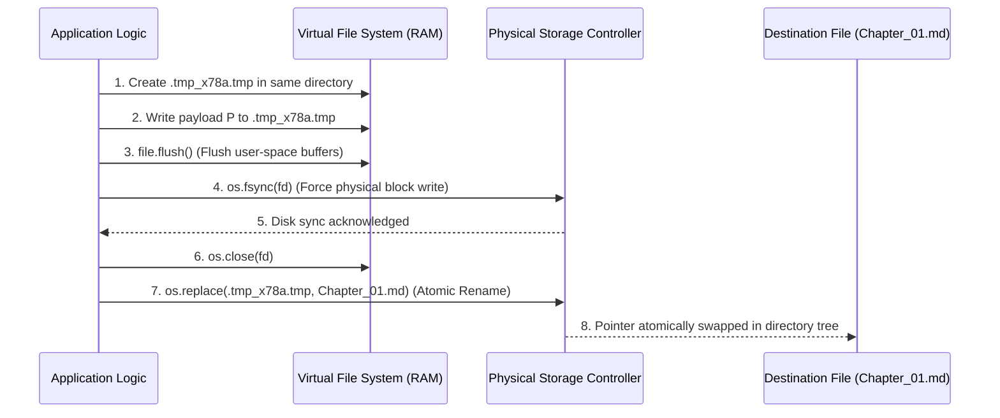
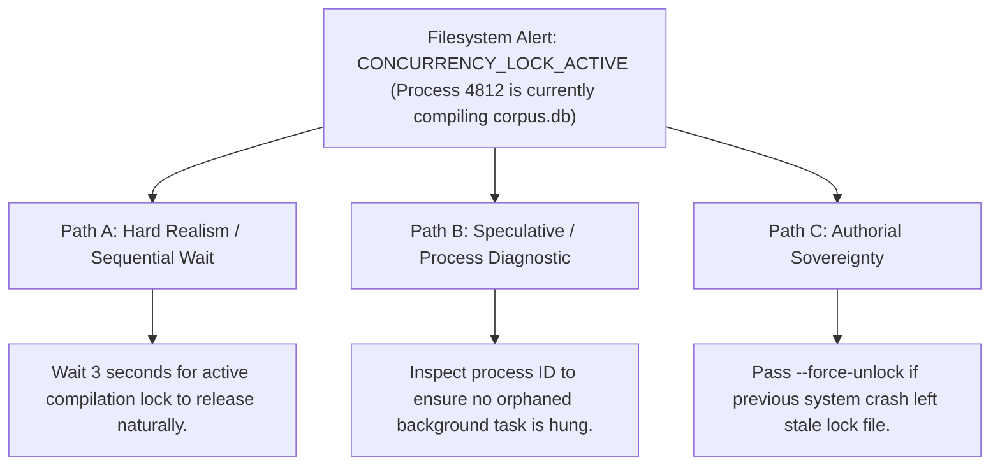

# Atomic Filesystem, Concurrency Locks & Storage Durability (`docs/FS_UTILS.md`)
> **Domain F: Retrieval, Storage & Infrastructure** | **Modules:** `scripts/lib/_bootstrap.py` & `scripts/lib/lockfile.py`

---

## 1. Overview & Theoretical Rationale

The **Ars Arcanum Filesystem & Security Architecture** (`scripts/lib/_bootstrap.py`, `scripts/lib/lockfile.py`) provides crash-consistent file writing primitives, cross-platform concurrency locking, and path-traversal sanitizers engineered to protect creative manuscripts and World Bibles from corruption during unexpected power loss, OS crashes, or multi-process race conditions.

Writing long-form fiction on consumer desktop computers exposes unpublished manuscripts to subtle storage hazards:
1. **Torn Writes & Zero-Length Truncation**: Standard file writing (`open(file, 'w')`) immediately truncates the existing file on disk before writing the new payload. If power fails or the process is killed mid-write, the manuscript is permanently destroyed or reduced to a $0$-byte stub.
2. **Filesystem Cache Desynchronization**: Modern operating systems buffer file writes in volatile RAM. Without explicit kernel-level synchronization (`fsync`), data residing in RAM buffers is lost upon system reboot.
3. **Concurrent Mutation Collisions**: When automated background tasks (such as corpus indexers or timeline synchronization engines) write to the same files as the author, race conditions cause interleaved garbage text.
4. **Path Traversal Vulnerabilities**: User-supplied identifiers in CLI flags that accept unvalidated relative paths (`../../etc/`) can inadvertently overwrite critical operating system files.

```
+-------------------------------------------------------------------------------+
|                    ARS ARCANUM ATOMIC WRITE LIFECYCLE                         |
|                                                                               |
|  [Step 1: Unique Tempfile]  -----> Writes payload to '.tmp_<uuid>' in same fs |
|                                                                               |
|  [Step 2: User-Space Flush] -----> Flushes Python I/O buffers via flush()     |
|                                                                               |
|  [Step 3: Kernel fsync()]   -----> Forces physical disk sync via os.fsync()   |
|                                                                               |
|  [Step 4: Atomic Replace]   -----> Atomic rename via os.replace(tmp, dest)    |
|                                                                               |
|  [Step 5: Parent Dir Sync]  -----> Syncs parent directory entry on POSIX      |
|                                                                               |
|  [Result: 100% Crash-Consistent / Zero Torn-Write Guarantee]                  |
+-------------------------------------------------------------------------------+
```

Ars Arcanum enforces strict storage durability contracts across all file mutations, ensuring that your manuscripts remain pristine and uncorrupted under all hardware and software failure modes.

---

## 2. Invariant Storage Contracts & Mathematical Durability

### 2.1 The Atomic Write Lifecycle Formalism
Let $F_{\text{dest}}$ be the target manuscript file and $\mathcal{P}$ be the new manuscript payload to be persisted.

The atomic state transition operator $\mathcal{T}_{\text{atomic}}(F_{\text{dest}}, \mathcal{P})$ guarantees that at any arbitrary point of power interruption $t_{\text{crash}}$:

$$\text{State}(F_{\text{dest}}, t_{\text{crash}}) \in \Big\{ \text{State}_{\text{original}}(F_{\text{dest}}), \; \mathcal{P} \Big\}$$

The file is guaranteed to never be in an intermediate, truncated, or corrupted half-written state:

$$\text{State}(F_{\text{dest}}, t_{\text{crash}}) \ne \emptyset \quad \land \quad \text{State}(F_{\text{dest}}, t_{\text{crash}}) \ne \text{TornWrite}$$



### 2.2 Cross-Platform Concurrency Locking Matrix (`ArcanumLock`)
To prevent concurrent process write collisions, Ars Arcanum implements an RAII-style context manager acquiring exclusive non-blocking advisory locks:

$$\text{Lock Acquisition}: \quad \mathcal{L}(F) = \begin{cases}
\texttt{fcntl.flock}(\text{fd}, \texttt{LOCK\_EX} \mid \texttt{LOCK\_NB}) & \text{on POSIX (Linux/macOS)} \\
\texttt{msvcrt.locking}(\text{fd}, \texttt{LK\_NBLCK}, 1) & \text{on Windows (NTFS)}
\end{cases}$$

If another process holds the lock, the engine raises `ConcurrencyConflictError` immediately rather than deadlocking the writing session.

```python
# Context Manager Usage Pattern
from scripts.lib.lockfile import ArcanumLock

with ArcanumLock("Manuscripts/Book-01/.lock", timeout=5.0):
    # Exclusive write operations guaranteed safe
    atomic_write("Manuscripts/Book-01/Chapter_01.md", payload)
```

### 2.3 Path Traversal Sanitization Regex
All user-provided identifiers (volume names, draft branches, character handles, snapshot tags) are validated against a strict character allowlist:

$$\text{ValidIdentifier}(S) \iff S \in \Sigma^* \quad \text{where } \Sigma = [\texttt{A-Za-z0-9\_-}]$$

Any string containing directory separators (`/`, `\`), null bytes (`\0`), or parent directory traversal sequences (`..`) is rejected with a `PathTraversalSecurityError`.

---

## 3. Subsystem API & Core Helper Functions

| Function Name | Location | Signature | Operational Invariant / Guarantee |
|---|---|---|---|
| `atomic_write()` | `_bootstrap.py` | `(path: Path, data: str, backup: bool = False) -> None` | Writes to tempfile, fsyncs, closes, and atomically swaps with destination. |
| `read_file_safe()` | `_bootstrap.py` | `(path: Path) -> str` | Reads file with strict UTF-8 decoding and explicit error diagnostics. |
| `sanitize_filename()` | `_bootstrap.py` | `(name: str) -> str` | Strips invalid characters and enforces POSIX-safe filename bounds. |
| `ArcanumLock` | `lockfile.py` | `class ArcanumLock(path: Path, timeout: float)` | RAII cross-platform file locking context manager. |
| `safe_relpath()` | `_bootstrap.py` | `(target: Path, base: Path) -> Path` | Computes relative paths while asserting no upward traversal breakout. |

---

## 4. Content Security Policy & Offline Isolation

All filesystem utilities operate 100% offline without network sockets or telemetry:

```html
<meta http-equiv="Content-Security-Policy" content="default-src 'none'; style-src 'unsafe-inline'; script-src 'unsafe-inline'; img-src data:; media-src data: blob:;">
```

---

## 5. Tri-Fold Creative Advisory Resolutions



### Scenario: Stale File Lock Encountered After System Crash
- **Path A (Hard Realism / Safe Sequential Retry)**:
  - The engine automatically waits with exponential backoff for up to $5.0\text{ seconds}$ before raising a timeout error.
- **Path B (Process Telemetry Inspection)**:
  - Check whether the PID recorded in `.lock` is still active in the operating system process table. If dead, the engine safely reclaims the lock.
- **Path C (Authorial Sovereignty)**:
  - If a hard reboot left an orphaned `.lock` file, pass `--force-unlock` or manually delete the `.lock` file to resume writing immediately.

---

## 6. Recommended Reading, References & Media

### 6.1 Foundational Storage Durability & Crash Consistency Treatises
- **Pillai, Thanumalayan Sankaranarayana, et al. (2014)**. "All File Systems Are Not Created Equal: On the Complexity of Crafting Crash-Consistent Applications", *11th USENIX Symposium on Operating Systems Design and Implementation (OSDI '14)*, pp. 433–448.  
  *The landmark empirical study demonstrating why write-flush-fsync-replace ordering is mandatory to prevent silent data corruption during system crashes.*
- **McKusick, Marshall Kirk, et al. (2014)**. *The Design and Implementation of the FreeBSD Operating System* (2nd Edition). Addison-Wesley. ISBN: 978-0321968975.  
  *Authoritative systems text on filesystem buffer caches, vnode lifecycles, atomic directory updates, and write-ahead integrity.*
- **IEEE & The Open Group (2018)**. *POSIX.1-2017: System Interfaces – fsync(), rename(), fcntl()*. IEEE Computer Society.  
  *Normative international standards specifying the POSIX filesystem contract and synchronous durability guarantees.*

### 6.2 Software Security & Concurrency Standards
- **OWASP Foundation (2021)**. *OWASP Path Traversal Prevention Cheat Sheet*. OWASP. [owasp.org](https://cheatsheetseries.owasp.org/cheatsheets/Path_Traversal_Prevention_Cheat_Sheet.html).  
  *Authoritative security guidance establishing strict token allowlisting to eliminate arbitrary filesystem breakout attacks.*
- **Microsoft Corporation (2021)**. *locking Function (C Runtime Library Reference)*. Microsoft Learn.  
  *Technical specifications for non-blocking byte-range file locking (`_locking`) and process exclusivity on Windows NTFS filesystems.*

### 6.3 Video Lectures, Masterclasses & Systems Media
- **USENIX Fast / OSDI Conference Presentations**: *Crash Consistency and Data Integrity in Modern File Systems*.  
  *Visual and empirical demonstrations of power-cut data loss in naive file writers.*
- **Computerphile**: *Why Moving a File is Faster Than Copying (Atomic File Swaps)*.  
  *In-depth explanation of directory inodes, pointers, and atomic rename operations.*
- **Brandon Sanderson's BYU Creative Writing Lectures**: *Backups, Data Safety, and Preserving Your Manuscript*.  
  *The 3-2-1 backup rule and why authors must never trust a single un-synced file.*

### 6.4 Landmark Speculative Case Studies
- **Martin, George R.R.**: *WordStar 4.0 on DOS Environment*.  
  *Famous example of an author using an air-gapped, sovereign DOS system with direct disk access to eliminate modern software corruption and distractions.*
- **Gaiman, Neil**: *Authored in Leuchtturm1917 Notebooks Before Digital Transcription*.  
  *The ultimate physical atomic write: immutable ink on paper, completely immune to digital bit-rot and power failure.*
