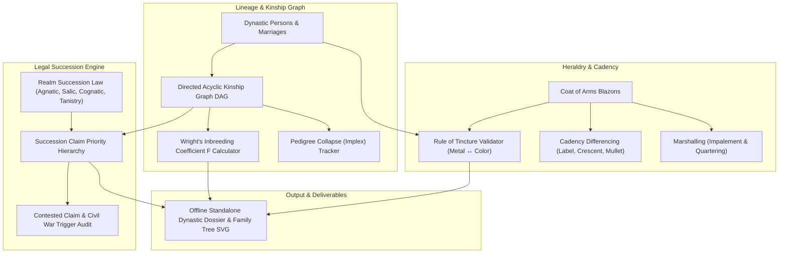

# Dynastic Succession, Hereditary Lineages & Population Genetics (`docs/GENEALOGY.md`)
> **Domain B: Societies, Lineages, Geopolitics & Tactical War** | **CLI:** `arcanum genealogy` / `arcanum dynasty`

---

## 1. Executive Summary & Epistemological Architecture

The **Ars Arcanum Genealogy & Dynastic Engine** (`scripts/lib/genealogy.py`) is an offline genealogical tree validator, succession law simulator, Wright's inbreeding coefficient calculator, and heraldic cadency compiler designed for fantasy worldbuilders, historical novelists, and dynastic roleplaying architects.

Hereditary monarchies and aristocratic houses are governed by legal precedent, biological kinship, and genetic realities. Fictional lineages frequently suffer from critical structural contradictions:
1. **Contradictory Succession Claims (`GEN-101`)**: Two claimants citing legal succession precedents that are mathematically or legally mutually exclusive within the declared constitution of the realm.
2. **Pedigree Collapse Amnesia (`GEN-102`)**: Depicting royal families practicing endogamous cousin/sibling marriage for twenty consecutive generations without calculating Wright's inbreeding coefficient ($F$) or modeling homozygous genetic disorders (e.g., Habsburg jaw, hemophilia).
3. **Heraldic Rule of Tincture Violations (`GEN-103`)**: Blazons placing metal directly on metal (gold on silver) or color on color (red on blue), violating fundamental historical optical contrast rules.
4. **Cadency Mark Chaos**: Younger sons and cadet branches displaying identical heraldic crests without difference marks (labels, crescents, mullets), causing identity confusion on the battlefield.

The Genealogy Engine ingests dynastic manifests (`World/Lineages/*.md`), builds directed acyclic lineage graphs (DAGs), traces Wright's inbreeding coefficients ($F$), simulates succession claim hierarchies, and validates heraldic blazons.



---

## 2. Dynastic Succession Systems & Legal Frameworks

The legitimacy of a royal claim depends entirely on the codified or traditional **Succession System** governing the crown.

```
                      [ SUCCESSION SYSTEM TAXONOMY ]
  1. STRICT AGNATIC (Salic Law)      ──► Eldest living male through strictly male lines
  2. MALE-PREFERENCE (Cognatic)      ──► Sons before daughters; daughters before uncles
  3. ABSOLUTE COGNATIC (Primogeniture)─► Eldest child regardless of biological sex
  4. ULTIMOGENITURE (Minorat)        ──► Youngest living child inherits crown/homestead
  5. TANISTRY / SENIORITY            ──► Eldest capable adult male elected within royal clan
  6. ELECTIVE MONARCHY               ──► Council of Prince-Electors / Nobles cast ballots
  7. PARTIBLE INHERITANCE (Gavelkind)──► Realm split equally among all surviving sons
```

### 2.1 Exhaustive Succession System Comparison

| Succession System | Primary Inheritance Rule | Female Succession Status | Civil War Risk Factors | Historical & Speculative Analogs |
|---|---|---|---|---|
| **Agnatic Primogeniture (Salic Law)** | Eldest surviving son of eldest male line | Completely barred from inheriting or transmitting claims | High when monarch has only daughters (Uncle vs Daughter) | Kingdom of France, Valyrian Freehold |
| **Male-Preference Primogeniture** | Eldest son; daughters inherit if no sons exist | Permitted as second-tier fallback | Medium (Daughter vs Younger Brother of King) | Kingdom of England (pre-2013), House Stark |
| **Absolute Cognatic Primogeniture** | Eldest child regardless of gender | Equal parity with male heirs | Low (Clear mathematical birth order) | Modern UK/Sweden, House Martell (Dorne) |
| **Ultimogeniture (Minorat)** | Youngest surviving child inherits | Varies by culture | High (Older, militarily experienced brothers resent boy king) | Nomadic Steppe Khanates, Folkloric Tale Kings |
| **Agnatic Seniority / Tanistry** | Eldest living brother/uncle of the royal clan | Barred (Focuses on adult warrior competence) | Extreme (Brothers murder nephews to accelerate turn) | Kievan Rus' (Rota system), Gaelic Clans |
| **Elective Monarchy** | Sovereign elected by college of magnates | Varies by electoral charter | High (Foreign bribery, interregnum civil wars) | Holy Roman Empire, Polish-Lithuanian Sejm |
| **Partible (Gavelkind)** | Realm divided equally among all legitimate sons | Barred or limited to dowries | Catastrophic (Realm fragments into warring micro-kingdoms)| Carolingian Empire (Treaty of Verdun 843) |

---

## 3. Mathematical Population Genetics & Inbreeding

```
                         [ INBREEDING LOOP (PEDIGREE COLLAPSE) ]
                                    (Common Ancestor A)
                                          /      \
                                         /        \
                                   (Father F)   (Mother M)
                                         \        /
                                          \      /
                                        (Offspring X)
                     F_X = (1/2)^(n₁ + n₂ + 1) * (1 + F_A)
```

### 3.1 Wright’s Inbreeding Coefficient ($F$)
Sewall Wright (1922) formulated the inbreeding coefficient $F$, defining the probability that two alleles at any given gene locus in an individual are identical by descent (IBD):

$$F_X = \sum_{A} \left( \frac{1}{2} \right)^{n_1 + n_2 + 1} (1 + F_A)$$

Where:
- $A$: A common ancestor in both maternal and paternal lineages.
- $n_1$: Number of genealogical generational steps from Father to common ancestor $A$.
- $n_2$: Number of genealogical generational steps from Mother to common ancestor $A$.
- $F_A$: Inbreeding coefficient of the common ancestor $A$ ($0.0$ if non-inbred).

#### Benchmark Reference Values for $F$:
- **Unrelated Parents**: $F = 0.000$ ($0.0\%$)
- **Second Cousins**: $F = \frac{1}{64} \approx 0.0156$ ($1.56\%$)
- **First Cousins**: $F = \frac{1}{16} = 0.0625$ ($6.25\%$)
- **Uncle-Niece / Double First Cousins**: $F = \frac{1}{8} = 0.125$ ($12.5\%$)
- **Full Sibling / Parent-Offspring**: $F = \frac{1}{4} = 0.250$ ($25.0\%$)
- **Charles II of Spain (Multi-Generational Inbreeding)**: $F = 0.254$ ($25.4\%$)
- **Ptolemaic Dynasty (Brother-Sister for 5+ Generations)**: $F > 0.35\text{--}0.40$ ($40.0\%$)

### 3.2 Pedigree Collapse (The Implex Paradox)
An individual possesses $2^k$ theoretical ancestors at generation $k$ in the past ($2$ parents, $4$ grandparents, $8$ great-grandparents, $\dots, 2^{30} \approx 1.07 \times 10^9$ ancestors 30 generations ago).

Because $1.07\text{ billion}$ exceeds the entire global human population in the High Middle Ages, ancestral trees must loop back onto themselves. The **Pedigree Collapse Factor** ($\text{PCF}$):

$$\text{PCF}(k) = 1 - \frac{N_{\text{distinct ancestors}}(k)}{2^k}$$

In endogamous aristocratic dynasties, $\text{PCF}$ exceeds $60\%\text{–}80\%$ by generation 5, resulting in severe homozygous genetic vulnerabilities.

---

## 4. Royal Heraldry, Cadency Marks & Blazonry

Heraldry is the visual identification grammar of feudal aristocracy.

```
                      [ THE NINE CADENCY MARKS ]
    1st Son: Label (Three Points)     ──►  ┌───┬───┐
    2nd Son: Crescent (Moon)          ──►    (
    3rd Son: Mullet (Five-Point Star) ──►    ★
    4th Son: Martlet (Footless Bird)  ──►    🕊
    5th Son: Annulet (Ring)           ──►    O
    6th Son: Fleur-de-lis (Lily)      ──►    ⚜
```

### 4.1 The Fundamental Rule of Tincture
Tinctures are divided into two strict optical classes:
1. **Metals**: *Or* (Gold / Yellow), *Argent* (Silver / White).
2. **Colors**: *Gules* (Red), *Azure* (Blue), *Sable* (Black), *Vert* (Green), *Purpure* (Purple).

#### The Absolute Heraldic Law:
> **Metal must never be placed upon metal, nor color upon color.**

- *Valid (High Contrast)*: Gold lion on Red shield (*Or on Gules*), Silver sword on Blue field (*Argent on Azure*).
- *Invalid (`GEN-103` Violation)*: Red dragon on Black field (*Gules on Sable*), Gold crown on Silver shield (*Or on Argent*).

### 4.2 Marshalling: Impalement & Quartering
- **Impalement (Marriage)**: Shield split vertically down the center. Husband's paternal arms on dexter (viewer's left); wife's arms on sinister (viewer's right).
- **Quartering (Inherited Dynastic Lineages)**: Shield divided into four or more quadrants, displaying arms from maternal heiresses whose fathers had no surviving male heirs.

---

## 5. Worked Step-by-Step Dynastic Calculation

### Scenario: The Grand Succession Crisis & Inbreeding Audit
King Valerius IV dies without a living son.
- Surviving daughter: **Princess Aurelia** (Age 26).
- Deceased younger brother: **Prince Cassian**, who left a legitimate 10-year-old son, **Lord Lucan**.
- The parents of Princess Aurelia were **first cousins** (King Valerius IV and Queen Lyra shared grandparents Duke Titus and Duchess Mara).

#### Step 1: Calculate Wright's Inbreeding Coefficient for Princess Aurelia
Duke Titus and Duchess Mara are two common ancestors ($A_1, A_2$).
For each ancestor, the generational path from Father to Ancestor is $n_1 = 1$ (Father is son of Titus), and Mother to Ancestor is $n_2 = 1$ (Mother is daughter of Titus).
Assuming ancestors Titus and Mara were non-inbred ($F_A = 0$):

$$F_{\text{Aurelia}} = \sum_{A \in \{\text{Titus}, \text{Mara}\}} \left( \frac{1}{2} \right)^{1 + 1 + 1} (1 + 0) = \left( \frac{1}{2} \right)^3 + \left( \frac{1}{2} \right)^3 = \frac{1}{8} + \frac{1}{8} = \frac{1}{16} + \frac{1}{16} = 0.0625 \ (6.25\%)$$

*Result*: Princess Aurelia carries an inbreeding coefficient of $F = 0.0625$ (standard first-cousin offspring).

#### Step 2: Resolve Succession Priority Under Different Legal Charters
- **Case A: Strict Agnatic (Salic Law)**:
  Princess Aurelia is barred. Claim passes through the male line to her nephew, **Lord Lucan** (1st in line).
- **Case B: Male-Preference Primogeniture**:
  King Valerius IV had no surviving sons, so the claim passes to his eldest surviving daughter, **Princess Aurelia** (1st in line). Lord Lucan is relegated to 2nd in line.
- **Succession War Diagnostic (`GEN-101`)**: If the realm's legal constitution is ambiguous between Salic tradition and feudal primogeniture, Lord Lucan's regent will declare Princess Aurelia a usurper, triggering a high-probability civil war.

---

## 6. Practical YAML Schemas

```yaml
schema_version: "2.0"
dynasty:
  id: "house_aurelius"
  realm_name: "Imperium Aurelia"
  succession_law: "male_preference_primogeniture"

members:
  - id: "valerius_iv"
    name: "King Valerius IV"
    gender: "male"
    birth_year: 1210
    death_year: 1265
    father_id: "valerius_iii"
    mother_id: "queen_helena"

  - id: "aurelia"
    name: "Princess Aurelia"
    gender: "female"
    birth_year: 1239
    death_year: null
    father_id: "valerius_iv"
    mother_id: "lyra"
    inbreeding_coefficient_f: 0.0625

  - id: "cassian"
    name: "Prince Cassian"
    gender: "male"
    birth_year: 1214
    death_year: 1258
    father_id: "valerius_iii"
    mother_id: "queen_helena"

  - id: "lucan"
    name: "Lord Lucan"
    gender: "male"
    birth_year: 1255
    death_year: null
    father_id: "cassian"
    mother_id: "lady_vanna"

heraldry:
  house_arms:
    shield_field: "gules"
    primary_charge: "lion_rampant"
    charge_tincture: "or"
    rule_of_tincture_valid: true
    cadency_mark: null
```

---

## 7. CLI Reference & Scriptorium Integration

```bash
# Audit genealogical tree for pedigree collapse and succession disputes
arcanum genealogy --audit World/Lineages/house_aurelius.yaml

# Calculate exact Wright's inbreeding coefficient for a character
arcanum dynasty --inbreeding --person aurelia --tree World/Lineages/

# Resolve legal succession order following monarch death
arcanum dynasty --succession --monarch valerius_iv --law male_preference
```

---

## 8. Recommended Reading, References & Media

### Foundational Craft & Academic Textbooks
- **Round, J. Horace (1901)**. *Studies in Peerage and Family History*. Archibald Constable & Co.  
  *The landmark historical treatise on peerage law, baronial descent, and feudal genealogy.*
- **Cavalli-Sforza, Luigi Luca, & Bodmer, Walter F. (1971)**. *The Genetics of Human Populations*. W.H. Freeman.  
  *The university standard for population genetics, kinship matrices, and inbreeding dynamics.*
- **Wright, Sewall (1922)**. "Coefficients of inbreeding and relationship." *The American Naturalist*, 56(645), 330–338.  
  *The foundational paper formulating the inbreeding coefficient $F$.*
- **Fox-Davies, Arthur Charles (1909)**. *A Complete Guide to Heraldry*. T.C. & E.C. Jack.  
  *The definitive reference for heraldic blazons, tinctures, cadency differencing, and marshalling.*

### Seminal Video Lectures, Masterclasses & Channels
- **UsefulCharts** (YouTube Series: *European Royal Family Trees*, *Succession Laws Explained*, *Pedigree Collapse & Royal Inbreeding*).  
  *The premier visual channel for understanding royal lineages, dynastic claims, and genetic implex.*
- **Bret Devereaux (ACOUP)** (*Succession Crises in Pre-Modern Empires*).  
  *Deep historical analysis of why primogeniture evolved to prevent devastating civil wars.*
- **Tale Foundry** (*Designing Noble Houses, Bloodlines, and Royal Dynasties*).  
  *Practical craft guides for developing memorable, legally intricate fantasy noble families.*

### Landmark Speculative Case Studies
- **Martin, George R.R.** *Fire & Blood* / *A Song of Ice and Fire* (Targaryen brother-sister inbreeding, the Dance of the Dragons succession war, and Robert's Baratheon claim via Targaryen grandmother).
- **Herbert, Frank**. *Dune* (The Bene Gesserit ten-millennium multi-house selective human breeding program for the Kwisatz Haderach).
- **Hobb, Robin**. *The Farseer Trilogy* (Farseer royal lineage politics, bastardy laws, and magical hereditary Skill transmission).
- **Tolkien, J.R.R.** *The Lord of the Rings* (The split lines of Isildur and Anárion, the claiming of Gondor's throne by Aragorn II Elessar).
