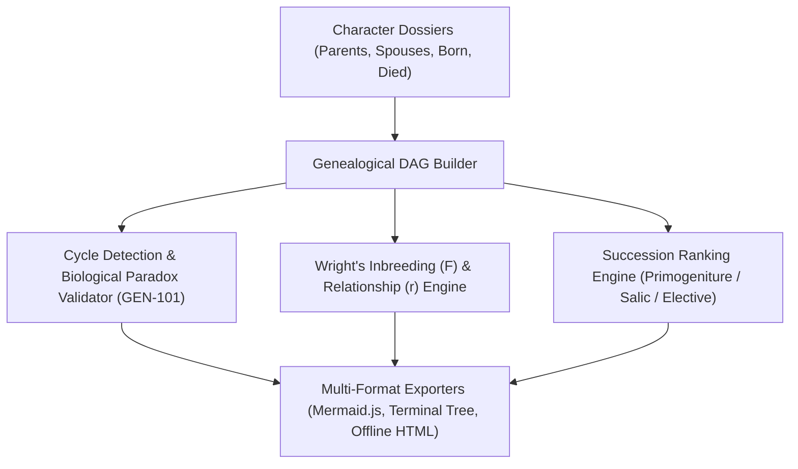
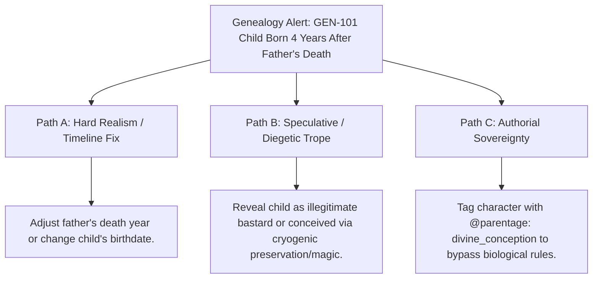

# Dynastic Genealogies, Succession Lineages & Pedigree Analysis (`docs/GENEALOGY.md`)
> **Domain D: Sociology, Factions, Economics, Genealogy & Warfare** | **CLI:** `arcanum genealogy` / `arcanum lineage`

---

## 1. Overview & Theoretical Rationale

The **Ars Arcanum Genealogy Engine** (`scripts/lib/genealogy.py`) is an offline genealogical graph analyzer, biological timeline validator, and succession claim auditor designed for fantasy worldbuilders, historical novelists, and dynastic storytellers.

In epic fantasy and historical fiction, aristocratic bloodlines and succession disputes are primary drivers of geopolitical conflict. Hand-drawn family trees frequently contain silent biological and chronological errors:
1. **Biological Impossibilities & Chronological Inversions (`GEN-101`)**: Children born before their parents, conceptions occurring years after a parent's death, or cyclical ancestry loops ($A \text{ father of } B \text{ father of } A$).
2. **Conflicting Succession Claims (`GEN-102`)**: Ambiguous or duplicated crown rankings (`succession_order: 1` claimed by multiple legitimate heirs) without explicit pretender tags.
3. **Pedigree Collapse & Consanguinity Extremes**: Royal houses inbreeding over generations without tracking biological consanguinity coefficients ($F$).

The Genealogy Engine parses character dossiers (`World/Characters/*.md`), constructs directed acyclic genealogical graphs, computes Wright's coefficient of relationship ($r$) and inbreeding coefficient ($F$), validates monarchical succession orders (agnatic, cognatic, elective), and renders publication diagrams in Mermaid.js, ASCII, and interactive HTML.

---

## 2. Formal Genetics, Graph Theory & Mathematical Formulation



### 2.1 Genealogical Graph Definition & Chronological Invariants
A genealogy is modeled as a Directed Acyclic Graph (DAG) $G = (V, E_{\text{parent}} \cup E_{\text{spouse}})$:
- Vertices $V$: Individual character entities with birth year $t_b(v)$ and death year $t_d(v)$.
- Directed Parent Edges $(u, v) \in E_{\text{parent}}$ where $u$ is parent of $v$.

#### Mathematical Invariants:
1. **Acyclicity**: $\nexists \text{ path from } v \text{ to } v \text{ in } E_{\text{parent}}$.
2. **Biological Causality**: $\forall (u, v) \in E_{\text{parent}}, \quad t_b(u) + \Delta_{\text{puberty}} \le t_b(v) \le t_d(u) + 1.0 \text{ year}$.
3. **Mortality Logic**: $\forall v \in V, \quad t_b(v) \le t_d(v)$.

### 2.2 Wright's Coefficient of Relationship ($r$) & Inbreeding ($F$)
For two individuals $X$ and $Y$ sharing common ancestors $A \in \mathcal{A}$:

$$r_{XY} = \sum_{A \in \mathcal{A}} \left(\frac{1}{2}\right)^{L(X, A) + L(Y, A)} \cdot (1 + F_A)$$

Where $L(X, A)$ is the genealogical path length from $X$ to ancestor $A$, and $F_A$ is the inbreeding coefficient of ancestor $A$.

The Inbreeding Coefficient of individual $Z$ (offspring of $X$ and $Y$):
$$F_Z = \frac{1}{2} r_{XY} = \sum_{A \in \mathcal{A}} \left(\frac{1}{2}\right)^{n_1 + n_2 + 1} (1 + F_A)$$

- $F = 0.0$: Outbred / unrelated lineage.
- $F = 0.0625$: First cousins once removed.
- $F = 0.125$: First cousins ($12.5\%$).
- $F = 0.25$: Siblings or Parent-Child incest ($25.0\%$).
- $F \ge 0.35$: Severe pedigree collapse (e.g. historical Habsburg dynasties).

### 2.3 Dynastic Succession Law Evaluation
The engine resolves legitimate succession rankings based on declared house inheritance doctrines:
1. **Agnatic (Salic) Primogeniture**: Strict male-line descent; females and male descendants through females excluded.
2. **Agnatic-Cognatic (Semi-Salic)**: Males favored; females inherit only upon total extinction of all direct male lines.
3. **Absolute Cognatic (Equal)**: Oldest child inherits regardless of gender.
4. **Ultimogeniture**: Youngest child inherits.
5. **Tanistry / Elective**: Lineage council selects among the royal sept.

---

## 3. Subfeatures Matrix

| Subfeature | Algorithmic Mechanism | Diagnostic Output / Rule | Narrative Significance |
|---|---|---|---|
| **Bidirectional Family Graph** | Resolves wikilinked parents, children, and spouses across markdown files. | Constructs full multi-generational lineage graph. | Eliminates manual maintenance of separate family tree charts. |
| **Chronological Paradox Auditor**| Validates birth/death intervals against parent lifespans. | Flags `GEN-101: BIOLOGICAL_PARADOX` with exact year deltas. | Catches impossible birthdates and post-mortem conceptions. |
| **Dynastic Succession Auditor** | Validates declared integer ranks (`succession_order`) against house rules. | Flags `GEN-102: CONFLICTING_SUCCESSION_CLAIM`. | Surfaces unacknowledged crown pretenders and civil war flashpoints. |
| **Consanguinity Calculator** | Computes Wright's $F$ coefficient across all royal marriages. | Emits inbreeding percentage and pedigree collapse warnings. | Models realistic hereditary afflictions or magical blood purity tropes. |
| **Mermaid & HTML Exporter** | Transpiles graph to Mermaid.js flowcharts and standalone HTML dashboards. | Emits copy-pasteable Obsidian markdown and visual HTML. | Seamlessly embeds dynamic family trees directly into world notes. |

---

## 4. Author Extension & Configuration Guide

### 4.1 Character Dossier Frontmatter (`World/Characters/Prince_Valen.md`)
```markdown
---
name: "Prince Valen"
type: character
house: "House Vance"
title: "Crown Prince of the Spires"
gender: "Male"
born: "125 AC"
died: "180 AC"
succession_order: 1
parents: ["[[King Eldor I]]", "[[Queen Alyssa]]"]
spouses: ["[[Lady Morwen]]"]
children: ["[[Prince Eldor II]]"]
---

# Prince Valen
The crown prince who forged the Iron Alliance.
```

---

## 5. Command-Line Interface (CLI) Reference

```bash
# View terminal family tree and lineage for a noble house
arcanum genealogy "House Vance" -w World/

# Generate Mermaid.js flowchart syntax for embedding in Obsidian
arcanum genealogy "House Vance" -w World/ --mermaid

# Export standalone interactive offline HTML family tree
arcanum genealogy "House Vance" -w World/ --html exports/vance_tree.html

# Display chronological crown succession ranking roster
arcanum lineage "House Vance" -w World/

# Output raw JSON genealogical graph data
arcanum genealogy "House Vance" -w World/ --json

# Query mathematical derivation of Wright's F coefficient
arcanum doc genealogy --math --why
```

---

## 6. Tri-Fold Creative Advisory Resolutions



### Scenario: Posthumous Conception Warning (`GEN-101`)
- **Path A (Hard Realism / Biological Accuracy)**:
  - Adjust the father's recorded year of death or update the child's birth year in `World/Characters/*.md`.
- **Path B (Speculative / Diegetic Trope)**:
  - Reveal a major plot secret: the child is an illegitimate bastard whose real father is the High Commander, or was conceived through cryo-storage, necromantic alchemy, or clone gestation.
- **Path C (Authorial Sovereignty)**:
  - Tag the child with `origin: divine_miracle` or `parthenogenesis: true` in frontmatter to mute biological causality validation.

---

## 7. Content Security Policy & Offline Isolation

All family tree reports and interactive graph dashboards operate 100% offline with zero CDN dependencies:

```html
<meta http-equiv="Content-Security-Policy" content="default-src 'none'; style-src 'unsafe-inline'; script-src 'unsafe-inline'; img-src data:; media-src data: blob:;">
```
