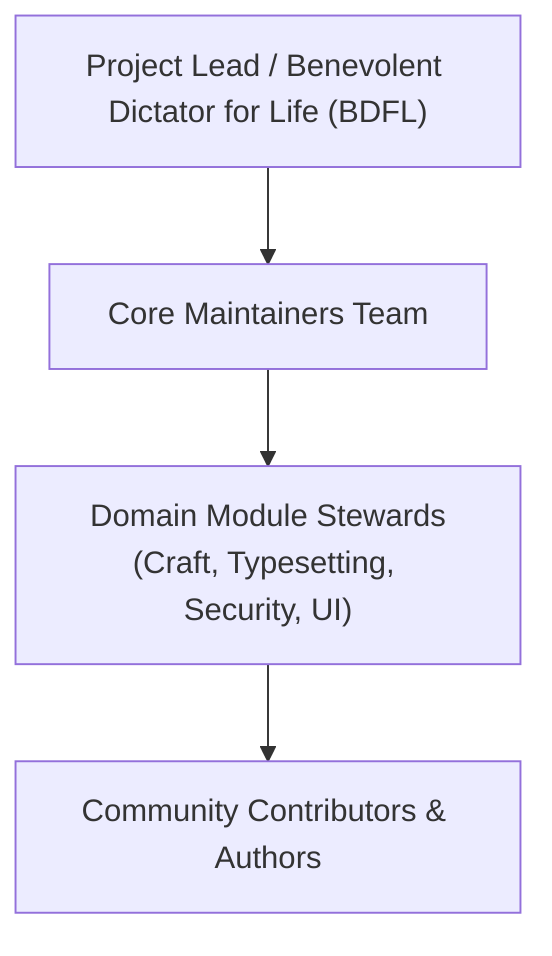

# Ars Arcanum — Open-Source Governance Charter & Project Operating Model

> **Project Mandate**: Maintain a 100% sovereign, offline, privacy-first speculative fiction authoring platform that remains open, free from telemetry, and permanently available to authors worldwide.
> **Current Version**: `5.0.0` | **License**: MIT

---

## 1. Governance Principles

Ars Arcanum operates under four non-negotiable core principles:

1. **Author Sovereignty**: No proprietary file formats, no mandatory cloud sync, no lock-in. Plain Markdown (`.md`) and standard open YAML schemas remain the primary source of truth.
2. **Zero-Telemetry & Local-First**: The software shall never include phone-home analytics, advertising, tracking, or mandatory internet connectivity for core authoring functions.
3. **Fail-Closed Security & Crash Safety**: Every filesystem operation must use atomic writes (`atomic_write`), verified checksums, and defensive validation against corruption or path traversal.
4. **Transparent & Merit-Based Evolution**: Major architectural shifts require formal Architecture Decision Records (ADRs) and community RFC review.

---

## 2. Roles & Responsibilities

### 2.1 Project Lead (BDFL)
- Holds final decision-making authority in deadlocked architectural disputes.
- Sets high-level strategic roadmap, release tags, and security advisory disclosures.
- Current Lead: **Aryan Singh Nagar** (`@aryansinghnagar`).

### 2.2 Core Maintainers
- Review and merge pull requests across the codebase.
- Maintain CI/CD pipelines, regression test suites, and automated test coverage floors.
- Ensure strict adherence to coding standards (Ruff, Mypy).
- Minimum criteria for core maintainer nomination: $\ge 6$ months of continuous, high-quality contributions and unanimous approval of existing maintainers.

### 2.3 Domain Stewards
- **Craft & Speculative Sciences**: Manages orbital mechanics, climate models, hard magic validation, and genealogy DAG algorithms.
- **Publishing & Typesetting**: Manages Typst templates, Pandoc filters, and OpenXML (.docx) sync engines.
- **Desktop & UI Presentation**: Manages GTK3 interfaces, Studio Hub, Zen Studio, and Story Canvas corkboards.
- **Security & Reliability**: Manages path traversal defenses, GPG backup encryption, and atomic filesystem safety.

---

## 3. Decision-Making & RFC Process

For trivial bug fixes, documentation corrections, and non-breaking performance improvements, standard pull requests require **one core maintainer approval**.

For major architectural changes:
1. **RFC Proposal**: The author submits an issue tagged `[RFC] <Title>`.
2. **Community Discussion**: A minimum 14-day public review period during which domain stewards and authors provide feedback.
3. **ADR Recording**: Once consensus is reached, the decision is formally drafted as an Architecture Decision Record in `decisions.md`.
4. **Implementation & Gate**: Code is merged only after meeting 100% test pass rate, strict static typing, and zero linter violations.

---

## 4. Release Cadence & Versioning

The project adheres strictly to **Semantic Versioning 2.0.0** (`MAJOR.MINOR.PATCH`):
- `MAJOR`: Breaking changes to CLI syntax, manifest formats, or core data architectures.
- `MINOR`: Backwards-compatible additions of craft engines, UI capabilities, or export formats.
- `PATCH`: Backwards-compatible bug fixes, performance optimizations, and security patches.

---

## 5. Security & Vulnerability Disclosure

Ars Arcanum takes security vulnerabilities and path traversal defenses seriously:
- **Reporting Channel**: Security concerns or vulnerability disclosures should be sent directly to security maintainers or filed via encrypted PGP channel.
- **Triage Window**: Initial acknowledgment within 48 hours and remediation patches released within 7 business days.
- **Air-Gapped Isolation Guarantee**: Core authoring engines never require outbound network connectivity, minimizing attack vectors.

---

## 6. Recommended Reading & References

1. **Fogel, Karl** (2005). *Producing Open Source Software: How to Run a Successful Free Software Project*. O'Reilly Media.
2. **Raymond, Eric S.** (1999). *The Cathedral and the Bazaar: Musings on Linux and Open Source by an Accidental Revolutionary*. O'Reilly Media.
3. **Nygard, Michael** (2011). *Documenting Architecture Decisions*. (ADR methodology).
