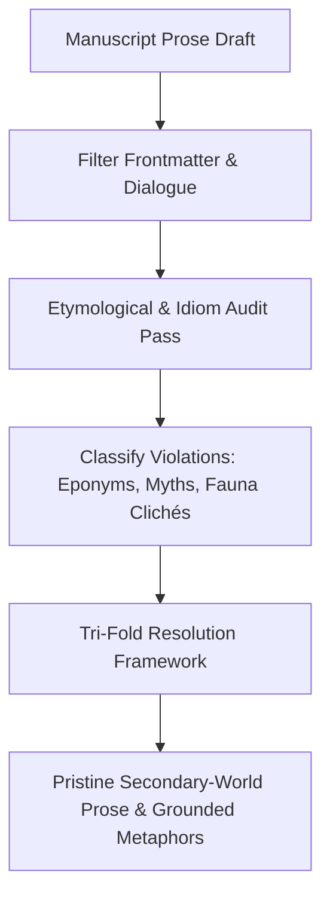
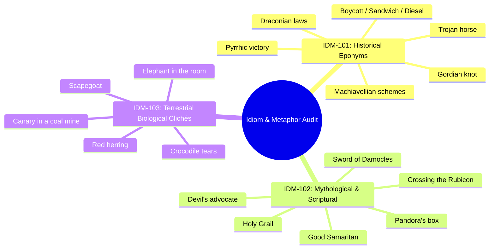
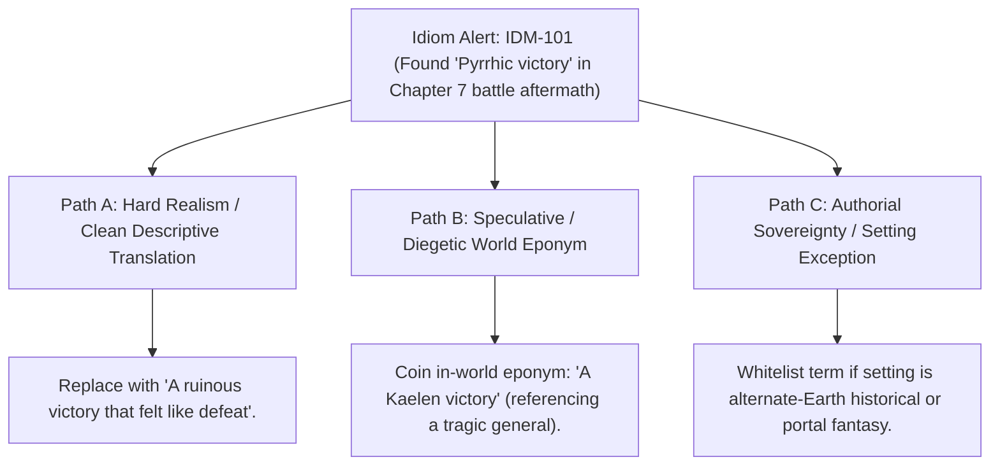

# Author Craft Masterclass: Speculative Idioms, Metaphorical Coherence & World Flavor (`docs/IDIOMS.md`)
> **Domain B: Linguistics, Conlang, Idioms & Stylistics** | **Category:** Author Craft & Narrative Doctrine | **Status:** Theoretical Framework & Writing Rubric

---

## 1. Overview & Theoretical Rationale

When crafting immersive secondary worlds (such as Tolkien's Arda, Sanderson's Roshar, or Herbert's Arrakis), accidental inclusion of Earth-specific idioms, historical namesakes (eponyms), and terrestrial biological metaphors shatters reader immersion and breaks secondary belief:

1. **Historical Eponyms (`IDM-101`)**: Describing a fantasy battle as a *"Pyrrhic victory"* when King Pyrrhus of Epirus never existed in the secondary world, or calling harsh laws *"Draconian"* when Athenian lawgiver Draco was never born.
2. **Earth-Specific Mythological & Scriptural Idioms (`IDM-102`)**: Characters in a polytheistic world using phrases like *"playing devil's advocate"*, *"crossing the Rubicon"*, *"opening Pandora's box"*, or acting as a *"Good Samaritan"*.
3. **Terrestrial Biological Clichés (`IDM-103`)**: Metaphors referring to Earth animals that do not exist in the world's ecosystem (e.g. *"canary in a coal mine"* on a world without canaries, or *"elephant in the room"* in a polar empire).



---

## 2. Linguistic Distancing Theory & The Translation Convention

### 2.1 Tolkien's Translation Hypothesis
In *The Lord of the Rings* (Appendix F), J.R.R. Tolkien formalized the **Translation Convention**: the conceit that the author is translating an ancient secondary-world text (the *Red Book of Westmarch*) into modern English for the reader.

Under the Translation Convention:
- **Acceptable Semantic Translation**: Translating Westron concepts into standard English words (*sword*, *castle*, *honor*, *winter*).
- **Immersion-Breaking Eponyms**: Using terms inextricably bound to Earth geography and historical individuals (*Pyrrhic*, *Spartan*, *Machiavellian*, *Caesarean*). These instantly destroy the illusion of an authentic secondary antiquity.

```
Linguistic Translation Spectrum:
[ Abstract Concepts ] ----------------> [ Ecological Metaphors ] ----------------> [ Specific Earth Eponyms ]
(Acceptable: 'brave', 'winter')         (Hazardous: 'canary in coal mine')         (Immersion-Breaking: 'draconian')
```

### 2.2 Idiom Contamination Density Metric ($\rho_{\text{idiom}}$)
For a manuscript chapter $c$ containing total word count $W_c$ and $N_{\text{idiom}}$ detected Earth-specific violations:

$$\rho_{\text{idiom}} = \frac{N_{\text{idiom}}}{W_c} \times 1,000 \text{ words}$$

- $\rho_{\text{idiom}} = 0.0$: Pristine Secondary-World Immersion.
- $0.0 < \rho_{\text{idiom}} \le 0.5$: Minor Etymological Drift.
- $\rho_{\text{idiom}} > 1.5$: Severe Immersion Fracture (Pervasive terrestrial idioms).

---

## 3. Immersion Categories & Editorial Diagnostic Codes



| Code | Severity | Category | Definition & Real-World Historical Origin | In-World Replacement Options |
|:---:|:---:|---|---|---|
| **`IDM-101`** | **ERROR** | **Earth Eponym** | **Pyrrhic victory** *(King Pyrrhus of Epirus, 279 BCE battle at Asculum)*. | *Ruinous victory, costly triumph, hollow conquest, ash-won prize.* |
| **`IDM-101`** | **ERROR** | **Earth Eponym** | **Draconian** *(Draco, 7th-century BCE Athenian severe lawgiver)*. | *Brutal, merciless, iron-fisted, ruthless, unforgiving.* |
| **`IDM-101`** | **ERROR** | **Earth Eponym** | **Machiavellian** *(Niccolò Machiavelli, author of The Prince)*. | *Cunning, scheming, treacherous, serpentine, cold-blooded.* |
| **`IDM-101`** | **ERROR** | **Earth Eponym** | **Gordian knot** *(King Gordias of Phrygia / Alexander the Great)*. | *Insoluble tangle, tangled cipher, unyielding knot.* |
| **`IDM-101`** | **ERROR** | **Earth Eponym** | **Trojan horse** *(Virgil's Aeneid / Trojan War subterfuge gift)*. | *Covert infiltrator, false gift, hollow offering, traitor's vessel.* |
| **`IDM-101`** | **WARN** | **Earth Eponym** | **Boycott** *(Captain Charles Boycott, Irish land agent, 1880)*. | *Embargo, shun, blackball, ostracize, commercial blockade.* |
| **`IDM-102`** | **ERROR** | **Scriptural** | **Devil's advocate** *(Catholic Church canonization promoter of the faith)*. | *Contrarian voice, opposing scholar, devil's challenger.* |
| **`IDM-102`** | **ERROR** | **Historical** | **Crossing the Rubicon** *(Julius Caesar crossing boundary river in 49 BCE)*. | *The point of no return, crossing the threshold, burning the bridge.* |
| **`IDM-102`** | **ERROR** | **Mythological**| **Pandora's box** *(Greek Hesiod myth of the forbidden jar)*. | *Forbidden casket, unsealed calamity, unleashed curse.* |
| **`IDM-102`** | **ERROR** | **Scriptural** | **Good Samaritan** *(Gospel of Luke parable of the traveler)*. | *Kind stranger, honorable traveler, merciful wanderer.* |
| **`IDM-103`** | **WARN** | **Fauna Cliché**| **Canary in a coal mine** *(British mining practice using birds for methane)*. | *Early warning, vanguard omen, toxic harbinger, wind-chime alert.* |
| **`IDM-103`** | **WARN** | **Fauna Cliché**| **Elephant in the room** *(Earth megafauna obvious presence metaphor)*. | *Unspoken truth, unavoidable reality, towering shadow.* |
| **`IDM-103`** | **WARN** | **Fauna Cliché**| **Red herring** *(Cured smoked fish used to train hounds)*. | *False trail, deceptive scent, misleading decoy, phantom scent.* |
| **`IDM-103`** | **WARN** | **Fauna Cliché**| **Crocodile tears** *(Medieval bestiary myth of weeping reptiles)*. | *Feigned sorrow, false grief, hollow weeping.* |

---

## 4. Custom Configuration & Whitelist Schema (`configs/idioms.json`)

Authors can document world-specific idioms, forbidden expressions, and whitelisted terms in `configs/idioms.json`:

```json
{
  "strictness": "warning",
  "ignored_tags": ["@quote:", "@diegetic_earth_character:"],
  "whitelist": [
    "sandwich",
    "spartan"
  ],
  "custom_rules": [
    {
      "pattern": "\\bAchilles'?\\s+heel\\b",
      "code": "IDM-101",
      "category": "Earth Eponym",
      "origin": "Greek myth of Achilles",
      "suggestions": ["vulnerable flaw", "mortal chink", "fatal weakness"]
    },
    {
      "pattern": "\\bdrinking\\s+the\\s+kool-aid\\b",
      "code": "IDM-101",
      "category": "Modern Earth Idiom",
      "origin": "1978 Jonestown massacre",
      "suggestions": ["swallowing the doctrine", "blindly faithful"]
    }
  ]
}
```

---

## 5. Tri-Fold Creative Advisory Resolutions



### Scenario: Earth Eponym Flagged in High-Fantasy Battle Scene
- **Path A (Hard Realism / Clean Descriptive Translation)**:
  - Replace the eponym with evocative sensory description: *"It was a victory made of ash, won at the cost of two thousand brothers."*
- **Path B (Diegetic Worldbuilding Eponym)**:
  - Invent an in-world eponym rooted in the setting's history: *"A Vaelen triumph"* (referencing Lord Vaelen, who won his crown only to watch his entire dynasty burn).
- **Path C (Authorial Sovereignty / Portal Fantasy)**:
  - If the story is an Isekai, portal fantasy, or alternate-history Earth novel where characters originate from Earth, explicitly whitelist the idiom.

---

## 6. Authorial Self-Editing Checklist

1. **Fauna Sweep**: Do your characters reference animals (*horses, rats, lions, canaries, dogs*) that do not exist in the world's ecology? Replace with endemic species (*chulls, ryshadium, thala-hounds*).
2. **Religious/Theological Idioms**: Do characters swear by *"God"*, *"Heaven"*, or *"Hell"* in a setting with a polytheistic pantheon, ancestor worship, or cosmic animism? Ensure oaths reflect the active cosmological entities.
3. **Tech and Era Clichés**: Are modern mechanical metaphors (*"running out of steam"*, *"sparking an idea"*, *"on the same wavelength"*) slipping into a Bronze Age or medieval fantasy?

---

## 7. Recommended Reading, References & Media

### 7.1 Foundational Linguistics & Translation Treatises
- **Tolkien, J.R.R. (1955)**. *The Lord of the Rings* (Appendix F: "The Languages and Peoples of the Third Age – On Translation"). George Allen & Unwin.  
  *The foundational treatise on linguistic distancing, translation conventions, and cultural nomenclature in secondary worlds.*
- **Le Guin, Ursula K. (1998)**. *Steering the Craft: A Twenty-First-Century Guide to Sailing the Sea of Story*. Mariner Books.  
  *Masterclass on language texture, metaphor choice, and the danger of anachronistic idioms.*
- **Lewis, C.S. (1960)**. *Studies in Words*. Cambridge University Press. ISBN: 978-0521398312.  
  *Etymological deep-dive into semantic drift and the historical weight of idiomatic phrases.*

### 7.2 Worldbuilding & Speculative Nomenclature
- **Sanderson, Brandon (2018)**. *Brandon Sanderson on Worldbuilding: Language, Metaphors, and Local Slang*. Dragonsteel.  
  *How to create diegetic swear words, idioms, and slang (e.g. "Stormfather", "Rust and Ruin", "Sparks") that feel organic.*
- **Artifexian & Biblaridion**: *Constructed Languages and Idiom Evolution in Speculative Worlds*.  
  *Developing culturally authentic metaphors based on geography and religious myth.*
- **Tale Foundry**: *The Power of Words in Fantasy: Why 'Sandwich' Breaks Your Magic*.  
  *Visual and narrative analysis of eponyms and reader psychology in world immersion.*

### 7.3 Landmark Speculative Case Studies
- **Sanderson, Brandon**: *The Stormlight Archive*.  
  *World where all animal idioms use "cremling", "chull", and "greatshell" rather than horses or canaries.*
- **Herbert, Frank**: *Dune*.  
  *Masterclass in desert-derived idioms and Arabic-influenced Chakobsa religious terms ("Water of Life", "Bi-la kaifa").*
- **Burgess, Anthony**: *A Clockwork Orange* (1962).  
  *Pioneered the immersive use of Nadsat (Anglo-Russian slang) to create a distinct psychological alienation.*
