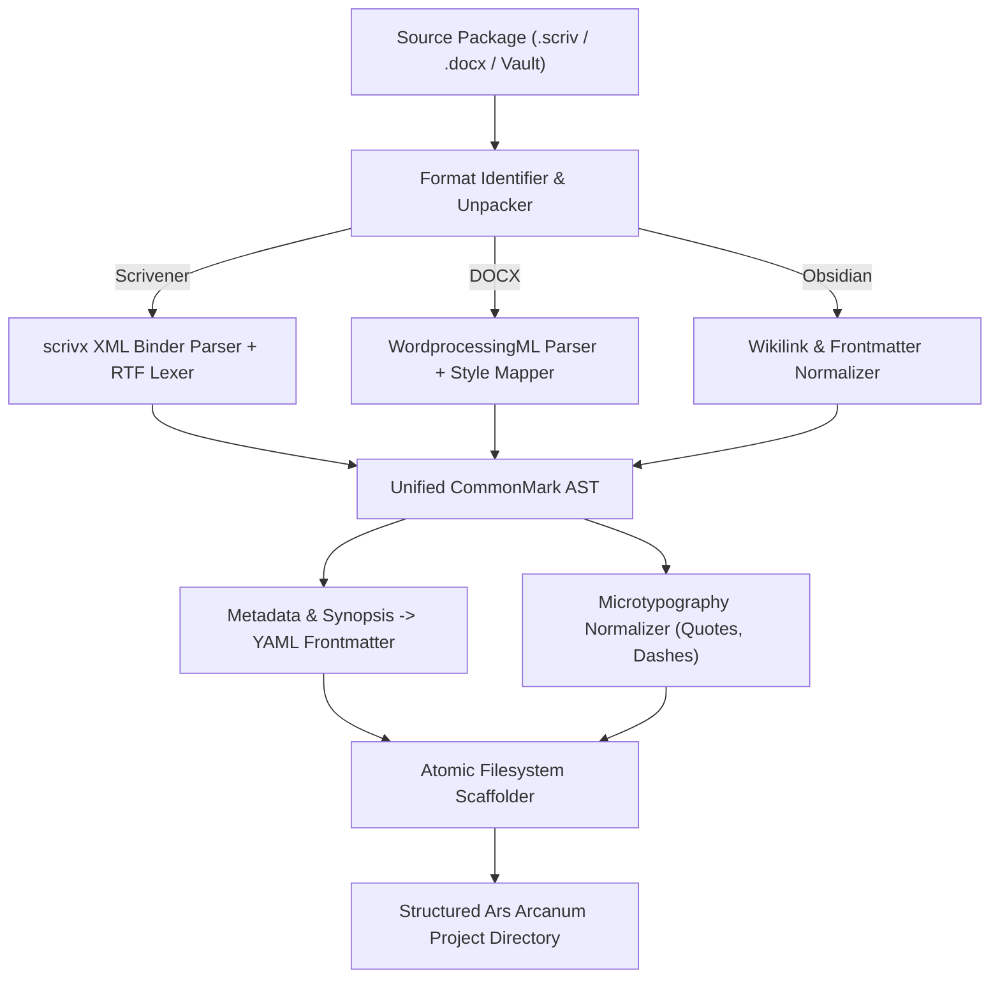
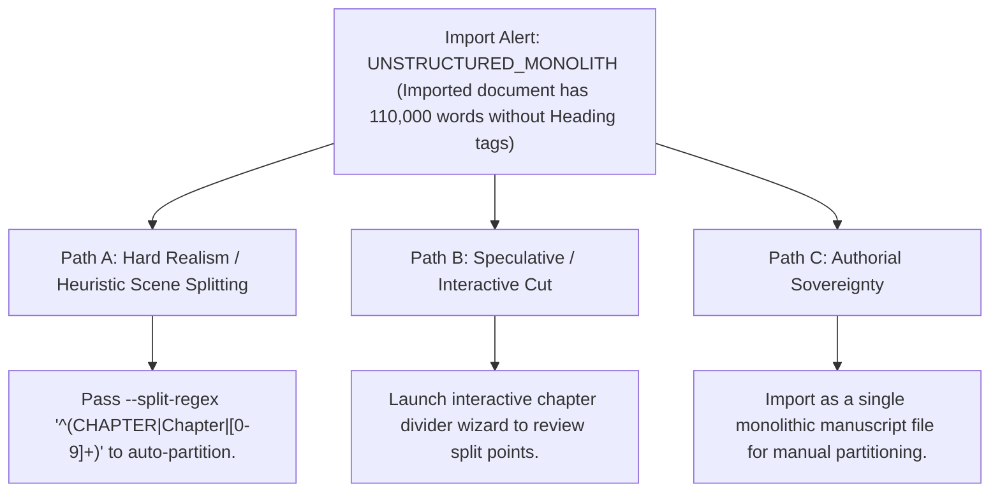

# Universal External Project Importer Engine (`docs/IMPORTER.md`)
> **Domain F: Retrieval, Storage & Infrastructure** | **CLI:** `arcanum import` / `arcanum ingest`

---

## 1. Overview & Theoretical Rationale

The **Ars Arcanum Project Importer Engine** (`scripts/lib/importer.py`) is an offline, zero-dependency data migration and AST transpiler suite engineered to onboard writing projects from proprietary formats (Scrivener 3 `.scriv`, Microsoft Word `.docx`, Fountain screenplays, and raw Obsidian vaults) into clean, standard CommonMark Markdown and Ars Arcanum directory structures.

Authors migrating away from siloed, proprietary writing tools face substantial data extraction barriers:
1. **Proprietary XML & RTF Encodings**: Scrivener projects encapsulate prose inside nested RTF (Rich Text Format) documents tied together by complex XML binder manifests (`project.scrivx`).
2. **Metadata & Binder Loss**: Exporting via standard copy-paste destroys chapter synopses, POV tags, custom binder hierarchies, and research notes.
3. **Escaped Formatting Artifacts**: Conversion scripts often produce messy escaped characters, broken curly quotes, and corrupted italic spans.

```
+-------------------------------------------------------------------------------+
|                    ARS ARCANUM UNIVERSAL IMPORTER PIPELINE                    |
|                                                                               |
|  +--------------------+     Format-Specific Lexer     +--------------------+  |
|  | Scrivener (.scriv) | ----------------------------> | Structural Binder  |  |
|  | Word / Obsidian    |                               | Manifest Parser    |  |
|  +--------------------+                               +--------------------+  |
|            |                                                    |             |
|            v                                                    v             |
|  [RTF / XML Tokenizer]                                [Hierarchy Rebuilder]   |
|  (Strip control words, decode UTF-8)                  (Draft -> 01_Manuscript)|
|            |                                          (Research -> World/)    |
|            +----------------------------------------------------+             |
|                                     |                                         |
|                                     v                                         |
|                   +-----------------------------------+                       |
|                   |  CommonMark AST Normalization     |                       |
|                   |  Frontmatter Metadata Extraction  |                       |
|                   |  Atomic Disk Serialization        |                       |
|                   +-----------------------------------+                       |
|                                     |                                         |
|                                     v                                         |
|                     [Standard Ars Arcanum Project Vault]                      |
|                     [Zero-Cloud Sovereign Conversion]                         |
+-------------------------------------------------------------------------------+
```

The Importer Engine parses binary containers and markup trees using Python's native standard library, producing clean, structured Markdown manuscripts and World Bibles with 100% data fidelity and zero cloud telemetry.

---

## 2. Compiler Theory & Format Transpilation Mechanics



### 2.1 Scrivener 3 (`.scrivx`) Binder Tree Traversal
The Scrivener project manifest (`project.scrivx`) contains a hierarchical XML tree of `<BinderItem>` nodes:
- `Type="DraftFolder"` $\implies$ Mapped to `01_Manuscript/`
- `Type="Text"` with parent in Draft $\implies$ Mapped to `Chapter_NN.md`
- `Type="Folder"` / `Type="ResearchFolder"` $\implies$ Mapped to `00_World_Bible/`

### 2.2 RTF Control Word Lexer
For each `<BinderItem>`, the engine parses the raw text payload from `Files/Data/<UUID>/content.rtf`.

The RTF lexer strips font tables (`\fonttbl`), color tables (`\colortbl`), and stylesheet headers while mapping text styles:
$$\verb|\b word \b0| \implies \verb|**word**|, \qquad \verb|\i word \i0| \implies \verb|*word*|$$
$$\verb|\uc0\u8212| \implies \verb|—| \quad (\text{Unicode Em-Dash}), \qquad \verb|\uc0\u8220| \implies \verb|“| \quad (\text{Left Curly Quote})$$

### 2.3 Heuristic Scene Break Inference
When importing flat manuscripts without explicit chapter headings, the engine evaluates inter-paragraph whitespace and dingbats using an inference metric:

$$\text{BreakScore}(P_i, P_{i+1}) = 3.0 \cdot \mathbb{I}_{\text{dingbat}}(P_i) + 2.0 \cdot \mathbb{I}_{\text{blanklines} \ge 2}(P_i) + 1.5 \cdot \mathbb{I}_{\text{dropcap}}(P_{i+1})$$

If $\text{BreakScore} \ge 2.5$, the boundary is converted to a standardized scene break delimiter (`***` or `---`).

---

## 3. CLI Execution & Option Reference

```bash
# 1. Import a Scrivener 3 project into a new Ars Arcanum universe
arcanum import ~/Novels/MyMasterpiece.scriv --output ./Universes/MyMasterpiece/

# 2. Import an existing Obsidian worldbuilding vault
arcanum import ~/ObsidianVaults/Eldoria/ --type obsidian --output ./Worlds/Eldoria/

# 3. Import a raw Word manuscript (.docx) and split into chapters at Heading 1 styles
arcanum import ~/Drafts/Complete_Book.docx --split-headings 1 -o ./Manuscripts/Book-01/

# 4. Preview import structure without writing files (Dry Run)
arcanum import ~/Novels/MyMasterpiece.scriv --dry-run

# 5. Output import manifest and conversion statistics as JSON
arcanum import ~/Novels/MyMasterpiece.scriv --json
```

### Parameter Reference Table

| Parameter | Short | Type | Default | Description |
|---|---|---|---|---|
| `source_path` | (Positional) | `Path` | *Required* | Path to incoming `.scriv`, `.docx`, or Markdown folder. |
| `--output` | `-o` | `Path` | `./Imported_Project` | Destination directory for new project. |
| `--type` | `-t` | `choice` | `auto` | Source format: `auto`, `scrivener`, `docx`, `obsidian`, `fountain`. |
| `--split-headings`| `-s` | `int` | `1` | Heading level used to split monolithic files into chapters. |
| `--dry-run` | `-d` | `bool` | `False` | Simulates import and prints target file tree. |
| `--json` | `-j` | `bool` | `False` | Emits structured JSON summary to stdout. |

---

## 4. Tri-Fold Creative Advisory Resolutions



### Scenario: Monolithic Word File Without Heading Styles
- **Path A (Hard Realism / Regular Expression Splitting)**:
  - Pass `--split-regex "^(Chapter\\s+[0-9IVXLCDM]+|PROLOGUE|EPILOGUE)"` to automatically detect chapter boundaries in plaintext.
- **Path B (Interactive Division Wizard)**:
  - Run `arcanum import novel.docx --interactive-split` to review every detected scene break before writing chapter files to disk.
- **Path C (Authorial Sovereignty)**:
  - Import the entire document into `Manuscripts/Book-01/Monolith_Draft.md` and partition chapters manually over time.

---

## 5. Recommended Reading, References & Media

### 5.1 Compiler Architecture & Document Format Standards
- **Aho, Alfred V., Lam, Monica S., Sethi, Ravi, & Ullman, Jeffrey D. (2006)**. *Compilers: Principles, Techniques, and Tools* (2nd Edition). Addison-Wesley. ISBN: 978-0321486813.  
  *The canonical "Dragon Book" on lexical analysis, tokenization, abstract syntax trees (AST), and intermediate representations.*
- **MacFarlane, John (2019)**. *CommonMark Spec: Version 0.29 / 0.31*. CommonMark.org. [spec.commonmark.org](https://spec.commonmark.org/).  
  *The normative international specification for unambiguous, deterministic Markdown parsing and semantic AST construction.*
- **Microsoft Corporation (2008)**. *Rich Text Format (RTF) Specification, Version 1.9.1*. [Microsoft RTF Spec](https://web.archive.org/web/20190708132914/http://www.microsoft.com/en-us/download/details.aspx?id=10725).  
  *The definitive specification for decoding legacy RTF token streams, control words, and character code pages.*

### 5.2 Text Segmentation & Data Extraction
- **Unicode Consortium (2023)**. *Unicode Standard Annex #29: Unicode Text Segmentation*. Unicode Consortium.  
  *Standard algorithms for word, sentence, and grapheme cluster boundaries during raw text normalization.*
- **Bray, Tim, et al. (2008)**. *Extensible Markup Language (XML) 1.0 (Fifth Edition)*. W3C Recommendation. [W3C XML](https://www.w3.org/TR/xml/).  
  *The standard for parsing Scrivener `.scrivx` project manifests.*

### 5.3 Video Lectures, Masterclasses & Migration Tutorials
- **Literature & Latte (Scrivener Official)**: *Scrivener 3: Understanding the Binder, Inspector, and Project Architecture*.  
  *Official deep dive into how Scrivener organizes binder items and metadata internally.*
- **Obsidian Community & Nicole van der Hoeven**: *Migrating from Scrivener to Markdown: Preserving Notes and Formatting*.  
  *Practical video walkthroughs on migrating novel projects into local-first Markdown vaults.*
- **Computerphile**: *ASTs and Compilers: Transforming One Language into Another*.  
  *Visual breakdown of tree-to-tree abstract syntax transformations.*

### 5.4 Landmark Speculative Case Studies
- **Sanderson, Brandon**: *Toolchain Evolution: From Microsoft Word to Scrivener to Plain Text*. Dragonsteel.  
  *Case study on managing massive epic fantasy drafts across changing software platforms over 20 years.*
- **Doctorow, Cory**: *Information Doesn't Want to Be Free: Laws of Digital Longevity*. McSweeney's.  
  *Why open formats (plain text, Markdown) protect authors from proprietary software obsolescence.*
