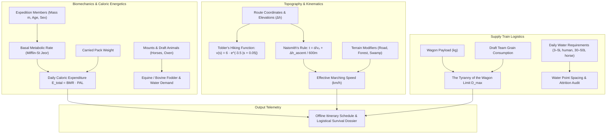

# Expedition Logistics, Biomechanics & Terrestrial Travel Physics (`docs/JOURNEY.md`)
> **Domain A: Astrophysics, Climate, Cartography & Celestial Mechanics** | **CLI:** `arcanum journey` / `arcanum travel`

---

## 1. Executive Summary & Epistemological Architecture

The **Ars Arcanum Journey & Expedition Engine** (`scripts/lib/journey.py`) is an offline overland travel calculator, caloric metabolism simulator, topographic slope physics engine, and military baggage train logistics auditor designed for fantasy novelists, historical fiction authors, and campaign worldbuilders.

Travel across realistic terrain is strictly bounded by human/animal biomechanics, caloric consumption rates, and supply train friction. Fictional expeditions frequently suffer from glaring logistical fallacies:
1. **The Teleporting Army Paradox (`JRN-101`)**: Depicting an armored army of 30,000 marching $80\text{ km}$ per day across rugged mountain passes without rest days, stragglers, or logistical collapse.
2. **The "Tyranny of the Wagon" Ignored (`JRN-102`)**: Assuming horse-drawn supply wagons can travel indefinitely into hostile wastelands, ignoring that the draft horses consume their entire payload of grain within 10–14 days.
3. **Caloric Starvation Blindness (`JRN-103`)**: Adventuring parties engaging in intense mountain climbs and daily combat on a meager single ration of dry hardtack ($500\text{ kcal}$), ignoring the $4,500+\text{ kcal/day}$ metabolic demand that leads to rapid physical exhaustion.
4. **Ignoring Gradient Friction**: Treating mountain ascents and flat paved roads as having identical travel times, ignoring Naismith's Rule and Tobler's Hiking Function.

The Journey Engine computes route elevations, calculates caloric burn rates for humans and beasts of burden, evaluates supply train exhaustion limits, and produces day-by-day expedition itineraries.



---

## 2. Human & Animal Energetics

Every organism consumes chemical potential energy (kilocalories) to maintain homeostasis and perform mechanical work against gravity and friction.

```
                      [ DAILY CALORIC DEMAND SPECTRUM ]
  Human (Sedentary / Rest)       ──► 1,800 – 2,200 kcal/day
  Human (Loaded Alpine Trek)     ──► 4,500 – 6,000 kcal/day
  Riding Horse (Active Trot)     ──► 20,000 – 25,000 kcal/day (10–12 kg grain/hay)
  Draft Ox (Heavy Wagon Haul)    ──► 30,000 – 35,000 kcal/day (15–20 kg forage)
```

### 2.1 Basal Metabolic Rate (Mifflin-St Jeor Formula)
For a human of body mass $m$ (kg), height $h$ (cm), age $a$ (years), and biological sex parameter $s$ ($+5$ for males, $-161$ for females):

$$\text{BMR} = 10 \, m + 6.25 \, h - 5 \, a + s$$

### 2.2 Total Daily Expedition Energy Expenditure ($E_{\text{total}}$)
When traversing rugged terrain with a backpack of mass $m_{\text{pack}}$:

$$E_{\text{total}} = \text{BMR} \times \text{PAL} \times \left( 1 + 0.015 \, m_{\text{pack}} \right)$$

Where the **Physical Activity Level (PAL)** is:
- Moderate Flat Trail Marching ($15\text{–}20\text{ km/day}$): $\text{PAL} \approx 2.2\text{–}2.5$.
- Heavy Armored Forced March / Alpine Ascent: $\text{PAL} \approx 3.0\text{–}3.8$.

### 2.3 Hydration Demands (The Hardest Constraint)
- **Human on Trail**: $3.0\text{–}5.0\text{ Liters/day}$ in temperate climates; $8.0\text{–}12.0\text{ Liters/day}$ in arid deserts.
- **Riding / Pack Horse**: $30\text{–}50\text{ Liters/day}$. (Water cannot be compressed; carrying 3 days of water for 10 horses requires $1,200\text{ kg}$ of deadweight—exceeding two full supply wagons).

---

## 3. Topographic Movement Physics & Kinematics

```
      Speed (km/h)
           ▲
         6 ┼             ╭─────── Maximum Pace (Gentle Downhill s = -0.05)
           │           ╭─╯ ╲
         4 ┼─────────╭─╯     ╲
           │       ╭─╯         ╲   Tobler's Curve: Steep Ascent Friction
         2 ┼─────╭─╯             ╲
           │   ╭─╯                 ╲________________
         0 ┼───┴─────────┼─────────┼───────────────► Slope Gradient (s = dh/dx)
             -0.20     -0.05      0.00    +0.20
            (Steep Down)       (Flat)  (Steep Up)
```

### 3.1 Naismith’s Rule (Mountain Hiking Time)
Formulated by William W. Naismith (1892) for estimating walking time over rugged Scottish highlands:

$$t = \frac{d}{v_0} + \frac{\Delta h_{\text{ascent}}}{r_{\text{climb}}}$$

Where:
- $d$: Horizontal map distance (km).
- $v_0$: Base walking speed on flat ground ($\approx 5.0\text{ km/h}$ for unencumbered scouts; $\approx 3.5\text{–}4.0\text{ km/h}$ for loaded infantry).
- $\Delta h_{\text{ascent}}$: Total cumulative vertical elevation gain (meters).
- $r_{\text{climb}}$: Climbing speed ($\approx 600\text{ vertical meters per hour}$).

#### Aitken-Scarf Descent Correction:
- For gentle descents (slopes $5^\circ\text{ to }12^\circ$), subtract $10\text{ minutes per } 300\text{ m}$ of descent (gravity assists pace).
- For steep descents (slopes $> 12^\circ$), **add $10\text{ minutes per } 300\text{ m}$** of descent (braking against gravity causes muscle fatigue and knee strain).

### 3.2 Tobler’s Hiking Function
Waldo Tobler's (1993) continuous exponential formulation for human walking velocity $v$ as a function of terrain slope $s = \frac{dh}{dx} = \tan\theta$:

$$v(s) = 6.0 \cdot e^{-3.5 \, |s + 0.05|} \quad (\text{km/h})$$

- Peak speed ($6.0\text{ km/h}$) occurs on a gentle $-5\%$ downhill ($s = -0.05$).
- On a $+20\%$ steep incline ($s = +0.20$), speed drops to $v = 6.0 \cdot e^{-3.5(0.25)} = 6.0 \cdot e^{-0.875} \approx 2.50\text{ km/h}$.

---

## 4. Terrain Modifiers & Movement Modalities

Effective speed equals base speed multiplied by the composite terrain and weather modifier:

$$v_{\text{effective}} = v_{\text{base}} \times \mu_{\text{terrain}} \times \mu_{\text{weather}}$$

| Terrain Type | Terrain Friction ($\mu$) | Typical Daily Range (Infantry) | Typical Daily Range (Cavalry) |
|---|---|---|---|
| **Paved Imperial High Road** | $1.00$ | $28\text{–}35\text{ km/day}$ | $45\text{–}55\text{ km/day}$ |
| **Packed Dirt Road / Open Grassland** | $0.85$ | $22\text{–}28\text{ km/day}$ | $35\text{–}45\text{ km/day}$ |
| **Light Woodland / Rolling Hills** | $0.65$ | $16\text{–}20\text{ km/day}$ | $22\text{–}30\text{ km/day}$ |
| **Dense Forest / Rocky Scree** | $0.45$ | $10\text{–}14\text{ km/day}$ | $12\text{–}16\text{ km/day}$ |
| **Swamp, Mud & Mangrove Bog** | $0.25$ | $5\text{–}8\text{ km/day}$ | $4\text{–}7\text{ km/day}$ (Horses bog down) |
| **Deep Powder Snow / Sand Dunes** | $0.20$ | $4\text{–}6\text{ km/day}$ | $3\text{–}5\text{ km/day}$ |

---

## 5. The "Tyranny of the Wagon": Supply Train Logistics

In Donald Engels' landmark logistical study of Alexander the Great’s army, the fundamental constraint of pre-industrial overland warfare is the **consumption rate of the transport animals themselves**.

```
                  [ THE OVERLAND LOGISTICAL COLLAPSE CURVE ]
  Usable Payload Remaining (kg)
       ▲
   500 ┼─────────╮
       │          ╲
   250 ┼           ╲   Draft horses eating their own wagon cargo
       │            ╲
     0 ┼─────────────┴────────────────────────► Travel Days (Round Trip)
       0             12.5 Days (Zero payload remains for destination army)
```

### 5.1 The Mathematical Wagon Exhaustion Limit
Consider a standard two-horse medieval baggage wagon:
- **Net Usable Payload**: $P_0 = 500\text{ kg}$ of grain.
- **Draft Team Consumption**: 2 horses require $C = 20\text{ kg}$ of grain/hay per day ($10\text{ kg/horse/day}$).
- **Human Teamster Consumption**: $C_{\text{driver}} = 1.5\text{ kg}$ grain/day.
- **Total Wagon Consumption Rate**: $\dot{C}_{\text{total}} = 21.5\text{ kg/day}$.

If the wagon carries food into a barren wasteland where no local grazing is possible, the maximum operational round-trip duration $T_{\text{max}}$ before the draft team eats its entire cargo is:

$$T_{\text{max}} = \frac{P_0}{\dot{C}_{\text{total}}} = \frac{500\text{ kg}}{21.5\text{ kg/day}} \approx 23.2\text{ days}$$

At an average baggage train marching speed of $15\text{ km/day}$, the **maximum one-way operational radius** $R_{\text{max}}$ where the wagon delivers *zero* food and barely makes it home alive:

$$R_{\text{max}} = \frac{T_{\text{max}}}{2} \times v_{\text{wagon}} = 11.6\text{ days} \times 15\text{ km/day} \approx 174\text{ km}$$

*The Logistical Law*: Any army operating more than **$150\text{–}200\text{ km}$ away from a navigable river or coastline** cannot be resupplied overland by wagon trains; it must forage locally or starve.

### 5.2 Riverine & Maritime Superiority
- A single wooden river barge carrying $80\text{ tons}$ ($80,000\text{ kg}$) of grain requires only $2$ draft horses walking along a towpath.
- Transport efficiency ratio:
  $$\frac{\text{Water Efficiency}}{\text{Wagon Efficiency}} = \frac{80,000\text{ kg} / 2\text{ horses}}{500\text{ kg} / 2\text{ horses}} = 160\times$$
  Waterborne logistics is over **two orders of magnitude** more energy-efficient than overland transport.

---

## 6. Worked Step-by-Step Expedition Calculation

### Scenario: The High Pass Expedition
A party of 4 human rangers (average mass $75\text{ kg}$, carrying $20\text{ kg}$ gear) treks across a mountain pass:
- Map distance: $d = 24\text{ km}$.
- Vertical ascent: $\Delta h_{\text{ascent}} = 1500\text{ m}$.
- Vertical descent: $\Delta h_{\text{descent}} = 900\text{ m}$ (steep, $> 15^\circ$).
- Terrain: Rocky mountain trail ($\mu = 0.65$).

#### Step 1: Calculate Travel Time via Naismith's Rule with Corrections
- Base walking speed: $v_0 = 4.0\text{ km/h} \times 0.65 = 2.60\text{ km/h}$.
- Flat transit time: $t_{\text{flat}} = \frac{24\text{ km}}{2.60\text{ km/h}} \approx 9.23\text{ hours}$.
- Ascent penalty: $t_{\text{ascent}} = \frac{1500\text{ m}}{600\text{ m/h}} = 2.50\text{ hours}$.
- Steep descent penalty (Scarf correction): $+10\text{ min per } 300\text{ m} \implies 3 \times 10\text{ min} = +30\text{ min} = 0.50\text{ hours}$.
- **Total Marching Time**:
  $$t_{\text{total}} = 9.23 + 2.50 + 0.50 = 12.23\text{ hours}$$
  *(Must be split into a 2-day trek; attempting this in a single day forces an exhausted night march).*

#### Step 2: Calculate Caloric Requirements
- Ranger base BMR: $10(75) + 6.25(178) - 5(28) + 5 = 750 + 1112.5 - 140 + 5 = 1727.5\text{ kcal/day}$.
- Intense alpine activity ($\text{PAL} = 3.2$):
  $$E_{\text{daily}} = 1727.5 \times 3.2 \times (1 + 0.015 \times 20) = 5528 \times (1 + 0.30) = 5528 \times 1.30 \approx 7,186\text{ kcal/day}$$
- For 4 rangers over 2 days: Total caloric fuel required = $4 \times 2 \times 7,186 \approx 57,500\text{ kcal}$ ($\approx 14.4\text{ kg}$ of dense rations like pemmican or nuts/dried meat).

---

## 7. Practical YAML Schemas

```yaml
schema_version: "2.0"
expedition:
  id: "iron_pass_recon"
  party_size: 4
  days_duration: 2

personnel:
  - id: "ranger_lead"
    body_mass_kg: 78.0
    pack_weight_kg: 22.0
    bmr_kcal: 1780.0
    daily_caloric_demand_kcal: 7250.0

waypoints:
  - name: "Valley Base Camp"
    elevation_m: 450
    coord_km: [0.0, 0.0]
  - name: "Pass Summit Crest"
    elevation_m: 1950
    coord_km: [14.0, 6.0]
  - name: "Leeward Forest Basin"
    elevation_m: 1050
    coord_km: [24.0, 10.0]

logistics_inventory:
  total_food_weight_kg: 16.0
  total_caloric_payload_kcal: 64000.0
  water_carried_liters: 24.0
  water_resupply_available: true
```

---

## 8. CLI Reference & Scriptorium Integration

```bash
# Calculate travel duration and caloric burn for a mountain waypoint route
arcanum journey --route World/Geography/iron_pass.yaml --party-size 4

# Audit wagon baggage train survival radius against the Tyranny of the Wagon
arcanum travel --wagon-audit --horses 2 --payload-kg 500 --wasteland-km 220

# Generate standalone offline HTML expedition dossier and elevation profile
arcanum journey --plan World/Expeditions/recon.yaml --html reports/expedition_dossier.html
```

---

## 9. Recommended Reading, References & Media

### Foundational Craft & Academic Textbooks
- **Engels, Donald W. (1978)**. *Alexander the Great and the Logistics of the Macedonian Army*. University of California Press.  
  *The landmark historical treatise establishing daily consumption rates, transport animal limitations, and foraging radii.*
- **van Creveld, Martin (1977)**. *Supplying War: Logistics from Wallenstein to Patton*. Cambridge University Press.  
  *The authoritative study on the evolution of military supply trains, magazines, and the limits of overland transport.*
- **Fonstad, Karen Wynn (1991)**. *The Atlas of Middle-earth* (Rev. ed.). Houghton Mifflin.  
  *Masterpiece of speculative cartographic analysis calculating exact daily marches, camping waypoints, and topography in Tolkien's legendarium.*
- **Naismith, William W. (1892)**. "Excursions: Cruach Ardran." *Scottish Mountaineering Club Journal*, 2(3), 136.  
  *The original formulation of Naismith's Rule for mountain trekking.*

### Landmark Scientific & Biomechanical Papers
- **Minetti, A. E., et al. (2002)**. "Energy cost of walking and running on extreme gradients." *Journal of Applied Physiology*, 93(3), 1039–1046.  
  *The definitive laboratory study measuring human metabolic efficiency across positive and negative slope gradients.*
- **Tobler, Waldo (1993)**. "Three Presentations on Geographical Analysis and Modeling." *National Center for Geographic Information and Analysis (NCGIA) Technical Report* 93-1.  
  *Mathematical formulation of the Tobler Hiking Function.*

### Seminal Video Lectures, Masterclasses & Channels
- **Bret Devereaux (ACOUP)** (*The Logistics of the Iron Throne*, *Walking to Mordor: The Realistic Timeline of the Fellowship*).  
  *Brilliant military-historical analysis of march rates, draft animals, and supply train physics.*
- **Modern History TV** (YouTube Series: *What Did Medieval People Eat on Campaign?*, *How Far Could a Knight Travel in a Day?*).  
  *Practical reenactment demonstrations of historical saddle gear, pack animals, and trail ergonomics.*
- **Todd's Workshop & Shadiversity** (*The Reality of Armor Weight & Endurance Hiking*).  
  *Hands-on physical testing of marching in historical plate armor and chainmail.*

### Landmark Speculative Case Studies
- **Tolkien, J.R.R.** *The Lord of the Rings* (The grueling, mathematically exact three-day forced march of Aragorn, Legolas, and Gimli across 135 miles of Rohan plains).
- **Martin, George R.R.** *A Dance with Dragons* (Stannis Baratheon’s disastrous 100-mile winter march on Winterfell: draft horses dying, starvation cannibalism, deep snow reducing pace to 3 miles/day).
- **Herbert, Frank**. *Dune* (The Fremen stillsuit, recovering 99.5% of biological moisture to enable sustained ultra-endurance treks across hyper-arid sand seas).
