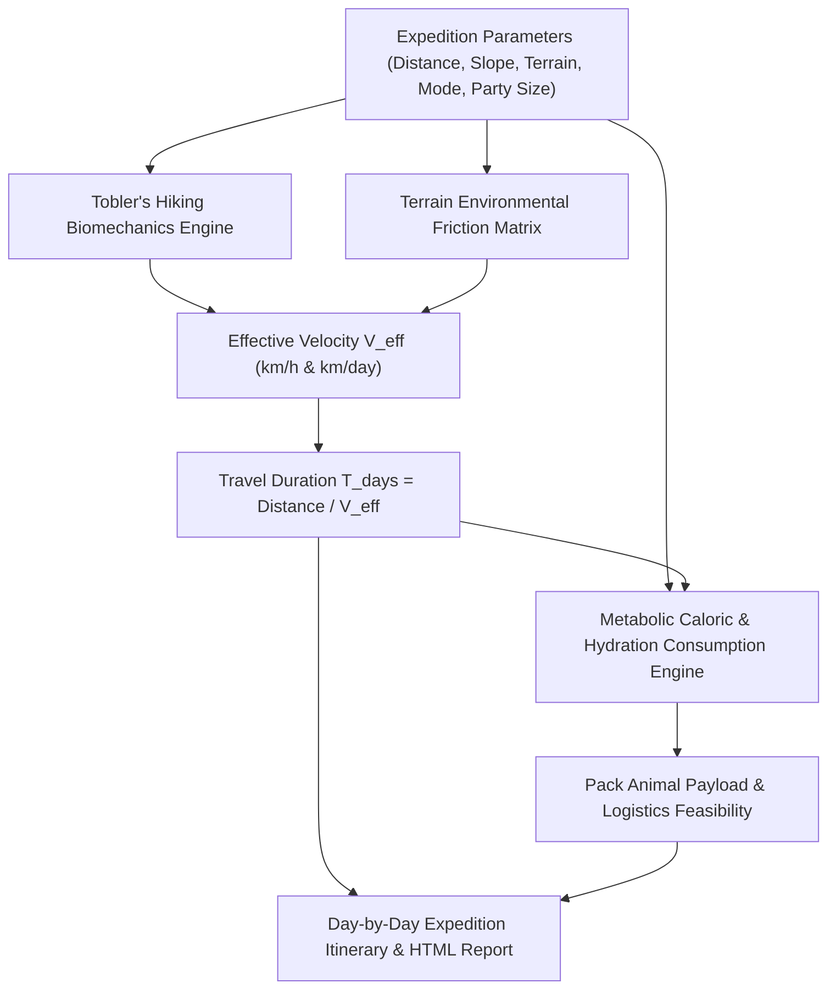
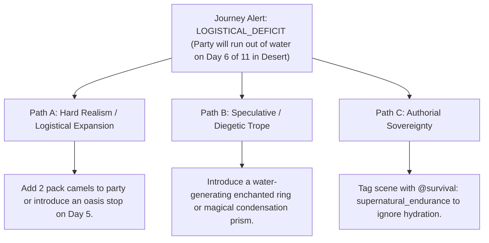

# Overland, Naval & Aerial Journey Modeler & Tobler Kinematics (`docs/JOURNEY.md`)
> **Domain A: Astrophysics, Climate, Cartography & Celestial Mechanics** | **CLI:** `arcanum journey` / `arcanum travel`

---

## 1. Overview & Theoretical Rationale

The **Ars Arcanum Journey Engine** (`scripts/lib/journey.py`) is an offline expedition planner, slope-dependent movement calculator, naval navigation modeler, and party supply depletion simulator designed for fantasy novelists, historical authors, and adventure worldbuilders.

Unrealistic travel times and impossible logistical feats break reader immersion. Common narrative errors include:
1. **Teleporting Armies & Characters**: Heroes crossing continental mountain ranges on foot in three days.
2. **Infinite Supply Pouches**: Small adventuring parties traveling across waterless salt flats for weeks without pack animals or water canteens.
3. **Flat-Earth Velocity Assumptions**: Assuming walking speed is identical on flat stone highways and $30^\circ$ mountain inclines.

The Journey Engine calculates movement speeds based on empirical human/mount biomechanics (Tobler's Hiking Function), applies environmental terrain friction multipliers, calculates metabolic caloric and hydration demands, and computes multi-leg expedition itineraries.

---

## 2. Biomechanics, Kinematics & Mathematical Formulation



### 2.1 Tobler's Hiking Function (Slope-Dependent Walking Velocity)
Waldo Tobler's empirical formulation computes walking velocity $W$ ($\text{km/h}$) as an exponential function of topographic slope $S = \frac{dh}{dx} = \tan(\theta)$:

$$W(S) = 6.0 \cdot \exp\left(-3.5 \cdot |S + 0.05|\right)$$

- **Peak Walking Velocity**: $\approx 6.0 \text{ km/h}$ occurs on a slight downhill slope ($S = -0.05$ or $-2.86^\circ$).
- **Flat Ground**: $\approx 5.0 \text{ km/h}$.
- **Steep Incline ($+20^\circ$, $S \approx 0.36$)**: Drops to $\approx 1.4 \text{ km/h}$.

### 2.2 Effective Daily Travel Pace
For a daily travel window of $H_{\text{march}}$ hours (standard: $8.0 \text{ hours}$):

$$V_{\text{eff}} = W(S) \cdot \mu_{\text{terrain}} \cdot \mu_{\text{weather}}$$
$$\text{Daily Distance } D_{\text{day}} = V_{\text{eff}} \cdot H_{\text{march}}$$
$$\text{Total Expedition Days } T = \left\lceil \frac{D_{\text{total}}}{D_{\text{day}}} \right\rceil$$

### 2.3 Party Supply Depletion & Logistic Feasibility
For $N_{\text{people}}$ humans and $N_{\text{mounts}}$ animals traveling for $T$ days:

$$\text{Daily Food (kg)} = 1.0 \cdot N_{\text{people}} + 8.0 \cdot N_{\text{mounts}}$$
$$\text{Daily Water (Liters)} = \begin{cases} 3.0 \cdot N_{\text{people}} + 25.0 \cdot N_{\text{mounts}} & (\text{Temperate}) \\ 4.5 \cdot N_{\text{people}} + 40.0 \cdot N_{\text{mounts}} & (\text{Arid/Desert}) \end{cases}$$
$$\text{Total Required Payload} = T \cdot (\text{Daily Food} + \text{Daily Water}) + \text{GearWeight}$$

$$\text{Logistical Viability} \iff \text{Total Required Payload} \le \sum \text{CarryingCapacity}(\text{Party + Mules + Wagons})$$

---

## 3. Subfeatures Matrix

| Subfeature | Algorithmic Mechanism | Diagnostic Output / Rule | Narrative Craft Significance |
|---|---|---|---|
| **Tobler Slope Kinematics** | Evaluates exponential slope velocity equations for alpine routes. | Computes accurate mountain march rates. | Prevents unrealistically rapid mountain passes and ascents. |
| **Terrain Friction Matrix** | Multiplies base speed by 14 distinct surface friction coefficients. | Adjusts travel speed from paved roads ($1.0\times$) to swamps ($0.25\times$). | Forces characters to navigate along established roads and rivers. |
| **Multi-Mode Travel Engine** | Models 15 travel modes (Foot, Mule, Warhorse, Galley, Airship, Dragon). | Emits speed and stamina limits per vehicle/mount. | Accurately distinguishes courier relays from heavy wagon caravans. |
| **Metabolic Supply Simulator**| Tracks daily water, food, and fodder depletion along routes. | Flags starvation, dehydration, and pack animal payload overloads. | Injects realistic survival tension into wilderness journeys. |
| **Day-by-Day Itinerary Builder**| Compiles multi-leg expedition schedules with campsite milestones. | Emits publication-ready travel schedules and HTML reports. | Keeps multi-chapter travel chronologies flawlessly synchronized. |

---

## 4. Author Extension & Configuration Guide

### 4.1 CLI Command Syntax
```bash
# Calculate overland march duration and supplies for a 4-person party across mountains
arcanum journey --dist "140 km" --terrain "mountains" --mode "foot-normal" --party 4

# Model a cavalry trek with mounts through open plains
arcanum journey --dist "240 km" --terrain "plains" --mode "horse-trot" --party 2 --mounts 2

# Plan a long-range oceanic voyage on a sailing frigate
arcanum journey --dist "800 km" --terrain "ocean" --mode "ship-frigate" --party 25 --html dist/voyage.html

# Output machine-readable JSON
arcanum journey --dist "100 km" --terrain "forest" --mode "foot-fast" --json

# Query Tobler hiking math and metabolic formulas
arcanum doc journey --math --why
```

---

## 5. Tri-Fold Creative Advisory Resolutions



### Scenario: Desert Dehydration Warning (Water exhausts on Day 6 of 11)
- **Path A (Hard Realism / Logistical Feasibility)**:
  - Add two pack mules or camels carrying additional water barrels, or route the party through an intermediate oasis or desert spring.
- **Path B (Speculative / Diegetic Trope)**:
  - Give the party a low-tier magical artifact (e.g. *Decanter of Endless Water*, *Frost-Rune Condenser*, or native moisture-retaining cacti).
- **Path C (Authorial Sovereignty)**:
  - Declare the characters possess superhuman physical endurance due to desert lineage, suppressing survival warnings via `@survival: adapted`.

---

## 6. Content Security Policy & Offline Isolation

Generated HTML journey itineraries and SVG route profiles operate 100% offline with zero external network access:

```html
<meta http-equiv="Content-Security-Policy" content="default-src 'none'; style-src 'unsafe-inline'; script-src 'unsafe-inline'; img-src data:; media-src data: blob:;">
```
