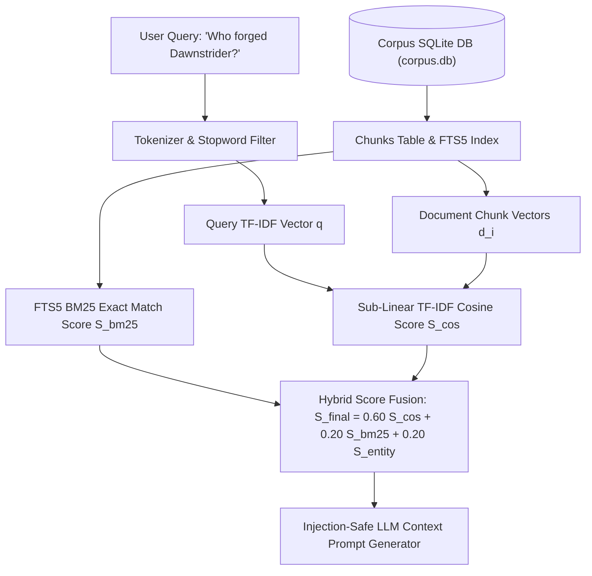
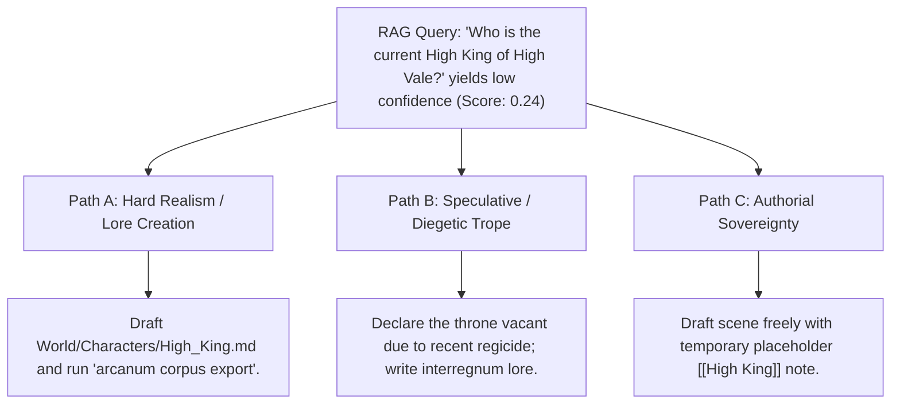

# Sovereign Local Semantic Retrieval (RAG) & Lore Recall (`docs/LOCAL_RAG.md`)
> **Domain F: Corpus Analytics, Diff, Continuity, RAG & Search** | **CLI:** `arcanum rag` / `arcanum recall`

---

## 1. Overview & Theoretical Rationale

The **Ars Arcanum Local RAG Engine** (`scripts/lib/local_rag.py`) is an offline hybrid semantic retrieval, lore recall, and injection-safe context synthesis suite built for speculative fiction novelists and loremasters.

Authors working on extensive World Bibles and multi-volume sagas need instant recall of canonical facts ("*Who forged the Dawnstrider blade?*", "*What are the strict limitations of Aether soulstone casting?*") to maintain continuity during drafting. However, uploading creative IP to cloud vector databases introduces severe intellectual property theft, data leakage, and telemetry risks.

The Local RAG Engine implements a hybrid search pipeline combining Robertson-Spärck Jones BM25 exact matching (via SQLite FTS5) with sub-linear TF-IDF vector cosine similarity, entity title boosting, and injection-safe LLM prompt synthesis—operating 100% offline with zero `pip` dependencies.

---

## 2. Information Retrieval & Hybrid Mathematical Formulation



### 2.1 Sub-Linear Term Frequency & Smoothed IDF
For a vocabulary term $t$ across corpus chunks $N$ with document frequency $\text{df}(t)$:

$$\text{IDF}(t) = \ln\left(1.0 + \frac{N - \text{df}(t) + 0.5}{\text{df}(t) + 0.5}\right) + 1.0$$
$$\text{TF}(t, d) = \begin{cases} 1.0 + \ln(\text{count}(t, d)) & \text{if } \text{count}(t, d) > 0 \\ 0.0 & \text{otherwise} \end{cases}$$

Document vector weight: $w(t, d) = \text{TF}(t, d) \cdot \text{IDF}(t)$.

### 2.2 Vector Cosine Similarity
$$\mathcal{S}_{\text{cos}}(\vec{q}, \vec{d}) = \frac{\sum_{t \in q \cap d} w(t, q) \cdot w(t, d)}{\|\vec{q}\|_2 \cdot \|\vec{d}\|_2} \in [0.0, 1.0]$$

### 2.3 Hybrid Score Fusion Formula
To capture both semantic concept overlap and exact proper noun recall (character names, artifact titles), the engine computes:

$$\mathcal{S}_{\text{hybrid}}(d, q) = \alpha \cdot \mathcal{S}_{\text{cos}}(d, q) + \beta \cdot \mathcal{S}_{\text{bm25}}(d, q) + \gamma \cdot \mathbb{I}(q \cap \text{Title}(d) \ne \emptyset)$$

Where $\alpha = 0.60$, $\beta = 0.20$, and $\gamma = 0.20$.

---

## 3. Subfeatures Matrix

| Subfeature | Algorithmic Mechanism | Diagnostic Output / Rule | Narrative Significance |
|---|---|---|---|
| **Zero-Pip Hybrid Retriever** | Combines pure Python TF-IDF with SQLite FTS5 BM25. | Emits scored, ranked list of relevant lore chunks. | Delivers millisecond search without bulky machine learning packages. |
| **Heading-Aware Chunking** | Splits lore notes at Markdown `##` headings and paragraphs. | Preserves semantic context blocks with breadcrumbs. | Prevents broken context fragments from confounding recall. |
| **Entity & Title Boosting** | Applies $+0.20$ bonus to chunks matching entity headings. | Prioritizes authoritative entity definitions. | Surfaces primary character/location dossiers above passing mentions. |
| **Injection-Safe Prompt Synthesizer**| Structures context in `<canonical_lore>` XML tags with tokens count. | Generates clean, secure prompts for local LLMs. | Protects local AI drafting assistants from prompt injection. |
| **Multi-Taxonomy Filter** | Filters search candidates by category (`Characters`, `Magic`). | Constrains retrieval to specific world domains. | Accelerates targeted lookups in massive multi-volume bibles. |

---

## 4. Author Extension & Configuration Guide

### 4.1 CLI Query Syntax
```bash
# Query default workspace corpus database
arcanum rag "Who forged the Dawnstrider blade?"

# Query custom SQLite database
arcanum rag "What are the limitations of Aether soulstone casting?" -d dist/corpus/corpus.db

# Query directly from an Obsidian world vault or manuscript folder
arcanum rag "How did the Void Incursion begin?" -t World/

# Retrieve top-3 chunks from Characters category with minimum score 0.30
arcanum rag "High Archon Valerius" -k 3 -m 0.30 -c Characters

# Export injection-safe LLM prompt context to file
arcanum rag "Battle of the Crimson Rift" -f context -o prompt_context.txt
```

### 4.2 Local LLM Integration (Ollama / LM Studio)
```bash
# Pipe canonical lore context directly into local Ollama model
arcanum rag "Describe the architecture of the Sunfire Citadel" -f context | ollama run llama3
```

---

## 5. Tri-Fold Creative Advisory Resolutions



### Scenario: Low Confidence Retrieval Alert (Score $< 0.30$)
- **Path A (Hard Realism / Canonical Completeness)**:
  - The query fact is missing from the World Bible. Create the missing dossier `World/Characters/High_King.md` and rebuild the corpus index via `arcanum corpus export`.
- **Path B (Speculative / Diegetic Trope)**:
  - Reframe the absence of information as an in-world conspiracy: the royal lineage records were erased in the Great Purge, making the true king's identity an unsolved mystery.
- **Path C (Authorial Sovereignty)**:
  - Continue drafting without pausing for lore creation, tagging the scene with `@todo: establish_king`.

---

## 6. Content Security Policy & Offline Isolation

The Local RAG Engine computes all vector embeddings and search rankings entirely on your local CPU without sending any data over the network:

```html
<meta http-equiv="Content-Security-Policy" content="default-src 'none'; style-src 'unsafe-inline'; script-src 'unsafe-inline'; img-src data:; media-src data: blob:;">
```
