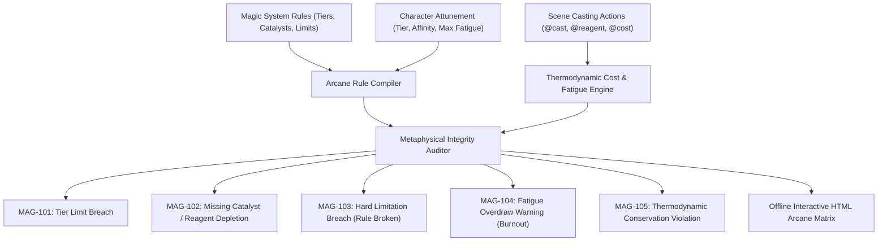

# Hard Magic Systems, Arcane Thermodynamics & Sanderson Laws (`docs/MAGIC_SYSTEM.md`)
> **Domain C: Magic Systems, Metaphysics, Metasystems & Causality** | **CLI:** `arcanum magic-check` / `arcanum magic-report`

---

## 1. Overview & Theoretical Rationale

The **Ars Arcanum Magic System Engine** (`scripts/lib/magic_system.py`) is an offline metaphysical constraint validator, thermodynamic balance checker, and narrative magic auditor built for rationalist fantasy worldbuilders, hard magic designers, and speculative fiction authors.

Unconstrained, hand-waved, or internally contradictory magic systems dissolve dramatic stakes, eliminate tension, and reduce climactic resolutions to cheap *Deus ex Machina*. A well-crafted magic system operates as a coherent set of physical, metaphysical, and economic laws whose strict boundaries create genuine problem-solving drama.



---

## 2. Sanderson's Laws of Magic & The Metaphysical Spectrum

```
+-----------------------------------------------------------------------------------+
|                           THE HARD-SOFT MAGIC SPECTRUM                            |
+---------------------------------------------------+-------------------------------+
| SOFT MAGIC (Mystical / Numeneous)                 | HARD MAGIC (Rational / Lawful)|
| - Rules unknown to reader                         | - Strict, transparent rules   |
| - Evokes awe, dread, wonder                       | - Operates like physics       |
| - Used to create problems, not solve them         | - Used for proactive solutions|
| - Examples: Tolkien's Gandalf, Miyazaki spirits   | - Examples: Allomancy, Sympathy|
+---------------------------------------------------+-------------------------------+
```

### 2.1 Brandon Sanderson's Four Laws of Magic
1. **The Zeroth Law**: *Err on the side of awesome, but justify it internally.*  
   Make the magic thrilling, evocative, and visually striking, but ensure its internal logic supports the premise without breaking world invariants.
2. **Sanderson's First Law**: *An author's ability to solve problems with magic in a satisfying way is directly proportional to how well the reader understands said magic.*  
   $$\text{Satisfaction}(\text{Solution}) \propto \text{Comprehension}(\text{Rules})$$  
   If the audience does not understand how a spell works before the climax, using that spell to defeat the antagonist feels unearned.
3. **Sanderson's Second Law**: *Limitations are greater than powers.*  
   $$\text{Dramatic Potential} = f(\text{Limitations}, \text{Weaknesses}, \text{Costs}) \gg f(\text{Raw Power})$$  
   Superman is interesting not because he can lift buildings, but because Kryptonite exists and he cannot save everyone at once. What a magic user *cannot* do drives plot tension.
4. **Sanderson's Third Law**: *Expand what you already have before you add something new.*  
   $$\text{World Coherence} = \frac{\text{Interconnected Depth}}{\text{Number of Disparate Magic Types}}$$  
   Extrapolate cultural, industrial, military, and culinary consequences of a single magical rule rather than inventing five separate magic systems.

---

## 3. Arcane Thermodynamics & Mathematical Invariants

### 3.1 Energy Conservation Equation for Magic
In hard magic systems, arcane energy obeys fundamental thermodynamic conservation principles. Magical work $\Delta E_{\text{magic}}$ derived from a source reservoir $E_{\text{source}}$ must satisfy:

$$\Delta E_{\text{magic}} = \eta \cdot E_{\text{source}} - C_{\text{strain}} - E_{\text{entropy}}$$

Where:
- $E_{\text{source}}$: The energy reservoir (Metabolic calories, ambient thermal energy, kinetic momentum, stored solar flux, or catalytic chemical bonds).
- $\eta \in (0.0, 1.0)$: The casting efficiency coefficient (governed by caster skill, attunement tier, and conduit quality).
- $C_{\text{strain}}$: Somatic, neurological, or metaphysical cost absorbed directly by the caster's body.
- $E_{\text{entropy}}$: Waste heat, acoustic shock, ionizing radiation, or ethereal miasma released into the local environment.

### 3.2 Caster Exhaustion & Overdraw Threshold Curves
For a caster performing $K$ magical invocations at timestamps $t_1, t_2, \dots, t_K$ with energetic strain costs $c_1, c_2, \dots, c_K$:

$$F(t) = \sum_{i=1}^{K} c_i \cdot \exp\left( -\lambda (t - t_i) \right) \cdot \mathbb{I}(t \ge t_i)$$

Where $\lambda$ is the biological/arcane metabolic recovery rate constant ($\text{time}^{-1}$).

```
Fatigue F(t)
 ^
 |             * Cast 3 (Overdraw!) -> MAG-104 Alert
F_max + - - - - - - - - - - - - - - - - - - - - - - - - - - -
 |                 * Cast 2
 |       * Cast 1   \
 |      / \          \
 |     /   \          \
 0 +--+-----+----------+------------------------------------> Time (t)
```

$$\text{Fatigue State} = \begin{cases} 
\text{Optimal} & \text{if } F(t) \le 0.50 F_{\text{max}} \\
\text{Strained} & \text{if } 0.50 F_{\text{max}} < F(t) \le F_{\text{max}} \\
\text{Overdrawn / Burnout} & \text{if } F(t) > F_{\text{max}} \quad (\text{Triggers MAG-104: Hemorrhage / Loss of Power})
\end{cases}$$

### 3.3 Catalyst Depletion & Reagent Economics
Let spell $S$ require a consumable reagent quantity $q_{\text{req}}(R)$. In an economic ecosystem, the market price $P(R)$ of arcane catalysts follows supply scarcity and hazardous extraction curves:

$$P(R) = P_0 \cdot \left( \frac{S_0}{S_{\text{current}}} \right)^\alpha \cdot (1 + \tau_{\text{risk}})$$

Where $S_{\text{current}}$ is regional remaining stockpiles, and $\tau_{\text{risk}}$ reflects guild embargoes or monster nest proximity.

---

## 4. Subfeatures Matrix & Diagnostic Codes

| Diagnostic Code | Flag | Trigger Condition | Worldbuilding Correction |
|---|---|---|---|
| `MAG-101` | `TIER_LIMIT_BREACH` | Caster tier $T(C) < T_{\text{req}}(S)$ without external amplifier relic. | Lower spell circle, raise character attunement, or provide sacrificial catalyst. |
| `MAG-102` | `MISSING_REAGENT` | Scene casting action `@cast` without required item in character inventory $\mathcal{I}(C)$. | Add prior scene where character harvests/purchases reagent. |
| `MAG-103` | `HARD_LIMIT_BREACH` | Casting violates declared hard limitation (e.g. creating true life, teleporting through lead). | Reframe action using indirect physical application of valid rules. |
| `MAG-104` | `FATIGUE_OVERDRAW` | Rolling fatigue $F(t) > F_{\text{max}}$. | Depict physical consequences: unconsciousness, ruptured capillaries, permanent power loss. |
| `MAG-105` | `THERMODYNAMIC_DEFICIT` | Output work exceeds input source by $> 100\times$ without ambient reservoir. | Account for thermal heat sink or environmental cooling backlash. |
| `MAG-106` | `UNEXPLAINED_RECOVERY` | Caster recovers from maximum burnout in minutes without medical/alchemical intervention. | Enforce realistic recovery downtime or permanent scars. |

---

## 4.1 Soft Magic Systems & Creative Sovereignty Flags

Ars Arcanum upholds absolute **creative sovereignty**. While hard magic systems are audited against thermodynamic rules, soft and mythic magic systems (*e.g., fairy tales, poetic surrealism, cosmic horror*) are treated with advisory flexibility:

- **Soft Magic Paradigm (`paradigm: "soft"`)**: When a magic system declares a soft/mythic paradigm (or sets `is_soft: true`), thermodynamic deficit findings (`MAG-105`) and strict tier breaches are categorized as **advisory craft insights** rather than blocking failures.
- **`--advisory` CLI Flag**: `arcanum magic-check --advisory` treats all thermodynamic warnings as informative guidance without failing automated build pipelines.
- **`--strict` CLI Flag**: `arcanum magic-check --strict` enforces zero-tolerance hard magic rules for pure rationalist fiction projects.

---

## 5. Frontmatter Directives & YAML Schemas

### 5.1 Magic System Rule Declaration (`World/Magic-Technology/Hemocraft.md`)
```yaml
---
magic_system: "Hemomancy"
paradigm: "hard"
law_alignment: "sanderson_hard"
source_reservoir: "somatic_metabolic_blood"
efficiency_coefficient: 0.72
hard_limitations:
  - "Cannot animate inorganic stone or dead bone."
  - "Cannot transmute blood type; requires genetic compatibility."
  - "Cannot reverse brain death after 3 minutes."
costs:
  somatic_strain: "vascular_pressure_increase"
  environmental_entropy: "localized_temperature_drop"
catalysts:
  - id: "refined_vitriol"
    consumption_rate: 1.0 # grams per cast
    rarity: "uncommon"
tiers:
  1: "Capillary Shaping (Minor lacerations, needles)"
  2: "Arterial Weaving (Blades, armor hardening)"
  3: "Sanguine Puppet (External motor control of living targets)"
---
```

### 5.2 Character Arcane Dossier (`World/Characters/Kaelen.md`)
```yaml
---
name: "Kaelen Vane"
attunement:
  system: "Hemomancy"
  tier: 2
  max_fatigue: 100.0
  recovery_rate: 0.05 # λ per minute
inventory:
  - item: "refined_vitriol"
    quantity: 4.5
  - item: "obsidian_lancet"
---
```

### 5.3 Scene In-Text Directives (`Manuscript/Chapter-14.md`)
```markdown
# Chapter 14: The Blood Bastion
@cast: Arterial_Shield
@system: Hemomancy
@tier: 2
@reagent: refined_vitriol (qty: 1.0)
@cost: 35.0
@strain: "Severe forearm bruising"

Kaelen crushed the vitriol vial in his palm and whispered the binding verse.
```

---

## 6. Worked Step-by-Step Example

### Scenario: Thermodynamic Kinetic Redistribution System
1. **Rule**: Kinetic energy can be absorbed into iron rings and discharged into steel projectiles.
2. **Absorption**: Kaelen leaps from a 10-meter tower ($m = 80\text{ kg}, g = 9.81\text{ m/s}^2, h = 10\text{ m}$):
   $$E_{\text{absorbed}} = m g h = 80 \times 9.81 \times 10 = 7,848\text{ Joules}$$
3. **Efficiency & Waste Heat**: With $\eta = 0.80$, usable energy is $6,278.4\text{ J}$. Waste heat is $1,569.6\text{ J}$ absorbed into the ring ($m_{\text{ring}} = 0.05\text{ kg}, c_{\text{iron}} = 450\text{ J/(kg}\cdot\text{K)}$):
   $$\Delta T = \frac{1,569.6}{0.05 \times 450} = \frac{1,569.6}{22.5} \approx 69.8^\circ\text{C}$$
   *Sensory Consequence*: The ring scorches the caster's finger, leaving a permanent blistered ring of scar tissue.
4. **Discharge**: Firing an iron coin ($m_{\text{coin}} = 0.01\text{ kg}$):
   $$v = \sqrt{\frac{2 \cdot 6,278.4}{0.01}} = \sqrt{1,255,680} \approx 1,120.5\text{ m/s} \quad (\approx \text{Mach 3.3})$$
   *Result*: Bullet-speed supersonic kinetic strike with authentic sonic boom and thermal flash.

---

## 7. Recommended Reading, References & Media

### 7.1 Foundational Craft & Academic Books
- **Sanderson, Brandon (2007–2013)**. *Sanderson's Laws of Magic* (Three-part essay series in *Dragonsteel Publications* / Tor.com).  
  *The foundational codification of hard vs soft magic, limitations over powers, and system depth.*
- **Grossman, Lev (2009)**. *The Magicians*. Viking Press. ISBN: 978-0670020553.  
  *Pioneering exploration of the academic, physical, and psychological weight of magic as advanced applied mathematics and linguistics.*
- **Friedman, C. S. (1991)**. *Black Sun Rising* (The Coldfire Trilogy, Book 1). DAW Books. ISBN: 978-0886774851.  
  *Masterpiece in metaphysical consistency, detailing the Faed-field and psychic thermodynamic sacrifice.*
- **Frazer, James George (1890)**. *The Golden Bough: A Study in Comparative Religion*. Macmillan.  
  *The anthropological root text establishing the principles of Sympathetic Magic (Law of Similarity and Law of Contact/Contagion).*
- **Card, Orson Scott (1990)**. *How to Write Science Fiction & Fantasy*. Writer's Digest Books. ISBN: 978-0898794168.  
  *Contains the classic MICE Quotient and foundational chapters on establishing rules and costs for magical technologies.*

### 7.2 Landmark Scientific / Worldbuilding Papers & Textbooks
- **Rothfuss, Patrick (2007)**. *The Name of the Wind*. DAW Books. ISBN: 978-0756404741.  
  *Textbook case study of Sympathy: conservation of energy, source-to-target linkage efficiency, and slippage heat dissipation (Binder's Chills).*
- **Schroeder, Daniel V. (1999)**. *An Introduction to Thermal Physics*. Addison Wesley Longman. ISBN: 978-0201380279.  
  *The physical reference text for calculating thermal energy, entropy transfer, and thermodynamic efficiency.*

### 7.3 Seminal Video Lectures, Masterclasses & Channels
- **Brandon Sanderson (2020)**. *Lecture #5: Worldbuilding — Magic Systems & Technology*, BYU Creative Writing Lectures. YouTube.  
  *The definitive university masterclass breaking down the mechanics, economics, and limitations of hard magic.*
- **Tale Foundry (2017–Present)**. *Hard vs Soft Magic Systems: The Spectrum of Fantasy*. YouTube.  
  *Exhaustive analytical breakdown of magic classifications, psychological immersion, and thematic relevance.*
- **Hello Future Me (Tim Hickson, 2018)**. *On Writing: Hard Magic Systems & Limitations*. YouTube.  
  *Detailed examination of casting costs, physical consequences, and narrative integration.*
- **Artifexian (2019)**. *Building Magic Systems: Soft, Hard, and Hybrid Paradigms*. YouTube.  
  *Structured worldbuilding diagrams for designing consistent metaphysical frameworks.*

### 7.4 Landmark Speculative Case Studies
- **Brandon Sanderson, *Mistborn: The Final Empire* (2006)**: The premier case study in Allomancy, Feruchemy, and Hemalurgy obeying strict Newton's Third Law kinetic reactions.
- **Robert Jordan, *The Wheel of Time* (1990–2013)**: The Five Powers (Earth, Fire, Air, Water, Spirit) and the tragic psychological decay of the Taint on Saidin.
- **Hiromu Arakawa, *Fullmetal Alchemist* (2001–2010)**: The Law of Equivalent Exchange as an immutable metaphysical and ethical invariant.
