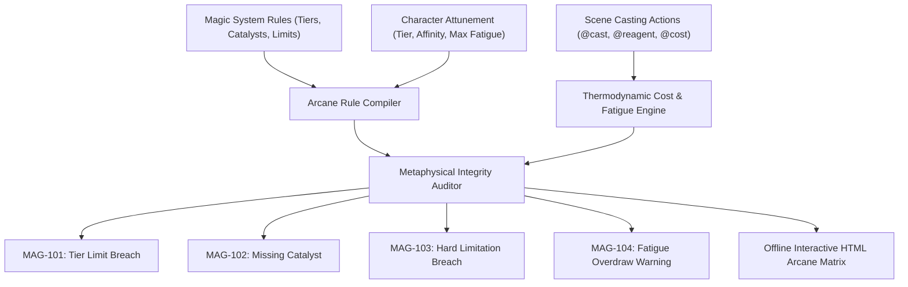
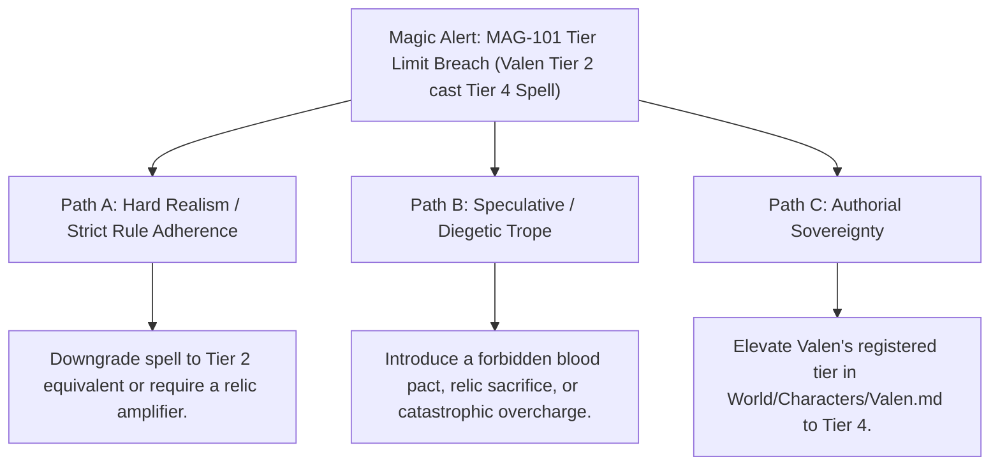

# Hard Magic Systems, Arcane Constraints & Sanderson Laws (`docs/MAGIC_SYSTEM.md`)
> **Domain C: Magic Systems, Metaphysics, Metasystems & Causality** | **CLI:** `arcanum magic-check` / `arcanum magic-report`

---

## 1. Overview & Theoretical Rationale

The **Ars Arcanum Magic System Engine** (`scripts/lib/magic_system.py`) is an offline metaphysical constraint validator, thermodynamic balance checker, and narrative magic auditor built for fantasy worldbuilders and rationalist fiction authors.

Unconstrained or inconsistent magic systems dissolve dramatic tension and ruin narrative stakes (*Deus ex Machina*). Brandon Sanderson's foundational Laws of Magic state:
1. **Sanderson's First Law**: An author's ability to solve problems with magic in a satisfying way is directly proportional to how well the reader understands said magic.
2. **Sanderson's Second Law**: Limitations > Powers. What a magic user *cannot* do is vastly more interesting than what they *can* do.
3. **Sanderson's Third Law**: Expand what you already have before you add something new.

The Magic System Engine enforces these laws deterministically: it scans metaphysical definitions in `World/Magic-Technology/*.md`, verifies character arcane tiers and inventories in `World/Characters/*.md`, validates casting actions and costs in manuscript scenes, tracks biological/arcane fatigue overdraw, and prevents hard metaphysical contradictions (such as spontaneous resurrection or infinite energy loops).

---

## 2. Metaphysical Principles & Mathematical Formulation



### 2.1 Thermodynamic Conservation & Energy Balances
In rationalist hard magic systems, magical energy obeys conservation laws where arcane energy $E_{\text{arcane}}$ derives from a defined physical or metaphysical reservoir $E_{\text{source}}$:

$$E_{\text{output}} = \eta \cdot E_{\text{source}} - E_{\text{entropy}}$$

Where $\eta \in (0, 1)$ represents casting efficiency and $E_{\text{entropy}}$ represents heat, acoustic shock, or arcane radiation released into the surrounding environment.

### 2.2 Fatigue Accumulation & Biological Overdraw
For a caster performing $K$ magical invocations in a scene with costs $C = [c_1, c_2, \dots, c_K]$:

$$F_{\text{current}}(t) = \sum_{i=1}^k c_i \cdot e^{-\lambda (t - t_i)}$$

$$\text{Fatigue Overdraw Alert} \iff F_{\text{current}} > F_{\text{max}} \quad (\text{Triggers MAG-104})$$

Where $\lambda$ is the natural metabolic recovery rate and $F_{\text{max}}$ is the caster's biological threshold.

### 2.3 Tier Boundary & Catalyst Predicates
Let a spell $S$ require tier level $T(S)$ and reagent set $\mathcal{R}(S)$. A character $C$ with tier $T(C)$ and inventory $\mathcal{I}(C)$ is legally permitted to cast $S$ if and only if:

$$T(C) \ge T(S) \quad \land \quad \mathcal{R}(S) \subseteq \mathcal{I}(C) \cup \mathcal{R}_{\text{scene}}$$

$$\text{Violations}: \quad T(C) < T(S) \implies \texttt{MAG-101}, \qquad \mathcal{R}(S) \not\subseteq (\mathcal{I} \cup \mathcal{R}_{\text{scene}}) \implies \texttt{MAG-102}$$

---

## 3. Subfeatures Matrix

| Subfeature | Algorithmic Mechanism | Diagnostic Output / Rule | Narrative Significance |
|---|---|---|---|
| **Magic Rule & Tier Compiler** | Parses `World/Magic-Technology/*.md` for constraints and affinities. | Builds lookup tables of valid spells, reagents, and tier costs. | Centralizes metaphysical rules into an authoritative engine model. |
| **Character Attunement Profiler** | Scans character dossiers for tier ratings and focus items. | Generates cast capability profiles per character. | Prevents novice characters from casting grandmaster spells accidentally. |
| **Scene Semantic Casting Auditor**| Evaluates `@cast`, `@magic`, `@reagent`, and `@cost` in chapters. | Emits `MAG-101` through `MAG-104` diagnostic flags. | Ensures battle and magic scenes maintain logical, rules-bound tension. |
| **Hard Limitation Enforcer** | Checks prose against `hard_limitations` forbidden strings. | Emits `MAG-103: HARD_LIMIT_BREACH` with line references. | Eliminates narrative-breaking plot holes (e.g. unearned resurrections). |
| **Fatigue Overdraw Tracker** | Accumulates casting costs per scene and checks against caster max. | Emits `MAG-104: FATIGUE_OVERDRAW`. | Enforces biological or psychological costs for powerful magic. |

---

## 4. Author Extension & Configuration Guide

### 4.1 Magic System Lore Dossier (`World/Magic-Technology/Aether_Weaving.md`)
```markdown
---
name: "Aether Weaving"
type: magic_tech_system
classification: "Hard Magic"
source_of_power: "Atmospheric Aether"
danger_cost: "High"
max_tier: 5
disciplines:
  - "Pyromancy"
  - "Chronomancy"
catalysts:
  - "Ruby Focus"
  - "Silver Thread"
hard_limitations:
  - "Cannot resurrect the dead"
  - "Cannot create matter from nothing"
  - "Cannot travel backwards in time"
---

# Aether Weaving
Aether Weaving manipulates ambient light and heat through focused crystalline prisms.
```

### 4.2 Character Arcane Attunement (`World/Characters/Valen.md`)
```markdown
---
name: "Valen Vance"
type: character
role: Protagonist
magic_tier: 2
magic_ability: "Pyromancy"
catalyst: "Ruby Focus"
max_fatigue: 80
---
```

### 4.3 Scene Casting Directives (`Manuscript/Book-01/03_Siege.md`)
```markdown
# Chapter 3: The Siege
@pov: Valen Vance
@reagent: Ruby Focus
@cast: Valen Vance, Firebolt, tier=2, catalyst=Ruby Focus, cost=35

Valen channeled the ambient heat into the crimson gemstone.
A spear of flame erupted across the courtyard.

@cast: Valen Vance, Inferno-Wall, tier=2, catalyst=Ruby Focus, cost=55
# Total fatigue = 90 > 80 (Triggers MAG-104 Fatigue Overdraw)
```

---

## 5. Command-Line Interface (CLI) Reference

```bash
# Run magic consistency check across world notes and manuscript
arcanum magic-check World/ -m Manuscript/

# Output raw JSON diagnostics for editor integration
arcanum magic-check World/ -m Manuscript/ --json

# Generate standalone offline interactive HTML arcane dashboard
arcanum magic-report World/ -m Manuscript/ --html reports/magic_dashboard.html

# Query Sanderson laws, thermodynamic math, and fatigue formulas
arcanum doc magic_system --math --why
```

---

## 6. Tri-Fold Creative Advisory Resolutions



### Scenario: Tier Limit Violation (`MAG-101`)
- **Path A (Hard Realism / Strict Metaphysical Rules)**:
  - Downgrade the spell to a Tier 2 power level, maintaining established world rules.
  - Or, introduce an external amplifying artifact (e.g. an ancient archmage's staff) in the scene to justify the temporary power spike.
- **Path B (Speculative / Diegetic Trope)**:
  - Frame the over-tier cast as a dangerous **Arcane Overcharge / Blood Sacrifice**: the character successfully casts the spell, but their catalyst shatters, their arm is permanently scarred, or they fall unconscious for three days.
- **Path C (Authorial Sovereignty)**:
  - Update `magic_tier: 4` in `World/Characters/Valen.md`, establishing that the character has canonically leveled up their powers.

---

## 7. Content Security Policy & Offline Isolation

Generated arcane dashboards and audit reports are 100% offline and compliant with the Ars Arcanum manifesto:

```html
<meta http-equiv="Content-Security-Policy" content="default-src 'none'; style-src 'unsafe-inline'; script-src 'unsafe-inline'; img-src data:; media-src data: blob:;">
```
